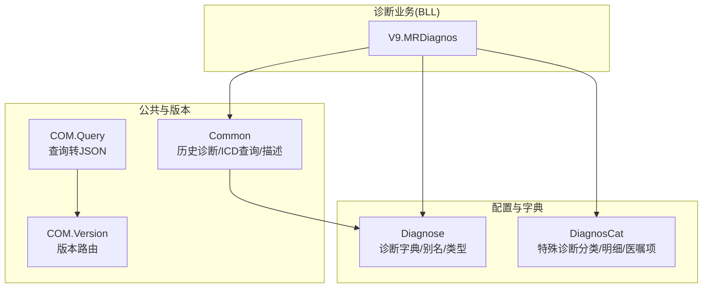
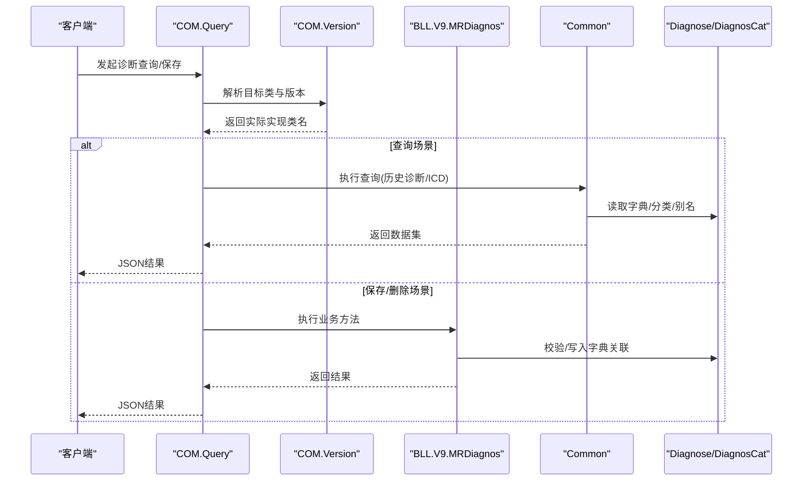
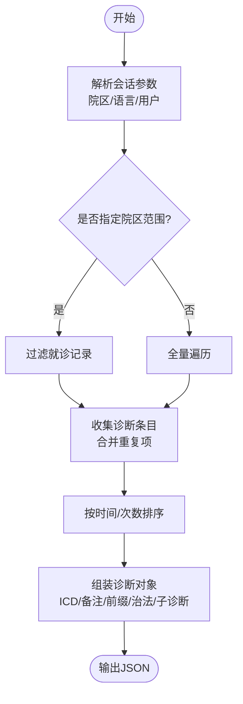
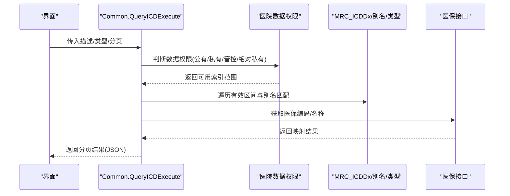
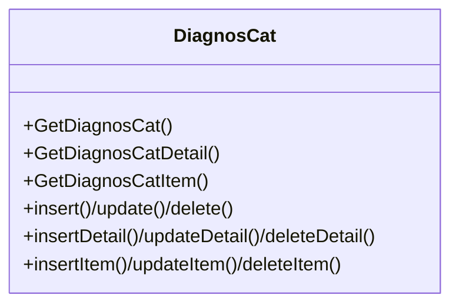
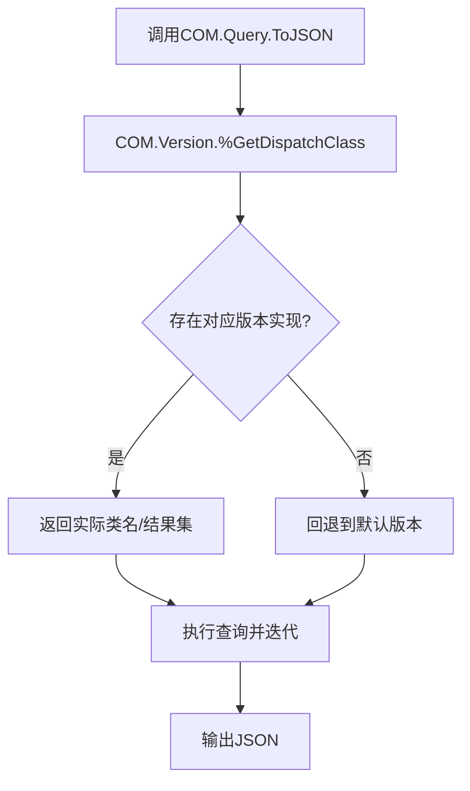
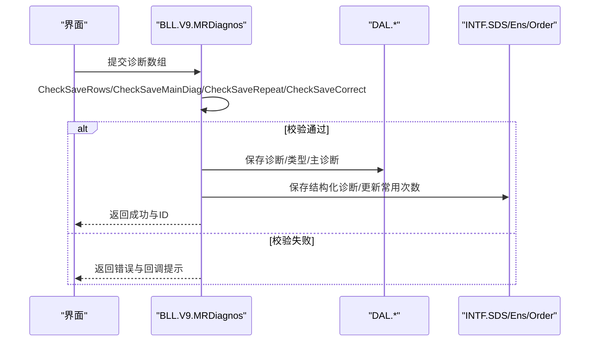
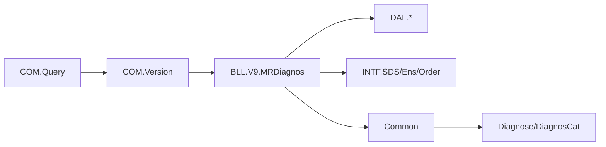

# 诊断信息同步

<cite>
**本文引用的文件**
- [Common.cls](file://src/backend/doc-ws/DHCDoc/Diagnos/Common.cls)
- [Query.cls](file://src/backend/doc-ws/DHCDoc/Diagnos/COM/Query.cls)
- [Version.cls](file://src/backend/doc-ws/DHCDoc/Diagnos/COM/Version.cls)
- [Diagnose.cls](file://src/backend/doc-ws/DHCDoc/DHCDocConfig/Diagnose.cls)
- [DiagnosCat.cls](file://src/backend/doc-ws/DHCDoc/DHCDocConfig/DiagnosCat.cls)
- [MRDiagnos.cls (V9)](file://src/backend/doc-ws/DHCDoc/Diagnos/BLL/V9/MRDiagnos.cls)
</cite>

## 目录
1. [简介](#简介)
2. [项目结构](#项目结构)
3. [核心组件](#核心组件)
4. [架构总览](#架构总览)
5. [详细组件分析](#详细组件分析)
6. [依赖关系分析](#依赖关系分析)
7. [性能与缓存策略](#性能与缓存策略)
8. [故障排查指南](#故障排查指南)
9. [结论](#结论)
10. [附录：API调用示例](#附录api调用示例)

## 简介
本文件面向与HIS系统的诊断数据交换接口，聚焦诊断编码同步、诊断模板管理、ICD编码映射等能力，覆盖诊断信息的实时同步、批量导入导出、版本管理等特性。文档从系统架构、关键组件、数据流、处理逻辑、集成点、错误处理、性能优化与缓存策略等方面展开，并提供可操作的API调用示例（查询、编码转换、模板操作），帮助实施与运维人员快速落地。

## 项目结构
围绕诊断模块的代码主要分布在 doc-ws 的 DHCDoc\Diagnos 与 DHCDoc\DHCDocConfig 两个子域：
- 诊断业务层（BLL）：封装就诊诊断获取、历史诊断聚合、保存校验、批量删除等流程
- 配置与字典（DHCDocConfig）：提供诊断字典查询、分类管理、别名管理、类型配置等
- 公共查询与版本路由（COM）：统一查询结果转JSON、按版本分发类方法
- 通用工具（Common）：历史诊断汇总、ICD查询、中医治法查询、诊断描述拼装等

图表来源
- [MRDiagnos.cls (V9):1-800](file://src/backend/doc-ws/DHCDoc/Diagnos/BLL/V9/MRDiagnos.cls#L1-L800)
- [Common.cls:1-581](file://src/backend/doc-ws/DHCDoc/Diagnos/Common.cls#L1-L581)
- [Diagnose.cls:1-398](file://src/backend/doc-ws/DHCDoc/DHCDocConfig/Diagnose.cls#L1-L398)
- [DiagnosCat.cls:1-304](file://src/backend/doc-ws/DHCDoc/DHCDocConfig/DiagnosCat.cls#L1-L304)
- [Query.cls:1-24](file://src/backend/doc-ws/DHCDoc/Diagnos/COM/Query.cls#L1-L24)
- [Version.cls:1-47](file://src/backend/doc-ws/DHCDoc/Diagnos/COM/Version.cls#L1-L47)

章节来源
- [MRDiagnos.cls (V9):1-800](file://src/backend/doc-ws/DHCDoc/Diagnos/BLL/V9/MRDiagnos.cls#L1-L800)
- [Common.cls:1-581](file://src/backend/doc-ws/DHCDoc/Diagnos/Common.cls#L1-L581)
- [Diagnose.cls:1-398](file://src/backend/doc-ws/DHCDoc/DHCDocConfig/Diagnose.cls#L1-L398)
- [DiagnosCat.cls:1-304](file://src/backend/doc-ws/DHCDoc/DHCDocConfig/DiagnosCat.cls#L1-L304)
- [Query.cls:1-24](file://src/backend/doc-ws/DHCDoc/Diagnos/COM/Query.cls#L1-L24)
- [Version.cls:1-47](file://src/backend/doc-ws/DHCDoc/Diagnos/COM/Version.cls#L1-L47)

## 核心组件
- 诊断查询与历史聚合：支持按患者、就诊、院区范围获取历史诊断，合并重复诊断并按时间或频次排序
- ICD查询与医保映射：支持按名称/编码模糊匹配，返回ICD10CM、医保编码及名称
- 诊断模板与分类：支持特殊诊断分类、诊断明细、医嘱项绑定与增删改查
- 版本路由与查询转JSON：通过版本控制选择具体实现类，统一将查询结果转为JSON供前端使用
- 保存校验与批量操作：对诊断录入进行强校验（主诊断限制、时间约束、修正诊断规则），支持批量保存与删除

章节来源
- [Common.cls:1-581](file://src/backend/doc-ws/DHCDoc/Diagnos/Common.cls#L1-L581)
- [Diagnose.cls:1-398](file://src/backend/doc-ws/DHCDoc/DHCDocConfig/Diagnose.cls#L1-L398)
- [DiagnosCat.cls:1-304](file://src/backend/doc-ws/DHCDoc/DHCDocConfig/DiagnosCat.cls#L1-L304)
- [Query.cls:1-24](file://src/backend/doc-ws/DHCDoc/Diagnos/COM/Query.cls#L1-L24)
- [Version.cls:1-47](file://src/backend/doc-ws/DHCDoc/Diagnos/COM/Version.cls#L1-L47)
- [MRDiagnos.cls (V9):1-800](file://src/backend/doc-ws/DHCDoc/Diagnos/BLL/V9/MRDiagnos.cls#L1-L800)

## 架构总览
诊断同步涉及“查询—转换—持久化”的闭环：
- 查询：通过 COM.Query 统一入口，结合 Version 路由到具体实现类（如 V9）
- 转换：Common 负责历史诊断聚合、ICD查询、描述拼装；Diagnose/DiagnosCat 提供字典与分类
- 持久化：BLL.V9.MRDiagnos 负责保存、校验、批量删除，并联动结构化诊断、证明书等扩展

图表来源
- [Query.cls:1-24](file://src/backend/doc-ws/DHCDoc/Diagnos/COM/Query.cls#L1-L24)
- [Version.cls:1-47](file://src/backend/doc-ws/DHCDoc/Diagnos/COM/Version.cls#L1-L47)
- [MRDiagnos.cls (V9):1-800](file://src/backend/doc-ws/DHCDoc/Diagnos/BLL/V9/MRDiagnos.cls#L1-L800)
- [Common.cls:1-581](file://src/backend/doc-ws/DHCDoc/Diagnos/Common.cls#L1-L581)
- [Diagnose.cls:1-398](file://src/backend/doc-ws/DHCDoc/DHCDocConfig/Diagnose.cls#L1-L398)
- [DiagnosCat.cls:1-304](file://src/backend/doc-ws/DHCDoc/DHCDocConfig/DiagnosCat.cls#L1-L304)

## 详细组件分析

### 诊断查询与历史聚合（Common）
- 功能要点
  - 获取患者历史诊断：支持按院区范围过滤、合并重复诊断、按时间或次数排序
  - ICD查询：支持精确/模糊匹配、按诊断类型筛选、分页输出、医保编码映射
  - 诊断描述拼装：优先结构化诊断显示，其次ICD描述+备注+前缀+中医治法+子诊断
- 关键路径
  - 历史诊断聚合：遍历就诊记录与诊断子表，构建对象集合后序列化输出
  - ICD查询：根据数据权限（公有/私有/管控/绝对私有）选择索引表，按有效期与就诊类型过滤，再取医保信息
  - 诊断描述：组合ICD文本、备注、前缀、中医治法、子诊断，必要时替换为结构化诊断名称

图表来源
- [Common.cls:1-581](file://src/backend/doc-ws/DHCDoc/Diagnos/Common.cls#L1-L581)

章节来源
- [Common.cls:1-581](file://src/backend/doc-ws/DHCDoc/Diagnos/Common.cls#L1-L581)

### ICD编码映射与查询（Common + Diagnose）
- 功能要点
  - ICD查询：支持按名称/编码检索、按诊断类型（西医/中医/证型）过滤、按有效期与就诊类型过滤
  - 医保映射：在查询过程中调用平台接口获取国家医保诊断编码与名称
  - 诊断字典维护：支持新增/更新/删除诊断字典、别名管理、类型配置
- 关键路径
  - 查询：根据数据权限选择全局或院区维度索引，遍历有效区间，匹配描述/别名，分页输出
  - 字典：SQL事务保证一致性，更新时同步关联路径信息

图表来源
- [Common.cls:380-569](file://src/backend/doc-ws/DHCDoc/Diagnos/Common.cls#L380-L569)
- [Diagnose.cls:1-398](file://src/backend/doc-ws/DHCDoc/DHCDocConfig/Diagnose.cls#L1-L398)

章节来源
- [Common.cls:380-569](file://src/backend/doc-ws/DHCDoc/Diagnos/Common.cls#L380-L569)
- [Diagnose.cls:1-398](file://src/backend/doc-ws/DHCDoc/DHCDocConfig/Diagnose.cls#L1-L398)

### 诊断模板与分类管理（DiagnosCat）
- 功能要点
  - 特殊诊断分类：支持按院区、就诊类型、账单类型、时长、类型（特殊病/慢性病/押金）管理
  - 诊断明细：将诊断与分类关联，支持查询与增删改
  - 医嘱项绑定：为分类绑定医嘱项、时长、最大数量等
- 关键路径
  - 查询：按院区过滤，翻译字段（描述/时长/类型），输出列表
  - 维护：插入/更新/删除时进行唯一性校验与外键有效性检查

图表来源
- [DiagnosCat.cls:1-304](file://src/backend/doc-ws/DHCDoc/DHCDocConfig/DiagnosCat.cls#L1-L304)

章节来源
- [DiagnosCat.cls:1-304](file://src/backend/doc-ws/DHCDoc/DHCDocConfig/DiagnosCat.cls#L1-L304)

### 版本管理与查询路由（COM.Version + COM.Query）
- 功能要点
  - 版本路由：根据当前版本（如 V9）动态选择实现类，支持 Local 优先
  - 查询转JSON：统一将 %ResultSet 查询结果转换为 JSON，便于前端消费
- 关键路径
  - 路由：拼接包名与版本号，验证方法/查询是否存在，返回实际类名或结果集
  - 转换：封装查询执行与迭代，生成标准JSON结构

图表来源
- [Version.cls:1-47](file://src/backend/doc-ws/DHCDoc/Diagnos/COM/Version.cls#L1-L47)
- [Query.cls:1-24](file://src/backend/doc-ws/DHCDoc/Diagnos/COM/Query.cls#L1-L24)

章节来源
- [Version.cls:1-47](file://src/backend/doc-ws/DHCDoc/Diagnos/COM/Version.cls#L1-L47)
- [Query.cls:1-24](file://src/backend/doc-ws/DHCDoc/Diagnos/COM/Query.cls#L1-L24)

### 保存校验与批量操作（BLL.V9.MRDiagnos）
- 功能要点
  - 保存校验：主诊断数量限制、时间顺序校验（发病/诊断/截止）、修正诊断规则、非标准ICD提醒
  - 批量保存：逐条保存诊断、类型、主诊断标识、结构化诊断、常用次数统计，递归处理子诊断
  - 批量删除：前置校验（关联申请、打印证明、修正状态、权限限制），删除后作废证明书与结构化诊断，发送平台消息
- 关键路径
  - CheckSaveRows/CheckSaveRow：逐项校验并累积回调（确认/告警）
  - SaveMulti：事务内保存，失败回滚
  - DeleteMulti：事务内删除，失败回滚，清理关联数据

图表来源
- [MRDiagnos.cls (V9):262-800](file://src/backend/doc-ws/DHCDoc/Diagnos/BLL/V9/MRDiagnos.cls#L262-L800)

章节来源
- [MRDiagnos.cls (V9):262-800](file://src/backend/doc-ws/DHCDoc/Diagnos/BLL/V9/MRDiagnos.cls#L262-L800)

## 依赖关系分析
- 组件耦合
  - BLL 依赖 DAL/INTF 完成数据读写与外部系统交互（结构化诊断、平台消息、医嘱关联）
  - Common 依赖字典与配置（Diagnose/DiagnosCat）完成描述拼装与查询增强
  - COM 提供统一入口与版本路由，降低上层调用复杂度
- 直接/间接依赖
  - 直接：BLL -> DAL/INTF；Common -> Diagnose/DiagnosCat；Query -> Version
  - 间接：Query -> Version -> 具体实现类 -> 其他组件
- 外部集成点
  - 医保接口：在ICD查询中获取医保编码与名称
  - 平台消息：删除诊断后发送消息，用于下游系统同步
  - 结构化诊断：保存/删除时联动SDS数据

图表来源
- [Query.cls:1-24](file://src/backend/doc-ws/DHCDoc/Diagnos/COM/Query.cls#L1-L24)
- [Version.cls:1-47](file://src/backend/doc-ws/DHCDoc/Diagnos/COM/Version.cls#L1-L47)
- [MRDiagnos.cls (V9):1-800](file://src/backend/doc-ws/DHCDoc/Diagnos/BLL/V9/MRDiagnos.cls#L1-L800)
- [Common.cls:1-581](file://src/backend/doc-ws/DHCDoc/Diagnos/Common.cls#L1-L581)
- [Diagnose.cls:1-398](file://src/backend/doc-ws/DHCDoc/DHCDocConfig/Diagnose.cls#L1-L398)
- [DiagnosCat.cls:1-304](file://src/backend/doc-ws/DHCDoc/DHCDocConfig/DiagnosCat.cls#L1-L304)

章节来源
- [Query.cls:1-24](file://src/backend/doc-ws/DHCDoc/Diagnos/COM/Query.cls#L1-L24)
- [Version.cls:1-47](file://src/backend/doc-ws/DHCDoc/Diagnos/COM/Version.cls#L1-L47)
- [MRDiagnos.cls (V9):1-800](file://src/backend/doc-ws/DHCDoc/Diagnos/BLL/V9/MRDiagnos.cls#L1-L800)
- [Common.cls:1-581](file://src/backend/doc-ws/DHCDoc/Diagnos/Common.cls#L1-L581)
- [Diagnose.cls:1-398](file://src/backend/doc-ws/DHCDoc/DHCDocConfig/Diagnose.cls#L1-L398)
- [DiagnosCat.cls:1-304](file://src/backend/doc-ws/DHCDoc/DHCDocConfig/DiagnosCat.cls#L1-L304)

## 性能与缓存策略
- 查询性能
  - 分页输出：ICD查询支持 rows/page 参数，仅输出显示页数据，减少网络传输与内存占用
  - 索引选择：根据数据权限选择全局或院区维度索引，避免全表扫描
  - 排序优化：历史诊断支持按时间或次数排序，减少前端计算开销
- 缓存策略
  - 临时缓存：查询过程使用临时变量存储中间结果，关闭查询时释放
  - 语言翻译：翻译字段按需加载，避免重复翻译开销
- 建议优化
  - 对高频查询增加应用级缓存（如ICD字典、分类列表）
  - 对大数据量历史诊断采用增量同步与分片查询
  - 对医保映射接口增加本地缓存与重试机制

章节来源
- [Common.cls:380-569](file://src/backend/doc-ws/DHCDoc/Diagnos/Common.cls#L380-L569)
- [Diagnose.cls:1-398](file://src/backend/doc-ws/DHCDoc/DHCDocConfig/Diagnose.cls#L1-L398)
- [DiagnosCat.cls:1-304](file://src/backend/doc-ws/DHCDoc/DHCDocConfig/DiagnosCat.cls#L1-L304)

## 故障排查指南
- 常见问题
  - 诊断保存失败：检查主诊断数量限制、时间顺序、修正诊断规则、结构化诊断权限
  - ICD查询无结果：确认数据权限、有效期、就诊类型限制、别名匹配
  - 删除诊断被拒：检查是否已打印证明书、是否被修正、是否有关联医嘱申请
- 定位步骤
  - 查看返回的错误码与回调消息（Alert/Confirm）
  - 核对会话参数（院区/用户/语言）与权限配置
  - 检查字典与分类配置是否完整（诊断类型、时长、账单类型）
- 日志与追踪
  - 利用变更日志接口获取诊断修改前后对比
  - 关注平台消息发送结果，确保下游系统同步成功

章节来源
- [MRDiagnos.cls (V9):262-800](file://src/backend/doc-ws/DHCDoc/Diagnos/BLL/V9/MRDiagnos.cls#L262-L800)
- [Common.cls:186-307](file://src/backend/doc-ws/DHCDoc/Diagnos/Common.cls#L186-L307)

## 结论
本方案通过分层架构与版本路由，实现了诊断数据的标准化查询、编码映射、模板管理与批量操作。借助严格的保存校验与完善的错误处理，保障了数据一致性与业务合规性。结合分页、索引与临时缓存等优化手段，提升了查询与同步性能。建议在实施中结合院区数据权限与医保接口特点，进一步定制缓存与增量同步策略，以满足高并发与大规模数据场景。

## 附录：API调用示例
以下为常见API调用示例（以方法名为指引，具体参数与返回值请参考对应类与方法）：
- 诊断查询
  - 历史诊断聚合：调用 Common.GetHistoryDiag，传入患者ID、院区范围、院区ID
  - 就诊诊断描述：调用 Common.GetAdmDiagDesc，传入就诊ID、诊断类型、主诊断标志、是否仅ICD、分隔符
  - ICD查询：调用 Common.QueryICDExecute，传入描述、类型、会话串、分页参数
- 编码转换与映射
  - 医保编码映射：在ICD查询过程中自动调用平台接口获取医保编码与名称
  - 诊断分类ID：调用 Common.GetDiagnosCatID 或 GetICDCatID，传入诊断行ID或ICD行ID
- 模板操作
  - 诊断字典：调用 Diagnose.save/saveAlias/delete，传入字典数据与行ID
  - 特殊诊断分类：调用 DiagnosCat.insert/update/delete，传入分类信息与院区ID
  - 分类明细与医嘱项：调用 DiagnosCat.insertDetail/updateDetail/deleteDetail 与 insertItem/updateItem/deleteItem
- 批量操作
  - 批量保存：调用 MRDiagnos.SaveMulti，传入就诊ID、诊断数组、会话串
  - 批量删除：调用 MRDiagnos.DeleteMulti，传入基础参数、诊断行ID数组、会话串

章节来源
- [Common.cls:1-581](file://src/backend/doc-ws/DHCDoc/Diagnos/Common.cls#L1-L581)
- [Diagnose.cls:1-398](file://src/backend/doc-ws/DHCDoc/DHCDocConfig/Diagnose.cls#L1-L398)
- [DiagnosCat.cls:1-304](file://src/backend/doc-ws/DHCDoc/DHCDocConfig/DiagnosCat.cls#L1-L304)
- [MRDiagnos.cls (V9):262-800](file://src/backend/doc-ws/DHCDoc/Diagnos/BLL/V9/MRDiagnos.cls#L262-L800)