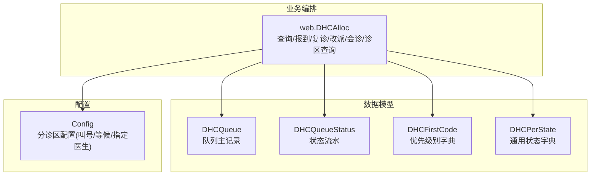
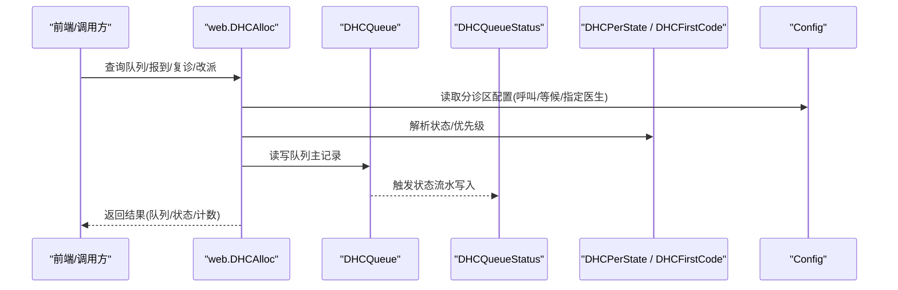
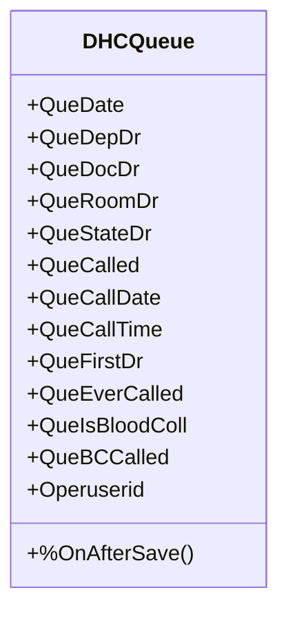
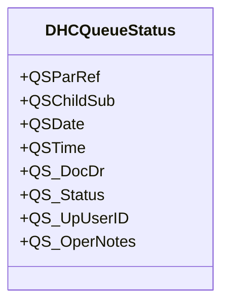
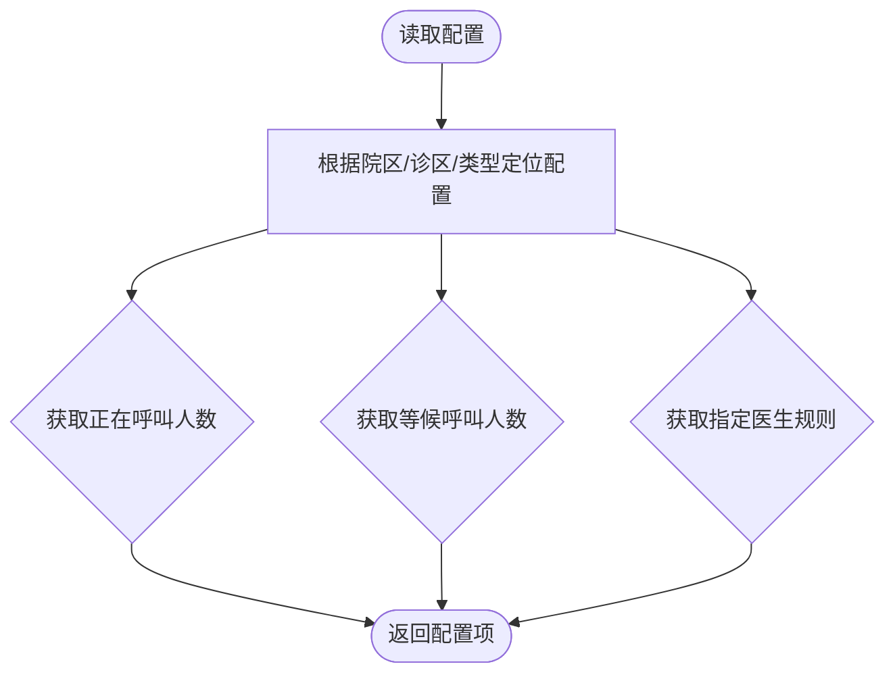
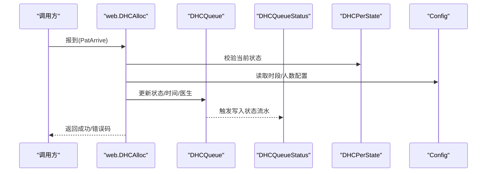
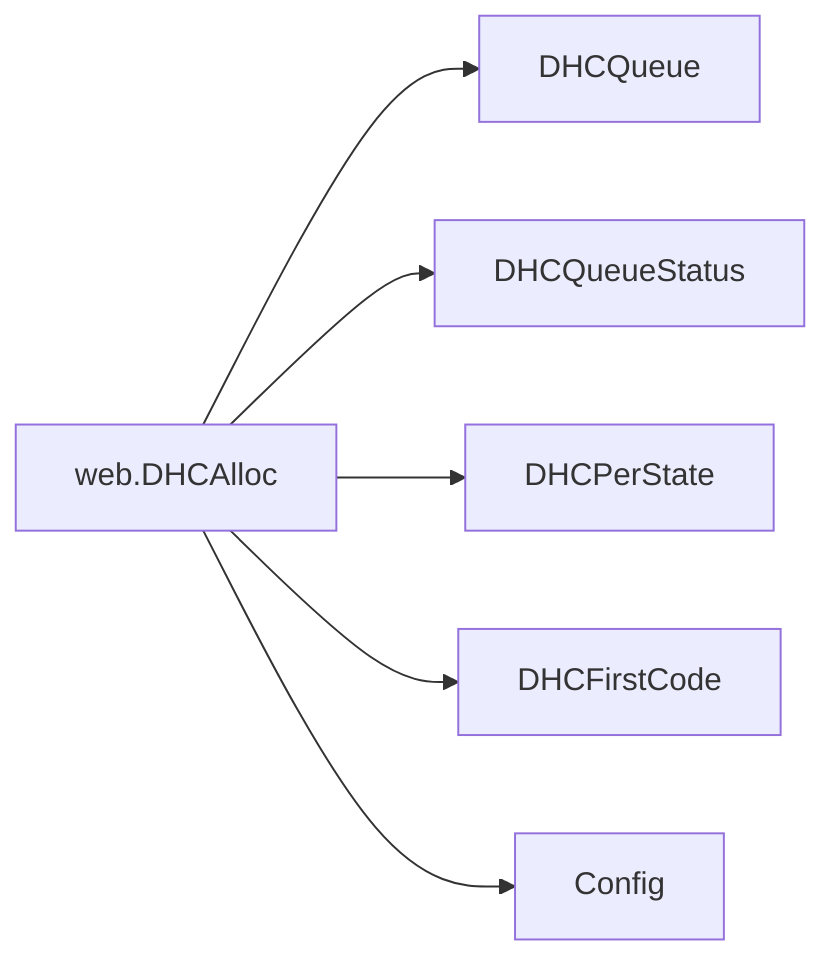

# 门诊分诊调度集成

<cite>
**本文引用的文件**
- [DHCQueue.cls](file://src/backend/triage-ws/User/DHCQueue.cls)
- [DHCQueueStatus.cls](file://src/backend/triage-ws/User/DHCQueueStatus.cls)
- [Config.cls](file://src/backend/triage-ws/CF/DOC/Alloc/Config.cls)
- [DHCAlloc.cls](file://src/backend/triage-ws/web/DHCAlloc.cls)
- [DHCFirstCode.cls](file://src/backend/triage-ws/User/DHCFirstCode.cls)
- [DHCPerState.cls](file://src/backend/triage-ws/User/DHCPerState.cls)
</cite>

## 目录
1. [简介](#简介)
2. [项目结构](#项目结构)
3. [核心组件](#核心组件)
4. [架构总览](#架构总览)
5. [详细组件分析](#详细组件分析)
6. [依赖关系分析](#依赖关系分析)
7. [性能与高并发优化](#性能与高并发优化)
8. [故障转移与服务降级](#故障转移与服务降级)
9. [排障指南](#排障指南)
10. [结论](#结论)
11. [附录：接口与配置示例](#附录接口与配置示例)

## 简介
本文件面向“门诊分诊调度集成”，聚焦于分诊系统与挂号系统的协同，覆盖患者分流算法、优先级计算、资源分配、分诊规则配置、智能排队管理与实时状态同步。文档同时给出调度示例（策略配置、队列管理接口、状态更新机制），并针对高并发场景提供性能优化与负载均衡建议，以及故障转移与服务降级方案。

## 项目结构
本模块位于后端 triage-ws 服务中，围绕“队列数据模型 + 规则配置 + 业务编排”三层组织：
- 数据模型层：队列主表 DHCQueue、队列状态流水 DHCQueueStatus、优先级别字典 DHCFirstCode、通用状态字典 DHCPerState
- 规则配置层：分诊区相关配置 Config（叫号人数、等候人数、指定医生检索规则等）
- 业务编排层：web.DHCAlloc 提供查询、报到、复诊、改派、会诊插入、诊区/诊室查询等能力

图表来源
- [DHCQueue.cls:1-120](file://src/backend/triage-ws/User/DHCQueue.cls#L1-L120)
- [DHCQueueStatus.cls:1-30](file://src/backend/triage-ws/User/DHCQueueStatus.cls#L1-L30)
- [Config.cls:1-76](file://src/backend/triage-ws/CF/DOC/Alloc/Config.cls#L1-L76)
- [DHCAlloc.cls:111-269](file://src/backend/triage-ws/web/DHCAlloc.cls#L111-L269)

章节来源
- [DHCQueue.cls:1-120](file://src/backend/triage-ws/User/DHCQueue.cls#L1-L120)
- [DHCQueueStatus.cls:1-30](file://src/backend/triage-ws/User/DHCQueueStatus.cls#L1-L30)
- [Config.cls:1-76](file://src/backend/triage-ws/CF/DOC/Alloc/Config.cls#L1-L76)
- [DHCAlloc.cls:111-269](file://src/backend/triage-ws/web/DHCAlloc.cls#L111-L269)

## 核心组件
- 队列主记录 DHCQueue：承载一次就诊的队列信息（日期、科室、医生、房间、状态、呼叫时间、优先级别、是否已呼叫等），并在保存后触发状态流水写入。
- 状态流水 DHCQueueStatus：记录每次状态变更的时间、操作人、新状态及备注，支持按医生、日期、状态等多维索引查询。
- 优先级别 DHCFirstCode：定义“正常/优先”等优先级类别，用于排序与展示。
- 通用状态 DHCPerState：定义“报到/等候/过号/复诊/退号”等状态，驱动流程控制。
- 分诊区配置 Config：按院区/诊区维度配置“正在呼叫人数”“等候呼叫人数”“指定医生检索规则”“复诊可重新指定医生”等。
- 业务编排 web.DHCAlloc：实现患者查询、报到、复诊、改派、会诊插入、诊区/诊室列表等关键流程。

章节来源
- [DHCQueue.cls:24-100](file://src/backend/triage-ws/User/DHCQueue.cls#L24-L100)
- [DHCQueueStatus.cls:8-27](file://src/backend/triage-ws/User/DHCQueueStatus.cls#L8-L27)
- [DHCFirstCode.cls:4-12](file://src/backend/triage-ws/User/DHCFirstCode.cls#L4-L12)
- [DHCPerState.cls:4-13](file://src/backend/triage-ws/User/DHCPerState.cls#L4-L13)
- [Config.cls:5-24](file://src/backend/triage-ws/CF/DOC/Alloc/Config.cls#L5-L24)
- [DHCAlloc.cls:111-269](file://src/backend/triage-ws/web/DHCAlloc.cls#L111-L269)

## 架构总览
整体采用“数据模型 + 规则配置 + 业务编排”的分层架构：
- 数据模型层提供持久化与索引能力，支撑高效查询与审计追溯。
- 规则配置层通过 Config 集中管理分诊策略参数，便于多院区/诊区差异化运营。
- 业务编排层以 web.DHCAlloc 为核心，串联挂号系统、排班系统、字典表与队列数据，完成端到端调度。

图表来源
- [DHCAlloc.cls:111-269](file://src/backend/triage-ws/web/DHCAlloc.cls#L111-L269)
- [DHCQueue.cls:102-121](file://src/backend/triage-ws/User/DHCQueue.cls#L102-L121)
- [DHCQueueStatus.cls:1-30](file://src/backend/triage-ws/User/DHCQueueStatus.cls#L1-L30)
- [Config.cls:5-24](file://src/backend/triage-ws/CF/DOC/Alloc/Config.cls#L5-L24)

## 详细组件分析

### 队列主记录 DHCQueue
- 职责：维护一次就诊的完整队列上下文（日期、科室、医生、房间、状态、呼叫时间、优先级别、是否已呼叫、采血/B超流程标记等）。
- 关键设计：
  - 多字段索引：按日期、科室、医生、房间、人员ID等建立复合索引，提升查询效率。
  - 触发器：在插入/更新后自动调用状态流水写入，保证状态可追溯。
  - 扩展字段：预留 Comm1/Comm2 等扩展位，支持业务流程描述。
- 复杂度：典型查询为按日期+科室+状态的过滤，配合索引可达 O(logN) 级别；批量遍历需关注分页与游标使用。

图表来源
- [DHCQueue.cls:24-100](file://src/backend/triage-ws/User/DHCQueue.cls#L24-L100)
- [DHCQueue.cls:102-121](file://src/backend/triage-ws/User/DHCQueue.cls#L102-L121)

章节来源
- [DHCQueue.cls:24-100](file://src/backend/triage-ws/User/DHCQueue.cls#L24-L100)
- [DHCQueue.cls:102-121](file://src/backend/triage-ws/User/DHCQueue.cls#L102-L121)

### 状态流水 DHCQueueStatus
- 职责：记录每次状态变更的明细（父引用、子序号、时间、医生、状态、操作人、备注），并提供多维索引（按医生、日期、状态、操作人）。
- 关键设计：
  - RowId 由父引用与子序号组成，确保唯一性。
  - 多个 SQLMap 索引：DocDr、Date、Status、UPUser，便于多维度统计与审计。
- 复杂度：按日期+状态或医生+日期的查询利用索引，保持良好性能。

图表来源
- [DHCQueueStatus.cls:8-27](file://src/backend/triage-ws/User/DHCQueueStatus.cls#L8-L27)
- [DHCQueueStatus.cls:82-190](file://src/backend/triage-ws/User/DHCQueueStatus.cls#L82-L190)

章节来源
- [DHCQueueStatus.cls:8-27](file://src/backend/triage-ws/User/DHCQueueStatus.cls#L8-L27)
- [DHCQueueStatus.cls:82-190](file://src/backend/triage-ws/User/DHCQueueStatus.cls#L82-L190)

### 分诊区配置 Config
- 职责：按院区/诊区维度配置分诊策略，包括“正在呼叫人数”“等候呼叫人数”“指定医生检索规则”“复诊可重新指定医生”等。
- 关键设计：
  - 组合索引：HospitalDR+ConfigType、ExaBorDR+ConfigType，便于快速定位配置。
  - 扩展字段：Common1~Common12，支持未来策略扩展。
- 使用方式：业务编排层在查询/报到/改派时读取配置，决定显示数量与行为。

图表来源
- [Config.cls:5-24](file://src/backend/triage-ws/CF/DOC/Alloc/Config.cls#L5-L24)
- [Config.cls:71-76](file://src/backend/triage-ws/CF/DOC/Alloc/Config.cls#L71-L76)

章节来源
- [Config.cls:5-24](file://src/backend/triage-ws/CF/DOC/Alloc/Config.cls#L5-L24)
- [Config.cls:71-76](file://src/backend/triage-ws/CF/DOC/Alloc/Config.cls#L71-L76)

### 业务编排 web.DHCAlloc
- 职责：对外暴露分诊调度的核心能力，包括：
  - 查询患者队列 FindPatQueue：按日期、诊区、状态、房间、号别、患者ID等条件筛选，结合优先级别与状态进行排序输出。
  - 报到 PatArrive：校验状态与时段限制，更新状态为“等候”，必要时生成新的队列号。
  - 复诊 PatAgain：将队列状态置为“复诊”，重置优先级别。
  - 改派 PatAdjDoc：在允许范围内调整接诊医生与诊区，更新状态与时间。
  - 会诊插入 ConsultationQueueInsert：封装会诊队列插入逻辑。
  - 诊区/诊室查询 QueryExabExecute/QueryExaboroughExecute：基于用户权限与排班，输出可用诊区与诊室列表。
- 关键设计：
  - 状态机约束：严格校验当前状态是否允许操作（如仅“报到/过号”可报到）。
  - 时段控制：报到前检查时间段限制，避免非工作时段误操作。
  - 配置联动：依据 Config 中的“正在呼叫人数/等候呼叫人数”控制前端展示与调度策略。
  - 事务与一致性：涉及队列主表与状态流水的写入，确保一致性与可追溯。

图表来源
- [DHCAlloc.cls:393-472](file://src/backend/triage-ws/web/DHCAlloc.cls#L393-L472)
- [DHCQueue.cls:102-121](file://src/backend/triage-ws/User/DHCQueue.cls#L102-L121)
- [Config.cls:5-24](file://src/backend/triage-ws/CF/DOC/Alloc/Config.cls#L5-L24)

章节来源
- [DHCAlloc.cls:111-269](file://src/backend/triage-ws/web/DHCAlloc.cls#L111-L269)
- [DHCAlloc.cls:393-472](file://src/backend/triage-ws/web/DHCAlloc.cls#L393-L472)
- [DHCAlloc.cls:277-348](file://src/backend/triage-ws/web/DHCAlloc.cls#L277-L348)
- [DHCAlloc.cls:350-391](file://src/backend/triage-ws/web/DHCAlloc.cls#L350-L391)
- [DHCAlloc.cls:474-515](file://src/backend/triage-ws/web/DHCAlloc.cls#L474-L515)
- [DHCAlloc.cls:520-552](file://src/backend/triage-ws/web/DHCAlloc.cls#L520-L552)
- [DHCAlloc.cls:646-749](file://src/backend/triage-ws/web/DHCAlloc.cls#L646-L749)

### 优先级与状态字典
- DHCFirstCode：定义“正常/优先”等优先级，参与排序与展示。
- DHCPerState：定义“报到/等候/过号/复诊/退号”等状态，驱动流程控制。
- 使用方式：在查询与状态流转中，通过字典映射名称与编码，保证跨语言与一致性。

章节来源
- [DHCFirstCode.cls:4-12](file://src/backend/triage-ws/User/DHCFirstCode.cls#L4-L12)
- [DHCPerState.cls:4-13](file://src/backend/triage-ws/User/DHCPerState.cls#L4-L13)

## 依赖关系分析
- web.DHCAlloc 依赖：
  - 数据模型：DHCQueue、DHCQueueStatus
  - 字典：DHCPerState、DHCFirstCode
  - 配置：Config
- 数据流向：
  - 查询：从 DHCQueue 读取并按状态/优先级/时间排序，结合字典翻译名称。
  - 报到/复诊/改派：更新 DHCQueue，并通过触发器写入 DHCQueueStatus。
  - 配置读取：根据院区/诊区/类型获取策略参数，影响展示与行为。

图表来源
- [DHCAlloc.cls:111-269](file://src/backend/triage-ws/web/DHCAlloc.cls#L111-L269)
- [DHCQueue.cls:102-121](file://src/backend/triage-ws/User/DHCQueue.cls#L102-L121)
- [Config.cls:5-24](file://src/backend/triage-ws/CF/DOC/Alloc/Config.cls#L5-L24)

章节来源
- [DHCAlloc.cls:111-269](file://src/backend/triage-ws/web/DHCAlloc.cls#L111-L269)
- [DHCQueue.cls:102-121](file://src/backend/triage-ws/User/DHCQueue.cls#L102-L121)
- [Config.cls:5-24](file://src/backend/triage-ws/CF/DOC/Alloc/Config.cls#L5-L24)

## 性能与高并发优化
- 索引优化：
  - DHCQueue 已对日期、科室、医生、房间、人员ID等建立复合索引，建议查询尽量命中这些索引键。
  - DHCQueueStatus 提供按医生、日期、状态、操作人的索引，适合统计与审计查询。
- 查询分页与游标：
  - 对于大结果集，建议使用分页或游标式读取，避免一次性加载过多数据。
- 缓存与临时存储：
  - web.DHCAlloc 在诊区/诊室查询中使用临时存储（^CacheTemp）减少重复计算，建议在高频场景下复用该模式。
- 事务与批处理：
  - 涉及多表写入的操作应包裹在事务中，确保一致性；批量更新时考虑分批提交以降低锁竞争。
- 负载均衡：
  - 在应用层可通过多实例部署与请求路由均衡负载；数据库层可考虑读写分离与连接池优化。

[本节为通用性能建议，不直接分析具体代码文件]

## 故障转移与服务降级
- 故障转移：
  - 数据库故障：启用只读模式或切换备用库，前端提示“暂时不可用”。
  - 服务实例故障：通过健康检查与自动重启恢复；若持续失败，流量切至其他实例。
- 服务降级：
  - 降级策略：在高峰期关闭非必要功能（如复杂报表、历史回溯），保留核心报到/查询能力。
  - 限流与熔断：对高频接口实施限流，异常时快速失败并返回友好提示。
- 回滚与补偿：
  - 对关键写操作提供补偿逻辑（如状态回滚、重试机制），确保最终一致性。

[本节为通用可靠性建议，不直接分析具体代码文件]

## 排障指南
- 常见问题定位：
  - 无法报到：检查当前状态是否为“报到/过号”，并确认时段限制与医生停诊状态。
  - 队列为空：确认日期、诊区、状态过滤条件是否正确；检查是否有有效队列记录。
  - 状态不同步：查看 DHCQueueStatus 流水，确认触发器是否正常写入。
- 日志与审计：
  - 通过 DHCQueueStatus 的备注字段与操作人字段追踪变更轨迹。
  - 结合业务日志（如 DTS 埋点）定位问题时间点。
- 性能问题：
  - 慢查询：检查是否命中索引；必要时优化查询条件或增加索引。
  - 高并发：评估连接池、事务粒度与锁竞争情况。

章节来源
- [DHCQueueStatus.cls:8-27](file://src/backend/triage-ws/User/DHCQueueStatus.cls#L8-L27)
- [DHCAlloc.cls:393-472](file://src/backend/triage-ws/web/DHCAlloc.cls#L393-L472)

## 结论
本集成以 DHCQueue 为核心，配合 DHCQueueStatus 的状态流水、Config 的策略配置与 web.DHCAlloc 的业务编排，实现了门诊分诊的高效调度。通过合理的索引设计与流程约束，系统在准确性与性能之间取得平衡。在高并发场景下，建议结合缓存、分页、事务与负载均衡策略进一步提升稳定性与吞吐能力。

[本节为总结性内容，不直接分析具体代码文件]

## 附录：接口与配置示例
- 分诊策略配置（Config）
  - 字段：院区、诊区、配置类型（Call/AdjDoc）、正在呼叫人数、等候呼叫人数、指定医生检索规则、复诊可重新指定医生等。
  - 用途：控制前端展示数量与行为，支持多院区差异化运营。
- 队列管理接口（web.DHCAlloc）
  - 查询队列：FindPatQueue，支持按日期、诊区、状态、房间、号别、患者ID等条件筛选。
  - 报到：PatArrive，校验状态与时段限制，更新状态为“等候”，必要时生成新队列号。
  - 复诊：PatAgain，将状态置为“复诊”，重置优先级别。
  - 改派：PatAdjDoc，在允许范围内调整接诊医生与诊区。
  - 会诊插入：ConsultationQueueInsert，封装会诊队列插入逻辑。
  - 诊区/诊室查询：QueryExabExecute/QueryExaboroughExecute，基于用户权限与排班输出可用列表。
- 状态更新机制
  - 通过 DHCQueue 的触发器自动写入 DHCQueueStatus，确保状态变更可追溯。
  - 状态字典（DHCPerState）与优先级字典（DHCFirstCode）统一命名与编码，保证一致性。

章节来源
- [Config.cls:5-24](file://src/backend/triage-ws/CF/DOC/Alloc/Config.cls#L5-L24)
- [DHCAlloc.cls:111-269](file://src/backend/triage-ws/web/DHCAlloc.cls#L111-L269)
- [DHCAlloc.cls:393-472](file://src/backend/triage-ws/web/DHCAlloc.cls#L393-L472)
- [DHCQueue.cls:102-121](file://src/backend/triage-ws/User/DHCQueue.cls#L102-L121)
- [DHCPerState.cls:4-13](file://src/backend/triage-ws/User/DHCPerState.cls#L4-L13)
- [DHCFirstCode.cls:4-12](file://src/backend/triage-ws/User/DHCFirstCode.cls#L4-L12)