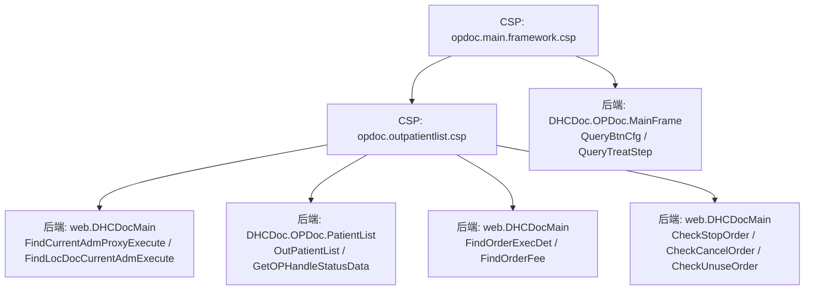
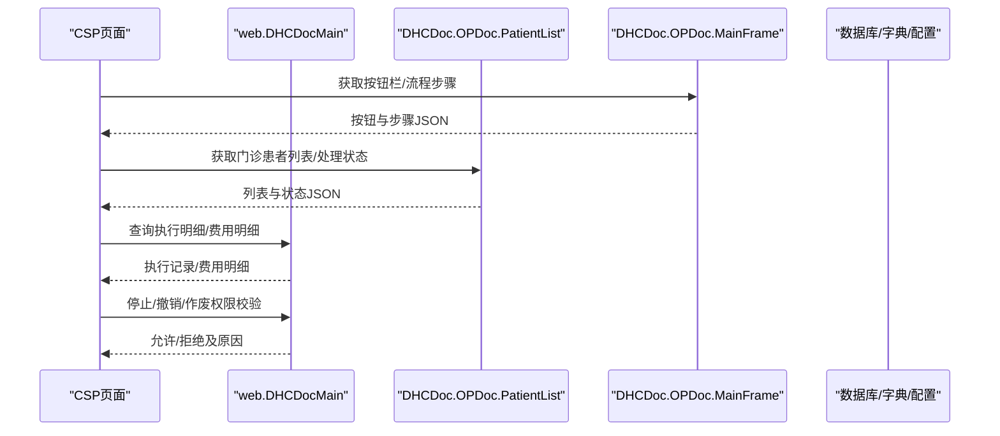
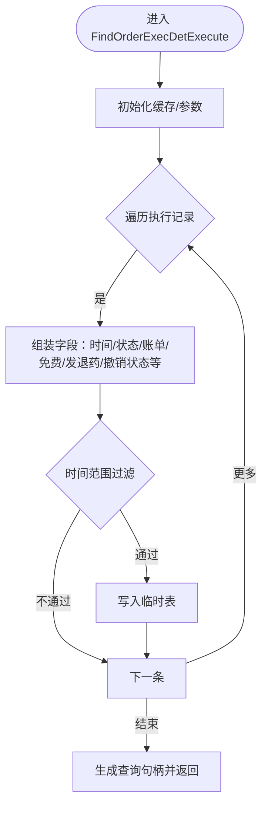
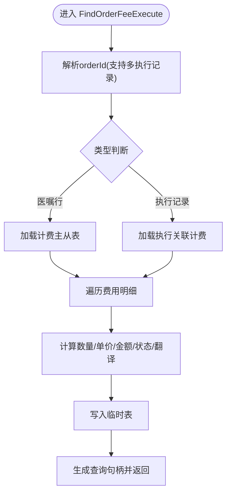
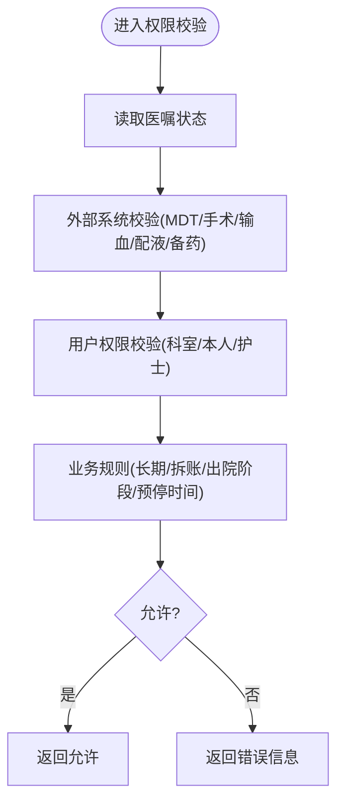
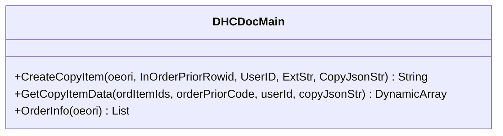
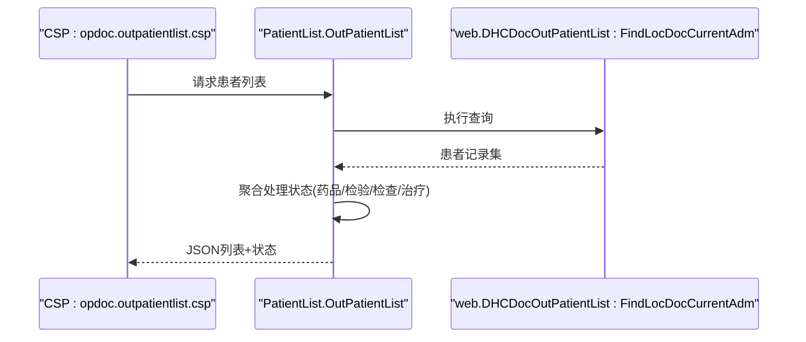
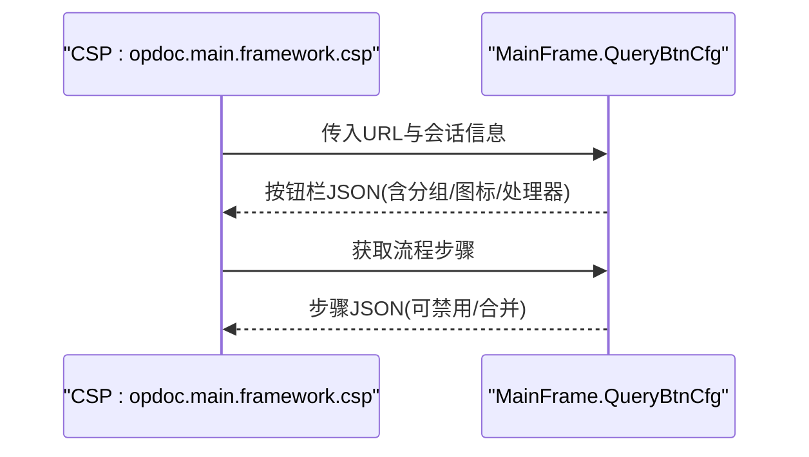
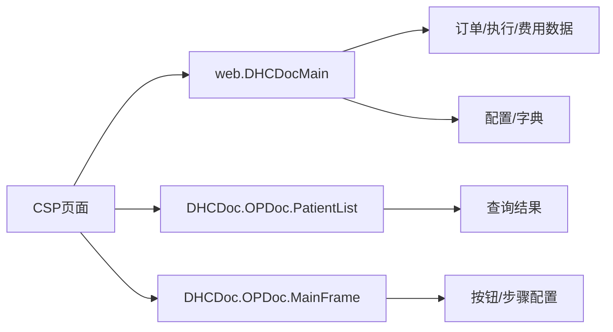

# 门诊医生工作流

<cite>
**本文引用的文件**
- [DHCDocMain.cls](file://src/backend/doc-ws/web/DHCDocMain.cls)
- [PatientList.cls](file://src/backend/doc-ws/DHCDoc/OPDoc/PatientList.cls)
- [MainFrame.cls](file://src/backend/doc-ws/DHCDoc/OPDoc/MainFrame.cls)
- [opdoc.main.framework.csp](file://src/frontend/doc-ws/csp/opdoc.main.framework.csp)
- [opdoc.outpatientlist.csp](file://src/frontend/doc-ws/csp/opdoc.outpatientlist.csp)
- [order.entry.v9.csp](file://src/frontend/doc-ws/csp/order.entry.v9.csp)
</cite>

## 目录
1. [简介](#简介)
2. [项目结构](#项目结构)
3. [核心组件](#核心组件)
4. [架构总览](#架构总览)
5. [详细组件分析](#详细组件分析)
6. [依赖关系分析](#依赖关系分析)
7. [性能考虑](#性能考虑)
8. [故障排查指南](#故障排查指南)
9. [结论](#结论)
10. [附录](#附录)

## 简介
本文件面向门诊医生工作流的完整诊疗流程，覆盖患者登记、诊断录入、医嘱开具、处方管理、执行与收费等关键环节。重点解析后端 DHCDocMain 类中的 FindOrderExecDet 与 FindOrderFee 方法机制，梳理 CSP 页面与后端的交互链路，并给出权限控制、数据验证与业务规则的实现方式。文末提供扩展示例、常见问题排查与性能优化建议，帮助开发者快速定位问题并安全扩展功能。

## 项目结构
- 后端服务（doc-ws）
  - web.DHCDocMain：门诊主入口类，封装查询、权限校验、医嘱复制、执行与费用相关逻辑
  - DHCDoc.OPDoc.PatientList：门诊患者列表、处理状态聚合、列配置读取
  - DHCDoc.OPDoc.MainFrame：按钮栏、流程步骤、呼叫分诊、未读报告计数等框架能力
- 前端界面（doc-ws/csp）
  - opdoc.main.framework.csp：门诊一体化主框架
  - opdoc.outpatientlist.csp：门诊患者列表页
  - order.entry.v9.csp：医嘱开立入口页

**图表来源**
- [DHCDocMain.cls:1-150](file://src/backend/doc-ws/web/DHCDocMain.cls#L1-L150)
- [PatientList.cls:289-334](file://src/backend/doc-ws/DHCDoc/OPDoc/PatientList.cls#L289-L334)
- [MainFrame.cls:33-74](file://src/backend/doc-ws/DHCDoc/OPDoc/MainFrame.cls#L33-L74)

**章节来源**
- [DHCDocMain.cls:1-150](file://src/backend/doc-ws/web/DHCDocMain.cls#L1-L150)
- [PatientList.cls:289-334](file://src/backend/doc-ws/DHCDoc/OPDoc/PatientList.cls#L289-L334)
- [MainFrame.cls:33-74](file://src/backend/doc-ws/DHCDoc/OPDoc/MainFrame.cls#L33-L74)

## 核心组件
- web.DHCDocMain
  - 查询类：FindOrderExecDet、FindOrderFee、FindCurrentAdmProxy、FindLocDocCurrentAdm
  - 权限与规则：CheckStopOrder、CheckCancelOrder、CheckUnuseOrder、ForceDealOrder、CheckOperationOrder
  - 辅助能力：CreateCopyItem、GetCopyItemData、OrderInfo、GetPHFreqInfo、getPrintInfo
- DHCDoc.OPDoc.PatientList
  - 门诊患者列表查询、处理状态聚合（药品、检验、检查、治疗）、列配置读取
- DHCDoc.OPDoc.MainFrame
  - 按钮栏配置、流程步骤、呼叫分诊、未读报告计数、集成页面链接

**章节来源**
- [DHCDocMain.cls:1-150](file://src/backend/doc-ws/web/DHCDocMain.cls#L1-L150)
- [DHCDocMain.cls:1276-1387](file://src/backend/doc-ws/web/DHCDocMain.cls#L1276-L1387)
- [PatientList.cls:145-243](file://src/backend/doc-ws/DHCDoc/OPDoc/PatientList.cls#L145-L243)
- [MainFrame.cls:33-74](file://src/backend/doc-ws/DHCDoc/OPDoc/MainFrame.cls#L33-L74)

## 架构总览
门诊医生工作流采用“CSP 页面 + 后端 Class 查询/接口”的分层模式：
- 前端通过 CSP 发起请求，调用后端 ClassMethod 或 %Query
- 后端在 DHCDocMain 中实现核心查询与业务规则校验，返回结构化数据供前端渲染
- PatientList 负责门诊患者列表及处理状态聚合；MainFrame 负责按钮栏与流程步骤

**图表来源**
- [MainFrame.cls:33-74](file://src/backend/doc-ws/DHCDoc/OPDoc/MainFrame.cls#L33-L74)
- [PatientList.cls:289-334](file://src/backend/doc-ws/DHCDoc/OPDoc/PatientList.cls#L289-L334)
- [DHCDocMain.cls:1-150](file://src/backend/doc-ws/web/DHCDocMain.cls#L1-L150)

## 详细组件分析

### FindOrderExecDet：执行明细查询
- 作用：根据医嘱行ID与执行时间范围，查询该医嘱的执行明细，包括执行时间、状态、账单状态、免费标志、发退药数量、申请撤销状态、是否可欠费执行、备注、检查部位等
- 关键流程
  - 参数校验与缓存准备
  - 遍历执行记录，组装字段（执行日期/时间、状态码/描述、账单状态、免费标志、发退药数量、申请撤销状态等）
  - 过滤条件：按要求执行时间范围筛选
  - 输出到临时表并生成查询句柄
- 复杂度：O(N) 遍历执行记录，N为执行记录数
- 扩展点：如需新增显示字段，可在输出数组位置追加并在前端映射

**图表来源**
- [DHCDocMain.cls:9-127](file://src/backend/doc-ws/web/DHCDocMain.cls#L9-L127)

**章节来源**
- [DHCDocMain.cls:9-127](file://src/backend/doc-ws/web/DHCDocMain.cls#L9-L127)

### FindOrderFee：费用明细查询
- 作用：根据医嘱行ID或执行记录ID，查询对应的费用明细，包含收费项名称、代码、数量、单价、金额、记账时间、原因等
- 关键流程
  - 支持多执行记录输入（以^分隔）
  - 区分医嘱orditemrowid与执行oeore行id两种情况
  - 遍历费用明细，计算金额符号、账单状态、翻译描述
  - 输出到临时表并生成查询句柄
- 复杂度：O(M) 遍历费用明细，M为费用明细数
- 扩展点：如需新增费用字段，可在输出数组位置追加并在前端映射

**图表来源**
- [DHCDocMain.cls:134-203](file://src/backend/doc-ws/web/DHCDocMain.cls#L134-L203)

**章节来源**
- [DHCDocMain.cls:134-203](file://src/backend/doc-ws/web/DHCDocMain.cls#L134-L203)

### 权限控制与业务规则
- 停止医嘱权限：CheckStopOrder/CheckOneStopOrder
  - 校验状态（已作废/已停/已执行）、会诊/MDT/手术/输血等外部系统约束
  - 长期医嘱限制、拆账单限制、用户权限（同科室/本人/护士特殊规则）
  - 预停时间窗口校验、子医嘱联动校验
- 撤销/作废权限：CheckCancelOrder/CheckUnuseOrder/CheckCancelOrdCommonUser
  - 状态校验、执行与结算约束、出院阶段限制、配液/备药/扫码等前置流程
  - 门急诊特定规则（挂号诊查费不可停、医保处方回退等）
- 强制处理：ForceDealOrder
  - 针对特定子类或护士场景的强制作废/撤销策略

**图表来源**
- [DHCDocMain.cls:1756-1944](file://src/backend/doc-ws/web/DHCDocMain.cls#L1756-L1944)
- [DHCDocMain.cls:1946-2241](file://src/backend/doc-ws/web/DHCDocMain.cls#L1946-L2241)
- [DHCDocMain.cls:2312-2338](file://src/backend/doc-ws/web/DHCDocMain.cls#L2312-L2338)

**章节来源**
- [DHCDocMain.cls:1756-1944](file://src/backend/doc-ws/web/DHCDocMain.cls#L1756-L1944)
- [DHCDocMain.cls:1946-2241](file://src/backend/doc-ws/web/DHCDocMain.cls#L1946-L2241)
- [DHCDocMain.cls:2312-2338](file://src/backend/doc-ws/web/DHCDocMain.cls#L2312-L2338)

### 医嘱复制与模板
- CreateCopyItem：将现有医嘱项转换为可复制的数据串，包含用法、频次、时长、包装单位、优先级、备注、紧急标志、阶段、流速等
- GetCopyItemData：批量复制多个医嘱项，处理主从关系与序号重算
- OrderInfo：获取医嘱展示信息（名称、频次、时长、优先级、开单/停嘱医生、科室、账单单位等）

**图表来源**
- [DHCDocMain.cls:1514-1711](file://src/backend/doc-ws/web/DHCDocMain.cls#L1514-L1711)
- [DHCDocMain.cls:1713-1754](file://src/backend/doc-ws/web/DHCDocMain.cls#L1713-L1754)
- [DHCDocMain.cls:1289-1387](file://src/backend/doc-ws/web/DHCDocMain.cls#L1289-L1387)

**章节来源**
- [DHCDocMain.cls:1514-1711](file://src/backend/doc-ws/web/DHCDocMain.cls#L1514-L1711)
- [DHCDocMain.cls:1713-1754](file://src/backend/doc-ws/web/DHCDocMain.cls#L1713-L1754)
- [DHCDocMain.cls:1289-1387](file://src/backend/doc-ws/web/DHCDocMain.cls#L1289-L1387)

### 门诊患者列表与处理状态
- OutPatientList：基于查询结果构建JSON列表，附加处理状态（药品、检验、检查、治疗）
- GetOPHandleStatusData：聚合各业务域的处理状态，用于前端提示与导航
- ReadListColSet：读取用户列配置，支持隐藏/排序/分页等个性化设置

**图表来源**
- [PatientList.cls:289-334](file://src/backend/doc-ws/DHCDoc/OPDoc/PatientList.cls#L289-L334)
- [PatientList.cls:145-243](file://src/backend/doc-ws/DHCDoc/OPDoc/PatientList.cls#L145-L243)

**章节来源**
- [PatientList.cls:289-334](file://src/backend/doc-ws/DHCDoc/OPDoc/PatientList.cls#L289-L334)
- [PatientList.cls:145-243](file://src/backend/doc-ws/DHCDoc/OPDoc/PatientList.cls#L145-L243)

### 按钮栏与流程步骤
- QueryBtnCfg：根据CSP URL与院区配置动态生成按钮栏数据
- QueryTreatStep：获取一体化流程步骤（如病历、诊断、医嘱、支持模块）
- CallPatient/SkipCallPat：呼叫分诊、过号等队列操作

**图表来源**
- [MainFrame.cls:33-74](file://src/backend/doc-ws/DHCDoc/OPDoc/MainFrame.cls#L33-L74)
- [MainFrame.cls:82-113](file://src/backend/doc-ws/DHCDoc/OPDoc/MainFrame.cls#L82-L113)

**章节来源**
- [MainFrame.cls:33-74](file://src/backend/doc-ws/DHCDoc/OPDoc/MainFrame.cls#L33-L74)
- [MainFrame.cls:82-113](file://src/backend/doc-ws/DHCDoc/OPDoc/MainFrame.cls#L82-L113)

## 依赖关系分析
- 前端CSP依赖后端ClassMethod/%Query提供数据
- DHCDocMain 依赖底层订单、计费、字典、配置等模块进行数据组装与规则校验
- PatientList 依赖查询结果与业务聚合逻辑
- MainFrame 依赖配置表与会话信息生成界面元素

**图表来源**
- [DHCDocMain.cls:1-150](file://src/backend/doc-ws/web/DHCDocMain.cls#L1-L150)
- [PatientList.cls:289-334](file://src/backend/doc-ws/DHCDoc/OPDoc/PatientList.cls#L289-L334)
- [MainFrame.cls:33-74](file://src/backend/doc-ws/DHCDoc/OPDoc/MainFrame.cls#L33-L74)

**章节来源**
- [DHCDocMain.cls:1-150](file://src/backend/doc-ws/web/DHCDocMain.cls#L1-L150)
- [PatientList.cls:289-334](file://src/backend/doc-ws/DHCDoc/OPDoc/PatientList.cls#L289-L334)
- [MainFrame.cls:33-74](file://src/backend/doc-ws/DHCDoc/OPDoc/MainFrame.cls#L33-L74)

## 性能考虑
- 使用临时表与查询句柄减少内存占用，提升大数据量下的响应速度
- 对执行与费用明细采用逐条遍历与过滤，建议在数据量大时增加索引与分页
- 聚合处理状态时避免重复查询，尽量复用已有结果
- 按钮栏与流程步骤配置缓存化，减少频繁读取配置表

[本节为通用指导，无需具体文件引用]

## 故障排查指南
- 执行明细为空
  - 检查医嘱行ID与执行时间范围是否正确
  - 确认是否存在执行记录与账单状态
  - 参考路径：[DHCDocMain.cls:9-127](file://src/backend/doc-ws/web/DHCDocMain.cls#L9-L127)
- 费用明细为空
  - 确认传入的是医嘱行ID还是执行记录ID
  - 检查计费主从表是否存在明细
  - 参考路径：[DHCDocMain.cls:134-203](file://src/backend/doc-ws/web/DHCDocMain.cls#L134-L203)
- 停止/撤销/作废失败
  - 查看状态校验与外部系统约束（MDT/手术/输血/配液/备药）
  - 检查用户权限与科室限制
  - 参考路径：[DHCDocMain.cls:1756-1944](file://src/backend/doc-ws/web/DHCDocMain.cls#L1756-L1944)、[DHCDocMain.cls:1946-2241](file://src/backend/doc-ws/web/DHCDocMain.cls#L1946-L2241)
- 患者列表无数据
  - 确认查询参数与会话信息（科室、医生、时间范围）
  - 检查查询结果集与处理状态聚合
  - 参考路径：[PatientList.cls:289-334](file://src/backend/doc-ws/DHCDoc/OPDoc/PatientList.cls#L289-L334)

**章节来源**
- [DHCDocMain.cls:9-127](file://src/backend/doc-ws/web/DHCDocMain.cls#L9-L127)
- [DHCDocMain.cls:134-203](file://src/backend/doc-ws/web/DHCDocMain.cls#L134-L203)
- [DHCDocMain.cls:1756-1944](file://src/backend/doc-ws/web/DHCDocMain.cls#L1756-L1944)
- [DHCDocMain.cls:1946-2241](file://src/backend/doc-ws/web/DHCDocMain.cls#L1946-L2241)
- [PatientList.cls:289-334](file://src/backend/doc-ws/DHCDoc/OPDoc/PatientList.cls#L289-L334)

## 结论
本工作流以 DHCDocMain 为核心，结合 PatientList 与 MainFrame 提供完整的门诊医生操作体验。FindOrderExecDet 与 FindOrderFee 分别支撑执行与费用明细查询；权限与规则校验确保医疗安全与合规。通过合理的数据结构与查询设计，系统在可扩展性与性能之间取得平衡。建议在实际扩展中遵循现有模式，谨慎修改核心校验逻辑，并结合配置与字典进行灵活定制。

[本节为总结性内容，无需具体文件引用]

## 附录
- 扩展示例：在 FindOrderExecDet 的输出数组中新增字段，并在前端映射显示
  - 参考路径：[DHCDocMain.cls:9-127](file://src/backend/doc-ws/web/DHCDocMain.cls#L9-L127)
- 扩展示例：在 FindOrderFee 中新增费用字段计算与翻译
  - 参考路径：[DHCDocMain.cls:134-203](file://src/backend/doc-ws/web/DHCDocMain.cls#L134-L203)
- 扩展示例：在按钮栏配置中添加新按钮，绑定处理器与提示信息
  - 参考路径：[MainFrame.cls:33-74](file://src/backend/doc-ws/DHCDoc/OPDoc/MainFrame.cls#L33-L74)

**章节来源**
- [DHCDocMain.cls:9-127](file://src/backend/doc-ws/web/DHCDocMain.cls#L9-L127)
- [DHCDocMain.cls:134-203](file://src/backend/doc-ws/web/DHCDocMain.cls#L134-L203)
- [MainFrame.cls:33-74](file://src/backend/doc-ws/DHCDoc/OPDoc/MainFrame.cls#L33-L74)