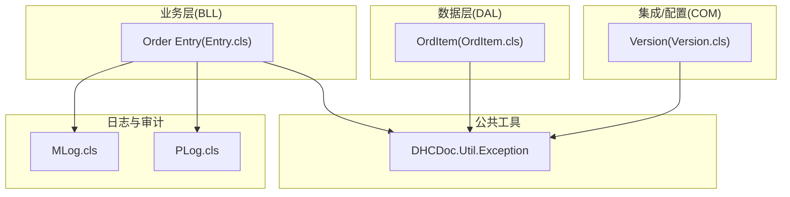
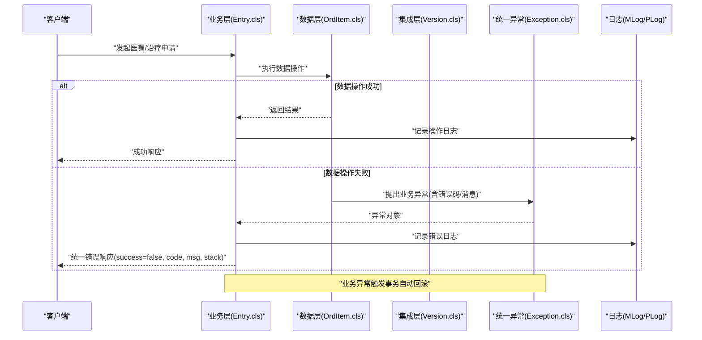
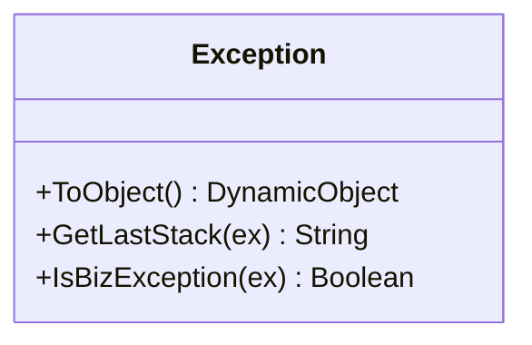
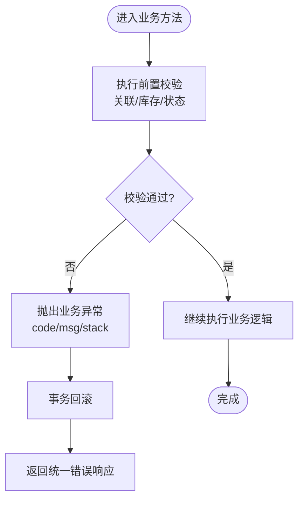
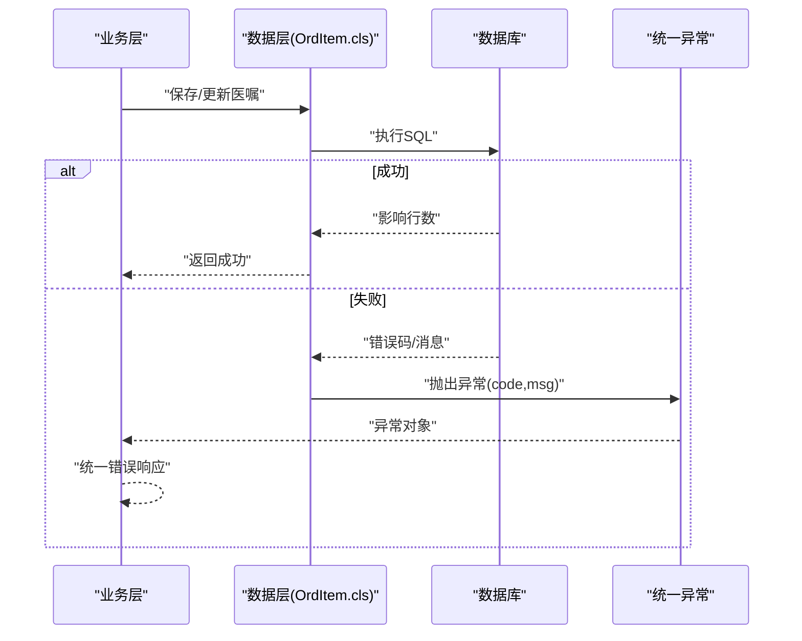
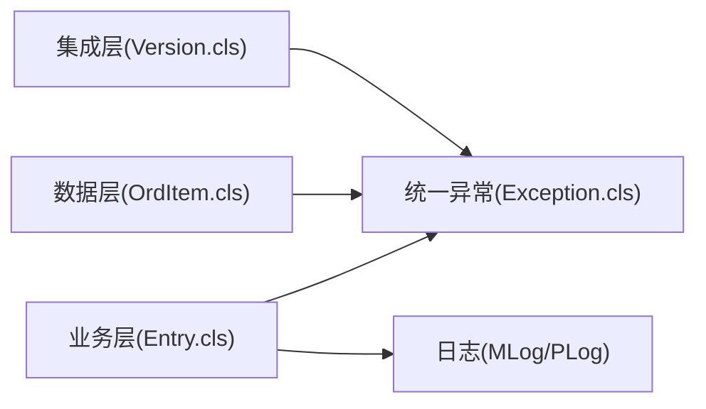

# 错误处理机制

<cite>
**本文引用的文件**
- [Exception.cls](file://src/backend/public-mc/DHCDoc/Util/Exception.cls)
- [Entry.cls](file://src/backend/doc-ws/DHCDoc/Order/BLL/V9/Entry.cls)
- [OrdItem.cls](file://src/backend/doc-ws/DHCDoc/Order/DAL/V9/OrdItem.cls)
- [Version.cls](file://src/backend/doc-ws/DHCDoc/Order/COM/Version.cls)
- [Apply.cls](file://src/backend/cure-ws/DHCDoc/DHCDocCure/Apply.cls)
- [AppointmentV2.cls](file://src/backend/cure-ws/DHCDoc/DHCDocCure/AppointmentV2.cls)
- [AssScale.cls](file://src/backend/cure-ws/DHCDoc/DHCDocCure/AssScale.cls)
- [MLog.cls](file://src/backend/doc-ws/DHCAnt/Base/MLog.cls)
- [PLog.cls](file://src/backend/doc-ws/DHCDoc/Chemo/Base/PLog.cls)
</cite>

## 目录
1. [简介](#简介)
2. [项目结构](#项目结构)
3. [核心组件](#核心组件)
4. [架构总览](#架构总览)
5. [详细组件分析](#详细组件分析)
6. [依赖关系分析](#依赖关系分析)
7. [性能考虑](#性能考虑)
8. [故障排查指南](#故障排查指南)
9. [结论](#结论)
10. [附录](#附录)

## 简介
本文件系统性梳理医疗系统（Iris IMedical）中的错误处理机制，覆盖统一错误代码、异常处理流程、错误响应格式、错误分类、国际化、日志记录与监控告警、常见错误诊断与解决方案、编程最佳实践与调试技巧，以及错误追踪与性能监控的实现方式。文档面向不同技术背景的读者，提供从高层概览到代码级细节的渐进式说明，并辅以可视化图示帮助理解。

## 项目结构
错误处理相关能力分布在公共工具层与各业务模块中：
- 公共工具层：统一的业务异常类型与转换方法，便于上层统一捕获与返回。
- 业务逻辑层（BLL）：在关键业务流程中抛出业务异常，保证事务一致性。
- 数据访问层（DAL）：在数据库操作失败时抛出异常，附带上下文信息。
- 集成与配置层（COM）：对底层系统异常进行包装与标准化。
- 日志与审计：通过持久化日志类记录关键操作与变更，辅助问题定位。

图表来源
- [Exception.cls:1-38](file://src/backend/public-mc/DHCDoc/Util/Exception.cls#L1-L38)
- [Entry.cls:100-140](file://src/backend/doc-ws/DHCDoc/Order/BLL/V9/Entry.cls#L100-L140)
- [OrdItem.cls:10-20](file://src/backend/doc-ws/DHCDoc/Order/DAL/V9/OrdItem.cls#L10-L20)
- [Version.cls:40-50](file://src/backend/doc-ws/DHCDoc/Order/COM/Version.cls#L40-L50)
- [MLog.cls:1-81](file://src/backend/doc-ws/DHCAnt/Base/MLog.cls#L1-L81)
- [PLog.cls:1-85](file://src/backend/doc-ws/DHCDoc/Chemo/Base/PLog.cls#L1-L85)

章节来源
- [Exception.cls:1-38](file://src/backend/public-mc/DHCDoc/Util/Exception.cls#L1-L38)
- [Entry.cls:100-140](file://src/backend/doc-ws/DHCDoc/Order/BLL/V9/Entry.cls#L100-L140)
- [OrdItem.cls:10-20](file://src/backend/doc-ws/DHCDoc/Order/DAL/V9/OrdItem.cls#L10-L20)
- [Version.cls:40-50](file://src/backend/doc-ws/DHCDoc/Order/COM/Version.cls#L40-L50)
- [MLog.cls:1-81](file://src/backend/doc-ws/DHCAnt/Base/MLog.cls#L1-L81)
- [PLog.cls:1-85](file://src/backend/doc-ws/DHCDoc/Chemo/Base/PLog.cls#L1-L85)

## 核心组件
- 统一业务异常类型：提供标准化的异常对象、堆栈提取、是否业务异常的判断，以及可序列化的响应体构造。
- 业务层异常抛出点：在订单/医嘱等关键流程中进行前置校验与状态检查，失败时抛出业务异常，确保事务回滚。
- 数据层异常抛出点：在执行SQL或保存数据失败时抛出异常，携带原始错误码与消息，便于上层统一处理。
- 集成层异常包装：将系统级异常转换为标准业务异常，屏蔽底层差异。
- 日志与审计：通过持久化日志记录关键操作与变更，支持事后追溯与合规审计。

章节来源
- [Exception.cls:1-38](file://src/backend/public-mc/DHCDoc/Util/Exception.cls#L1-L38)
- [Entry.cls:100-140](file://src/backend/doc-ws/DHCDoc/Order/BLL/V9/Entry.cls#L100-L140)
- [OrdItem.cls:10-20](file://src/backend/doc-ws/DHCDoc/Order/DAL/V9/OrdItem.cls#L10-L20)
- [Version.cls:40-50](file://src/backend/doc-ws/DHCDoc/Order/COM/Version.cls#L40-L50)
- [MLog.cls:1-81](file://src/backend/doc-ws/DHCAnt/Base/MLog.cls#L1-L81)
- [PLog.cls:1-85](file://src/backend/doc-ws/DHCDoc/Chemo/Base/PLog.cls#L1-L85)

## 架构总览
下图展示请求进入后，业务层与数据层的异常抛出路径，以及统一异常对象的生成与响应序列化过程。

图表来源
- [Entry.cls:100-140](file://src/backend/doc-ws/DHCDoc/Order/BLL/V9/Entry.cls#L100-L140)
- [OrdItem.cls:10-20](file://src/backend/doc-ws/DHCDoc/Order/DAL/V9/OrdItem.cls#L10-L20)
- [Version.cls:40-50](file://src/backend/doc-ws/DHCDoc/Order/COM/Version.cls#L40-L50)
- [Exception.cls:1-38](file://src/backend/public-mc/DHCDoc/Util/Exception.cls#L1-L38)
- [MLog.cls:1-81](file://src/backend/doc-ws/DHCAnt/Base/MLog.cls#L1-L81)
- [PLog.cls:1-85](file://src/backend/doc-ws/DHCDoc/Chemo/Base/PLog.cls#L1-L85)

## 详细组件分析

### 统一业务异常与响应格式
- 异常类型：继承自抽象异常，用于承载业务错误码、消息与堆栈信息。
- 响应序列化：提供将异常转换为标准JSON对象的方法，包含成功标志、错误码、消息、堆栈与数据字段。
- 堆栈提取：过滤框架内部堆栈，仅保留业务调用位置，便于快速定位问题。
- 业务异常识别：提供判断是否为业务异常的方法，便于上层区分系统异常与业务异常。

图表来源
- [Exception.cls:1-38](file://src/backend/public-mc/DHCDoc/Util/Exception.cls#L1-L38)

章节来源
- [Exception.cls:1-38](file://src/backend/public-mc/DHCDoc/Util/Exception.cls#L1-L38)

### 业务层异常抛出（医嘱/治疗申请）
- 前置校验：如关联关系、库存、状态等，不满足条件时抛出业务异常。
- 事务语义：业务异常触发事务自动回滚，保证数据一致性。
- 国际化：错误消息使用翻译函数，结合会话语言动态输出。

图表来源
- [Entry.cls:100-140](file://src/backend/doc-ws/DHCDoc/Order/BLL/V9/Entry.cls#L100-L140)
- [Apply.cls:1470-1570](file://src/backend/cure-ws/DHCDoc/DHCDocCure/Apply.cls#L1470-L1570)
- [AppointmentV2.cls:920-940](file://src/backend/cure-ws/DHCDoc/DHCDocCure/AppointmentV2.cls#L920-L940)
- [AssScale.cls:120-140](file://src/backend/cure-ws/DHCDoc/DHCDocCure/AssScale.cls#L120-L140)

章节来源
- [Entry.cls:100-140](file://src/backend/doc-ws/DHCDoc/Order/BLL/V9/Entry.cls#L100-L140)
- [Apply.cls:1470-1570](file://src/backend/cure-ws/DHCDoc/DHCDocCure/Apply.cls#L1470-L1570)
- [AppointmentV2.cls:920-940](file://src/backend/cure-ws/DHCDoc/DHCDocCure/AppointmentV2.cls#L920-L940)
- [AssScale.cls:120-140](file://src/backend/cure-ws/DHCDoc/DHCDocCure/AssScale.cls#L120-L140)

### 数据层异常抛出（保存/更新失败）
- 在SQL执行或保存失败时抛出异常，携带原始错误码与消息。
- 上层统一捕获并转换为标准响应，避免泄露底层细节。

图表来源
- [OrdItem.cls:10-20](file://src/backend/doc-ws/DHCDoc/Order/DAL/V9/OrdItem.cls#L10-L20)
- [OrdItem.cls:360-380](file://src/backend/doc-ws/DHCDoc/Order/DAL/V9/OrdItem.cls#L360-L380)
- [OrdItem.cls:560-580](file://src/backend/doc-ws/DHCDoc/Order/DAL/V9/OrdItem.cls#L560-L580)
- [OrdItem.cls:620-640](file://src/backend/doc-ws/DHCDoc/Order/DAL/V9/OrdItem.cls#L620-L640)

章节来源
- [OrdItem.cls:10-20](file://src/backend/doc-ws/DHCDoc/Order/DAL/V9/OrdItem.cls#L10-L20)
- [OrdItem.cls:360-380](file://src/backend/doc-ws/DHCDoc/Order/DAL/V9/OrdItem.cls#L360-L380)
- [OrdItem.cls:560-580](file://src/backend/doc-ws/DHCDoc/Order/DAL/V9/OrdItem.cls#L560-L580)
- [OrdItem.cls:620-640](file://src/backend/doc-ws/DHCDoc/Order/DAL/V9/OrdItem.cls#L620-L640)

### 集成层异常包装（系统异常标准化）
- 将系统级异常转换为标准业务异常，屏蔽底层差异，便于统一处理。
- 示例：当方法不存在或版本不匹配时，抛出带错误码的系统异常。

章节来源
- [Version.cls:40-50](file://src/backend/doc-ws/DHCDoc/Order/COM/Version.cls#L40-L50)

### 日志与审计（错误追踪与合规）
- 审核日志（MLog）：记录申请单审核相关的操作时间、人员、科室、值与备注，支持按申请单与类型索引查询。
- 化疗方案日志（PLog）：记录方案状态变更等操作，包含操作ID、表名、时间、人员、科室、值与备注，支持复合索引。
- 用途：错误发生后，可通过日志回溯操作链路，定位问题根因；同时满足合规审计要求。

章节来源
- [MLog.cls:1-81](file://src/backend/doc-ws/DHCAnt/Base/MLog.cls#L1-L81)
- [PLog.cls:1-85](file://src/backend/doc-ws/DHCDoc/Chemo/Base/PLog.cls#L1-L85)

## 依赖关系分析
- 业务层依赖统一异常类型，确保异常对象一致性与可序列化。
- 数据层在失败时抛出异常，由业务层统一捕获并转化为响应。
- 集成层对系统异常进行包装，减少业务层耦合。
- 日志与审计作为横切关注点，贯穿业务流程，便于追踪与审计。

图表来源
- [Entry.cls:100-140](file://src/backend/doc-ws/DHCDoc/Order/BLL/V9/Entry.cls#L100-L140)
- [OrdItem.cls:10-20](file://src/backend/doc-ws/DHCDoc/Order/DAL/V9/OrdItem.cls#L10-L20)
- [Version.cls:40-50](file://src/backend/doc-ws/DHCDoc/Order/COM/Version.cls#L40-L50)
- [Exception.cls:1-38](file://src/backend/public-mc/DHCDoc/Util/Exception.cls#L1-L38)
- [MLog.cls:1-81](file://src/backend/doc-ws/DHCAnt/Base/MLog.cls#L1-L81)
- [PLog.cls:1-85](file://src/backend/doc-ws/DHCDoc/Chemo/Base/PLog.cls#L1-L85)

章节来源
- [Entry.cls:100-140](file://src/backend/doc-ws/DHCDoc/Order/BLL/V9/Entry.cls#L100-L140)
- [OrdItem.cls:10-20](file://src/backend/doc-ws/DHCDoc/Order/DAL/V9/OrdItem.cls#L10-L20)
- [Version.cls:40-50](file://src/backend/doc-ws/DHCDoc/Order/COM/Version.cls#L40-L50)
- [Exception.cls:1-38](file://src/backend/public-mc/DHCDoc/Util/Exception.cls#L1-L38)
- [MLog.cls:1-81](file://src/backend/doc-ws/DHCAnt/Base/MLog.cls#L1-L81)
- [PLog.cls:1-85](file://src/backend/doc-ws/DHCDoc/Chemo/Base/PLog.cls#L1-L85)

## 性能考虑
- 异常抛出成本：频繁抛异常会影响性能，建议仅在真正异常场景抛出，常规校验优先使用返回值或布尔标志。
- 日志写入开销：高并发下日志落盘可能成为瓶颈，建议异步写入或批量提交，并对高频日志进行采样。
- 堆栈提取：仅在需要时提取完整堆栈，避免在热路径中做昂贵字符串处理。
- 事务边界：尽量缩小事务范围，减少长事务导致的锁竞争与回滚成本。

[本节为通用指导，不直接分析具体文件]

## 故障排查指南
- 统一错误响应：客户端收到success=false时，查看code与msg定位错误类别，stack字段用于定位业务调用位置。
- 业务异常定位：根据堆栈信息找到业务方法，结合输入参数与上下文复现问题。
- 数据层错误：核对SQL执行上下文、参数绑定与数据库状态，必要时开启详细日志。
- 日志回溯：通过MLog/PLog按申请单ID、操作类型、时间范围检索，还原操作链路。
- 常见问题与解决：
  - 库存不足：检查库存扣减逻辑与并发控制，确认是否有未释放的占用。
  - 状态冲突：核对业务状态机，确保状态转换合法。
  - 关联校验失败：检查关联数据是否存在、权限是否足够。
  - 系统异常：确认版本兼容性与依赖服务可用性。

章节来源
- [Exception.cls:1-38](file://src/backend/public-mc/DHCDoc/Util/Exception.cls#L1-L38)
- [Entry.cls:100-140](file://src/backend/doc-ws/DHCDoc/Order/BLL/V9/Entry.cls#L100-L140)
- [OrdItem.cls:10-20](file://src/backend/doc-ws/DHCDoc/Order/DAL/V9/OrdItem.cls#L10-L20)
- [MLog.cls:1-81](file://src/backend/doc-ws/DHCAnt/Base/MLog.cls#L1-L81)
- [PLog.cls:1-85](file://src/backend/doc-ws/DHCDoc/Chemo/Base/PLog.cls#L1-L85)

## 结论
本系统通过统一业务异常类型、分层异常抛出与标准化响应，实现了清晰、可追踪的错误处理机制。结合日志与审计，既能快速定位问题，又满足合规需求。建议在后续迭代中持续优化异常路径的性能与可观测性，完善错误分类与告警策略，提升系统的稳定性与可维护性。

[本节为总结性内容，不直接分析具体文件]

## 附录
- 错误分类建议：
  - 业务规则错误：如状态非法、库存不足、重复申请等。
  - 数据访问错误：如SQL执行失败、约束冲突等。
  - 系统集成错误：如版本不匹配、外部服务不可用等。
- 错误信息国际化：
  - 使用翻译函数结合会话语言输出用户可读消息。
  - 错误码保持稳定，便于前端与监控统一处理。
- 错误日志与监控告警：
  - 关键错误写入持久化日志，支持按维度检索。
  - 对高频错误设置阈值告警，及时通知运维。
- 编程最佳实践：
  - 明确事务边界，业务异常触发回滚。
  - 避免在热路径抛异常，优先使用返回值。
  - 统一错误响应格式，便于前端与监控解析。
- 调试技巧：
  - 利用堆栈信息定位业务调用位置。
  - 结合日志与输入参数复现问题。
  - 对复杂流程增加分段日志，缩小问题范围。

[本节为通用指导，不直接分析具体文件]