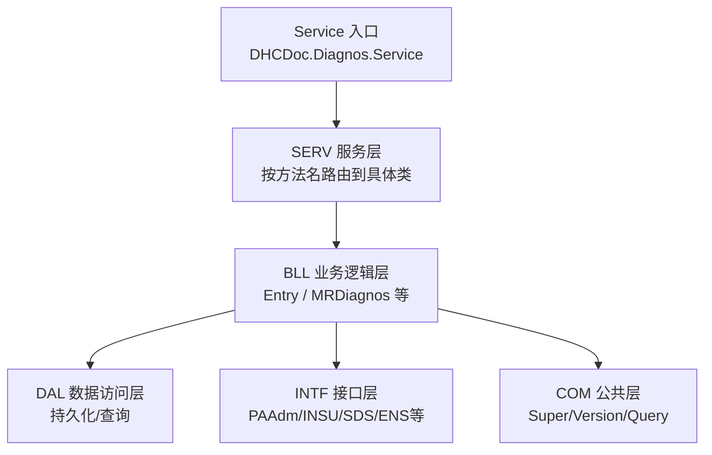
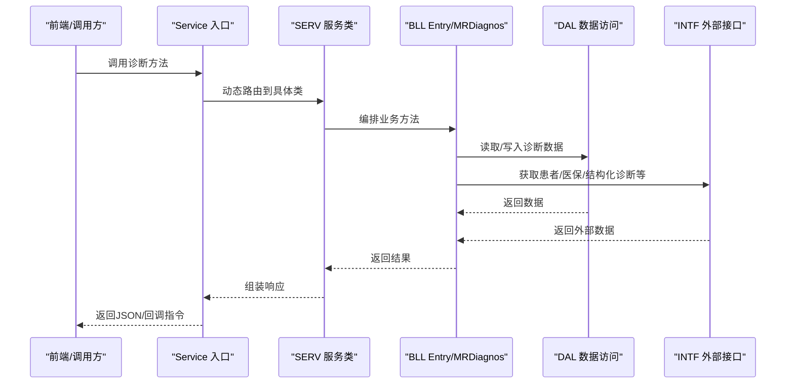
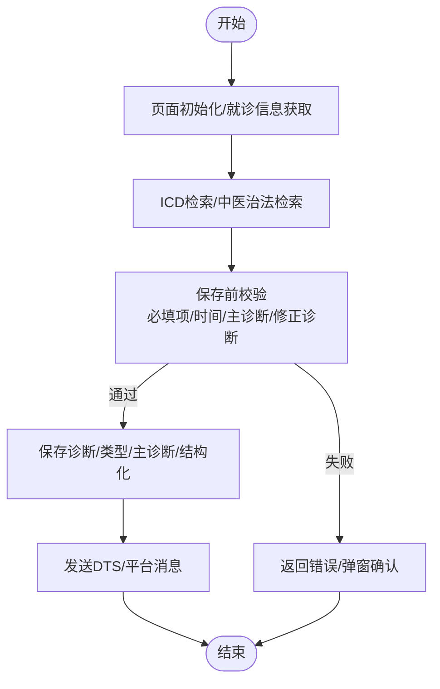
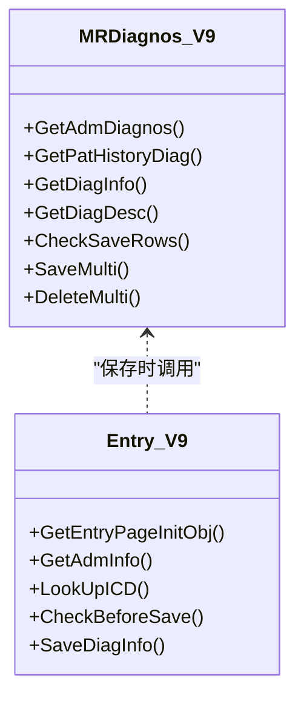
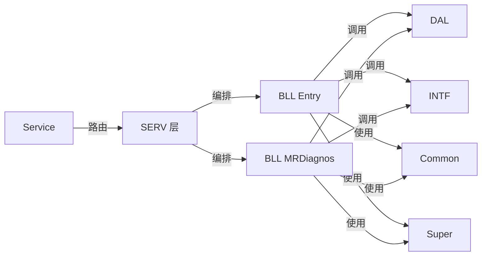

# 诊断管理系统

<cite>
**本文引用的文件**
- [Service.cls](file://src/backend/doc-ws/DHCDoc/Diagnos/Service.cls)
- [Common.cls](file://src/backend/doc-ws/DHCDoc/Diagnos/Common.cls)
- [Entry.cls（门面）](file://src/backend/doc-ws/DHCDoc/Diagnos/BLL/Entry.cls)
- [Entry.cls（V9实现）](file://src/backend/doc-ws/DHCDoc/Diagnos/BLL/V9/Entry.cls)
- [MRDiagnos.cls（门面）](file://src/backend/doc-ws/DHCDoc/Diagnos/BLL/MRDiagnos.cls)
- [MRDiagnos.cls（V9实现）](file://src/backend/doc-ws/DHCDoc/Diagnos/BLL/V9/MRDiagnos.cls)
- [Super.cls](file://src/backend/doc-ws/DHCDoc/Diagnos/COM/Super.cls)
</cite>

## 目录
1. [简介](#简介)
2. [项目结构](#项目结构)
3. [核心组件](#核心组件)
4. [架构总览](#架构总览)
5. [详细组件分析](#详细组件分析)
6. [依赖关系分析](#依赖关系分析)
7. [性能与查询优化](#性能与查询优化)
8. [故障排查指南](#故障排查指南)
9. [结论](#结论)
10. [附录：数据模型、编码映射与交互设计要点](#附录数据模型编码映射与交互设计要点)

## 简介
本文件系统性地梳理并文档化“诊断管理”子系统的功能与实现，覆盖诊断录入、编辑、查询与管理全链路；说明ICD编码集成、诊断模板、诊断组合（父子诊断）、诊断历史追踪；阐述结构化存储与检索机制，以及与医嘱、病案的关联关系；描述界面人机交互设计与智能辅助（如CDSS推荐）；给出数据模型、编码映射表与查询优化策略；总结质控规则、合理性与完整性检查；并提供具体代码示例路径以展示核心功能与扩展机制。

## 项目结构
诊断子系统采用分层架构与版本路由机制：
- Service层：统一对外服务入口，负责将请求动态路由到SERV层的具体实现类。
- SERV层：服务编排与调度，组合BLL方法、控制调用顺序与结果组装。
- BLL层：业务逻辑层，封装核心规则（校验、流程）。
- DAL层：数据访问层，负责底层数据操作与读取。
- INTF层：接口层，统一封装外部模块调用（病历、医保、医嘱等）。
- COM层：公共基础组件（版本路由、通用基类、Query工具等）。

**图表来源**
- [Service.cls:1-79](file://src/backend/doc-ws/DHCDoc/Diagnos/Service.cls#L1-L79)
- [Super.cls:1-59](file://src/backend/doc-ws/DHCDoc/Diagnos/COM/Super.cls#L1-L59)

**章节来源**
- [Service.cls:1-79](file://src/backend/doc-ws/DHCDoc/Diagnos/Service.cls#L1-L79)

## 核心组件
- 服务入口与版本路由：通过重写分发方法，优先查找Local版本，再回退到标准版本（如V9），确保本地化定制不侵入标准代码。
- 诊断录入（Entry）：提供页面初始化、就诊信息获取、必填项校验、ICD检索、重复提示、传染病提示、保存前审查、保存主流程等。
- 诊断持久化与查询（MRDiagnos）：提供本次/历史诊断获取、描述拼接、批量保存/删除、修正诊断校验、主诊断数量限制等。
- 公共能力（Common/Super）：历史诊断聚合、ICD查询、中医治法查询、错误对象与回调函数生成等。

**章节来源**
- [Entry.cls（V9实现）:1-660](file://src/backend/doc-ws/DHCDoc/Diagnos/BLL/V9/Entry.cls#L1-L660)
- [MRDiagnos.cls（V9实现）:1-800](file://src/backend/doc-ws/DHCDoc/Diagnos/BLL/V9/MRDiagnos.cls#L1-L800)
- [Common.cls:1-581](file://src/backend/doc-ws/DHCDoc/Diagnos/Common.cls#L1-L581)
- [Super.cls:1-59](file://src/backend/doc-ws/DHCDoc/Diagnos/COM/Super.cls#L1-L59)

## 架构总览
诊断子系统通过Service统一暴露能力，内部按方法名路由至SERV层对应类，再由BLL编排DAL与INTF完成业务处理。版本路由支持Local优先，便于医院个性化扩展。

**图表来源**
- [Service.cls:1-79](file://src/backend/doc-ws/DHCDoc/Diagnos/Service.cls#L1-L79)
- [Entry.cls（V9实现）:1-660](file://src/backend/doc-ws/DHCDoc/Diagnos/BLL/V9/Entry.cls#L1-L660)
- [MRDiagnos.cls（V9实现）:1-800](file://src/backend/doc-ws/DHCDoc/Diagnos/BLL/V9/MRDiagnos.cls#L1-L800)

## 详细组件分析

### 诊断录入（Entry）
- 页面初始化：加载就诊基本信息、用户配置、模板区域布局、自动保存开关、实时检索开关、中医科室标志、主诊断类型限制等。
- 就诊信息获取：校验是否允许录入、提示引用长效诊断、返回诊断类型字典与专科表单分类。
- ICD检索：支持精确匹配、分页、用户频率排序、院区权限过滤、就诊类型限制、性别/年龄限制等。
- 保存前审查：校验必填项（初复诊状态、血压/体重/身高）、时间合理性（发病日期、诊断日期、截止时间）、主诊断数量限制、修正诊断约束、非标准ICD提醒等。
- 保存流程：事务性保存诊断、诊断类型、主诊断标识、结构化诊断、常用次数统计、后续通知（DTS/平台消息）。

**图表来源**
- [Entry.cls（V9实现）:1-660](file://src/backend/doc-ws/DHCDoc/Diagnos/BLL/V9/Entry.cls#L1-L660)

**章节来源**
- [Entry.cls（V9实现）:1-660](file://src/backend/doc-ws/DHCDoc/Diagnos/BLL/V9/Entry.cls#L1-L660)

### 诊断持久化与查询（MRDiagnos）
- 获取本次诊断：按主诊断集合遍历，支持按分类、类型、是否主诊断、仅ICD、是否包含已停止等条件筛选。
- 历史诊断聚合：跨就诊合并相同诊断，记录最新一次的时间与位置，支持按时间或频次排序。
- 诊断描述拼接：优先结构化诊断显示，其次ICD名称+备注+前缀+中医治法+子诊断。
- 批量保存：事务性保存主诊断及子诊断，维护诊断类型与主诊断标识，更新常用次数，必要时作废证明书与结构化诊断。
- 批量删除：校验是否有关联医嘱、是否可删入院登记诊断、是否被修正、是否已打印证明书等。

**图表来源**
- [MRDiagnos.cls（V9实现）:1-800](file://src/backend/doc-ws/DHCDoc/Diagnos/BLL/V9/MRDiagnos.cls#L1-L800)
- [Entry.cls（V9实现）:1-660](file://src/backend/doc-ws/DHCDoc/Diagnos/BLL/V9/Entry.cls#L1-L660)

**章节来源**
- [MRDiagnos.cls（V9实现）:1-800](file://src/backend/doc-ws/DHCDoc/Diagnos/BLL/V9/MRDiagnos.cls#L1-L800)

### 公共能力（Common/Super）
- 历史诊断聚合：按就诊类型（门急诊住院）遍历，合并相同诊断，输出结构化列表。
- ICD查询：支持别名/名称模糊匹配、院区权限、有效期、就诊类型限制、医保编码获取、分页。
- 中医治法查询：按临床可用、有效期、检索码/名称匹配。
- 错误对象与回调：统一错误返回格式，支持前端回调（Alert/Confirm/Popover等）。

**章节来源**
- [Common.cls:1-581](file://src/backend/doc-ws/DHCDoc/Diagnos/Common.cls#L1-L581)
- [Super.cls:1-59](file://src/backend/doc-ws/DHCDoc/Diagnos/COM/Super.cls#L1-L59)

## 依赖关系分析
- 版本路由依赖：Service根据方法名在SERV.Local与SERV.V9中查找实现类，优先Local。
- 业务编排依赖：Entry与MRDiagnos通过DAL与INTF协作，保证数据一致性与外部系统同步。
- 公共能力依赖：Common提供查询与聚合能力，Super提供统一的错误与回调构造。

**图表来源**
- [Service.cls:1-79](file://src/backend/doc-ws/DHCDoc/Diagnos/Service.cls#L1-L79)
- [Entry.cls（V9实现）:1-660](file://src/backend/doc-ws/DHCDoc/Diagnos/BLL/V9/Entry.cls#L1-L660)
- [MRDiagnos.cls（V9实现）:1-800](file://src/backend/doc-ws/DHCDoc/Diagnos/BLL/V9/MRDiagnos.cls#L1-L800)
- [Common.cls:1-581](file://src/backend/doc-ws/DHCDoc/Diagnos/Common.cls#L1-L581)
- [Super.cls:1-59](file://src/backend/doc-ws/DHCDoc/Diagnos/COM/Super.cls#L1-L59)

**章节来源**
- [Service.cls:1-79](file://src/backend/doc-ws/DHCDoc/Diagnos/Service.cls#L1-L79)

## 性能与查询优化
- ICD查询优化：
  - 支持精确模式（末尾加#）减少模糊匹配开销。
  - 基于有效范围索引遍历，避免无效数据扫描。
  - 用户频率排序结合使用计数，提升常用诊断命中率。
  - 分页参数控制返回量，降低网络与渲染压力。
- 历史诊断聚合：
  - 按就诊类型与院区范围过滤，减少不必要遍历。
  - 合并相同诊断，仅保留最新记录，降低前端展示复杂度。
- 保存流程：
  - 事务性保存，失败回滚，保证一致性。
  - 批量保存减少往返次数，提高吞吐。

[本节为通用性能建议，无需特定文件引用]

## 故障排查指南
- 常见错误场景：
  - 诊断不可用：未生效/已停用/院区无权限/就诊类型限制/性别或年龄限制。
  - 必填项缺失：初复诊状态、血压/体重/身高等。
  - 时间不合理：诊断日期早于发病日期或分床时间、截止时间晚于当前时间。
  - 主诊断数量超限：按配置限制某些类型仅能有一个主诊断。
  - 修正诊断约束：被修正诊断必须存在且已截止并填写原因。
- 定位方法：
  - 查看返回对象的code/msg与callBackFuns，定位前端提示与交互。
  - 检查会话信息与院区上下文，确认权限与配置。
  - 核对ICD字典有效性、有效期与院区可见性。
  - 检查结构化诊断权限与保存结果。

**章节来源**
- [Entry.cls（V9实现）:1-660](file://src/backend/doc-ws/DHCDoc/Diagnos/BLL/V9/Entry.cls#L1-L660)
- [MRDiagnos.cls（V9实现）:1-800](file://src/backend/doc-ws/DHCDoc/Diagnos/BLL/V9/MRDiagnos.cls#L1-L800)
- [Super.cls:1-59](file://src/backend/doc-ws/DHCDoc/Diagnos/COM/Super.cls#L1-L59)

## 结论
诊断管理系统通过清晰的分层与版本路由机制，实现了高内聚、低耦合的诊断录入、查询与管理能力。系统在ICD集成、结构化诊断、历史追踪、质控规则等方面提供了完善支撑，并通过回调机制与前端紧密协作，提升了用户体验与可操作性。未来可进一步扩展智能辅助（如AI诊断推荐）、增强查询性能与可视化展示。

[本节为总结性内容，无需特定文件引用]

## 附录：数据模型、编码映射与交互设计要点

### 数据模型与关联
- 诊断实体：
  - 主诊断与子诊断（父子关系），支持多类型标记与主诊断标识。
  - 结构化诊断（SDS）：优先显示，字段包括术语、显示名、补充信息等。
- 关联关系：
  - 与病案（MR/PA）关联：通过就诊号与诊断行ID关联。
  - 与医嘱关联：删除前检查是否有关联检查申请，需先停医嘱。
  - 与证明书关联：删除前检查是否已打印，必要时作废证明书。
  - 与医保接口：获取国家医保诊断编码与名称。

**章节来源**
- [MRDiagnos.cls（V9实现）:1-800](file://src/backend/doc-ws/DHCDoc/Diagnos/BLL/V9/MRDiagnos.cls#L1-L800)
- [Entry.cls（V9实现）:1-660](file://src/backend/doc-ws/DHCDoc/Diagnos/BLL/V9/Entry.cls#L1-L660)

### 编码映射表（示意）
- ICD分类：
  - 西医（BillFlag1/Y/N）、中医（BillFlag3=Y且BillFlag1≠Y）、证型（BillFlag3=Y且BillFlag1=Y）。
- 诊断状态：
  - 从字典表获取中文描述，用于展示与统计。
- 中医治法：
  - 按临床可用、有效期、检索码/名称匹配，返回治法代码与名称。

**章节来源**
- [Common.cls:147-178](file://src/backend/doc-ws/DHCDoc/Diagnos/Common.cls#L147-L178)
- [Common.cls:324-374](file://src/backend/doc-ws/DHCDoc/Diagnos/Common.cls#L324-L374)

### 查询优化策略
- ICD查询：
  - 精确模式、有效范围索引、院区权限过滤、就诊类型限制、医保编码懒加载。
- 历史诊断：
  - 按就诊类型与院区范围过滤，合并相同诊断，支持按时间与频次排序。
- 分页与缓存：
  - 分页参数控制返回量；用户频率排序结合使用计数提升命中率。

**章节来源**
- [Common.cls:376-569](file://src/backend/doc-ws/DHCDoc/Diagnos/Common.cls#L376-L569)

### 人机交互与智能辅助
- 交互设计：
  - 通过callBackFuns实现前端弹窗、确认、气泡提示等。
  - 自动保存与模板快捷保存提升录入效率。
  - 实时检索与用户频率排序优化选择体验。
- 智能辅助：
  - CDSS疑似疾病推荐：按疾病信息匹配HIS诊断字典，构建待录入行并走校验流程。
  - 结构化诊断：优先显示结构化术语，提升可读性与标准化程度。

**章节来源**
- [Entry.cls（V9实现）:182-247](file://src/backend/doc-ws/DHCDoc/Diagnos/BLL/V9/Entry.cls#L182-L247)
- [Super.cls:15-37](file://src/backend/doc-ws/DHCDoc/Diagnos/COM/Super.cls#L15-L37)

### 质控规则、合理性与完整性检查
- 完整性：
  - 必填项校验（初复诊状态、体征等）。
  - 非标准ICD诊断提醒与确认。
- 合理性：
  - 时间合理性（发病日期、诊断日期、截止时间）。
  - 主诊断数量限制与提示。
  - 修正诊断约束（被修正诊断必须存在且已截止并填写原因）。
- 合规性：
  - 院区权限、有效期、就诊类型限制、性别/年龄限制。
  - 传染病诊断上报提示。

**章节来源**
- [Entry.cls（V9实现）:449-618](file://src/backend/doc-ws/DHCDoc/Diagnos/BLL/V9/Entry.cls#L449-L618)
- [MRDiagnos.cls（V9实现）:262-624](file://src/backend/doc-ws/DHCDoc/Diagnos/BLL/V9/MRDiagnos.cls#L262-L624)

### 代码示例路径（核心功能与扩展）
- 服务入口与路由：
  - [Service.cls:1-79](file://src/backend/doc-ws/DHCDoc/Diagnos/Service.cls#L1-L79)
- 诊断录入初始化与保存：
  - [Entry.cls（V9实现）:1-660](file://src/backend/doc-ws/DHCDoc/Diagnos/BLL/V9/Entry.cls#L1-L660)
- 诊断持久化与查询：
  - [MRDiagnos.cls（V9实现）:1-800](file://src/backend/doc-ws/DHCDoc/Diagnos/BLL/V9/MRDiagnos.cls#L1-L800)
- 公共查询与聚合：
  - [Common.cls:1-581](file://src/backend/doc-ws/DHCDoc/Diagnos/Common.cls#L1-L581)
- 错误与回调：
  - [Super.cls:1-59](file://src/backend/doc-ws/DHCDoc/Diagnos/COM/Super.cls#L1-L59)