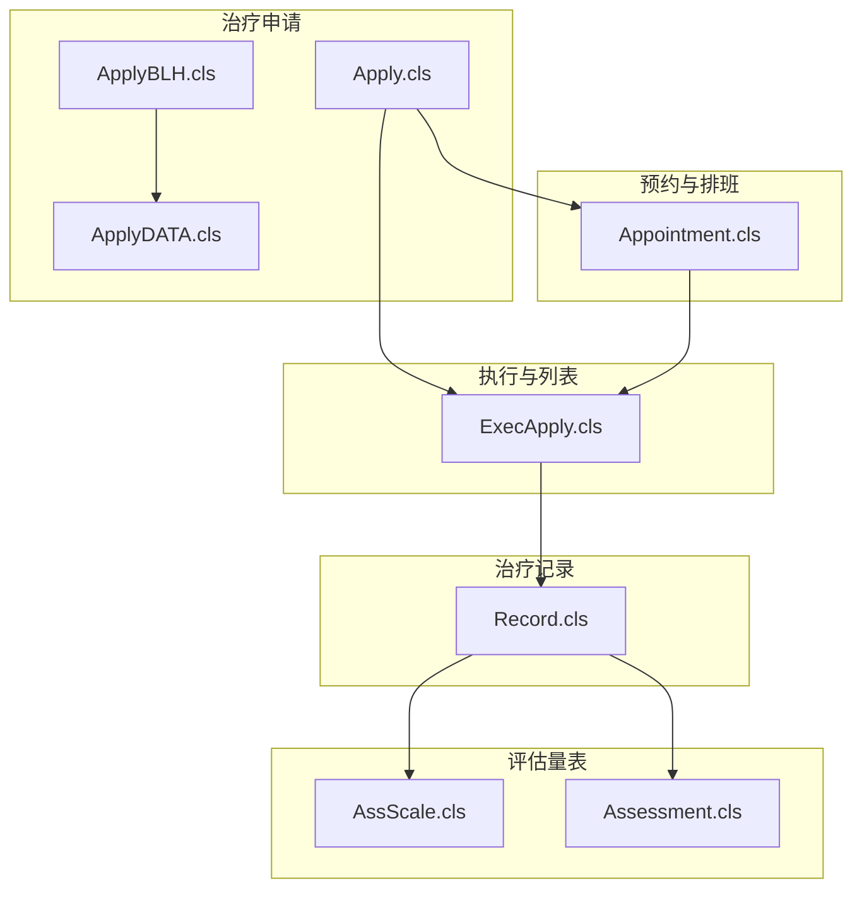
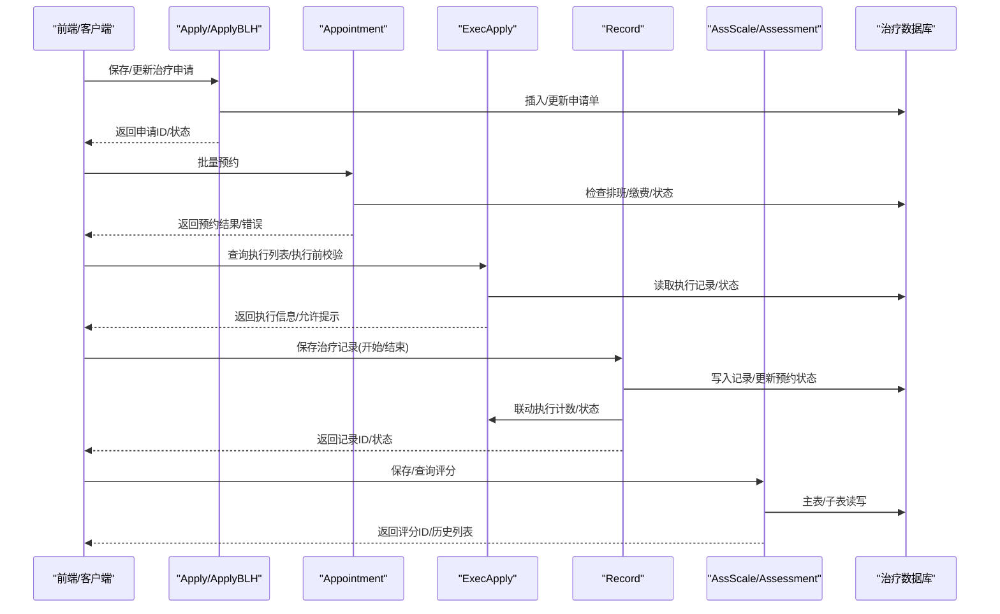
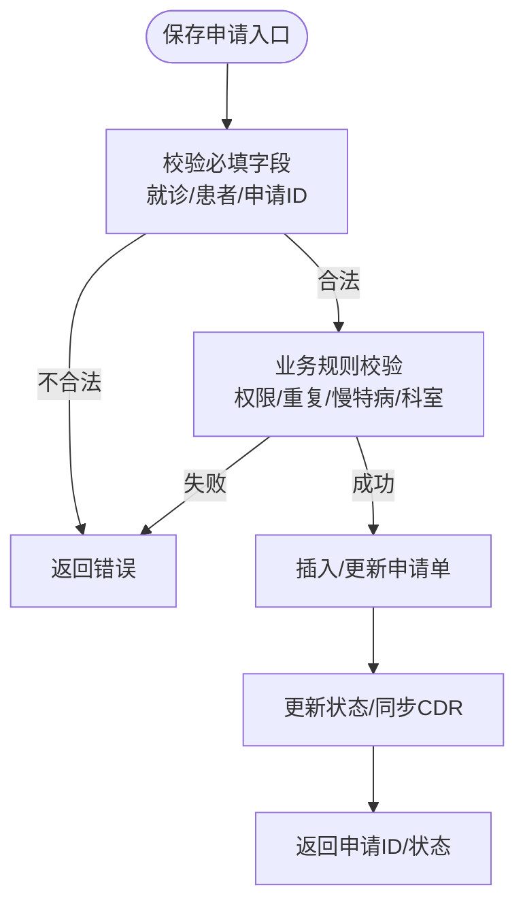
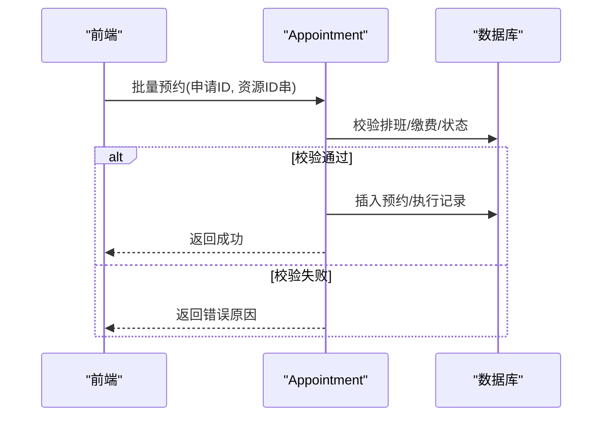
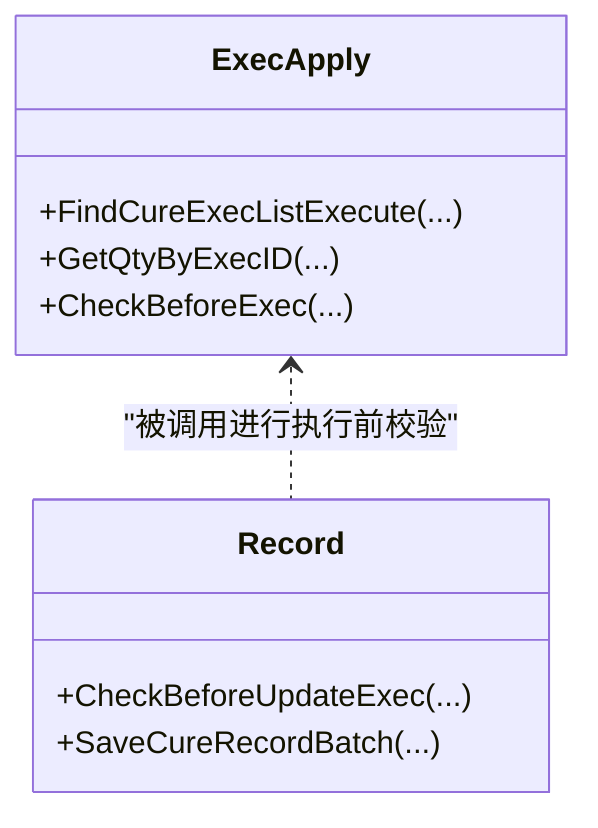
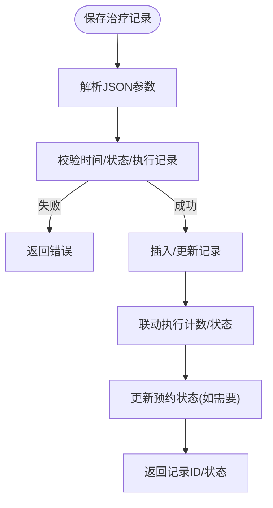
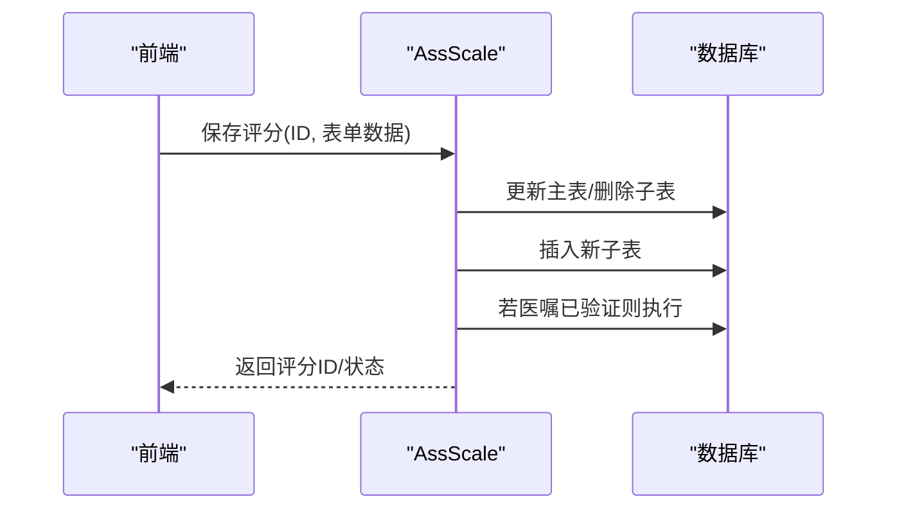
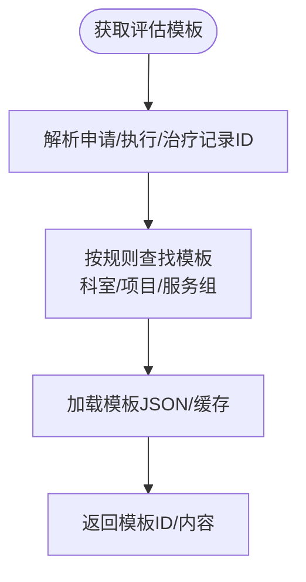
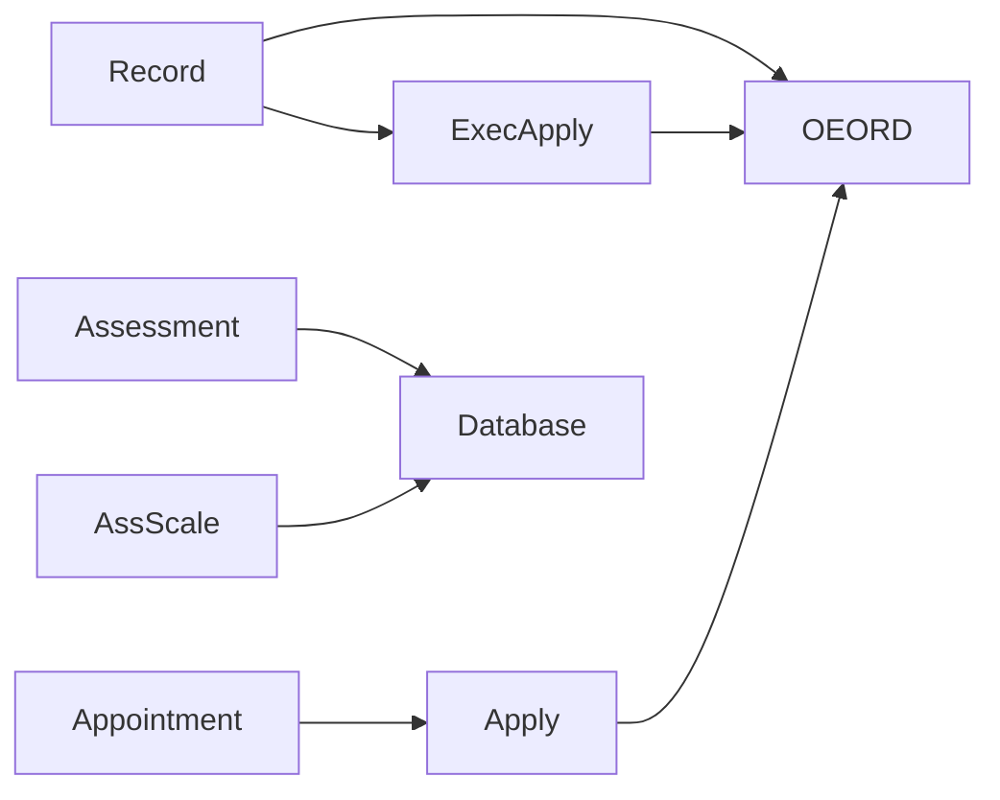

# 治疗系统接口

<cite>
**本文引用的文件**
- [Apply.cls](file://src/backend/cure-ws/DHCDoc/DHCDocCure/Apply.cls)
- [AssScale.cls](file://src/backend/cure-ws/DHCDoc/DHCDocCure/AssScale.cls)
- [Assessment.cls](file://src/backend/cure-ws/DHCDoc/DHCDocCure/Assessment.cls)
- [Record.cls](file://src/backend/cure-ws/DHCDoc/DHCDocCure/Record.cls)
- [ExecApply.cls](file://src/backend/cure-ws/DHCDoc/DHCDocCure/ExecApply.cls)
- [Appointment.cls](file://src/backend/cure-ws/DHCDoc/DHCDocCure/Appointment.cls)
- [ApplyBLH.cls](file://src/backend/cure-ws/DHCDoc/Cure/RT/ApplyBLH.cls)
- [ApplyDATA.cls](file://src/backend/cure-ws/DHCDoc/Cure/RT/ApplyDATA.cls)
</cite>

## 目录
1. [简介](#简介)
2. [项目结构](#项目结构)
3. [核心组件](#核心组件)
4. [架构总览](#架构总览)
5. [详细组件分析](#详细组件分析)
6. [依赖关系分析](#依赖关系分析)
7. [性能考虑](#性能考虑)
8. [故障排查指南](#故障排查指南)
9. [结论](#结论)
10. [附录：API规范与调用示例](#附录api规范与调用示例)

## 简介
本文件面向“治疗系统”Web服务接口，覆盖治疗计划管理、治疗执行跟踪、评估量表等核心能力。文档围绕以下业务流程展开：
- 治疗申请：创建、保存、状态更新、查询
- 治疗安排：预约资源、批量预约、预约校验
- 治疗执行：执行记录查询、执行前校验、执行推进
- 治疗记录：记录新增/更新、批量保存、撤销与审计
- 效果评估：量表评分保存/查询/历史对比、模板加载与打印

同时给出请求参数验证、数据格式转换、业务规则校验说明，并提供治疗师工作流中的典型API调用示例，解释与治疗数据库的交互模式及性能优化策略。

## 项目结构
后端以类（Class）组织业务域，按功能模块划分：
- 申请与放疗申请：Apply.cls、ApplyBLH.cls、ApplyDATA.cls
- 预约与排班：Appointment.cls
- 执行与执行列表：ExecApply.cls
- 治疗记录：Record.cls
- 评估量表与模板：AssScale.cls、Assessment.cls

图表来源
- [Apply.cls:1-800](file://src/backend/cure-ws/DHCDoc/DHCDocCure/Apply.cls#L1-L800)
- [Appointment.cls:1-200](file://src/backend/cure-ws/DHCDoc/DHCDocCure/Appointment.cls#L1-L200)
- [ExecApply.cls:1-200](file://src/backend/cure-ws/DHCDoc/DHCDocCure/ExecApply.cls#L1-L200)
- [Record.cls:1-800](file://src/backend/cure-ws/DHCDoc/DHCDocCure/Record.cls#L1-L800)
- [AssScale.cls:1-710](file://src/backend/cure-ws/DHCDoc/DHCDocCure/AssScale.cls#L1-L710)
- [Assessment.cls:1-800](file://src/backend/cure-ws/DHCDoc/DHCDocCure/Assessment.cls#L1-L800)
- [ApplyBLH.cls:1-61](file://src/backend/cure-ws/DHCDoc/Cure/RT/ApplyBLH.cls#L1-L61)
- [ApplyDATA.cls:1-36](file://src/backend/cure-ws/DHCDoc/Cure/RT/ApplyDATA.cls#L1-L36)

章节来源
- [Apply.cls:1-800](file://src/backend/cure-ws/DHCDoc/DHCDocCure/Apply.cls#L1-L800)
- [Appointment.cls:1-200](file://src/backend/cure-ws/DHCDoc/DHCDocCure/Appointment.cls#L1-L200)
- [ExecApply.cls:1-200](file://src/backend/cure-ws/DHCDoc/DHCDocCure/ExecApply.cls#L1-L200)
- [Record.cls:1-800](file://src/backend/cure-ws/DHCDoc/DHCDocCure/Record.cls#L1-L800)
- [AssScale.cls:1-710](file://src/backend/cure-ws/DHCDoc/DHCDocCure/AssScale.cls#L1-L710)
- [Assessment.cls:1-800](file://src/backend/cure-ws/DHCDoc/DHCDocCure/Assessment.cls#L1-L800)
- [ApplyBLH.cls:1-61](file://src/backend/cure-ws/DHCDoc/Cure/RT/ApplyBLH.cls#L1-L61)
- [ApplyDATA.cls:1-36](file://src/backend/cure-ws/DHCDoc/Cure/RT/ApplyDATA.cls#L1-L36)

## 核心组件
- 治疗申请（Apply）：医嘱到治疗申请的映射、自动创建申请单、插入/取消申请、剩余可预约次数计算、价格获取、权限与重复性校验。
- 预约（Appointment）：预约状态判断、批量预约、就诊类型与缴费校验、可预约数量控制。
- 执行（ExecApply）：执行列表查询、执行前校验、执行计数与状态聚合。
- 治疗记录（Record）：记录新增/更新/批量保存、时间校验、执行联动、撤销与变更日志。
- 评估量表（AssScale）：评分保存/更新/撤销、表单项处理、历史同量表评分查询、签名图获取。
- 评估模板（Assessment）：评估记录CRUD、模板缓存与加载、打印数据组装、模板关联规则。

章节来源
- [Apply.cls:175-602](file://src/backend/cure-ws/DHCDoc/DHCDocCure/Apply.cls#L175-L602)
- [Appointment.cls:1-200](file://src/backend/cure-ws/DHCDoc/DHCDocCure/Appointment.cls#L1-L200)
- [ExecApply.cls:1-200](file://src/backend/cure-ws/DHCDoc/DHCDocCure/ExecApply.cls#L1-L200)
- [Record.cls:38-128](file://src/backend/cure-ws/DHCDoc/DHCDocCure/Record.cls#L38-L128)
- [AssScale.cls:12-169](file://src/backend/cure-ws/DHCDoc/DHCDocCure/AssScale.cls#L12-L169)
- [Assessment.cls:176-304](file://src/backend/cure-ws/DHCDoc/DHCDocCure/Assessment.cls#L176-L304)

## 架构总览
治疗系统采用“申请-预约-执行-记录-评估”的分层流程，各阶段通过类方法暴露能力，内部通过SQL与索引访问治疗相关表，并通过异步任务写入集成数据仓库（CDR）。

图表来源
- [Apply.cls:175-602](file://src/backend/cure-ws/DHCDoc/DHCDocCure/Apply.cls#L175-L602)
- [Appointment.cls:48-127](file://src/backend/cure-ws/DHCDoc/DHCDocCure/Appointment.cls#L48-L127)
- [ExecApply.cls:13-177](file://src/backend/cure-ws/DHCDoc/DHCDocCure/ExecApply.cls#L13-L177)
- [Record.cls:128-379](file://src/backend/cure-ws/DHCDoc/DHCDocCure/Record.cls#L128-L379)
- [AssScale.cls:12-169](file://src/backend/cure-ws/DHCDoc/DHCDocCure/AssScale.cls#L12-L169)
- [Assessment.cls:176-304](file://src/backend/cure-ws/DHCDoc/DHCDocCure/Assessment.cls#L176-L304)

## 详细组件分析

### 治疗申请（Apply / ApplyBLH / ApplyDATA）
- 职责
  - 将医嘱转化为治疗申请单，支持自动创建或手动创建
  - 校验医嘱是否属于治疗类、接收科室是否为治疗科室
  - 支持申请单保存、状态更新、查询、取消
  - 计算剩余可预约次数、获取价格、权限与重复性校验
- 关键方法
  - 保存申请：SaveDHCDocCureApply、CreateCureApply、InsertCureApply
  - 取消申请：CancelCureApplyByStopOrd、CancelCureApply
  - 查询：GetApplyNoAppTimes、GetSimpleCureApply
  - 放疗申请：ApplyBLH.Save、UpdateStatus；ApplyDATA.GetIdByCureApply、GetJSONById
- 数据与校验
  - 必填字段：就诊ID、患者ID、治疗站申请ID等
  - 业务规则：未报到患者不可申请、慢特病匹配、子类重复限制、权限校验
  - 数据转换：日期/时间逻辑值与HTML值互转、JSON串解析
- 异常与事务
  - 使用事务块保证插入/更新一致性
  - 失败时回滚并返回错误码与消息

图表来源
- [Apply.cls:300-436](file://src/backend/cure-ws/DHCDoc/DHCDocCure/Apply.cls#L300-L436)
- [Apply.cls:500-602](file://src/backend/cure-ws/DHCDoc/DHCDocCure/Apply.cls#L500-L602)
- [ApplyBLH.cls:6-42](file://src/backend/cure-ws/DHCDoc/Cure/RT/ApplyBLH.cls#L6-L42)
- [ApplyDATA.cls:6-33](file://src/backend/cure-ws/DHCDoc/Cure/RT/ApplyDATA.cls#L6-L33)

章节来源
- [Apply.cls:175-602](file://src/backend/cure-ws/DHCDoc/DHCDocCure/Apply.cls#L175-L602)
- [ApplyBLH.cls:6-58](file://src/backend/cure-ws/DHCDoc/Cure/RT/ApplyBLH.cls#L6-L58)
- [ApplyDATA.cls:6-33](file://src/backend/cure-ws/DHCDoc/Cure/RT/ApplyDATA.cls#L6-L33)

### 预约与排班（Appointment）
- 职责
  - 判断执行记录是否已预约、获取预约状态
  - 批量预约，支持多资源、多时段
  - 校验就诊类型、缴费状态、退号/出院限制
- 关键方法
  - GetExecResultAppStatus、GetExecCureAppStatus
  - AppInsertBroker（批量预约）、CheckAdmType（就诊类型校验）
  - GetDCADoseAppQty（单次数量控制）
- 数据与校验
  - 排班可用性、时间段、号序余量
  - 医嘱缴费标志、关联医嘱缴费
  - 直接执行治疗医嘱不可预约
- 异常与事务
  - 批量预约失败收集错误信息，统一返回
  - 事务保护插入与执行记录联动

图表来源
- [Appointment.cls:48-127](file://src/backend/cure-ws/DHCDoc/DHCDocCure/Appointment.cls#L48-L127)
- [Appointment.cls:155-200](file://src/backend/cure-ws/DHCDoc/DHCDocCure/Appointment.cls#L155-L200)

章节来源
- [Appointment.cls:1-200](file://src/backend/cure-ws/DHCDoc/DHCDocCure/Appointment.cls#L1-L200)

### 执行与执行列表（ExecApply）
- 职责
  - 查询治疗执行列表，支持按申请单、时间范围、执行状态过滤
  - 获取执行数量、执行人员、执行时间等信息
  - 提供执行前校验（与Record联动）
- 关键方法
  - FindCureExecListExecute（列表查询）、GetQtyByExecID（数量）
  - CheckBeforeExec（执行前校验，由Record调用）
- 数据与校验
  - 执行记录状态（未完成/已完成/停止）
  - 预约标记、打印导出标记、患者签名状态
- 异常与事务
  - 列表查询无事务，但后续执行/记录更新涉及事务

图表来源
- [ExecApply.cls:13-177](file://src/backend/cure-ws/DHCDoc/DHCDocCure/ExecApply.cls#L13-L177)
- [Record.cls:5-36](file://src/backend/cure-ws/DHCDoc/DHCDocCure/Record.cls#L5-L36)

章节来源
- [ExecApply.cls:1-200](file://src/backend/cure-ws/DHCDoc/DHCDocCure/ExecApply.cls#L1-L200)
- [Record.cls:5-36](file://src/backend/cure-ws/DHCDoc/DHCDocCure/Record.cls#L5-L36)

### 治疗记录（Record）
- 职责
  - 新增/更新治疗记录，支持批量保存
  - 校验治疗开始/结束时间、执行记录状态
  - 与执行联动，更新执行计数与状态
  - 撤销记录并生成变更日志
- 关键方法
  - SaveCureRecordBatch（批量保存）、SaveCureRecord（单条保存）
  - CancelRecordBatch、CancelRecord（撤销）
  - GetCureRecord、FindCureRecordListExecute（查询）
- 数据与校验
  - 时间合法性：结束不早于开始、不早于医嘱开始时间
  - 状态约束：已取消/已治疗不可修改
  - 执行状态：已完成/停止不可添加记录
- 异常与事务
  - 批量保存逐条处理，错误汇总返回
  - 事务保护插入/更新与执行联动

图表来源
- [Record.cls:128-379](file://src/backend/cure-ws/DHCDoc/DHCDocCure/Record.cls#L128-L379)
- [Record.cls:398-409](file://src/backend/cure-ws/DHCDoc/DHCDocCure/Record.cls#L398-L409)

章节来源
- [Record.cls:38-128](file://src/backend/cure-ws/DHCDoc/DHCDocCure/Record.cls#L38-L128)
- [Record.cls:128-379](file://src/backend/cure-ws/DHCDoc/DHCDocCure/Record.cls#L128-L379)
- [Record.cls:398-409](file://src/backend/cure-ws/DHCDoc/DHCDocCure/Record.cls#L398-L409)

### 评估量表（AssScale）
- 职责
  - 保存/更新评分，支持表单项类型转换（日期等）
  - 撤销评分，校验前置条件（建议医嘱存在性）
  - 查询评分列表、历史同量表评分、签名图
- 关键方法
  - Insert、UpdScore、Cancel、Stop
  - QryAssScoreListExecute（列表查询）、GetAssScoreList（历史）
  - JsGetFormScore、JsGetFormItem（表单数据）
- 数据与校验
  - 主表/子表一致性，删除子表后重新插入
  - 订单状态为“已验证”时自动执行对应医嘱
- 异常与事务
  - 事务保护主表/子表操作
  - 错误码区分插入/更新/删除失败

图表来源
- [AssScale.cls:12-169](file://src/backend/cure-ws/DHCDoc/DHCDocCure/AssScale.cls#L12-L169)
- [AssScale.cls:203-267](file://src/backend/cure-ws/DHCDoc/DHCDocCure/AssScale.cls#L203-L267)
- [AssScale.cls:447-597](file://src/backend/cure-ws/DHCDoc/DHCDocCure/AssScale.cls#L447-L597)

章节来源
- [AssScale.cls:12-169](file://src/backend/cure-ws/DHCDoc/DHCDocCure/AssScale.cls#L12-L169)
- [AssScale.cls:203-267](file://src/backend/cure-ws/DHCDoc/DHCDocCure/AssScale.cls#L203-L267)
- [AssScale.cls:447-597](file://src/backend/cure-ws/DHCDoc/DHCDocCure/AssScale.cls#L447-L597)

### 评估模板（Assessment）
- 职责
  - 评估记录CRUD，支持批量保存/删除
  - 模板缓存与加载，按申请单/执行记录/治疗记录获取模板
  - 打印数据组装，包含患者信息、评估内容、签名图
- 关键方法
  - SaveCureAssessment、DelCureAssessment
  - GetAssTemp、GetAssTemplate、GetCacheMap
  - GetAssPrintJson（打印数据）
- 数据与校验
  - 模板关联规则：科室/项目/服务组优先级
  - 用户权限：仅本人新增记录可删除
- 异常与事务
  - 批量操作错误汇总
  - 事务保护插入/更新

图表来源
- [Assessment.cls:543-661](file://src/backend/cure-ws/DHCDoc/DHCDocCure/Assessment.cls#L543-L661)
- [Assessment.cls:375-449](file://src/backend/cure-ws/DHCDoc/DHCDocCure/Assessment.cls#L375-L449)

章节来源
- [Assessment.cls:176-304](file://src/backend/cure-ws/DHCDoc/DHCDocCure/Assessment.cls#L176-L304)
- [Assessment.cls:543-661](file://src/backend/cure-ws/DHCDoc/DHCDocCure/Assessment.cls#L543-L661)
- [Assessment.cls:375-449](file://src/backend/cure-ws/DHCDoc/DHCDocCure/Assessment.cls#L375-L449)

## 依赖关系分析
- 组件耦合
  - Record依赖ExecApply进行执行前校验与执行联动
  - Appointment依赖Apply获取申请信息与可预约数量
  - AssScale与Assessment均依赖数据库表DHC_DocCureAss*系列
- 外部依赖
  - 医嘱系统（OEORD/ARCIM）用于获取医嘱项、执行记录、价格
  - 排班与资源（RBCResSchdule/RBCServiceGroupSet）用于预约
  - 集成数据仓库（CDR）通过Invoke异步写入
- 潜在循环依赖
  - Record与ExecApply相互调用，但职责清晰：Record负责记录持久化，ExecApply提供执行视图与校验

图表来源
- [Record.cls:5-36](file://src/backend/cure-ws/DHCDoc/DHCDocCure/Record.cls#L5-L36)
- [Appointment.cls:48-127](file://src/backend/cure-ws/DHCDoc/DHCDocCure/Appointment.cls#L48-L127)
- [AssScale.cls:447-597](file://src/backend/cure-ws/DHCDoc/DHCDocCure/AssScale.cls#L447-L597)
- [Assessment.cls:543-661](file://src/backend/cure-ws/DHCDoc/DHCDocCure/Assessment.cls#L543-L661)

章节来源
- [Record.cls:5-36](file://src/backend/cure-ws/DHCDoc/DHCDocCure/Record.cls#L5-L36)
- [Appointment.cls:48-127](file://src/backend/cure-ws/DHCDoc/DHCDocCure/Appointment.cls#L48-L127)
- [AssScale.cls:447-597](file://src/backend/cure-ws/DHCDoc/DHCDocCure/AssScale.cls#L447-L597)
- [Assessment.cls:543-661](file://src/backend/cure-ws/DHCDoc/DHCDocCure/Assessment.cls#L543-L661)

## 性能考虑
- 列表查询优化
  - 使用ResultSet分页与缓存临时表（^CacheTemp）减少重复计算
  - 按索引遍历（如OEORDi、DHCDocCureI）提升检索效率
- 批量操作
  - 批量保存/预约采用逐条处理并汇总错误，避免长事务阻塞
  - 批号（execBatchNo）用于分组展示与追溯
- 异步写入
  - CDR写入通过Job异步执行，降低主流程延迟
- 数据转换
  - 日期/时间使用系统转换函数，避免多次格式化开销
- 建议
  - 对高频查询增加必要索引（如OEORD执行时间、状态）
  - 大列表查询时分页加载，减少前端渲染压力
  - 批量操作设置超时与重试机制

[本节为通用性能指导，无需特定文件引用]

## 故障排查指南
- 常见错误码与含义
  - 申请单：必填字段为空、无效状态值、插入失败
  - 预约：停诊排班、已过预约时间、可预约数量不足、未缴费、已出院/退号
  - 执行：执行记录已完成/停止、不允许添加记录
  - 记录：结束早于开始、未找到执行记录、已取消预约
  - 评估：未评分无法撤销、已执行评分无法撤销、建议医嘱存在阻止撤销
- 定位步骤
  - 检查输入参数是否完整（就诊ID、患者ID、申请ID、执行ID）
  - 查看业务规则校验返回的错误消息
  - 核对数据库状态（申请单状态、执行记录状态、预约状态）
  - 查看变更日志（治疗记录撤销/更新日志）
- 工具与方法
  - 使用调试注释中的示例调用路径验证方法
  - 通过列表查询接口过滤时间与状态缩小范围
  - 关注事务回滚后的错误码与消息

章节来源
- [ApplyBLH.cls:6-58](file://src/backend/cure-ws/DHCDoc/Cure/RT/ApplyBLH.cls#L6-L58)
- [Appointment.cls:48-127](file://src/backend/cure-ws/DHCDoc/DHCDocCure/Appointment.cls#L48-L127)
- [Record.cls:107-124](file://src/backend/cure-ws/DHCDoc/DHCDocCure/Record.cls#L107-L124)
- [AssScale.cls:28-52](file://src/backend/cure-ws/DHCDoc/DHCDocCure/AssScale.cls#L28-L52)

## 结论
治疗系统通过清晰的模块划分与严格的业务规则校验，实现了从申请到评估的闭环管理。接口设计注重可维护性与扩展性，支持批量操作与异步集成。建议在上线前完善索引与监控，确保高并发场景下的稳定性与响应速度。

[本节为总结，无需特定文件引用]

## 附录：API规范与调用示例
以下为治疗师工作流中的典型API调用示例（以类方法形式描述，实际调用需通过Web服务封装）：

- 治疗申请
  - 保存申请：调用Apply.InsertCureApply或ApplyBLH.Save，传入就诊ID、患者ID、申请ID、治疗项目等
  - 更新状态：ApplyBLH.UpdateStatus，传入申请ID与目标状态
  - 查询详情：ApplyDATA.GetJSONById，传入申请ID或治疗站申请ID
- 预约
  - 批量预约：Appointment.AppInsertBroker，传入申请ID与资源ID串
  - 就诊校验：Appointment.CheckAdmType，传入就诊ID与医嘱执行ID
- 执行
  - 查询列表：ExecApply.FindCureExecListExecute，传入申请ID串、时间范围、执行状态
  - 执行前校验：Record.CheckBeforeUpdateExec，传入记录ID、用户ID、执行ID
- 记录
  - 批量保存：Record.SaveCureRecordBatch，传入记录ID串、用户ID、JSON参数
  - 撤销记录：Record.CancelRecordBatch，传入记录ID串、用户ID
- 评估
  - 保存评分：AssScale.Insert，传入评分ID与表单数据
  - 查询历史：AssScale.GetAssScoreList，传入当前评分ID
  - 获取模板：Assessment.GetAssTempStr，传入申请/执行/治疗记录ID串

注意事项
- 所有接口需携带会话信息（用户、科室、医院、语言）
- 日期/时间需转换为系统逻辑值或HTML值
- 批量操作需处理部分失败情况，返回错误汇总
- 敏感操作（撤销、删除）需校验用户权限与前置条件

章节来源
- [Apply.cls:175-602](file://src/backend/cure-ws/DHCDoc/DHCDocCure/Apply.cls#L175-L602)
- [ApplyBLH.cls:6-58](file://src/backend/cure-ws/DHCDoc/Cure/RT/ApplyBLH.cls#L6-L58)
- [ApplyDATA.cls:6-33](file://src/backend/cure-ws/DHCDoc/Cure/RT/ApplyDATA.cls#L6-L33)
- [Appointment.cls:48-127](file://src/backend/cure-ws/DHCDoc/DHCDocCure/Appointment.cls#L48-L127)
- [ExecApply.cls:13-177](file://src/backend/cure-ws/DHCDoc/DHCDocCure/ExecApply.cls#L13-L177)
- [Record.cls:38-128](file://src/backend/cure-ws/DHCDoc/DHCDocCure/Record.cls#L38-L128)
- [AssScale.cls:12-169](file://src/backend/cure-ws/DHCDoc/DHCDocCure/AssScale.cls#L12-L169)
- [Assessment.cls:543-661](file://src/backend/cure-ws/DHCDoc/DHCDocCure/Assessment.cls#L543-L661)