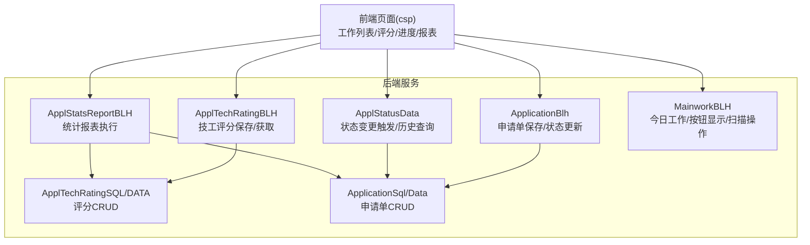
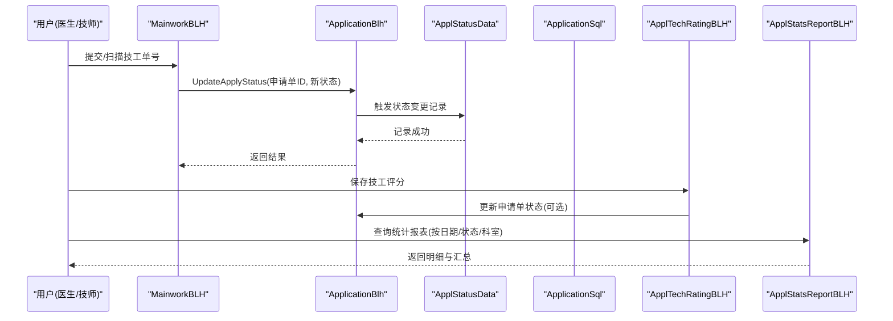
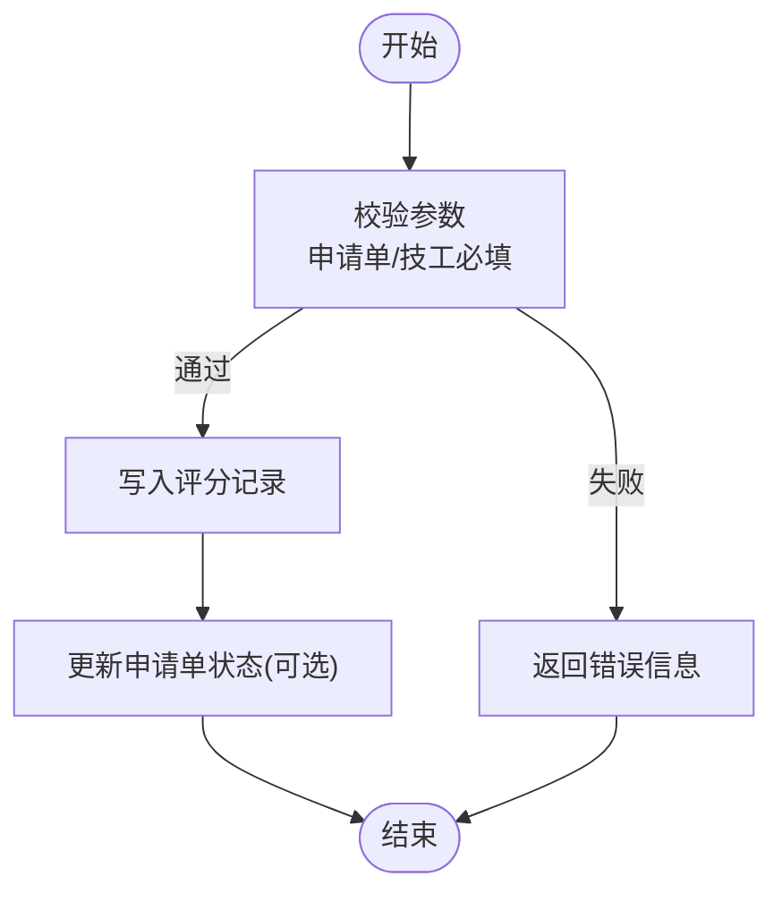
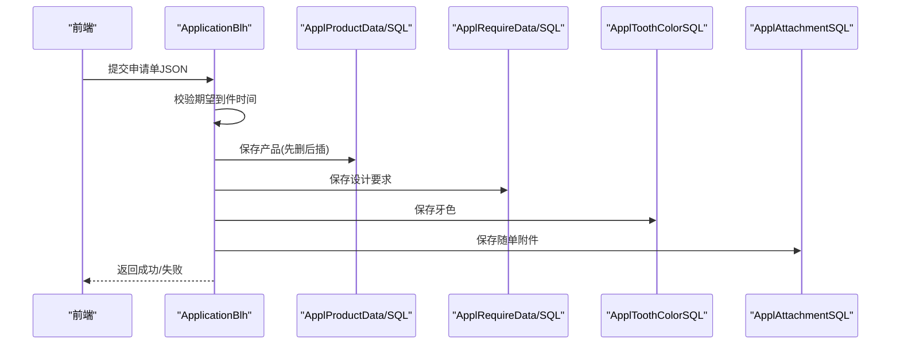
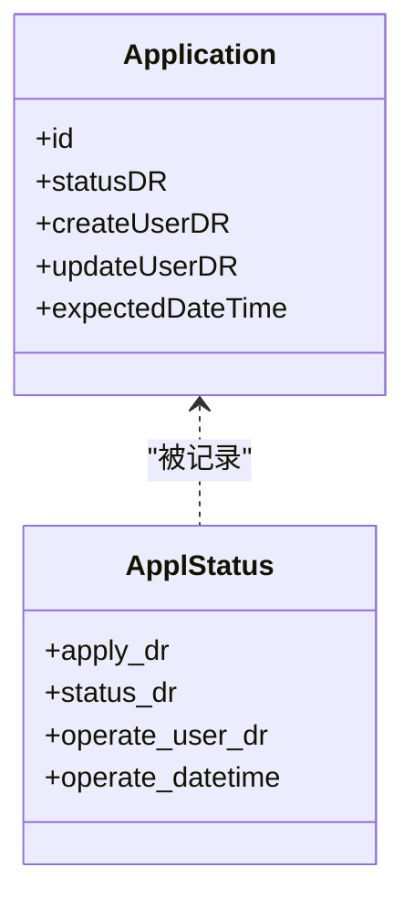
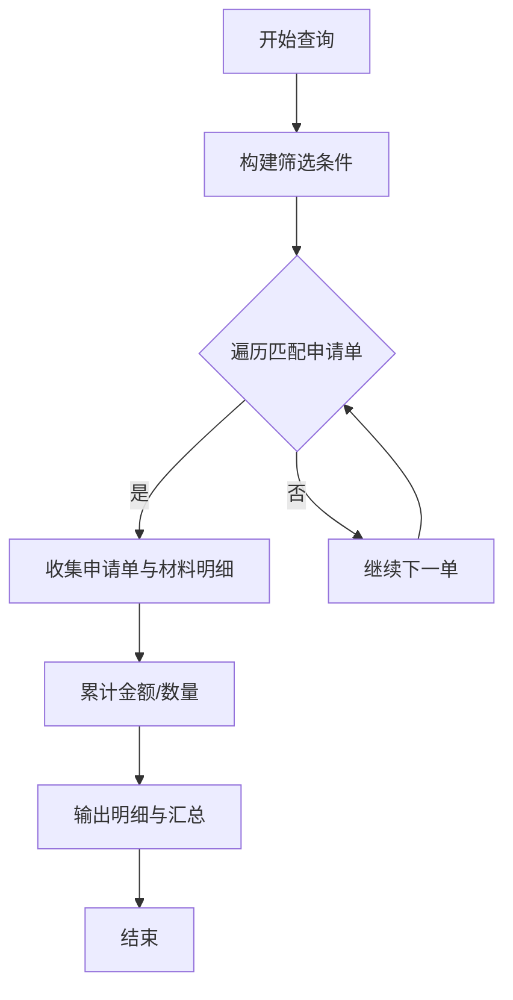
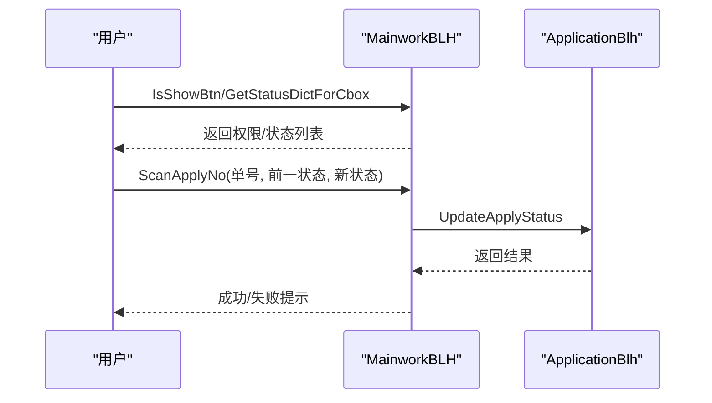
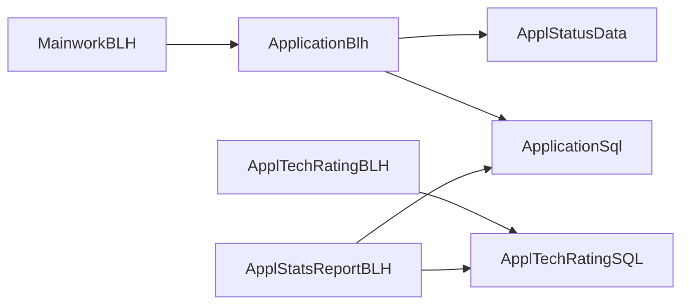

# 技工流程管理

<cite>
**本文引用的文件**
- [ApplTechRatingBLH.cls](file://src/backend/dental-ws/DHCDoc/Dental/TA/ApplTechRatingBLH.cls)
- [ApplTechRatingDATA.cls](file://src/backend/dental-ws/DHCDoc/Dental/TA/ApplTechRatingDATA.cls)
- [ApplTechRatingSQL.cls](file://src/backend/dental-ws/DHCDoc/Dental/TA/ApplTechRatingSQL.cls)
- [ApplTechRating.cls](file://src/backend/dental-ws/DOC/Dental/TA/ApplTechRating.cls)
- [ApplicationBlh.cls](file://src/backend/dental-ws/DHCDoc/Dental/TA/ApplicationBlh.cls)
- [ApplStatusData.cls](file://src/backend/dental-ws/DHCDoc/Dental/TA/ApplStatusData.cls)
- [ApplStatsReportBLH.cls](file://src/backend/dental-ws/DHCDoc/Dental/TA/ApplStatsReportBLH.cls)
- [MainworkBLH.cls](file://src/backend/dental-ws/DHCDoc/Dental/TA/MainworkBLH.cls)
</cite>

## 目录
1. [简介](#简介)
2. [项目结构](#项目结构)
3. [核心组件](#核心组件)
4. [架构总览](#架构总览)
5. [详细组件分析](#详细组件分析)
6. [依赖关系分析](#依赖关系分析)
7. [性能考虑](#性能考虑)
8. [故障排查指南](#故障排查指南)
9. [结论](#结论)
10. [附录](#附录)

## 简介
本模块面向牙科修复体的技工制作全流程，覆盖技工任务分配、进度跟踪、质量检查与反馈、工作量统计与费用汇总、技工评级与评分规则等关键业务。通过统一的申请单模型、状态机驱动的流程推进、可配置的字典与报表能力，实现从“医生提交→技工室加工→质检与评级→结算统计”的闭环管理。

## 项目结构
后端以 dental-ws 为核心，围绕 DHCDoc.Dental.TA 包组织业务逻辑：
- 数据模型层：定义技工申请单、技工评分、状态流转记录等实体
- 业务处理层（BLH）：封装保存、校验、状态更新、统计查询等复杂逻辑
- 数据访问层（SQL/DATA）：提供增删改查与自定义查询接口
- 前端页面（csp）：提供技工工作列表、评分录入、进度查看、报表导出等界面

图表来源
- [ApplicationBlh.cls:1-302](file://src/backend/dental-ws/DHCDoc/Dental/TA/ApplicationBlh.cls#L1-L302)
- [ApplTechRatingBLH.cls:1-48](file://src/backend/dental-ws/DHCDoc/Dental/TA/ApplTechRatingBLH.cls#L1-L48)
- [ApplStatusData.cls:1-157](file://src/backend/dental-ws/DHCDoc/Dental/TA/ApplStatusData.cls#L1-L157)
- [ApplStatsReportBLH.cls:1-243](file://src/backend/dental-ws/DHCDoc/Dental/TA/ApplStatsReportBLH.cls#L1-L243)
- [MainworkBLH.cls:1-102](file://src/backend/dental-ws/DHCDoc/Dental/TA/MainworkBLH.cls#L1-L102)

章节来源
- [ApplicationBlh.cls:1-302](file://src/backend/dental-ws/DHCDoc/Dental/TA/ApplicationBlh.cls#L1-L302)
- [ApplTechRatingBLH.cls:1-48](file://src/backend/dental-ws/DHCDoc/Dental/TA/ApplTechRatingBLH.cls#L1-L48)
- [ApplStatusData.cls:1-157](file://src/backend/dental-ws/DHCDoc/Dental/TA/ApplStatusData.cls#L1-L157)
- [ApplStatsReportBLH.cls:1-243](file://src/backend/dental-ws/DHCDoc/Dental/TA/ApplStatsReportBLH.cls#L1-L243)
- [MainworkBLH.cls:1-102](file://src/backend/dental-ws/DHCDoc/Dental/TA/MainworkBLH.cls#L1-L102)

## 核心组件
- 技工评分（ApplTechRating*）：维护评分主表与读写逻辑，支持按申请单一对一评分，包含工作效率、工作质量、服务态度及备注字段，并联动申请单状态更新。
- 申请单生命周期（ApplicationBlh）：负责申请单主表与子表（产品、设计要求、牙色、附件、牙位图）的保存与更新；提供状态统一更新入口。
- 状态流转（ApplStatusData）：监听申请单插入/更新事件，自动记录状态变更轨迹，并提供可视化进度查询。
- 统计报表（ApplStatsReportBLH）：聚合技工申请单、材料关联、金额与数量，支持按日期、状态、科室、医生等多维过滤与分页输出。
- 今日工作（MainworkBLH）：提供按钮权限控制、状态字典渲染、扫码批量更新状态等能力。

章节来源
- [ApplTechRating.cls:1-92](file://src/backend/dental-ws/DOC/Dental/TA/ApplTechRating.cls#L1-L92)
- [ApplTechRatingBLH.cls:1-48](file://src/backend/dental-ws/DHCDoc/Dental/TA/ApplTechRatingBLH.cls#L1-L48)
- [ApplicationBlh.cls:1-302](file://src/backend/dental-ws/DHCDoc/Dental/TA/ApplicationBlh.cls#L1-L302)
- [ApplStatusData.cls:1-157](file://src/backend/dental-ws/DHCDoc/Dental/TA/ApplStatusData.cls#L1-L157)
- [ApplStatsReportBLH.cls:1-243](file://src/backend/dental-ws/DHCDoc/Dental/TA/ApplStatsReportBLH.cls#L1-L243)
- [MainworkBLH.cls:1-102](file://src/backend/dental-ws/DHCDoc/Dental/TA/MainworkBLH.cls#L1-L102)

## 架构总览
技工流程采用“申请单+状态机”的核心架构：
- 申请单作为业务主键，承载患者、期望交期、加工单位、预期/实际技工等信息
- 状态机由字典配置驱动，变更时自动记录审计轨迹
- 评分与质检在流程末端或特定节点触发，影响最终结算与绩效
- 统计报表贯穿全量数据，支持多维度分析与导出

图表来源
- [MainworkBLH.cls:69-99](file://src/backend/dental-ws/DHCDoc/Dental/TA/MainworkBLH.cls#L69-L99)
- [ApplicationBlh.cls:205-217](file://src/backend/dental-ws/DHCDoc/Dental/TA/ApplicationBlh.cls#L205-L217)
- [ApplStatusData.cls:4-54](file://src/backend/dental-ws/DHCDoc/Dental/TA/ApplStatusData.cls#L4-L54)
- [ApplTechRatingBLH.cls:6-26](file://src/backend/dental-ws/DHCDoc/Dental/TA/ApplTechRatingBLH.cls#L6-L26)
- [ApplStatsReportBLH.cls:13-128](file://src/backend/dental-ws/DHCDoc/Dental/TA/ApplStatsReportBLH.cls#L13-L128)

## 详细组件分析

### 技工评分与评级标准
- 数据模型：评分表包含申请单、加工单位、评级技工、工作效率、工作质量、服务态度、备注、创建人/时间等字段，并对申请单与技工建立索引以提升查询效率。
- 业务逻辑：
  - 保存前校验：必须存在申请单主键与实际技工，否则拒绝评价
  - 新增评分后联动更新申请单状态（如进入质检或完成阶段）
  - 提供按ID获取评分数据的接口，便于前端展示与编辑
- 评分规则建议（结合字段语义）：
  - 工作效率：按时交付率、返工次数、平均周期
  - 工作质量：一次合格率、缺陷类型分布、客诉率
  - 服务态度：沟通及时性、问题响应速度、协作配合度
  - 综合评分：加权计算，用于绩效与费用结算

图表来源
- [ApplTechRatingBLH.cls:6-26](file://src/backend/dental-ws/DHCDoc/Dental/TA/ApplTechRatingBLH.cls#L6-L26)
- [ApplTechRating.cls:1-92](file://src/backend/dental-ws/DOC/Dental/TA/ApplTechRating.cls#L1-L92)

章节来源
- [ApplTechRatingBLH.cls:1-48](file://src/backend/dental-ws/DHCDoc/Dental/TA/ApplTechRatingBLH.cls#L1-L48)
- [ApplTechRating.cls:1-92](file://src/backend/dental-ws/DOC/Dental/TA/ApplTechRating.cls#L1-L92)

### 申请单保存与子表管理
- 主表保存：校验期望到件时间格式与合法性，确保不早于当天
- 子表管理：
  - 产品：支持多条，新增时先删除再插入以保证一致性
  - 设计要求：文本与明细项分离存储
  - 牙色：颜色体系与特殊打印标记
  - 随单附件：咬合记录、托盘数、石膏模型数等
  - 牙位图：独立模块保存与读取
- 暂存机制：基于会话与就诊ID的临时存储，支持草稿恢复

图表来源
- [ApplicationBlh.cls:6-146](file://src/backend/dental-ws/DHCDoc/Dental/TA/ApplicationBlh.cls#L6-L146)

章节来源
- [ApplicationBlh.cls:6-186](file://src/backend/dental-ws/DHCDoc/Dental/TA/ApplicationBlh.cls#L6-L186)

### 状态管理与进度跟踪
- 触发器：申请单插入/更新时自动记录状态变更，包括操作人、IP、堆栈信息，便于审计与回溯
- 进度查询：按申请单聚合状态历史，并按字典排序补齐后续节点，形成完整流程图
- 状态字典：通过字典目录“DTA_Status”统一管理，支持角色与页面可见性控制

图表来源
- [ApplStatusData.cls:4-54](file://src/backend/dental-ws/DHCDoc/Dental/TA/ApplStatusData.cls#L4-L54)
- [ApplStatusData.cls:56-112](file://src/backend/dental-ws/DHCDoc/Dental/TA/ApplStatusData.cls#L56-L112)

章节来源
- [ApplStatusData.cls:4-157](file://src/backend/dental-ws/DHCDoc/Dental/TA/ApplStatusData.cls#L4-L157)

### 统计报表与费用计算
- 查询维度：患者编号、日期范围、状态、申请科室、加工单位、医生、患者姓名等
- 数据聚合：
  - 申请单基础信息（单号、状态、期望交期、产品、技工信息等）
  - 材料关联明细（名称、数量、单价、金额）
  - 汇总行（总计金额、总数量、申请单计数）
- 过滤策略：
  - 计划交货日期过滤
  - 状态变更时间过滤（支持重读去重）
  - 仅包含有材料的申请单

图表来源
- [ApplStatsReportBLH.cls:13-128](file://src/backend/dental-ws/DHCDoc/Dental/TA/ApplStatsReportBLH.cls#L13-L128)
- [ApplStatsReportBLH.cls:130-239](file://src/backend/dental-ws/DHCDoc/Dental/TA/ApplStatsReportBLH.cls#L130-L239)

章节来源
- [ApplStatsReportBLH.cls:1-243](file://src/backend/dental-ws/DHCDoc/Dental/TA/ApplStatsReportBLH.cls#L1-L243)

### 今日工作与任务分配
- 按钮显示：根据登录用户组与角色控制功能可见性
- 状态字典：按角色与页面操作动态过滤可用状态
- 扫描操作：输入单号校验当前状态是否允许目标操作，成功后批量更新状态

图表来源
- [MainworkBLH.cls:8-21](file://src/backend/dental-ws/DHCDoc/Dental/TA/MainworkBLH.cls#L8-L21)
- [MainworkBLH.cls:23-67](file://src/backend/dental-ws/DHCDoc/Dental/TA/MainworkBLH.cls#L23-L67)
- [MainworkBLH.cls:69-99](file://src/backend/dental-ws/DHCDoc/Dental/TA/MainworkBLH.cls#L69-L99)

章节来源
- [MainworkBLH.cls:1-102](file://src/backend/dental-ws/DHCDoc/Dental/TA/MainworkBLH.cls#L1-L102)

## 依赖关系分析
- 低耦合分层：BLH 负责编排与校验，SQL/DATA 专注数据访问，模型类定义持久化结构
- 外部依赖：
  - 字典系统：状态、类型、页面链接等通过字典集中管理
  - 用户与机构：创建人、科室、加工单位等通过通用用户/机构服务解析
- 潜在循环：避免 BLH 直接调用自身方法造成递归；通过状态变更触发器解耦

图表来源
- [ApplicationBlh.cls:205-217](file://src/backend/dental-ws/DHCDoc/Dental/TA/ApplicationBlh.cls#L205-L217)
- [ApplTechRatingBLH.cls:6-26](file://src/backend/dental-ws/DHCDoc/Dental/TA/ApplTechRatingBLH.cls#L6-L26)
- [ApplStatsReportBLH.cls:13-128](file://src/backend/dental-ws/DHCDoc/Dental/TA/ApplStatsReportBLH.cls#L13-L128)
- [MainworkBLH.cls:69-99](file://src/backend/dental-ws/DHCDoc/Dental/TA/MainworkBLH.cls#L69-L99)

章节来源
- [ApplicationBlh.cls:1-302](file://src/backend/dental-ws/DHCDoc/Dental/TA/ApplicationBlh.cls#L1-L302)
- [ApplTechRatingBLH.cls:1-48](file://src/backend/dental-ws/DHCDoc/Dental/TA/ApplTechRatingBLH.cls#L1-L48)
- [ApplStatsReportBLH.cls:1-243](file://src/backend/dental-ws/DHCDoc/Dental/TA/ApplStatsReportBLH.cls#L1-L243)
- [MainworkBLH.cls:1-102](file://src/backend/dental-ws/DHCDoc/Dental/TA/MainworkBLH.cls#L1-L102)

## 性能考虑
- 索引优化：对申请单号、患者、状态变更时间等高频查询字段建立索引
- 批量处理：统计报表使用游标式遍历与缓存累加，减少重复计算
- 事务边界：申请单保存涉及多子表，需保证原子性与回滚一致性
- 字典缓存：状态字典与页面链接按需加载，避免频繁字典查询

[本节为通用指导，不直接分析具体文件]

## 故障排查指南
- 评分保存失败：
  - 检查申请单主键与实际技工是否为空
  - 确认评分写入与状态更新是否在同一事务中
- 状态无法流转：
  - 核对当前状态是否允许目标操作
  - 检查状态字典配置与页面权限
- 统计报表为空：
  - 确认日期范围与过滤条件
  - 验证是否存在材料关联数据
- 日志定位：
  - 关注状态变更触发器的调试输出
  - 检查异常堆栈与SQLCODE

章节来源
- [ApplTechRatingBLH.cls:28-37](file://src/backend/dental-ws/DHCDoc/Dental/TA/ApplTechRatingBLH.cls#L28-L37)
- [MainworkBLH.cls:69-99](file://src/backend/dental-ws/DHCDoc/Dental/TA/MainworkBLH.cls#L69-L99)
- [ApplStatusData.cls:4-54](file://src/backend/dental-ws/DHCDoc/Dental/TA/ApplStatusData.cls#L4-L54)

## 结论
本模块以申请单为核心，结合状态机、评分与统计能力，构建了完整的牙科修复体技工流程管理体系。通过字典驱动的灵活配置、严谨的数据一致性与完善的审计追踪，有效支撑质量控制与效率优化。建议在后续迭代中增强评分权重配置、自动化质检规则与更丰富的报表维度。

[本节为总结性内容，不直接分析具体文件]

## 附录
- 常用接口路径参考（示例）：
  - 保存技工评分：ApplTechRatingBLH.Save
  - 获取评分详情：ApplTechRatingBLH.GetTechRatingById
  - 更新申请单状态：ApplicationBlh.UpdateApplyStatus
  - 状态历史查询：ApplStatusData.GetStatusData
  - 统计报表执行：ApplStatsReportBLH.StatsApplyLinkMaterialExecute
  - 今日工作扫描：MainworkBLH.ScanApplyNo

章节来源
- [ApplTechRatingBLH.cls:6-45](file://src/backend/dental-ws/DHCDoc/Dental/TA/ApplTechRatingBLH.cls#L6-L45)
- [ApplicationBlh.cls:205-217](file://src/backend/dental-ws/DHCDoc/Dental/TA/ApplicationBlh.cls#L205-L217)
- [ApplStatusData.cls:56-112](file://src/backend/dental-ws/DHCDoc/Dental/TA/ApplStatusData.cls#L56-L112)
- [ApplStatsReportBLH.cls:13-128](file://src/backend/dental-ws/DHCDoc/Dental/TA/ApplStatsReportBLH.cls#L13-L128)
- [MainworkBLH.cls:69-99](file://src/backend/dental-ws/DHCDoc/Dental/TA/MainworkBLH.cls#L69-L99)