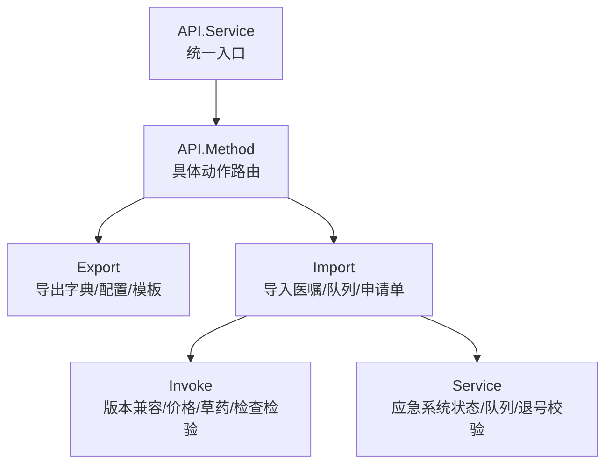
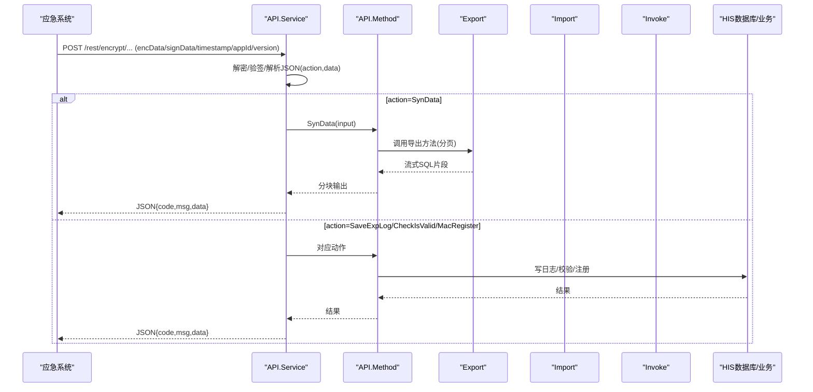
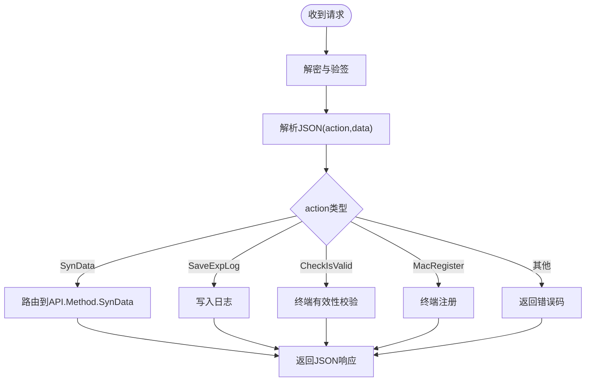
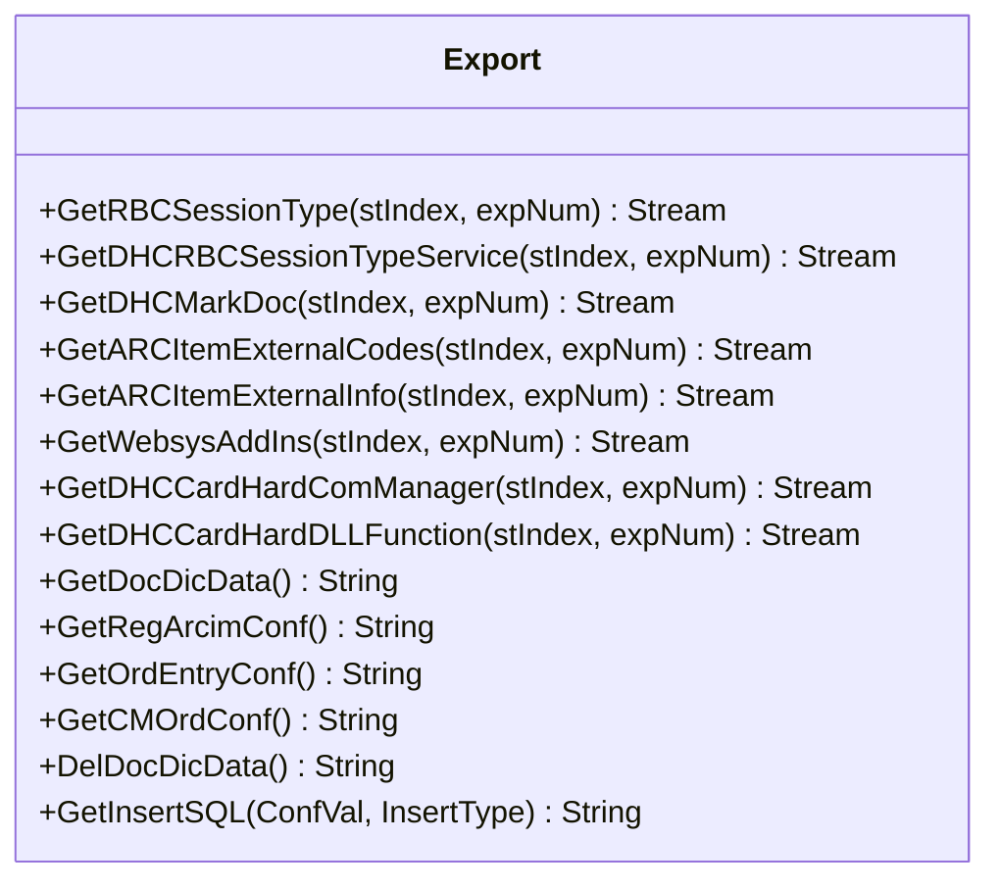
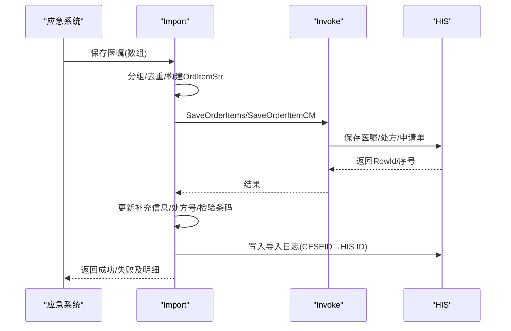
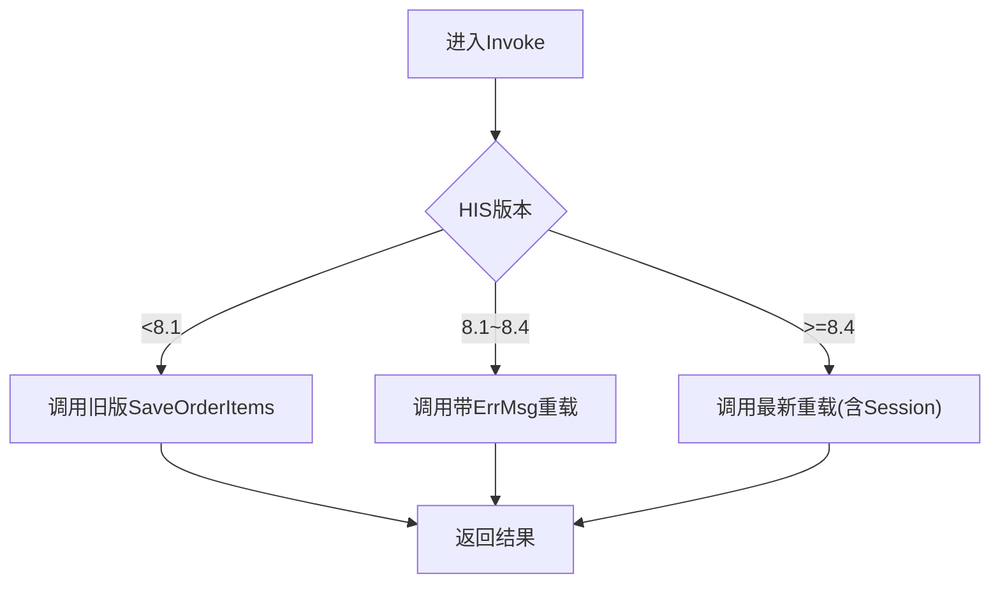
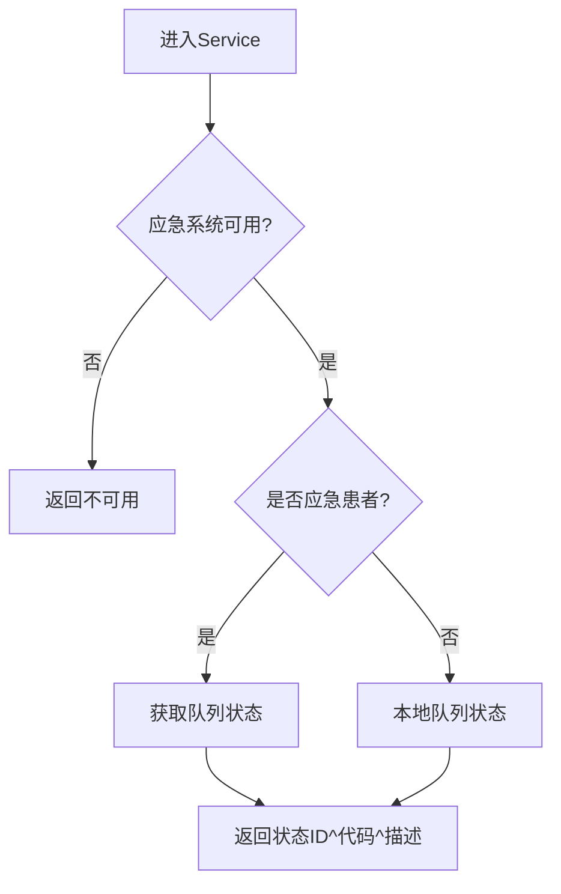
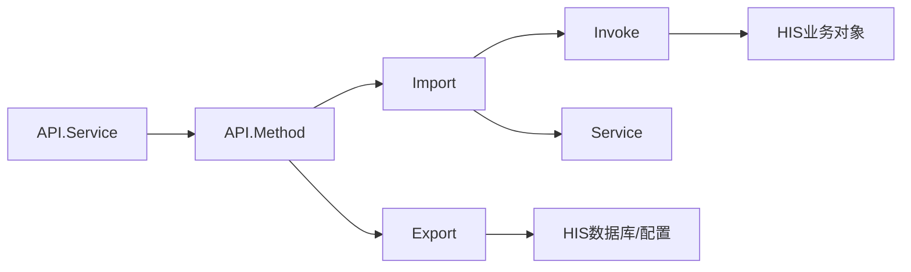

# 数据交换标准

<cite>
**本文引用的文件**
- [Service.cls](file://src/backend/conting-ws/DHCDoc/Interface/StandAlone/Service.cls)
- [Import.cls](file://src/backend/conting-ws/DHCDoc/Interface/StandAlone/Import.cls)
- [Export.cls](file://src/backend/conting-ws/DHCDoc/Interface/StandAlone/Export.cls)
- [API.Service.cls](file://src/backend/conting-ws/DHCDoc/Interface/StandAlone/API/Service.cls)
- [API.Method.cls](file://src/backend/conting-ws/DHCDoc/Interface/StandAlone/API/Method.cls)
- [Invoke.cls](file://src/backend/conting-ws/DHCDoc/Interface/StandAlone/Invoke.cls)
</cite>

## 目录
1. [简介](#简介)
2. [项目结构](#项目结构)
3. [核心组件](#核心组件)
4. [架构总览](#架构总览)
5. [详细组件分析](#详细组件分析)
6. [依赖关系分析](#依赖关系分析)
7. [性能考虑](#性能考虑)
8. [故障排查指南](#故障排查指南)
9. [结论](#结论)
10. [附录](#附录)

## 简介
本文件面向系统间数据交换，聚焦应急系统与HIS之间的数据对接规范与实现。当前代码库实现了基于自定义协议的数据导出、导入与统一API网关能力，用于在应急收费系统与HIS之间进行字典、配置、医嘱、申请单等数据的同步与回传。文档涵盖：
- 数据模型定义（以接口类方法为契约）
- 消息格式规范（JSON封装、流式分页、字段映射）
- 编码与安全（SM4加密、SM3签名、时间戳）
- 数据转换工具（统一调用入口、版本兼容、草药/检查检验特殊处理）
- 验证规则与批量处理方法（分页拉取、事务性写入、日志审计）
- 一致性保证、冲突解决与审计追踪机制

说明：仓库中未发现HL7 v2.x、HL7 FHIR、CDA相关实现；本规范基于现有接口约定与实现进行标准化描述。

## 项目结构
应急系统对接位于后端模块 contig-ws/DHCDoc/Interface/StandAlone，包含以下关键类：
- API层：统一HTTP入口、鉴权、参数解析、结果封装
- 导出层：按表/配置分页导出字典与业务数据
- 导入层：将外部数据转换为HIS内部结构并落库
- 调用适配层：屏蔽HIS版本差异，统一调用底层保存逻辑
- 服务层：应急系统状态判断、队列状态、退号前校验等

**图示来源**
- [API.Service.cls:9-36](file://src/backend/conting-ws/DHCDoc/Interface/StandAlone/API/Service.cls#L9-L36)
- [API.Method.cls:16-37](file://src/backend/conting-ws/DHCDoc/Interface/StandAlone/API/Method.cls#L16-L37)
- [Export.cls:22-152](file://src/backend/conting-ws/DHCDoc/Interface/StandAlone/Export.cls#L22-L152)
- [Import.cls:16-71](file://src/backend/conting-ws/DHCDoc/Interface/StandAlone/Import.cls#L16-L71)
- [Invoke.cls:44-74](file://src/backend/conting-ws/DHCDoc/Interface/StandAlone/Invoke.cls#L44-L74)
- [Service.cls:16-130](file://src/backend/conting-ws/DHCDoc/Interface/StandAlone/Service.cls#L16-L130)

**章节来源**
- [API.Service.cls:9-36](file://src/backend/conting-ws/DHCDoc/Interface/StandAlone/API/Service.cls#L9-L36)
- [API.Method.cls:16-37](file://src/backend/conting-ws/DHCDoc/Interface/StandAlone/API/Method.cls#L16-L37)
- [Export.cls:22-152](file://src/backend/conting-ws/DHCDoc/Interface/StandAlone/Export.cls#L22-L152)
- [Import.cls:16-71](file://src/backend/conting-ws/DHCDoc/Interface/StandAlone/Import.cls#L16-L71)
- [Invoke.cls:44-74](file://src/backend/conting-ws/DHCDoc/Interface/StandAlone/Invoke.cls#L44-L74)
- [Service.cls:16-130](file://src/backend/conting-ws/DHCDoc/Interface/StandAlone/Service.cls#L16-L130)

## 核心组件
- 统一API网关（API.Service）
  - 接收JSON请求，解析action/data，动态调用目标方法，返回统一JSON响应
  - 提供加密链接生成、终端有效性校验、日志写入、数据同步下载等能力
- 数据导出（Export）
  - 按表名或配置节点分页导出字典、医生站配置、模板等数据
  - 使用流式输出与游标索引（index/num）实现增量拉取
- 数据导入（Import）
  - 将外部数据转换为HIS内部字符串结构，调用保存方法，回填处方号、申请单号、组关系等
  - 支持草药医嘱、检查检验申请单自动生成与关联
- 调用适配（Invoke）
  - 根据HIS版本选择不同SaveOrderItems重载，统一价格计算、草药子类、检查分类类型等
- 应急服务（Service）
  - 判断应急系统可用性、患者来源标记、就诊队列状态、退号前校验等

**章节来源**
- [API.Service.cls:9-36](file://src/backend/conting-ws/DHCDoc/Interface/StandAlone/API/Service.cls#L9-L36)
- [Export.cls:22-152](file://src/backend/conting-ws/DHCDoc/Interface/StandAlone/Export.cls#L22-L152)
- [Import.cls:135-179](file://src/backend/conting-ws/DHCDoc/Interface/StandAlone/Import.cls#L135-L179)
- [Invoke.cls:44-74](file://src/backend/conting-ws/DHCDoc/Interface/StandAlone/Invoke.cls#L44-L74)
- [Service.cls:16-130](file://src/backend/conting-ws/DHCDoc/Interface/StandAlone/Service.cls#L16-L130)

## 架构总览
整体采用“API网关 + 导出/导入 + 适配层”的分层架构。API层负责鉴权、加解密、路由；导出/导入层负责数据序列化与持久化；适配层屏蔽HIS版本差异与领域细节。

**图示来源**
- [API.Service.cls:9-36](file://src/backend/conting-ws/DHCDoc/Interface/StandAlone/API/Service.cls#L9-L36)
- [API.Method.cls:16-37](file://src/backend/conting-ws/DHCDoc/Interface/StandAlone/API/Method.cls#L16-L37)
- [Export.cls:22-152](file://src/backend/conting-ws/DHCDoc/Interface/StandAlone/Export.cls#L22-L152)

**章节来源**
- [API.Service.cls:9-36](file://src/backend/conting-ws/DHCDoc/Interface/StandAlone/API/Service.cls#L9-L36)
- [API.Method.cls:16-37](file://src/backend/conting-ws/DHCDoc/Interface/StandAlone/API/Method.cls#L16-L37)
- [Export.cls:22-152](file://src/backend/conting-ws/DHCDoc/Interface/StandAlone/Export.cls#L22-L152)

## 详细组件分析

### 统一API网关（API.Service）
- 功能要点
  - 接收加密请求，解析JSON，动态执行action对应方法
  - 统一返回结构：code/msg/data
  - 提供数据同步下载、日志写入、终端校验、MAC注册、测试SQL等能力
  - 生成加密URL（SM4+SM3+时间戳+AppId+版本）
- 安全与认证
  - 使用SM4对请求体加密，SM3生成签名，附带timestamp、appId、version、encType、signType
  - 通过终端号校验有效性，支持注册新终端

**图示来源**
- [API.Service.cls:9-36](file://src/backend/conting-ws/DHCDoc/Interface/StandAlone/API/Service.cls#L9-L36)
- [API.Service.cls:116-133](file://src/backend/conting-ws/DHCDoc/Interface/StandAlone/API/Service.cls#L116-L133)

**章节来源**
- [API.Service.cls:9-36](file://src/backend/conting-ws/DHCDoc/Interface/StandAlone/API/Service.cls#L9-L36)
- [API.Service.cls:116-133](file://src/backend/conting-ws/DHCDoc/Interface/StandAlone/API/Service.cls#L116-L133)

### 数据导出（Export）
- 功能要点
  - 提供多种字典与配置的导出方法，如挂号职称、费用项、医生号别对照、外部代码登记、插件管理、硬件参数等
  - 使用游标索引（stIndex）与批次大小（expNum）实现分页拉取
  - 针对医生站配置，生成INSERT语句写入dicdata，支持忽略插入或替换插入
- 数据模型与映射
  - 各导出方法对应特定表或配置节点，字段经转义后拼接为SQL
  - 对于不存在表的情况，返回结束标志“-1”，便于客户端终止拉取

**图示来源**
- [Export.cls:22-152](file://src/backend/conting-ws/DHCDoc/Interface/StandAlone/Export.cls#L22-L152)
- [Export.cls:265-701](file://src/backend/conting-ws/DHCDoc/Interface/StandAlone/Export.cls#L265-L701)

**章节来源**
- [Export.cls:22-152](file://src/backend/conting-ws/DHCDoc/Interface/StandAlone/Export.cls#L22-L152)
- [Export.cls:265-701](file://src/backend/conting-ws/DHCDoc/Interface/StandAlone/Export.cls#L265-L701)

### 数据导入（Import）
- 功能要点
  - 回插就诊信息后插入队列，自动匹配医生号别与科室
  - 保存医嘱时生成申请单（检查/检验），并回填申请单号与流水号
  - 支持草药医嘱与普通医嘱的不同保存路径，统一组织参数
  - 批量导入时按组医嘱聚合，逐组调用保存，更新补充信息与导入日志
- 数据模型与映射
  - 将对象字段映射为HIS内部分隔串，包含优先级、频次、疗程、用法用量、标本、部位、备注等
  - 更新处方号、检验条码、计费时间与是否已计费标识
  - 记录CESEID与HIS RowId的映射，用于后续关联与审计

**图示来源**
- [Import.cls:135-179](file://src/backend/conting-ws/DHCDoc/Interface/StandAlone/Import.cls#L135-L179)
- [Import.cls:310-475](file://src/backend/conting-ws/DHCDoc/Interface/StandAlone/Import.cls#L310-L475)
- [Invoke.cls:59-74](file://src/backend/conting-ws/DHCDoc/Interface/StandAlone/Invoke.cls#L59-L74)

**章节来源**
- [Import.cls:135-179](file://src/backend/conting-ws/DHCDoc/Interface/StandAlone/Import.cls#L135-L179)
- [Import.cls:310-475](file://src/backend/conting-ws/DHCDoc/Interface/StandAlone/Import.cls#L310-L475)
- [Invoke.cls:59-74](file://src/backend/conting-ws/DHCDoc/Interface/StandAlone/Invoke.cls#L59-L74)

### 调用适配（Invoke）
- 功能要点
  - 根据HIS版本选择SaveOrderItems重载，兼容8.1/8.4前后差异
  - 统一获取草药子类、处方剂型、检查分类类型、煎药方式等
  - 价格计算委托给计费模块，支持自定价与折扣
- 数据模型与映射
  - 将外部字段映射为HIS内部参数，包括费别、优先级、频次、疗程、用法用量、标本、部位、备注等
  - 对检查/检验项目，自动生成申请单并回填申请单号

**图示来源**
- [Invoke.cls:65-74](file://src/backend/conting-ws/DHCDoc/Interface/StandAlone/Invoke.cls#L65-L74)
- [Invoke.cls:14-30](file://src/backend/conting-ws/DHCDoc/Interface/StandAlone/Invoke.cls#L14-L30)
- [Invoke.cls:82-101](file://src/backend/conting-ws/DHCDoc/Interface/StandAlone/Invoke.cls#L82-L101)

**章节来源**
- [Invoke.cls:65-74](file://src/backend/conting-ws/DHCDoc/Interface/StandAlone/Invoke.cls#L65-L74)
- [Invoke.cls:14-30](file://src/backend/conting-ws/DHCDoc/Interface/StandAlone/Invoke.cls#L14-L30)
- [Invoke.cls:82-101](file://src/backend/conting-ws/DHCDoc/Interface/StandAlone/Invoke.cls#L82-L101)

### 应急服务（Service）
- 功能要点
  - 判断应急系统是否可用、是否为应急系统患者
  - 获取患者队列状态（到达/等候），结合订单与科室账单子类判断
  - 退号前校验：防止误退应急系统患者或存在未结算挂号医嘱
- 数据模型与映射
  - 通过全局变量与SQL查询组合，得到队列状态与相关医嘱信息

**图示来源**
- [Service.cls:16-130](file://src/backend/conting-ws/DHCDoc/Interface/StandAlone/Service.cls#L16-L130)

**章节来源**
- [Service.cls:16-130](file://src/backend/conting-ws/DHCDoc/Interface/StandAlone/Service.cls#L16-L130)

## 依赖关系分析
- API层依赖导出/导入与日志/终端管理
- 导入层依赖调用适配层与HIS业务对象
- 导出层依赖数据库表与配置节点
- 调用适配层依赖HIS版本与领域服务（价格、草药、检查检验）

**图示来源**
- [API.Service.cls:9-36](file://src/backend/conting-ws/DHCDoc/Interface/StandAlone/API/Service.cls#L9-L36)
- [API.Method.cls:16-37](file://src/backend/conting-ws/DHCDoc/Interface/StandAlone/API/Method.cls#L16-L37)
- [Export.cls:22-152](file://src/backend/conting-ws/DHCDoc/Interface/StandAlone/Export.cls#L22-L152)
- [Import.cls:135-179](file://src/backend/conting-ws/DHCDoc/Interface/StandAlone/Import.cls#L135-L179)
- [Invoke.cls:65-74](file://src/backend/conting-ws/DHCDoc/Interface/StandAlone/Invoke.cls#L65-L74)

**章节来源**
- [API.Service.cls:9-36](file://src/backend/conting-ws/DHCDoc/Interface/StandAlone/API/Service.cls#L9-L36)
- [API.Method.cls:16-37](file://src/backend/conting-ws/DHCDoc/Interface/StandAlone/API/Method.cls#L16-L37)
- [Export.cls:22-152](file://src/backend/conting-ws/DHCDoc/Interface/StandAlone/Export.cls#L22-L152)
- [Import.cls:135-179](file://src/backend/conting-ws/DHCDoc/Interface/StandAlone/Import.cls#L135-L179)
- [Invoke.cls:65-74](file://src/backend/conting-ws/DHCDoc/Interface/StandAlone/Invoke.cls#L65-L74)

## 性能考虑
- 分页导出：使用stIndex与expNum控制每次拉取数量，避免一次性加载大量数据
- 流式输出：导出方法返回流，分块读取，降低内存占用
- 事务与重试：导入过程在失败时回滚，并记录错误信息，便于重试
- 版本兼容：调用适配层根据HIS版本选择最优路径，减少无效调用

[本节为通用指导，不直接分析具体文件]

## 故障排查指南
- 常见错误
  - 终端无效：检查终端号与注册状态
  - 数据缺失：确认导出索引与批次是否正确，检查表是否存在
  - 导入失败：查看错误信息，核对字段映射与必填项
- 日志与审计
  - 导入成功后写入导入日志，记录CESEID与HIS ID映射
  - 统一API提供日志写入接口，便于问题定位
- 一致性保障
  - 使用事务确保数据一致性，失败回滚
  - 更新补充信息（处方号、检验条码、计费时间）与主数据保持一致

**章节来源**
- [API.Method.cls:47-57](file://src/backend/conting-ws/DHCDoc/Interface/StandAlone/API/Method.cls#L47-L57)
- [Import.cls:458-463](file://src/backend/conting-ws/DHCDoc/Interface/StandAlone/Import.cls#L458-L463)

## 结论
本仓库实现了应急系统与HIS之间的数据交换能力，采用统一的API网关、分页导出、批量导入与版本适配，满足医疗场景下的字典、配置、医嘱与申请单同步需求。当前未实现HL7 v2.x、HL7 FHIR、CDA标准；若需扩展，可在API层增加相应编解码器与消息路由，保持现有分层架构不变。

[本节为总结，不直接分析具体文件]

## 附录

### 数据模型与消息格式规范
- 请求格式
  - URL参数：encData、signData、timestamp、appId、version、encType、signType
  - 请求体：JSON，包含action与data
- 响应格式
  - JSON：code、msg、data
- 导出分页
  - 参数：classname、methodname、index、num
  - 返回：流式SQL片段，客户端分块读取
- 导入数据
  - 数组形式，每个元素包含医嘱项字段（优先级、频次、疗程、用法用量、标本、部位、备注、处方号、检验条码等）
  - 组医嘱：通过主从关系聚合，逐组保存

**章节来源**
- [API.Service.cls:116-133](file://src/backend/conting-ws/DHCDoc/Interface/StandAlone/API/Service.cls#L116-L133)
- [API.Method.cls:16-37](file://src/backend/conting-ws/DHCDoc/Interface/StandAlone/API/Method.cls#L16-L37)
- [Import.cls:310-475](file://src/backend/conting-ws/DHCDoc/Interface/StandAlone/Import.cls#L310-L475)

### 编码映射表（示例）
- 草药子类：通过Invoke.GetCNMedItemCatStr获取，用于区分草药与非草药医嘱
- 处方剂型：通过Invoke.GetCMPrescTypeStr获取，用于草药处方限定
- 检查分类类型：通过Invoke.GetTraType获取，用于自动生成申请单
- 煎药方式：通过Invoke.GetCookModeInstr/GetCookArcim获取，用于关联用法与医嘱

**章节来源**
- [Invoke.cls:14-30](file://src/backend/conting-ws/DHCDoc/Interface/StandAlone/Invoke.cls#L14-L30)
- [Invoke.cls:82-101](file://src/backend/conting-ws/DHCDoc/Interface/StandAlone/Invoke.cls#L82-L101)
- [Invoke.cls:117-143](file://src/backend/conting-ws/DHCDoc/Interface/StandAlone/Invoke.cls#L117-L143)

### 批量处理方法
- 导出：按表名与方法名分页拉取，流式输出，客户端分块处理
- 导入：按组医嘱聚合，逐组保存，更新补充信息，记录导入日志

**章节来源**
- [Export.cls:22-152](file://src/backend/conting-ws/DHCDoc/Interface/StandAlone/Export.cls#L22-L152)
- [Import.cls:310-475](file://src/backend/conting-ws/DHCDoc/Interface/StandAlone/Import.cls#L310-L475)

### 一致性保证、冲突解决与审计追踪
- 一致性：事务包裹导入过程，失败回滚；更新补充信息与主数据一致
- 冲突解决：导入日志记录CESEID与HIS ID映射，便于重复导入时识别与处理
- 审计追踪：统一API提供日志写入接口，记录操作状态与消息内容

**章节来源**
- [Import.cls:458-463](file://src/backend/conting-ws/DHCDoc/Interface/StandAlone/Import.cls#L458-L463)
- [API.Method.cls:47-57](file://src/backend/conting-ws/DHCDoc/Interface/StandAlone/API/Method.cls#L47-L57)