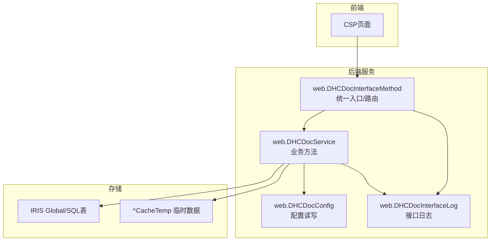
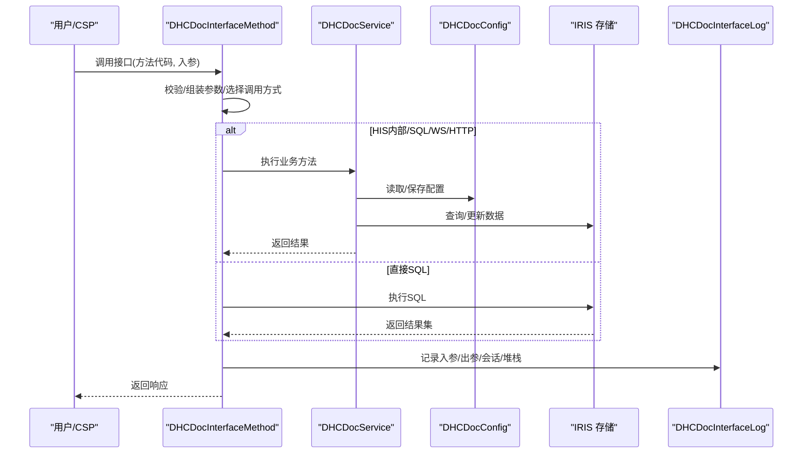
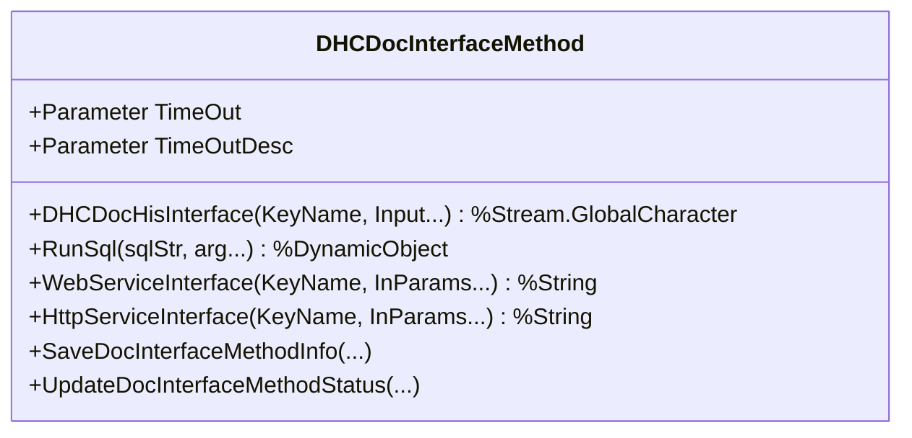
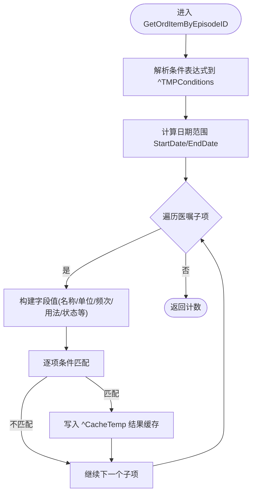
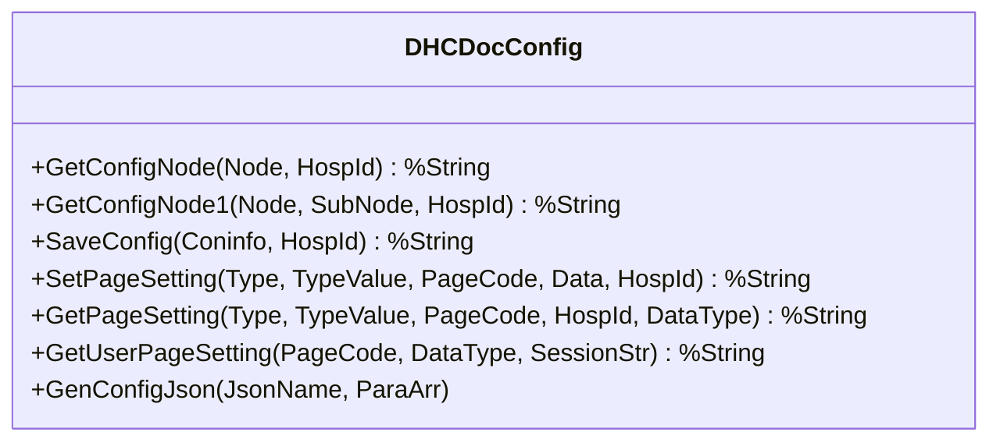
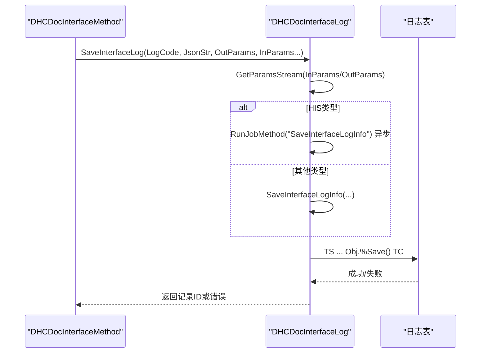
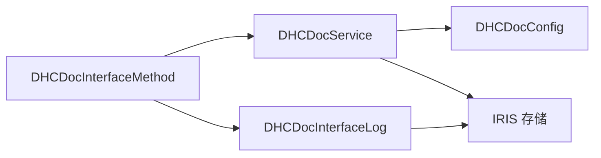

# 数据流设计

<cite>
**本文引用的文件**
- [DHCDocService.cls](file://src/backend/public-mc/web/DHCDocService.cls)
- [DHCDocConfig.cls](file://src/backend/public-mc/web/DHCDocConfig.cls)
- [DHCDocInterfaceMethod.cls](file://src/backend/public-mc/web/DHCDocInterfaceMethod.cls)
- [DHCDocInterfaceLog.cls](file://src/backend/public-mc/web/DHCDocInterfaceLog.cls)
- [DHCDoc.inc](file://src/backend/public-mc/DHCDoc.inc)
- [DHCDocConfig.mac](file://src/backend/public-mc/DHCDocConfig.mac)
</cite>

## 目录
1. [引言](#引言)
2. [项目结构](#项目结构)
3. [核心组件](#核心组件)
4. [架构总览](#架构总览)
5. [详细组件分析](#详细组件分析)
6. [依赖关系分析](#依赖关系分析)
7. [性能考虑](#性能考虑)
8. [故障排查指南](#故障排查指南)
9. [结论](#结论)
10. [附录](#附录)

## 引言
本文件面向IRIS医疗系统的数据流设计，聚焦从CSP页面接收请求到返回数据的完整链路：CSP页面 → ObjectScript类方法处理 → IRIS数据库操作 → 结果返回。文档覆盖数据验证、转换与持久化流程；配置数据的读取与缓存机制；事务处理与并发控制策略；一致性保证与错误处理机制；以及性能优化策略与监控指标。文中提供数据流图、时序图与状态转换图，帮助读者快速理解并落地实践。

## 项目结构
- 前端入口：CSP页面（位于 src/frontend/*/csp）负责发起请求与渲染响应。
- 后端服务层：以ObjectScript类为核心，承载业务逻辑与数据访问。
- 配置与工具：全局配置宏与类提供统一配置读写、日志记录、接口注册与调用等能力。
- 数据存储：IRIS Global/SQL表作为主存储，临时数据使用^CacheTemp等临时节点。

**图表来源**
- [DHCDocInterfaceMethod.cls:473-549](file://src/backend/public-mc/web/DHCDocInterfaceMethod.cls#L473-L549)
- [DHCDocService.cls:94-414](file://src/backend/public-mc/web/DHCDocService.cls#L94-L414)
- [DHCDocConfig.cls:21-44](file://src/backend/public-mc/web/DHCDocConfig.cls#L21-L44)
- [DHCDocInterfaceLog.cls:395-512](file://src/backend/public-mc/web/DHCDocInterfaceLog.cls#L395-L512)

**章节来源**
- [DHCDocInterfaceMethod.cls:473-549](file://src/backend/public-mc/web/DHCDocInterfaceMethod.cls#L473-L549)
- [DHCDocService.cls:94-414](file://src/backend/public-mc/web/DHCDocService.cls#L94-L414)
- [DHCDocConfig.cls:21-44](file://src/backend/public-mc/web/DHCDocConfig.cls#L21-L44)
- [DHCDocInterfaceLog.cls:395-512](file://src/backend/public-mc/web/DHCDocInterfaceLog.cls#L395-L512)

## 核心组件
- web.DHCDocInterfaceMethod：统一接口入口，支持HIS内部调用、SOAP/HTTP外部调用、SQL执行；负责参数组装、动态调用、异常捕获与日志记录。
- web.DHCDocService：业务方法集合，包含医嘱查询、转科复制、用药记录等；实现条件解析、数据聚合、临时缓存写入。
- web.DHCDocConfig：配置中心，支持按院区隔离的节点读取/保存、页面设置、全局配置JSON生成等。
- web.DHCDocInterfaceLog：接口日志与审计，支持入参/出参流式记录、异步落库、自动停用策略、堆栈与Session信息收集。
- DHCDoc.inc / DHCDocConfig.mac：全局宏与通用配置函数，提供日志对象定义与基础配置存取。

**章节来源**
- [DHCDocInterfaceMethod.cls:1-116](file://src/backend/public-mc/web/DHCDocInterfaceMethod.cls#L1-L116)
- [DHCDocService.cls:1-800](file://src/backend/public-mc/web/DHCDocService.cls#L1-L800)
- [DHCDocConfig.cls:1-456](file://src/backend/public-mc/web/DHCDocConfig.cls#L1-L456)
- [DHCDocInterfaceLog.cls:1-800](file://src/backend/public-mc/web/DHCDocInterfaceLog.cls#L1-L800)
- [DHCDoc.inc:1-8](file://src/backend/public-mc/DHCDoc.inc#L1-L8)
- [DHCDocConfig.mac:1-119](file://src/backend/public-mc/DHCDocConfig.mac#L1-L119)

## 架构总览
整体数据流遵循“入口路由 → 业务处理 → 数据访问 → 结果封装 → 日志记录”的分层模式。入口层根据接口类型分发到不同处理器；业务层完成校验、转换与持久化；存储层通过IRIS Global/SQL进行读写；日志层对关键路径进行全量或抽样审计。

**图表来源**
- [DHCDocInterfaceMethod.cls:473-549](file://src/backend/public-mc/web/DHCDocInterfaceMethod.cls#L473-L549)
- [DHCDocService.cls:94-414](file://src/backend/public-mc/web/DHCDocService.cls#L94-L414)
- [DHCDocConfig.cls:21-44](file://src/backend/public-mc/web/DHCDocConfig.cls#L21-L44)
- [DHCDocInterfaceLog.cls:395-512](file://src/backend/public-mc/web/DHCDocInterfaceLog.cls#L395-L512)

## 详细组件分析

### 组件A：统一入口与路由（web.DHCDocInterfaceMethod）
- 职责
  - 统一入口DHCDocHisInterface：根据方法代码查找注册信息，按接口类型（HIS/HTTP/SOAP）路由到对应处理器。
  - 动态调用：支持ClassMethod/ResultSet/SQL三种执行模式。
  - 超时与异常：捕获异常并格式化输出，统一记录日志。
  - 外部调用：WebServiceInterface与HttpServiceInterface封装第三方调用，支持HTTPS、Header、超时等。
- 关键点
  - 参数组装：将可变参数映射为Input1..N，构造动态调用字符串。
  - SQL执行：RunSql使用%DynamicQuery:SQL，返回%ResultSet。
  - 日志集成：非Query请求均调用SaveInterfaceLog记录。

**图表来源**
- [DHCDocInterfaceMethod.cls:473-549](file://src/backend/public-mc/web/DHCDocInterfaceMethod.cls#L473-L549)
- [DHCDocInterfaceMethod.cls:558-581](file://src/backend/public-mc/web/DHCDocInterfaceMethod.cls#L558-L581)
- [DHCDocInterfaceMethod.cls:588-645](file://src/backend/public-mc/web/DHCDocInterfaceMethod.cls#L588-L645)
- [DHCDocInterfaceMethod.cls:652-799](file://src/backend/public-mc/web/DHCDocInterfaceMethod.cls#L652-L799)

**章节来源**
- [DHCDocInterfaceMethod.cls:473-549](file://src/backend/public-mc/web/DHCDocInterfaceMethod.cls#L473-L549)
- [DHCDocInterfaceMethod.cls:558-581](file://src/backend/public-mc/web/DHCDocInterfaceMethod.cls#L558-L581)
- [DHCDocInterfaceMethod.cls:588-645](file://src/backend/public-mc/web/DHCDocInterfaceMethod.cls#L588-L645)
- [DHCDocInterfaceMethod.cls:652-799](file://src/backend/public-mc/web/DHCDocInterfaceMethod.cls#L652-L799)

### 组件B：业务处理（web.DHCDocService）
- 职责
  - 医嘱查询：GetOrdItemInfo/GetOrdItemByEpisodeID解析复杂条件表达式，遍历医嘱明细，聚合结果并写入临时节点^CacheTemp。
  - 转科复制：CopyTransDepOrder在事务中停止原科室医嘱并复制到目标科室，必要时调整时间戳。
  - 用药记录：IPUseDrugRecordExecute/Close/Fetch分页输出住院用药记录。
- 关键点
  - 条件解析：将形如{...}AND{...}OR{...}的条件串解析为临时结构，支持多字段匹配。
  - 数据聚合：多次读取^OEORD等Global，关联字典表获取描述信息。
  - 事务处理：TS/TRO/TC包裹写操作，确保原子性。

**图表来源**
- [DHCDocService.cls:115-414](file://src/backend/public-mc/web/DHCDocService.cls#L115-L414)

**章节来源**
- [DHCDocService.cls:94-414](file://src/backend/public-mc/web/DHCDocService.cls#L94-L414)
- [DHCDocService.cls:490-663](file://src/backend/public-mc/web/DHCDocService.cls#L490-L663)
- [DHCDocService.cls:671-793](file://src/backend/public-mc/web/DHCDocService.cls#L671-L793)

### 组件C：配置中心（web.DHCDocConfig）
- 职责
  - 按院区隔离的配置读取：GetConfigNode/GetConfigNode1/GetConfigNodeNew等支持HospId前缀。
  - 页面设置：SetPageSetting/GetPageSetting支持JSON合并与对象返回。
  - 全局配置：GenConfigJson生成JS变量供前端使用。
- 关键点
  - 院区键空间：^DHCDocConfig(HospDr_医院ID, Node, ...)。
  - 安全组/用户级设置：GetUserPageSetting合并个人与安全组配置。

**图表来源**
- [DHCDocConfig.cls:21-44](file://src/backend/public-mc/web/DHCDocConfig.cls#L21-L44)
- [DHCDocConfig.cls:139-164](file://src/backend/public-mc/web/DHCDocConfig.cls#L139-L164)
- [DHCDocConfig.cls:371-408](file://src/backend/public-mc/web/DHCDocConfig.cls#L371-L408)
- [DHCDocConfig.cls:430-439](file://src/backend/public-mc/web/DHCDocConfig.cls#L430-L439)

**章节来源**
- [DHCDocConfig.cls:21-44](file://src/backend/public-mc/web/DHCDocConfig.cls#L21-L44)
- [DHCDocConfig.cls:139-164](file://src/backend/public-mc/web/DHCDocConfig.cls#L139-L164)
- [DHCDocConfig.cls:371-408](file://src/backend/public-mc/web/DHCDocConfig.cls#L371-L408)
- [DHCDocConfig.cls:430-439](file://src/backend/public-mc/web/DHCDocConfig.cls#L430-L439)

### 组件D：日志与审计（web.DHCDocInterfaceLog）
- 职责
  - 接口注册与唯一性校验：CheckInterfaceCode避免重复。
  - 日志记录：SaveInterfaceLog组织入参/出参流，支持HIS/HIS外部/HTTP等不同类型；异步落库避免阻塞。
  - 自动停用：AutoStopMethodStatus统计当日超时次数，超过阈值自动停用方法。
  - 信息查询：GetLogListData/FindLogRegist支持多维度检索。
- 关键点
  - 流式I/O：GetParamsStream将对象/流转换为字符流，限制读取长度避免内存膨胀。
  - 会话与堆栈：GetSessionInfo/GetStackInfo采集上下文便于排障。
  - 事务保护：落库使用TS/TC包裹，失败回滚。

**图表来源**
- [DHCDocInterfaceLog.cls:395-512](file://src/backend/public-mc/web/DHCDocInterfaceLog.cls#L395-L512)
- [DHCDocInterfaceLog.cls:520-563](file://src/backend/public-mc/web/DHCDocInterfaceLog.cls#L520-L563)
- [DHCDocInterfaceLog.cls:627-753](file://src/backend/public-mc/web/DHCDocInterfaceLog.cls#L627-L753)

**章节来源**
- [DHCDocInterfaceLog.cls:395-512](file://src/backend/public-mc/web/DHCDocInterfaceLog.cls#L395-L512)
- [DHCDocInterfaceLog.cls:520-563](file://src/backend/public-mc/web/DHCDocInterfaceLog.cls#L520-L563)
- [DHCDocInterfaceLog.cls:627-753](file://src/backend/public-mc/web/DHCDocInterfaceLog.cls#L627-L753)

### 组件E：配置宏与工具（DHCDoc.inc / DHCDocConfig.mac）
- 职责
  - 日志对象定义：DHCDoc.inc定义DocLogObj指向web.DHCDocInterfaceLog。
  - 基础配置存取：DHCDocConfig.mac提供saveconfig/getconfignode等函数，用于全局配置读写。
- 关键点
  - 院区节点约定：注释说明若使用院区节点需通过类方法获取。
  - 常用工具：日期/时间格式转换、当前医院、诊断路径等。

**章节来源**
- [DHCDoc.inc:1-8](file://src/backend/public-mc/DHCDoc.inc#L1-L8)
- [DHCDocConfig.mac:1-119](file://src/backend/public-mc/DHCDocConfig.mac#L1-L119)

## 依赖关系分析
- 入口依赖：DHCDocInterfaceMethod依赖DHCDocInterfaceLog进行日志记录，依赖业务类（如DHCDocService）或SQL执行器。
- 业务依赖：DHCDocService依赖DHCDocConfig读取配置，依赖IRIS存储（Global/SQL）。
- 配置依赖：DHCDocConfig依赖会话上下文（LOGON.HOSPID）进行院区隔离。
- 日志依赖：DHCDocInterfaceLog依赖会话与进程信息，依赖日志表持久化。

**图表来源**
- [DHCDocInterfaceMethod.cls:473-549](file://src/backend/public-mc/web/DHCDocInterfaceMethod.cls#L473-L549)
- [DHCDocService.cls:94-414](file://src/backend/public-mc/web/DHCDocService.cls#L94-L414)
- [DHCDocConfig.cls:21-44](file://src/backend/public-mc/web/DHCDocConfig.cls#L21-L44)
- [DHCDocInterfaceLog.cls:395-512](file://src/backend/public-mc/web/DHCDocInterfaceLog.cls#L395-L512)

**章节来源**
- [DHCDocInterfaceMethod.cls:473-549](file://src/backend/public-mc/web/DHCDocInterfaceMethod.cls#L473-L549)
- [DHCDocService.cls:94-414](file://src/backend/public-mc/web/DHCDocService.cls#L94-L414)
- [DHCDocConfig.cls:21-44](file://src/backend/public-mc/web/DHCDocConfig.cls#L21-L44)
- [DHCDocInterfaceLog.cls:395-512](file://src/backend/public-mc/web/DHCDocInterfaceLog.cls#L395-L512)

## 性能考虑
- 条件查询优化
  - 将复杂条件解析为临时结构（^TMPConditions），减少重复解析开销。
  - 使用^CacheTemp缓存中间结果，降低重复IO。
- 批量与分页
  - 查询接口采用Execute/Fetch/Close模式，避免一次性加载大量数据。
- 事务边界
  - 写操作使用TS/TC包裹，缩小事务范围，提高并发吞吐。
- 外部调用
  - HTTP/WS调用设置合理Timeout，避免长连接阻塞。
- 日志落库
  - HIS类型日志异步落库，减少主流程延迟。

[本节为通用指导，无需特定文件引用]

## 故障排查指南
- 常见问题定位
  - 接口未启用：检查方法状态（Y/N），可通过UpdateDocInterfaceMethodStatus切换。
  - 超时问题：关注WebServiceInterface/HttpServiceInterface超时配置与网络状况。
  - 日志缺失：确认接口已注册且LogFlag=Y；查看AutoStopMethodStatus是否自动停用。
- 日志查询
  - 使用FindLogRegist/GetLogListData按时间、代码、内容过滤。
  - 通过GetLogListDetail获取入参/出参详情。
- 配置问题
  - 使用GetConfigNode/GetConfigNode1核对院区节点值。
  - 页面设置通过GetPageSetting/GetUserPageSetting检查合并结果。

**章节来源**
- [DHCDocInterfaceMethod.cls:396-424](file://src/backend/public-mc/web/DHCDocInterfaceMethod.cls#L396-L424)
- [DHCDocInterfaceLog.cls:520-563](file://src/backend/public-mc/web/DHCDocInterfaceLog.cls#L520-L563)
- [DHCDocInterfaceLog.cls:627-753](file://src/backend/public-mc/web/DHCDocInterfaceLog.cls#L627-L753)
- [DHCDocConfig.cls:21-44](file://src/backend/public-mc/web/DHCDocConfig.cls#L21-L44)

## 结论
本数据流设计以统一入口、分层处理、集中配置与全面审计为核心，实现了从CSP到IRIS存储的稳定、可观测、可扩展的数据通道。通过条件解析与临时缓存提升查询性能，通过事务与并发控制保障一致性与可用性，通过日志与自动停用机制增强可运维性。建议在生产环境中结合监控指标（QPS、耗时、错误率、超时次数）持续优化。

[本节为总结，无需特定文件引用]

## 附录

### 数据一致性保证
- 事务：写操作使用TS/TC包裹，失败回滚，确保原子性。
- 幂等：接口注册与日志落库具备唯一性校验与重试友好设计。
- 并发：锁清理（ClearOELock）与临时节点隔离减少竞争。

**章节来源**
- [DHCDocService.cls:490-663](file://src/backend/public-mc/web/DHCDocService.cls#L490-L663)
- [DHCDocConfig.cls:12-19](file://src/backend/public-mc/web/DHCDocConfig.cls#L12-L19)
- [DHCDocInterfaceLog.cls:481-500](file://src/backend/public-mc/web/DHCDocInterfaceLog.cls#L481-L500)

### 错误处理机制
- 统一异常捕获：入口层捕获异常并格式化输出。
- 超时识别：外部调用超时识别并记录特定描述。
- 自动降级：达到阈值自动停用方法，防止雪崩。

**章节来源**
- [DHCDocInterfaceMethod.cls:543-549](file://src/backend/public-mc/web/DHCDocInterfaceMethod.cls#L543-L549)
- [DHCDocInterfaceMethod.cls:637-645](file://src/backend/public-mc/web/DHCDocInterfaceMethod.cls#L637-L645)
- [DHCDocInterfaceLog.cls:520-563](file://src/backend/public-mc/web/DHCDocInterfaceLog.cls#L520-L563)

### 监控指标建议
- 入口层：接口调用次数、成功率、平均耗时、超时次数。
- 业务层：条件解析耗时、缓存命中率、分页条数。
- 存储层：SQL执行耗时、Global读写次数。
- 日志层：落库成功率、异步任务堆积量。

[本节为通用指导，无需特定文件引用]