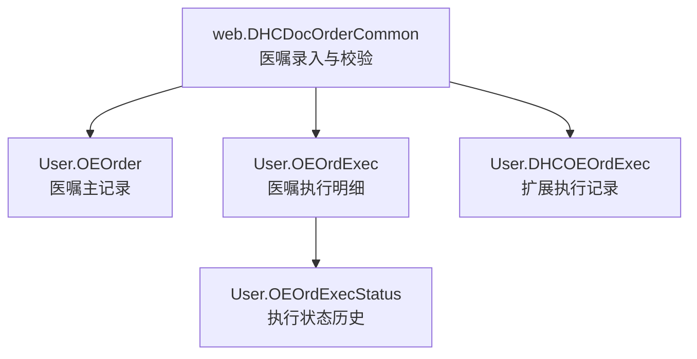
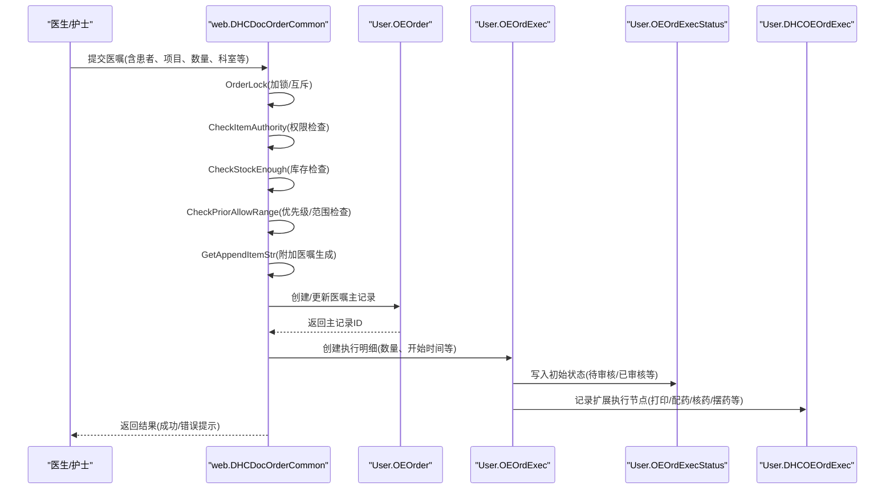
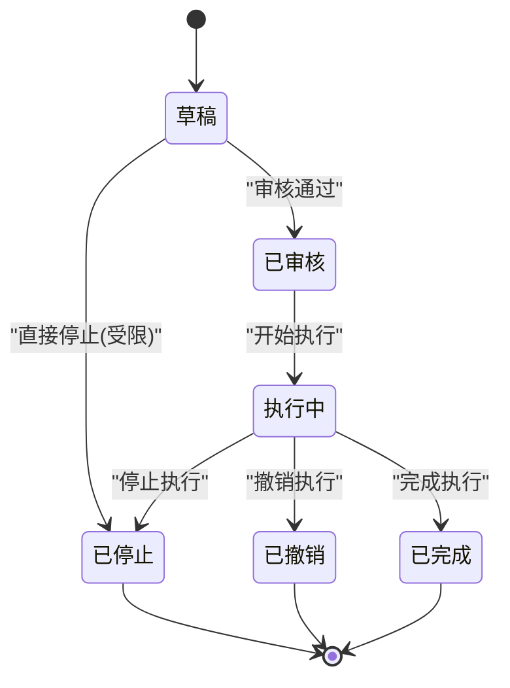
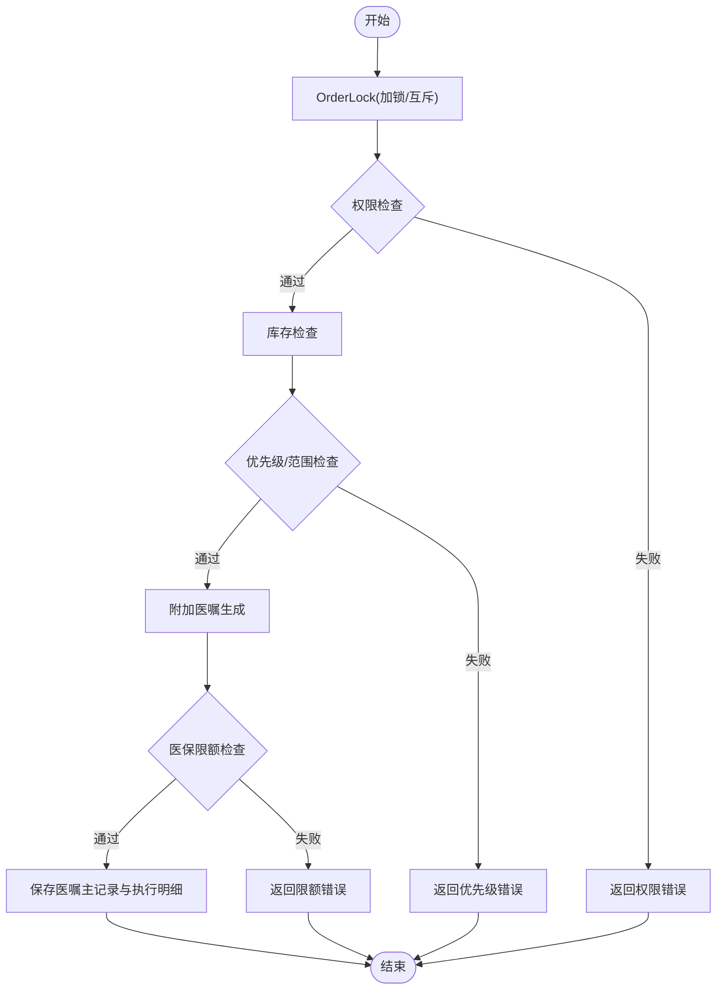
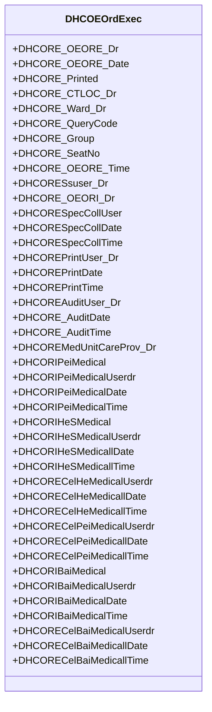
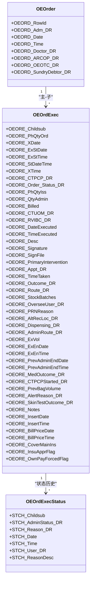
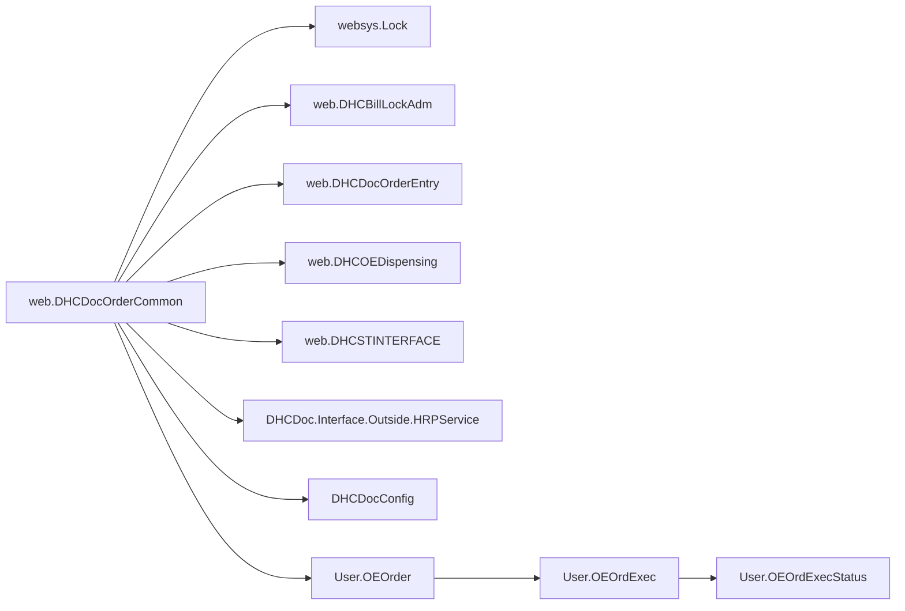

# 医嘱管理系统

<cite>
**本文引用的文件**
- [DHCDocOrderCommon.cls](file://src/backend/doc-ws/web/DHCDocOrderCommon.cls)
- [DHCOEOrdExec.cls](file://src/backend/doc-ws/User/DHCOEOrdExec.cls)
- [OEOrder.cls](file://src/backend/doc-ws/User/OEOrder.cls)
- [OEOrdExec.cls](file://src/backend/doc-ws/User/OEOrdExec.cls)
- [OEOrdExecStatus.cls](file://src/backend/doc-ws/User/OEOrdExecStatus.cls)
</cite>

## 目录
1. [简介](#简介)
2. [项目结构](#项目结构)
3. [核心组件](#核心组件)
4. [架构总览](#架构总览)
5. [详细组件分析](#详细组件分析)
6. [依赖关系分析](#依赖关系分析)
7. [性能考虑](#性能考虑)
8. [故障排查指南](#故障排查指南)
9. [结论](#结论)
10. [附录](#附录)

## 简介
本文件面向医嘱管理系统的后端实现，围绕医嘱的创建、审核、执行、停止、撤销等全生命周期进行系统化说明。重点解析以下两类核心逻辑：
- web.DHCDocOrderCommon：医嘱录入与保存前的校验、权限控制、库存检查、冲突检测、合理性检查、附加医嘱生成等。
- User.DHCOEOrdExec：医嘱执行过程的数据模型（配药、核药、摆药、打印、采样、审计等）及其索引设计。

同时给出医嘱状态机、数据一致性保障机制、优先级管理与执行规则配置、流程图与数据结构设计，并提供关键算法的代码片段路径以便定位实现。

## 项目结构
本系统采用分层组织方式：
- Web层/业务入口：web.DHCDocOrderCommon 提供医嘱录入与保存前校验的统一入口方法，集中处理锁、权限、库存、冲突、合理性等。
- 领域实体层：User.OEOrder、User.OEOrdExec、User.OEOrdExecStatus 定义医嘱主表、执行明细及状态变更历史。
- 扩展执行记录：User.DHCOEOrdExec 用于扩展执行信息（如配药、核药、摆药、打印、采样等）。

图表来源
- [DHCDocOrderCommon.cls:1-125](file://src/backend/doc-ws/web/DHCDocOrderCommon.cls#L1-L125)
- [OEOrder.cls:1-200](file://src/backend/doc-ws/User/OEOrder.cls#L1-L200)
- [OEOrdExec.cls:1-200](file://src/backend/doc-ws/User/OEOrdExec.cls#L1-L200)
- [OEOrdExecStatus.cls:1-190](file://src/backend/doc-ws/User/OEOrdExecStatus.cls#L1-L190)
- [DHCOEOrdExec.cls:1-446](file://src/backend/doc-ws/User/DHCOEOrdExec.cls#L1-L446)

章节来源
- [DHCDocOrderCommon.cls:1-125](file://src/backend/doc-ws/web/DHCDocOrderCommon.cls#L1-L125)
- [OEOrder.cls:1-200](file://src/backend/doc-ws/User/OEOrder.cls#L1-L200)
- [OEOrdExec.cls:1-200](file://src/backend/doc-ws/User/OEOrdExec.cls#L1-L200)
- [OEOrdExecStatus.cls:1-190](file://src/backend/doc-ws/User/OEOrdExecStatus.cls#L1-L190)
- [DHCOEOrdExec.cls:1-446](file://src/backend/doc-ws/User/DHCOEOrdExec.cls#L1-L446)

## 核心组件
- web.DHCDocOrderCommon：统一封装医嘱录入与保存前校验，包括加锁策略、权限检查、库存校验、冲突检测、合理性检查、附加医嘱生成、医保限额检查等。
- User.OEOrder：医嘱主记录，关联患者就诊、医生、时间等基础信息，并维护触发器以支持审计与动作类型日志。
- User.OEOrdExec：医嘱执行明细，包含执行数量、开始/结束时间、执行者、状态、计费、医保标志、签名等。
- User.OEOrdExecStatus：记录每次状态变更的原因、用户、时间，形成可追溯的状态历史。
- User.DHCOEOrdExec：扩展执行记录，覆盖打印、配药、核药、摆药、采样、审计等流程节点，提供多维度索引。

章节来源
- [DHCDocOrderCommon.cls:148-800](file://src/backend/doc-ws/web/DHCDocOrderCommon.cls#L148-L800)
- [OEOrder.cls:1-200](file://src/backend/doc-ws/User/OEOrder.cls#L1-L200)
- [OEOrdExec.cls:1-200](file://src/backend/doc-ws/User/OEOrdExec.cls#L1-L200)
- [OEOrdExecStatus.cls:1-190](file://src/backend/doc-ws/User/OEOrdExecStatus.cls#L1-L190)
- [DHCOEOrdExec.cls:1-446](file://src/backend/doc-ws/User/DHCOEOrdExec.cls#L1-L446)

## 架构总览
医嘱管理的关键流程从“录入与校验”到“执行与状态追踪”，并通过锁机制保证并发安全与数据一致性。

图表来源
- [DHCDocOrderCommon.cls:27-125](file://src/backend/doc-ws/web/DHCDocOrderCommon.cls#L27-L125)
- [DHCDocOrderCommon.cls:148-800](file://src/backend/doc-ws/web/DHCDocOrderCommon.cls#L148-L800)
- [OEOrder.cls:1-200](file://src/backend/doc-ws/User/OEOrder.cls#L1-L200)
- [OEOrdExec.cls:1-200](file://src/backend/doc-ws/User/OEOrdExec.cls#L1-L200)
- [OEOrdExecStatus.cls:1-190](file://src/backend/doc-ws/User/OEOrdExecStatus.cls#L1-L190)
- [DHCOEOrdExec.cls:1-446](file://src/backend/doc-ws/User/DHCOEOrdExec.cls#L1-L446)

## 详细组件分析

### 医嘱生命周期与状态机
医嘱在系统中的典型状态流转如下：
- 草稿/未核实：创建后尚未审核或结算。
- 已审核/待执行：通过审核后可进入执行队列。
- 执行中：已开始执行（有开始时间与执行人）。
- 已完成：执行完毕（有结束时间与执行量）。
- 已停止/已撤销：中途停止或撤销，需记录原因与操作人。

说明：
- 状态转换由业务方法驱动，并在 User.OEOrdExecStatus 中持久化变更记录（状态、原因、用户、时间）。
- 停止与撤销需满足前置条件（如是否允许停嘱、是否存在已执行部分），并由 web.DHCDocOrderCommon 的校验方法确保一致性。

章节来源
- [OEOrdExecStatus.cls:1-190](file://src/backend/doc-ws/User/OEOrdExecStatus.cls#L1-L190)
- [DHCDocOrderCommon.cls:27-125](file://src/backend/doc-ws/web/DHCDocOrderCommon.cls#L27-L125)

### 医嘱创建与保存前校验（web.DHCDocOrderCommon）
- 加锁与互斥：OrderLock 根据场景（登录、审核、结算、停止）对医嘱记录加锁，避免多用户并发修改导致不一致。
- 权限控制：CheckItemAuthority 基于用户组与医嘱类别限制开嘱权限。
- 库存检查：CheckStockEnough/CheckStockEnoughByInc 调用药房接口或HRP服务判断可用库存，支持逻辑/实际库存模式。
- 优先级与范围：CheckPriorAllowRange 限制特定场景下的优先级使用（如出院带药与长期医嘱互斥）。
- 附加医嘱：GetAppendItemStr 根据用法、病区、绑定设置自动生成附加医嘱项。
- 医保限额：CheckBillTypeSum/CheckOutOrderSum 计算当日累计金额，防止超限额。

图表来源
- [DHCDocOrderCommon.cls:27-125](file://src/backend/doc-ws/web/DHCDocOrderCommon.cls#L27-L125)
- [DHCDocOrderCommon.cls:148-800](file://src/backend/doc-ws/web/DHCDocOrderCommon.cls#L148-L800)

章节来源
- [DHCDocOrderCommon.cls:27-125](file://src/backend/doc-ws/web/DHCDocOrderCommon.cls#L27-L125)
- [DHCDocOrderCommon.cls:148-800](file://src/backend/doc-ws/web/DHCDocOrderCommon.cls#L148-L800)

### 医嘱执行与扩展记录（User.DHCOEOrdExec）
- 字段覆盖：执行日期/时间、打印、配药、核药、摆药、采样、审计等节点均有对应标识与用户、时间戳。
- 索引设计：按日期、执行主键、打印日期、采样日期等多维度索引，提升查询效率。
- 数据一致性：每个节点变更均应在状态历史中记录，确保可追溯。

图表来源
- [DHCOEOrdExec.cls:1-446](file://src/backend/doc-ws/User/DHCOEOrdExec.cls#L1-L446)

章节来源
- [DHCOEOrdExec.cls:1-446](file://src/backend/doc-ws/User/DHCOEOrdExec.cls#L1-L446)

### 医嘱主记录与执行明细（User.OEOrder / User.OEOrdExec）
- OEOrder：医嘱主记录，包含患者就诊、医生、时间等，维护触发器以支持审计与动作日志。
- OEOrdExec：执行明细，包含执行数量、开始/结束时间、执行者、状态、计费、医保标志、签名等；与状态历史 OEOrdExecStatus 关联。

图表来源
- [OEOrder.cls:1-200](file://src/backend/doc-ws/User/OEOrder.cls#L1-L200)
- [OEOrdExec.cls:1-200](file://src/backend/doc-ws/User/OEOrdExec.cls#L1-L200)
- [OEOrdExecStatus.cls:1-190](file://src/backend/doc-ws/User/OEOrdExecStatus.cls#L1-L190)

章节来源
- [OEOrder.cls:1-200](file://src/backend/doc-ws/User/OEOrder.cls#L1-L200)
- [OEOrdExec.cls:1-200](file://src/backend/doc-ws/User/OEOrdExec.cls#L1-L200)
- [OEOrdExecStatus.cls:1-190](file://src/backend/doc-ws/User/OEOrdExecStatus.cls#L1-L190)

### 数据一致性保障机制
- 并发控制：OrderLock 通过 websys.Lock 对不同场景（登录、审核、结算、停止）加锁，避免并发修改冲突。
- 事务性：医嘱主记录与执行明细的创建/更新应置于同一事务中，确保原子性。
- 审计追踪：OEOrder 与 OEOrdExec 的触发器记录动作类型与前后值，便于问题回溯。
- 状态历史：OEOrdExecStatus 记录每次状态变更的原因、用户、时间，形成完整审计链。

章节来源
- [DHCDocOrderCommon.cls:27-125](file://src/backend/doc-ws/web/DHCDocOrderCommon.cls#L27-L125)
- [OEOrder.cls:35-73](file://src/backend/doc-ws/User/OEOrder.cls#L35-L73)
- [OEOrdExec.cls:162-200](file://src/backend/doc-ws/User/OEOrdExec.cls#L162-L200)
- [OEOrdExecStatus.cls:30-67](file://src/backend/doc-ws/User/OEOrdExecStatus.cls#L30-L67)

### 医嘱类型分类、优先级管理与执行规则配置
- 类型分类：通过 ARCIM/ARC 的类别与子类区分医嘱类型（如药品、检验、检查等），影响库存与接收科室校验。
- 优先级管理：OECPR 中的优先级代码（如长期、单次、出院带药）受 CheckPriorAllowRange 限制，防止不合规组合。
- 执行规则：通过 GetAppendItemStr 与配置节点（用法绑定、病区绑定、住院/门诊差异）动态生成附加医嘱与执行参数。

章节来源
- [DHCDocOrderCommon.cls:776-800](file://src/backend/doc-ws/web/DHCDocOrderCommon.cls#L776-L800)
- [DHCDocOrderCommon.cls:602-714](file://src/backend/doc-ws/web/DHCDocOrderCommon.cls#L602-L714)

### 权限控制、冲突检测与合理性检查
- 权限控制：CheckItemAuthority 基于用户组与医嘱类别限制开嘱权限。
- 冲突检测：CheckPHInteractWith 检查药物相互作用；CheckRepeatLabSpec 避免重复检验；CheckNeedSkinTest 提示皮试需求。
- 合理性检查：CheckPriorAllowRange 限制优先级使用；CheckStockEnough 确保库存充足；CheckBillTypeSum/CheckOutOrderSum 控制医保限额。

章节来源
- [DHCDocOrderCommon.cls:209-225](file://src/backend/doc-ws/web/DHCDocOrderCommon.cls#L209-L225)
- [DHCDocOrderCommon.cls:309-323](file://src/backend/doc-ws/web/DHCDocOrderCommon.cls#L309-L323)
- [DHCDocOrderCommon.cls:352-395](file://src/backend/doc-ws/web/DHCDocOrderCommon.cls#L352-L395)
- [DHCDocOrderCommon.cls:266-289](file://src/backend/doc-ws/web/DHCDocOrderCommon.cls#L266-L289)
- [DHCDocOrderCommon.cls:717-774](file://src/backend/doc-ws/web/DHCDocOrderCommon.cls#L717-L774)

### 具体代码示例（以路径引用代替内容）
- 加锁与互斥：[OrderLock:27-125](file://src/backend/doc-ws/web/DHCDocOrderCommon.cls#L27-L125)
- 库存检查：[CheckStockEnough:454-554](file://src/backend/doc-ws/web/DHCDocOrderCommon.cls#L454-L554)、[CheckStockEnoughByInc:563-600](file://src/backend/doc-ws/web/DHCDocOrderCommon.cls#L563-L600)
- 权限检查：[CheckItemAuthority:209-225](file://src/backend/doc-ws/web/DHCDocOrderCommon.cls#L209-L225)
- 优先级限制：[CheckPriorAllowRange:776-800](file://src/backend/doc-ws/web/DHCDocOrderCommon.cls#L776-L800)
- 附加医嘱生成：[GetAppendItemStr:602-714](file://src/backend/doc-ws/web/DHCDocOrderCommon.cls#L602-L714)
- 医保限额：[CheckBillTypeSum:161-203](file://src/backend/doc-ws/web/DHCDocOrderCommon.cls#L161-L203)、[CheckOutOrderSum:717-774](file://src/backend/doc-ws/web/DHCDocOrderCommon.cls#L717-L774)
- 执行扩展记录：[DHCOEOrdExec 类定义:1-446](file://src/backend/doc-ws/User/DHCOEOrdExec.cls#L1-L446)
- 医嘱主记录：[OEOrder 类定义:1-200](file://src/backend/doc-ws/User/OEOrder.cls#L1-L200)
- 执行明细与状态历史：[OEOrdExec:1-200](file://src/backend/doc-ws/User/OEOrdExec.cls#L1-L200)、[OEOrdExecStatus:1-190](file://src/backend/doc-ws/User/OEOrdExecStatus.cls#L1-L190)

## 依赖关系分析
- web.DHCDocOrderCommon 依赖：
  - websys.Lock：并发锁管理。
  - web.DHCBillLockAdm：账单相关锁超时配置。
  - web.DHCDocOrderEntry：获取患者就诊类型、订单行号等。
  - web.DHCOEDispensing：批量取药开关。
  - web.DHCSTINTERFACE：药房库存接口。
  - DHCDoc.Interface.Outside.HRPService：HRP物资库存接口。
  - DHCDocConfig：配置节点（附加医嘱、用法绑定、病区绑定等）。
- 领域实体依赖：
  - OEOrder 与 OEOrdExec 通过父子关系关联。
  - OEOrdExecStatus 作为 OEOrdExec 的状态历史，形成审计链。

图表来源
- [DHCDocOrderCommon.cls:27-125](file://src/backend/doc-ws/web/DHCDocOrderCommon.cls#L27-L125)
- [DHCDocOrderCommon.cls:148-800](file://src/backend/doc-ws/web/DHCDocOrderCommon.cls#L148-L800)
- [OEOrder.cls:1-200](file://src/backend/doc-ws/User/OEOrder.cls#L1-L200)
- [OEOrdExec.cls:1-200](file://src/backend/doc-ws/User/OEOrdExec.cls#L1-L200)
- [OEOrdExecStatus.cls:1-190](file://src/backend/doc-ws/User/OEOrdExecStatus.cls#L1-L190)

章节来源
- [DHCDocOrderCommon.cls:27-125](file://src/backend/doc-ws/web/DHCDocOrderCommon.cls#L27-L125)
- [DHCDocOrderCommon.cls:148-800](file://src/backend/doc-ws/web/DHCDocOrderCommon.cls#L148-L800)
- [OEOrder.cls:1-200](file://src/backend/doc-ws/User/OEOrder.cls#L1-L200)
- [OEOrdExec.cls:1-200](file://src/backend/doc-ws/User/OEOrdExec.cls#L1-L200)
- [OEOrdExecStatus.cls:1-190](file://src/backend/doc-ws/User/OEOrdExecStatus.cls#L1-L190)

## 性能考虑
- 库存检查优化：优先读取配置（NotCheckStock、CheckRealStock）减少接口调用；批量检查时合并批次以减少往返。
- 锁超时与重试：OrderLock 支持超时配置，避免长时间阻塞；对临时锁提供解锁与重试提示。
- 索引设计：OEOrdExecStatus 与 DHCOEOrdExec 提供多维度索引（日期、执行主键、打印日期、采样日期），提升查询性能。
- 附加医嘱生成：按配置节点与场景（用法、病区、住院/门诊）预计算，减少运行时复杂度。

## 故障排查指南
- 并发冲突：若出现“其他用户临时锁定此记录”，检查 OrderLock 的警告信息与锁持有者，必要时联系管理员解锁。
- 库存不足：CheckStockEnough 返回负数或零表示无可用库存或被锁定，核对药房接口与 HRP 配置。
- 权限不足：CheckItemAuthority 返回非预期结果时，检查用户组与医嘱类别映射。
- 优先级限制：CheckPriorAllowRange 报错时，确认当前场景是否允许该优先级（如出院带药与长期医嘱互斥）。
- 状态异常：查看 OEOrdExecStatus 的历史记录，确认状态变更原因与操作人。

章节来源
- [DHCDocOrderCommon.cls:27-125](file://src/backend/doc-ws/web/DHCDocOrderCommon.cls#L27-L125)
- [DHCDocOrderCommon.cls:454-600](file://src/backend/doc-ws/web/DHCDocOrderCommon.cls#L454-L600)
- [OEOrdExecStatus.cls:1-190](file://src/backend/doc-ws/User/OEOrdExecStatus.cls#L1-L190)

## 结论
本系统通过 web.DHCDocOrderCommon 统一管控医嘱录入与保存前校验，结合 User.OEOrder、User.OEOrdExec、User.OEOrdExecStatus 与 User.DHCOEOrdExec 构建完整的医嘱生命周期与执行追踪。通过加锁机制、库存检查、权限控制、优先级限制与状态历史，确保数据一致性与可追溯性。建议在实际部署中合理配置库存检查策略、锁超时与附加医嘱规则，以提升系统稳定性与用户体验。

## 附录
- 关键方法路径参考：
  - 加锁与互斥：[OrderLock:27-125](file://src/backend/doc-ws/web/DHCDocOrderCommon.cls#L27-L125)
  - 库存检查：[CheckStockEnough:454-554](file://src/backend/doc-ws/web/DHCDocOrderCommon.cls#L454-L554)、[CheckStockEnoughByInc:563-600](file://src/backend/doc-ws/web/DHCDocOrderCommon.cls#L563-L600)
  - 权限检查：[CheckItemAuthority:209-225](file://src/backend/doc-ws/web/DHCDocOrderCommon.cls#L209-L225)
  - 优先级限制：[CheckPriorAllowRange:776-800](file://src/backend/doc-ws/web/DHCDocOrderCommon.cls#L776-L800)
  - 附加医嘱生成：[GetAppendItemStr:602-714](file://src/backend/doc-ws/web/DHCDocOrderCommon.cls#L602-L714)
  - 医保限额：[CheckBillTypeSum:161-203](file://src/backend/doc-ws/web/DHCDocOrderCommon.cls#L161-L203)、[CheckOutOrderSum:717-774](file://src/backend/doc-ws/web/DHCDocOrderCommon.cls#L717-L774)
  - 执行扩展记录：[DHCOEOrdExec:1-446](file://src/backend/doc-ws/User/DHCOEOrdExec.cls#L1-L446)
  - 医嘱主记录：[OEOrder:1-200](file://src/backend/doc-ws/User/OEOrder.cls#L1-L200)
  - 执行明细与状态历史：[OEOrdExec:1-200](file://src/backend/doc-ws/User/OEOrdExec.cls#L1-L200)、[OEOrdExecStatus:1-190](file://src/backend/doc-ws/User/OEOrdExecStatus.cls#L1-L190)