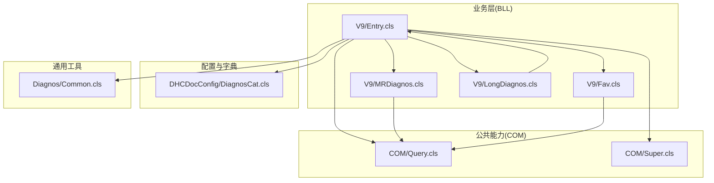
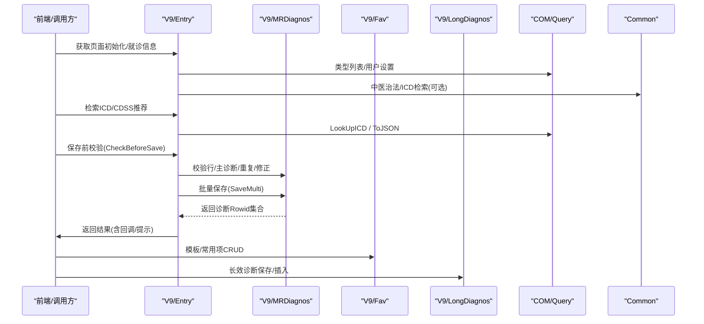
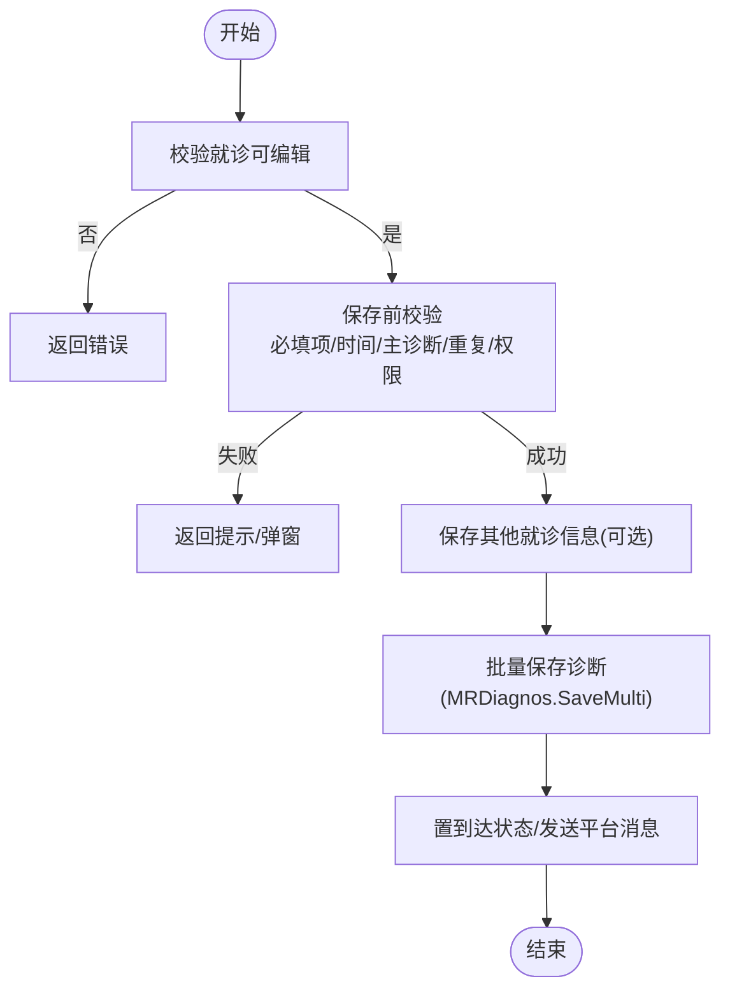
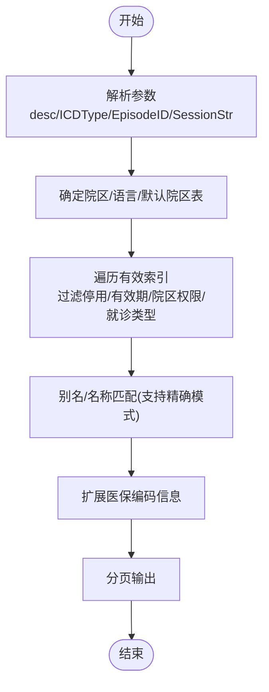
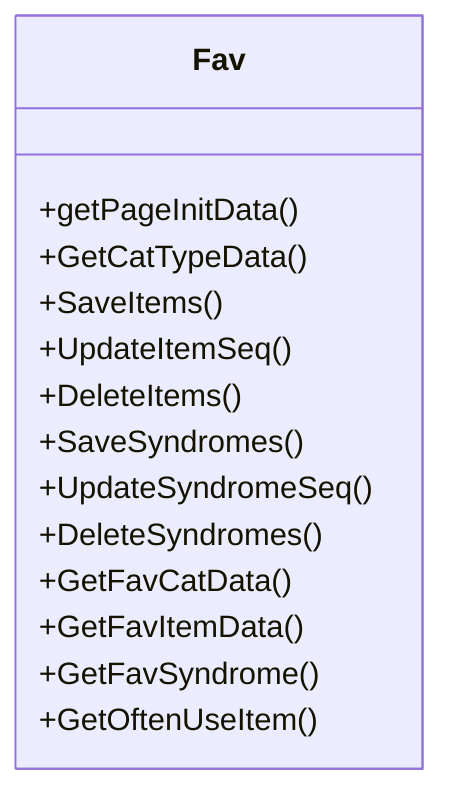
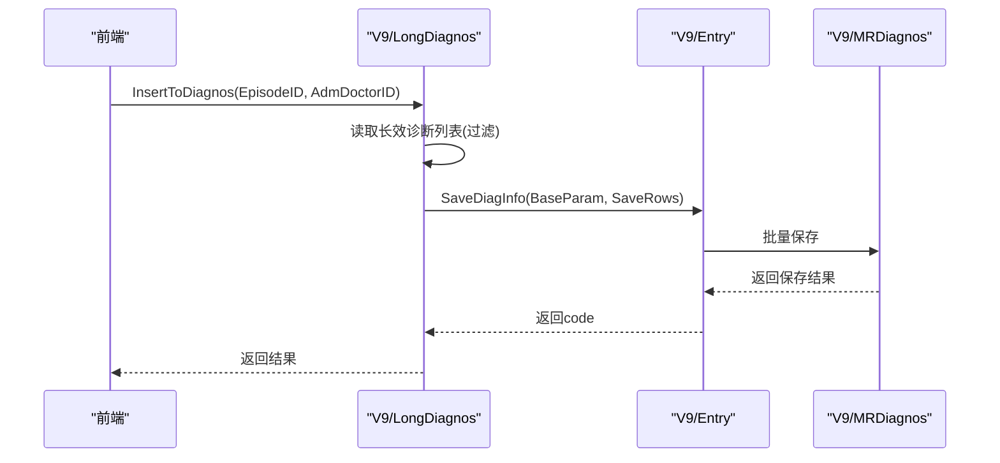
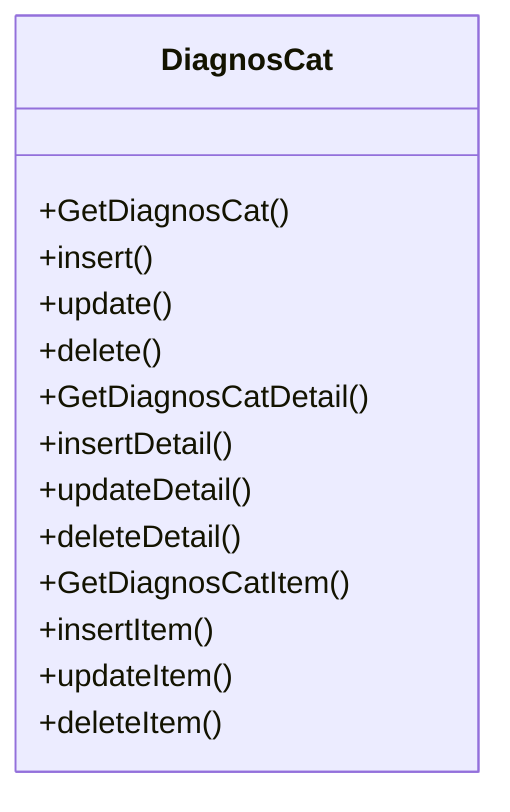
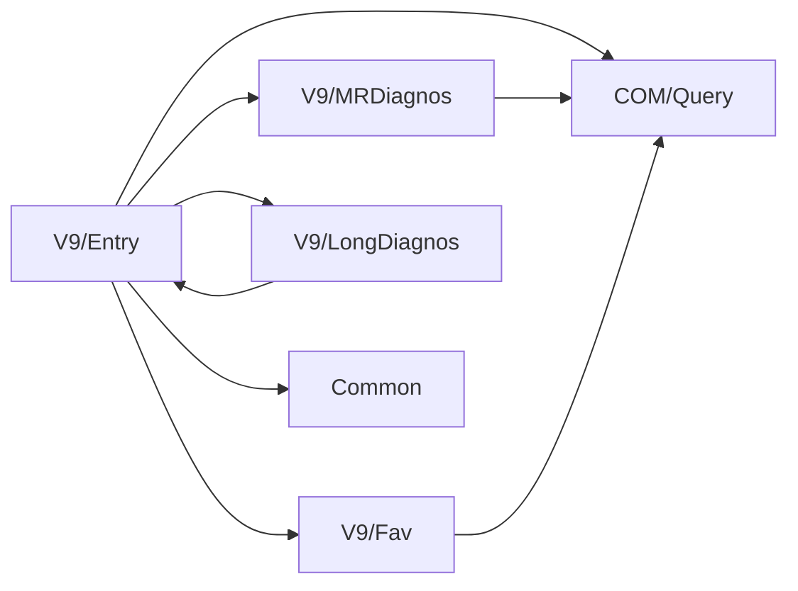

# 诊断管理接口

<cite>
**本文引用的文件**
- [V9/Entry.cls](file://src/backend/doc-ws/DHCDoc/Diagnos/BLL/V9/Entry.cls)
- [V9/MRDiagnos.cls](file://src/backend/doc-ws/DHCDoc/Diagnos/BLL/V9/MRDiagnos.cls)
- [V9/Fav.cls](file://src/backend/doc-ws/DHCDoc/Diagnos/BLL/V9/Fav.cls)
- [V9/LongDiagnos.cls](file://src/backend/doc-ws/DHCDoc/Diagnos/BLL/V9/LongDiagnos.cls)
- [Common.cls](file://src/backend/doc-ws/DHCDoc/Diagnos/Common.cls)
- [Query.cls](file://src/backend/doc-ws/DHCDoc/Diagnos/COM/Query.cls)
- [Super.cls](file://src/backend/doc-ws/DHCDoc/Diagnos/COM/Super.cls)
- [DiagnosCat.cls](file://src/backend/doc-ws/DHCDoc/DHCDocConfig/DiagnosCat.cls)
</cite>

## 目录
1. [简介](#简介)
2. [项目结构](#项目结构)
3. [核心组件](#核心组件)
4. [架构总览](#架构总览)
5. [详细组件分析](#详细组件分析)
6. [依赖关系分析](#依赖关系分析)
7. [性能考虑](#性能考虑)
8. [故障排查指南](#故障排查指南)
9. [结论](#结论)
10. [附录：API调用示例与规范](#附录api调用示例与规范)

## 简介
本文件面向医疗信息系统中的“诊断管理”能力，系统化梳理并文档化以下核心功能：
- 诊断录入、修改、删除
- 诊断查询（含历史诊断、就诊诊断、ICD检索）
- 诊断模板与常用项管理
- ICD编码处理、诊断分类、诊断优先级（主诊断）控制
- 数据校验规则、业务逻辑检查与权限控制
- 与诊断字典库的集成及数据一致性保证
- 诊断历史追踪与审计日志

## 项目结构
诊断管理后端采用分层设计：
- 业务层（BLL）：V9版本实现具体业务流程编排与校验
- 公共能力（COM）：通用查询封装、错误对象、回调机制等
- 配置与字典（DHCDocConfig）：特殊诊断分类、字典映射
- 通用工具（Common）：历史诊断聚合、ICD分类、中医治法查询等

**图示来源**
- [V9/Entry.cls:1-660](file://src/backend/doc-ws/DHCDoc/Diagnos/BLL/V9/Entry.cls#L1-L660)
- [V9/MRDiagnos.cls:1-800](file://src/backend/doc-ws/DHCDoc/Diagnos/BLL/V9/MRDiagnos.cls#L1-L800)
- [V9/Fav.cls:1-457](file://src/backend/doc-ws/DHCDoc/Diagnos/BLL/V9/Fav.cls#L1-L457)
- [V9/LongDiagnos.cls:1-198](file://src/backend/doc-ws/DHCDoc/Diagnos/BLL/V9/LongDiagnos.cls#L1-L198)
- [Common.cls:1-581](file://src/backend/doc-ws/DHCDoc/Diagnos/Common.cls#L1-L581)
- [Query.cls:1-24](file://src/backend/doc-ws/DHCDoc/Diagnos/COM/Query.cls#L1-L24)
- [Super.cls:1-59](file://src/backend/doc-ws/DHCDoc/Diagnos/COM/Super.cls#L1-L59)
- [DiagnosCat.cls:1-304](file://src/backend/doc-ws/DHCDoc/DHCDocConfig/DiagnosCat.cls#L1-L304)

**章节来源**
- [V9/Entry.cls:1-660](file://src/backend/doc-ws/DHCDoc/Diagnos/BLL/V9/Entry.cls#L1-L660)
- [V9/MRDiagnos.cls:1-800](file://src/backend/doc-ws/DHCDoc/Diagnos/BLL/V9/MRDiagnos.cls#L1-L800)
- [Common.cls:1-581](file://src/backend/doc-ws/DHCDoc/Diagnos/Common.cls#L1-L581)
- [DiagnosCat.cls:1-304](file://src/backend/doc-ws/DHCDoc/DHCDocConfig/DiagnosCat.cls#L1-L304)

## 核心组件
- 诊断录入与保存（Entry）：负责页面初始化、ICD检索、CDSS推荐、保存前校验、批量保存、其他就诊信息保存。
- 诊断持久化与校验（MRDiagnos）：负责获取本次/历史诊断、单条/批量保存、删除、主诊断数量限制、修正诊断校验、结构化诊断联动。
- 模板与常用项（Fav）：维护个人/科室模板、常用项排序、复制、高频使用统计展示。
- 长效诊断（LongDiagnos）：维护患者级长效诊断，支持从当前就诊插入为预诊诊断。
- 通用查询与工具（Common/Query/Super）：ICD检索、中医治法查询、历史诊断聚合、统一错误对象与回调方法生成。
- 特殊诊断分类（DiagnosCat）：特殊诊断分类及其明细、医嘱关联、增删改查。

**章节来源**
- [V9/Entry.cls:1-660](file://src/backend/doc-ws/DHCDoc/Diagnos/BLL/V9/Entry.cls#L1-L660)
- [V9/MRDiagnos.cls:1-800](file://src/backend/doc-ws/DHCDoc/Diagnos/BLL/V9/MRDiagnos.cls#L1-L800)
- [V9/Fav.cls:1-457](file://src/backend/doc-ws/DHCDoc/Diagnos/BLL/V9/Fav.cls#L1-L457)
- [V9/LongDiagnos.cls:1-198](file://src/backend/doc-ws/DHCDoc/Diagnos/BLL/V9/LongDiagnos.cls#L1-L198)
- [Common.cls:1-581](file://src/backend/doc-ws/DHCDoc/Diagnos/Common.cls#L1-L581)
- [Query.cls:1-24](file://src/backend/doc-ws/DHCDoc/Diagnos/COM/Query.cls#L1-L24)
- [Super.cls:1-59](file://src/backend/doc-ws/DHCDoc/Diagnos/COM/Super.cls#L1-L59)
- [DiagnosCat.cls:1-304](file://src/backend/doc-ws/DHCDoc/DHCDocConfig/DiagnosCat.cls#L1-L304)

## 架构总览
诊断管理以“业务编排 + 数据校验 + 字典集成 + 模板/常用项”为核心，通过统一的查询封装和错误/回调机制对外暴露稳定接口。

**图示来源**
- [V9/Entry.cls:1-660](file://src/backend/doc-ws/DHCDoc/Diagnos/BLL/V9/Entry.cls#L1-L660)
- [V9/MRDiagnos.cls:1-800](file://src/backend/doc-ws/DHCDoc/Diagnos/BLL/V9/MRDiagnos.cls#L1-L800)
- [V9/Fav.cls:1-457](file://src/backend/doc-ws/DHCDoc/Diagnos/BLL/V9/Fav.cls#L1-L457)
- [V9/LongDiagnos.cls:1-198](file://src/backend/doc-ws/DHCDoc/Diagnos/BLL/V9/LongDiagnos.cls#L1-L198)
- [Query.cls:1-24](file://src/backend/doc-ws/DHCDoc/Diagnos/COM/Query.cls#L1-L24)
- [Common.cls:1-581](file://src/backend/doc-ws/DHCDoc/Diagnos/Common.cls#L1-L581)

## 详细组件分析

### 诊断录入与保存（Entry）
- 关键能力
  - 页面初始化：组装就诊基础信息、用户设置、是否启用结构化诊断、中医相关标志、主诊断限制类型等
  - 诊断检索：ICD检索、中医治法检索、CDSS疑似疾病推荐
  - 保存前校验：就诊有效性、必填项、时间逻辑、主诊断数量限制、重复提示、传染病提示、结构化诊断权限
  - 批量保存：事务性保存诊断、诊断类型、主诊断标识、结构化诊断、常用次数统计、子诊断递归保存
  - 其他就诊信息保存：初复诊状态、血压体重身高等必填项校验
- 典型流程（保存）

**图示来源**
- [V9/Entry.cls:449-523](file://src/backend/doc-ws/DHCDoc/Diagnos/BLL/V9/Entry.cls#L449-L523)
- [V9/MRDiagnos.cls:626-684](file://src/backend/doc-ws/DHCDoc/Diagnos/BLL/V9/MRDiagnos.cls#L626-L684)

**章节来源**
- [V9/Entry.cls:1-660](file://src/backend/doc-ws/DHCDoc/Diagnos/BLL/V9/Entry.cls#L1-L660)

### 诊断查询与历史（MRDiagnos/Common）
- 能力要点
  - 本次就诊诊断：按主诊断、类型、是否仅ICD、是否包含已停止等维度筛选
  - 历史诊断合并：按患者维度聚合相同诊断的最新记录，支持按日期/频次排序
  - 描述拼装：优先结构化诊断显示，其次ICD+备注+前缀+中医治法+子诊断
  - ICD检索：支持精确匹配、院区权限、有效期、就诊类型限制、医保编码扩展
  - 中医治法检索：按临床可用、有效期、别名/名称模糊匹配
- 查询流程图（ICD检索）

**图示来源**
- [Common.cls:376-569](file://src/backend/doc-ws/DHCDoc/Diagnos/Common.cls#L376-L569)

**章节来源**
- [V9/MRDiagnos.cls:1-800](file://src/backend/doc-ws/DHCDoc/Diagnos/BLL/V9/MRDiagnos.cls#L1-L800)
- [Common.cls:1-581](file://src/backend/doc-ws/DHCDoc/Diagnos/Common.cls#L1-L581)

### 诊断模板与常用项（Fav）
- 能力要点
  - 模板分类与条目：支持个人/科室维度，维护顺序、复制、删除
  - 证型关联：条目下可挂接证型，支持顺序调整
  - 常用项展示：基于使用频率统计，自动展示系统常用西医/中医诊断
  - 权限控制：根据登录用户、科室、院区配置控制编辑权限
- 类关系图

**图示来源**
- [V9/Fav.cls:1-457](file://src/backend/doc-ws/DHCDoc/Diagnos/BLL/V9/Fav.cls#L1-L457)

**章节来源**
- [V9/Fav.cls:1-457](file://src/backend/doc-ws/DHCDoc/Diagnos/BLL/V9/Fav.cls#L1-L457)

### 长效诊断（LongDiagnos）
- 能力要点
  - 保存与校验：避免重复、层级子项保存、有效期控制
  - 插入到就诊：按配置将长效诊断转为预诊诊断，支持医生选择策略
  - 列表过滤：按院区、科室、有效期过滤无效项
- 序列图（插入到就诊）

**图示来源**
- [V9/LongDiagnos.cls:121-164](file://src/backend/doc-ws/DHCDoc/Diagnos/BLL/V9/LongDiagnos.cls#L121-L164)
- [V9/Entry.cls:484-523](file://src/backend/doc-ws/DHCDoc/Diagnos/BLL/V9/Entry.cls#L484-L523)

**章节来源**
- [V9/LongDiagnos.cls:1-198](file://src/backend/doc-ws/DHCDoc/Diagnos/BLL/V9/LongDiagnos.cls#L1-L198)

### 诊断分类与特殊诊断（DiagnosCat）
- 能力要点
  - 特殊诊断分类：维护分类名称、适用就诊类型、计费类型、时长、类型（特殊病/慢性病/押金）
  - 明细与医嘱：分类下可绑定诊断与医嘱，支持最大用量/时长配置
  - 增删改查：提供完整CRUD接口，含重复性校验与外键有效性校验
- 类与方法概览

**图示来源**
- [DiagnosCat.cls:1-304](file://src/backend/doc-ws/DHCDoc/DHCDocConfig/DiagnosCat.cls#L1-L304)

**章节来源**
- [DiagnosCat.cls:1-304](file://src/backend/doc-ws/DHCDoc/DHCDocConfig/DiagnosCat.cls#L1-L304)

## 依赖关系分析
- Entry 依赖 MRDiagnos 进行保存与校验；依赖 Query 进行查询封装；依赖 Common 进行ICD/中医治法检索；依赖 Fav/LongDiagnos 完成模板与长效诊断场景。
- MRDiagnos 依赖 DAL 层进行数据存取（在代码中通过类名间接引用），并通过 INTF 层访问外部系统（如PAAdm、SDS、INSU、Ens）。
- Fav 依赖 DAL.Fav 进行模板/常用项存储，结合日志统计展示高频项。
- Common 直接访问字典与全局索引，承担跨模块的数据聚合与翻译。

**图示来源**
- [V9/Entry.cls:1-660](file://src/backend/doc-ws/DHCDoc/Diagnos/BLL/V9/Entry.cls#L1-L660)
- [V9/MRDiagnos.cls:1-800](file://src/backend/doc-ws/DHCDoc/Diagnos/BLL/V9/MRDiagnos.cls#L1-L800)
- [V9/Fav.cls:1-457](file://src/backend/doc-ws/DHCDoc/Diagnos/BLL/V9/Fav.cls#L1-L457)
- [V9/LongDiagnos.cls:1-198](file://src/backend/doc-ws/DHCDoc/Diagnos/BLL/V9/LongDiagnos.cls#L1-L198)
- [Query.cls:1-24](file://src/backend/doc-ws/DHCDoc/Diagnos/COM/Query.cls#L1-L24)
- [Common.cls:1-581](file://src/backend/doc-ws/DHCDoc/Diagnos/Common.cls#L1-L581)

**章节来源**
- [V9/Entry.cls:1-660](file://src/backend/doc-ws/DHCDoc/Diagnos/BLL/V9/Entry.cls#L1-L660)
- [V9/MRDiagnos.cls:1-800](file://src/backend/doc-ws/DHCDoc/Diagnos/BLL/V9/MRDiagnos.cls#L1-L800)
- [V9/Fav.cls:1-457](file://src/backend/doc-ws/DHCDoc/Diagnos/BLL/V9/Fav.cls#L1-L457)
- [V9/LongDiagnos.cls:1-198](file://src/backend/doc-ws/DHCDoc/Diagnos/BLL/V9/LongDiagnos.cls#L1-L198)
- [Query.cls:1-24](file://src/backend/doc-ws/DHCDoc/Diagnos/COM/Query.cls#L1-L24)
- [Common.cls:1-581](file://src/backend/doc-ws/DHCDoc/Diagnos/Common.cls#L1-L581)

## 性能考虑
- ICD检索分页：通过 rows/page 控制输出范围，减少大数据量传输
- 排序优化：支持按用户使用频率排序，提升常用诊断命中率
- 缓存与临时表：查询过程使用临时数组/全局变量暂存中间结果，降低多次IO
- 事务与回滚：保存流程使用事务块，异常时回滚，保障一致性
- 并发控制：模板/常用项顺序更新使用锁，避免竞态条件

[本节为通用指导，不直接分析具体文件]

## 故障排查指南
- 常见错误与定位
  - 诊断不可用：检查院区权限、有效期、就诊类型限制、性别/年龄限制
  - 主诊断数量超限：检查配置的主诊断限制类型与当前主诊断数量
  - 重复诊断：确认是否已在本次或历史中存在相同ICD/备注
  - 结构化诊断无权限：检查结构化诊断录入标志与用户权限
  - 删除受限：有关联申请未停、已打印证明书、被修正、非本人开具等
- 审计与历史
  - 诊断变更日志：通过历史诊断接口可获取字段级变更详情（含结构化诊断日志）
  - 历史诊断聚合：支持按日期/频次/院区维度查看合并后的历史诊断

**章节来源**
- [Common.cls:186-307](file://src/backend/doc-ws/DHCDoc/Diagnos/Common.cls#L186-L307)
- [V9/MRDiagnos.cls:726-800](file://src/backend/doc-ws/DHCDoc/Diagnos/BLL/V9/MRDiagnos.cls#L726-L800)

## 结论
诊断管理接口围绕“录入—校验—保存—查询—模板—长效”形成闭环，具备完善的ICD处理、分类与优先级控制、严格的校验与权限机制，以及与字典库的深度集成。通过统一的查询封装与错误/回调机制，提供了稳定可扩展的API能力，满足多场景下的诊断业务需求。

[本节为总结性内容，不直接分析具体文件]

## 附录：API调用示例与规范
以下为典型API调用方式与参数说明（以方法名为准，实际调用请遵循前后端约定）：

- 诊断录入初始化
  - 方法：GetEntryPageInitObj(RequestObj, SessionStr)
  - 作用：返回页面初始化所需对象（就诊信息、用户设置、标志位等）
  - 参考路径：[V9/Entry.cls:4-70](file://src/backend/doc-ws/DHCDoc/Diagnos/BLL/V9/Entry.cls#L4-L70)

- 获取就诊信息（含警告与必填项）
  - 方法：GetAdmInfo(EpisodeID, SessionStr)
  - 作用：返回就诊基础信息、警告、诊断类型、专科表单等
  - 参考路径：[V9/Entry.cls:72-106](file://src/backend/doc-ws/DHCDoc/Diagnos/BLL/V9/Entry.cls#L72-L106)

- 诊断检索（ICD）
  - 方法：LookUpICD(desc, ICDType, EpisodeID, SessionStr, rows, page)
  - 作用：按名称/别名检索ICD，支持分页与院区权限
  - 参考路径：[V9/Entry.cls:169-174](file://src/backend/doc-ws/DHCDoc/Diagnos/BLL/V9/Entry.cls#L169-L174)
  - 底层实现：[Common.cls:376-569](file://src/backend/doc-ws/DHCDoc/Diagnos/Common.cls#L376-L569)

- CDSS推荐
  - 方法：GetCDSSDiagEntryInfo(EpisodeID, SessionStr)
  - 作用：获取疑似疾病并匹配HIS字典，返回待录入的诊断卡片
  - 参考路径：[V9/Entry.cls:182-247](file://src/backend/doc-ws/DHCDoc/Diagnos/BLL/V9/Entry.cls#L182-L247)

- 保存前校验
  - 方法：CheckBeforeSave(BaseParam, DiagRows, SessionStr)
  - 作用：校验就诊有效性、必填项、时间逻辑、主诊断限制、重复提示等
  - 参考路径：[V9/Entry.cls:449-482](file://src/backend/doc-ws/DHCDoc/Diagnos/BLL/V9/Entry.cls#L449-L482)

- 批量保存诊断
  - 方法：SaveDiagInfo(BaseParam, DiagRows, SessionStr)
  - 作用：事务性保存诊断、类型、主诊断标识、结构化诊断，并触发后续流程
  - 参考路径：[V9/Entry.cls:484-523](file://src/backend/doc-ws/DHCDoc/Diagnos/BLL/V9/Entry.cls#L484-L523)
  - 内部调用：[V9/MRDiagnos.cls:626-684](file://src/backend/doc-ws/DHCDoc/Diagnos/BLL/V9/MRDiagnos.cls#L626-L684)

- 获取本次/历史诊断
  - 方法：GetAdmDiagnos(EpisodeID, ActiveFlag, DiagCatID, DiagTypeCode, MainFlag, OnlyICD, SessionStr, IncludeStop)
  - 方法：GetPatHistoryDiag(PatientID, EpisodeID, LocRange, ActiveFlag, OrderBy, SessionStr)
  - 参考路径：[V9/MRDiagnos.cls:4-27](file://src/backend/doc-ws/DHCDoc/Diagnos/BLL/V9/MRDiagnos.cls#L4-L27), [V9/MRDiagnos.cls:29-158](file://src/backend/doc-ws/DHCDoc/Diagnos/BLL/V9/MRDiagnos.cls#L29-L158)

- 删除诊断
  - 方法：DeleteMulti(BaseParam, DiagRowidArr, SessionStr)
  - 作用：批量删除，含前置校验（关联申请、证明书、修正关系等）
  - 参考路径：[V9/MRDiagnos.cls:686-724](file://src/backend/doc-ws/DHCDoc/Diagnos/BLL/V9/MRDiagnos.cls#L686-L724)

- 模板与常用项
  - 方法：GetFavCatData(Type, SessionStr, CONTEXT, EpisodeID, OnlyCatNode)
  - 方法：SaveItems(CatID, SaveRows, SessionStr)
  - 方法：UpdateItemSeq(CatID, IDStr)
  - 参考路径：[V9/Fav.cls:215-256](file://src/backend/doc-ws/DHCDoc/Diagnos/BLL/V9/Fav.cls#L215-L256), [V9/Fav.cls:109-145](file://src/backend/doc-ws/DHCDoc/Diagnos/BLL/V9/Fav.cls#L109-L145)

- 长效诊断
  - 方法：InsertToDiagnos(EpisodeID, AdmDoctorID, SessionStr)
  - 作用：将有效长效诊断插入为预诊诊断
  - 参考路径：[V9/LongDiagnos.cls:121-164](file://src/backend/doc-ws/DHCDoc/Diagnos/BLL/V9/LongDiagnos.cls#L121-L164)

- 特殊诊断分类管理
  - 方法：GetDiagnosCat(HospId)
  - 方法：insert(str, HospId) / update(Rowid, str) / delete(Rowid)
  - 参考路径：[DiagnosCat.cls:7-77](file://src/backend/doc-ws/DHCDoc/DHCDocConfig/DiagnosCat.cls#L7-L77), [DiagnosCat.cls:79-125](file://src/backend/doc-ws/DHCDoc/DHCDocConfig/DiagnosCat.cls#L79-L125)

- 历史诊断与审计
  - 方法：GetHistoryDiag(PatientID, LocID, LocRange, HospID)
  - 方法：GetEditLog(DiagRowids, ReturnType)
  - 参考路径：[Common.cls:4-145](file://src/backend/doc-ws/DHCDoc/Diagnos/Common.cls#L4-L145), [Common.cls:186-307](file://src/backend/doc-ws/DHCDoc/Diagnos/Common.cls#L186-L307)

- 统一错误与回调
  - 方法：SetErrRetObj(msg, code)
  - 方法：PushCallBackFun / PushErrCallBackFun / DeleteCallBackFun
  - 参考路径：[Super.cls:7-56](file://src/backend/doc-ws/DHCDoc/Diagnos/COM/Super.cls#L7-L56)

- 查询封装
  - 方法：ToJSON(ClassName, QueryName, Args...)
  - 参考路径：[Query.cls:11-21](file://src/backend/doc-ws/DHCDoc/Diagnos/COM/Query.cls#L11-L21)

以上API均返回统一结构（code/msg/callBackFuns/data/rows），便于前端统一处理成功、失败与交互提示。

**章节来源**
- [V9/Entry.cls:1-660](file://src/backend/doc-ws/DHCDoc/Diagnos/BLL/V9/Entry.cls#L1-L660)
- [V9/MRDiagnos.cls:1-800](file://src/backend/doc-ws/DHCDoc/Diagnos/BLL/V9/MRDiagnos.cls#L1-L800)
- [V9/Fav.cls:1-457](file://src/backend/doc-ws/DHCDoc/Diagnos/BLL/V9/Fav.cls#L1-L457)
- [V9/LongDiagnos.cls:1-198](file://src/backend/doc-ws/DHCDoc/Diagnos/BLL/V9/LongDiagnos.cls#L1-L198)
- [Common.cls:1-581](file://src/backend/doc-ws/DHCDoc/Diagnos/Common.cls#L1-L581)
- [Query.cls:1-24](file://src/backend/doc-ws/DHCDoc/Diagnos/COM/Query.cls#L1-L24)
- [Super.cls:1-59](file://src/backend/doc-ws/DHCDoc/Diagnos/COM/Super.cls#L1-L59)
- [DiagnosCat.cls:1-304](file://src/backend/doc-ws/DHCDoc/DHCDocConfig/DiagnosCat.cls#L1-L304)