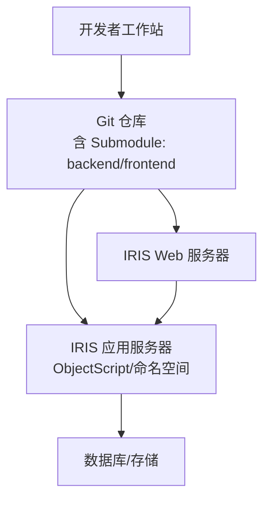
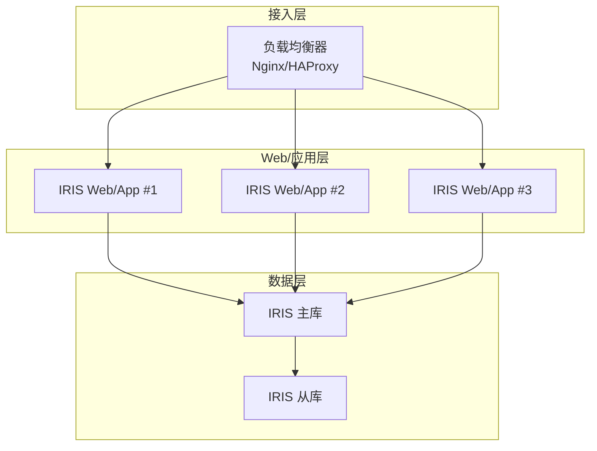
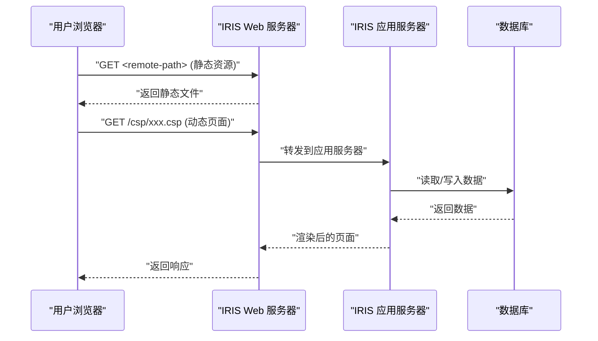
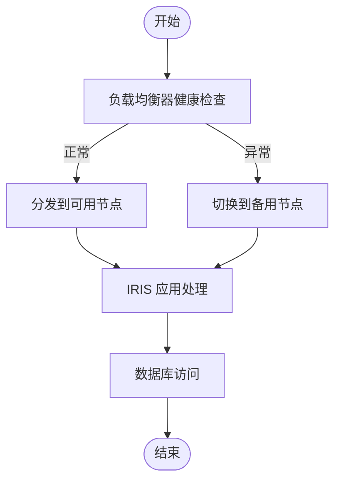
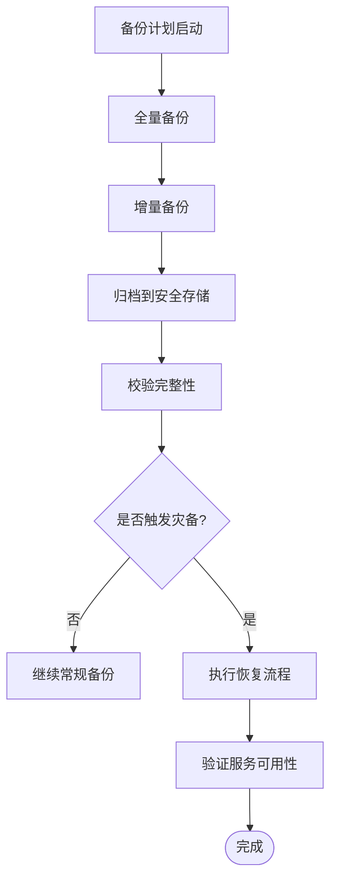
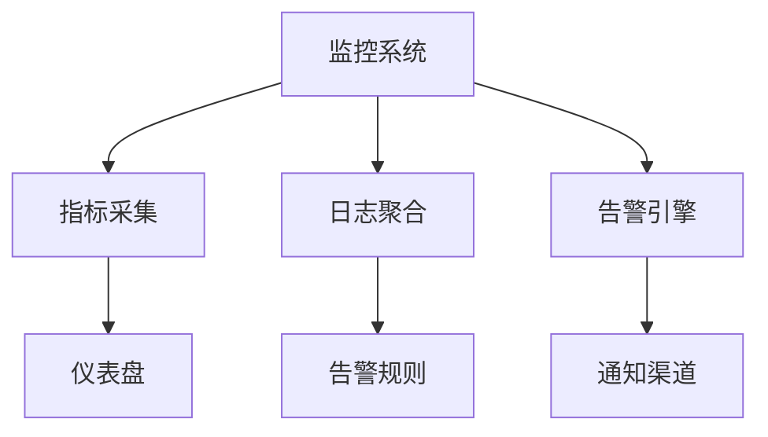
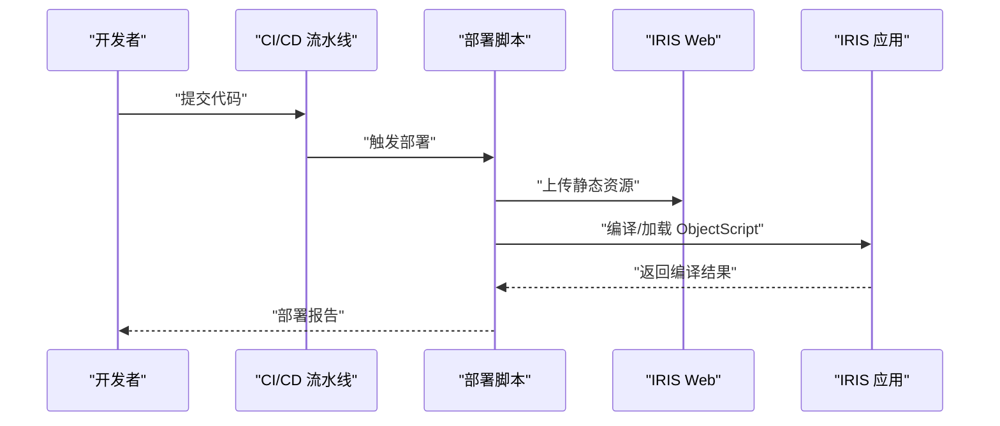
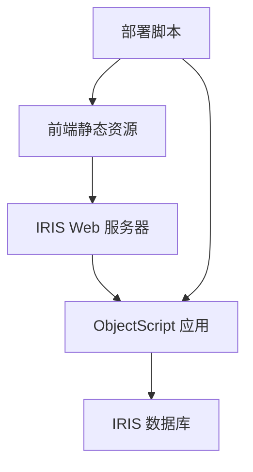

# 部署拓扑设计

<cite>
**本文引用的文件**
- [README.md](file://README.md)
- [sftp-sync.js](file://scripts/sftp-sync.js)
- [package.json](file://scripts/package.json)
</cite>

## 目录
1. [简介](#简介)
2. [项目结构](#项目结构)
3. [核心组件](#核心组件)
4. [架构总览](#架构总览)
5. [详细组件分析](#详细组件分析)
6. [依赖关系分析](#依赖关系分析)
7. [性能与高可用考虑](#性能与高可用考虑)
8. [备份与灾难恢复](#备份与灾难恢复)
9. [监控与告警体系](#监控与告警体系)
10. [运维自动化流程](#运维自动化流程)
11. [部署脚本使用方法](#部署脚本使用方法)
12. [故障排查指南](#故障排查指南)
13. [结论](#结论)

## 简介
本部署拓扑设计面向生产环境，围绕 InterSystems IRIS 应用服务器、前端静态资源与服务端动态内容（CSP）的分发机制，给出前后端分离的部署策略、负载均衡与高可用设计思路、备份与灾备方案、监控告警与运维自动化流程，并配套网络拓扑图、服务器架构图和数据流向图。文档同时记录部署脚本的使用方法与常见问题的排查步骤，帮助运维与开发团队在生产环境中稳定交付与快速排障。

## 项目结构
- 后端：InterSystems IRIS ObjectScript 代码，按业务域划分多个子系统（如医生工作站、治疗系统、牙科系统等），通过 IRIS 扩展直接编译上传至 IRIS 命名空间。
- 前端：传统 CSP + jQuery/HISUI 静态资源，按产品目录组织，统一发布到 IRIS Web 服务路径下。
- 脚本：提供 Git 多仓库管理与前端 SFTP 同步脚本，用于本地到服务器的文件同步与编译提示。

图表来源
- [README.md:1-549](file://README.md#L1-L549)

章节来源
- [README.md:1-549](file://README.md#L1-L549)

## 核心组件
- IRIS 应用服务器：承载 ObjectScript 业务逻辑与 CSP 动态页面渲染，连接数据库与外部系统。
- IRIS Web 服务器：对外暴露 HTTP/HTTPS 入口，托管前端静态资源与 CSP 页面。
- 前端静态资源：jQuery/HISUI 等静态文件，按产品目录映射到服务器统一 Web 根路径。
- 后端 ObjectScript：按子系统模块化组织，通过 IRIS 扩展编译部署到指定命名空间。
- 部署脚本：SFTP 同步脚本负责前端文件上传与编译提示；Git 脚本辅助多仓库管理。

章节来源
- [README.md:1-549](file://README.md#L1-L549)

## 架构总览
生产环境建议采用“Web 层 + 应用层 + 数据层”分层架构：
- Web 层：反向代理/负载均衡器（如 Nginx/HAProxy）将请求分发到多台 IRIS Web 节点，实现水平扩展与高可用。
- 应用层：IRIS 应用服务器集群，运行 ObjectScript 业务逻辑与 CSP 页面，共享或分片访问数据层。
- 数据层：IRIS 数据库主从复制或多实例高可用集群，确保数据一致性与容灾能力。

图表来源
- [README.md:1-549](file://README.md#L1-L549)

## 详细组件分析

### 前端静态资源与服务端动态内容分发
- 前端静态资源：位于 IRIS Web 服务器路径 <remote-path> doc-ws、cure-ws 等）。通过 sftp-sync.js 将本地 src/frontend/* 下的文件上传到对应远程路径，保持相对路径一致。
- 服务端动态内容：CSP 页面由 IRIS 应用服务器处理，上传 .csp 后需调用 iris_doc_compile 进行编译以生效；其他静态资源（.js/.css）无需编译。
- 分发机制：浏览器请求静态资源由 Web 服务器直接返回；请求动态页面或 API 由 IRIS 应用服务器处理，必要时访问数据库。

图表来源
- [README.md:1-549](file://README.md#L1-L549)
- [sftp-sync.js:1-291](file://scripts/sftp-sync.js#L1-L291)

章节来源
- [README.md:1-549](file://README.md#L1-L549)
- [sftp-sync.js:1-291](file://scripts/sftp-sync.js#L1-L291)

### 负载均衡与高可用性设计
- 负载均衡：在 IRIS Web 前部署负载均衡器，基于健康检查将流量轮询或加权分发到多个 IRIS Web/App 节点，避免单点故障。
- 会话与状态：若使用有状态会话，需在负载均衡器配置会话保持（sticky session）或将会话外置（如 Redis）。
- 应用层冗余：至少部署两个 IRIS 节点，配合自动故障转移与健康检查，保证服务连续性。
- 数据层高可用：IRIS 主从复制或集群模式，确保读写分离与故障切换；定期演练切换流程。

图表来源
- [README.md:1-549](file://README.md#L1-L549)

### 备份恢复策略与灾难恢复方案
- 备份策略：对 IRIS 数据库执行定期全量与增量备份；对 Web 静态资源与配置文件进行版本化备份（结合 Git 与对象存储）。
- 恢复流程：制定标准恢复 SOP，包括数据库还原、应用回滚、静态资源回滚与验证测试。
- 灾难恢复：跨机房或云区域部署副本，启用数据复制与自动故障切换；定期进行灾备演练，评估 RTO/RPO。

图表来源
- [README.md:1-549](file://README.md#L1-L549)

### 监控告警体系
- 指标采集：收集 IRIS 应用性能指标（CPU、内存、I/O、事务耗时）、Web 请求成功率与延迟、数据库连接池与慢查询。
- 日志聚合：集中收集 Web 与应用日志，建立检索与分析平台，支持错误追踪与根因定位。
- 告警规则：设定阈值告警（如错误率突增、响应时间超标、磁盘使用率过高），并通过多渠道通知（邮件、短信、IM）。
- 可视化：构建仪表盘展示关键指标趋势，便于日常巡检与问题复盘。

图表来源
- [README.md:1-549](file://README.md#L1-L549)

### 运维自动化流程
- 持续集成：代码提交后触发构建与单元测试，生成制品并推送至制品库。
- 自动化部署：通过脚本将前端静态资源上传至 IRIS Web 路径，并提示编译 CSP；后端 ObjectScript 通过 IRIS 扩展批量加载与编译。
- 灰度发布：先在小范围节点发布新版本，观察指标后再全量推广。
- 回滚机制：一键回滚到上一稳定版本，包含数据库与静态资源。

图表来源
- [README.md:1-549](file://README.md#L1-L549)
- [sftp-sync.js:1-291](file://scripts/sftp-sync.js#L1-L291)

## 依赖关系分析
- 前端与后端解耦：前端静态资源通过 Web 服务器独立发布；后端 ObjectScript 通过 IRIS 应用服务器提供服务接口。
- 部署脚本依赖：sftp-sync.js 依赖 psftp（PuTTY）与 Node.js 环境；Git 脚本依赖 Node.js 与 Git。
- 运行时依赖：IRIS 应用服务器依赖数据库与外部系统接口；Web 服务器依赖负载均衡器与域名解析。

图表来源
- [README.md:1-549](file://README.md#L1-L549)
- [sftp-sync.js:1-291](file://scripts/sftp-sync.js#L1-L291)
- [package.json:1-10](file://scripts/package.json#L1-L10)

章节来源
- [README.md:1-549](file://README.md#L1-L549)
- [sftp-sync.js:1-291](file://scripts/sftp-sync.js#L1-L291)
- [package.json:1-10](file://scripts/package.json#L1-L10)

## 性能与高可用考虑
- 水平扩展：增加 IRIS Web/App 节点数量，配合负载均衡提升吞吐与容错能力。
- 缓存策略：对热点静态资源启用 CDN 或边缘缓存；对频繁读的数据引入缓存层（如 Redis）。
- 连接池优化：合理配置数据库连接池大小，避免连接耗尽与上下文切换开销。
- 容量规划：根据业务峰值预估 CPU、内存、I/O 与带宽需求，预留冗余容量。

[本节为通用指导，不直接分析具体文件]

## 备份与灾难恢复
- 备份频率：数据库每日全量+每小时增量；静态资源每次发布前快照。
- 保留策略：保留最近若干周期备份，满足合规与审计要求。
- 恢复演练：每季度进行一次完整恢复演练，验证 RTO/RPO 达标。
- 异地容灾：跨地域复制关键数据与配置，确保极端场景可恢复。

[本节为通用指导，不直接分析具体文件]

## 监控与告警体系
- 监控覆盖：基础设施（主机、网络、存储）、应用（IRIS 指标、请求链路）、数据库（慢查询、锁等待）。
- 告警分级：P0/P1/P2 分级，明确升级路径与响应时限。
- 事件管理：建立事件工单与复盘机制，沉淀知识库。
- 可视化看板：关键指标实时展示，支持钻取与关联分析。

[本节为通用指导，不直接分析具体文件]

## 运维自动化流程
- 代码到上线：Git 提交 → 构建 → 测试 → 制品打包 → 自动化部署 → 验证。
- 变更管控：所有变更纳入版本控制与变更记录，禁止手工线上修改。
- 发布窗口：固定发布窗口与回滚预案，降低变更风险。
- 自动化脚本：使用 sftp-sync.js 与 IRIS 扩展命令实现前端上传与后端编译。

章节来源
- [README.md:1-549](file://README.md#L1-L549)
- [sftp-sync.js:1-291](file://scripts/sftp-sync.js#L1-L291)

## 部署脚本使用方法
- 前端文件同步：
  - 上传：node scripts/sftp-sync.js upload <文件或目录...>
  - 删除：node scripts/sftp-sync.js delete <文件...>
  - 预览映射：node scripts/sftp-sync.js check <文件或目录...>
- CSP 编译：上传 .csp 后需调用 iris_doc_compile 进行编译以生效。
- 依赖与环境：
  - Node.js 环境
  - PuTTY 的 psftp 工具（首次连接需缓存主机密钥）
  - .vscode/sftp.json 配置各产品的 SFTP 通道信息

章节来源
- [sftp-sync.js:1-291](file://scripts/sftp-sync.js#L1-L291)
- [README.md:1-549](file://README.md#L1-L549)

## 故障排查指南
- 无法连接服务器：
  - 检查 .vscode/sftp.json 中 host/port/username/password 是否正确
  - 确认防火墙与安全组放行端口
  - 首次连接需缓存主机密钥（psftp 交互应答 y）
- 上传失败：
  - 查看 psftp 输出日志，确认权限与路径
  - 确认目标目录存在且可写
- CSP 未生效：
  - 确认已调用 iris_doc_compile 编译对应 .csp
  - 检查 IRIS 命名空间与路径映射
- 编译错误：
  - 检查 ObjectScript 语法与依赖
  - 查看 IRIS 编译日志定位错误行

章节来源
- [sftp-sync.js:1-291](file://scripts/sftp-sync.js#L1-L291)
- [README.md:1-549](file://README.md#L1-L549)

## 结论
本部署拓扑以 IRIS 应用服务器为核心，结合 Web 层与数据层的分层架构，实现了前后端分离的稳定交付与高效运维。通过负载均衡与高可用设计、完善的备份与灾备方案、全面的监控告警与自动化流程，保障生产环境的可靠性与可扩展性。建议在实施过程中严格遵循变更管控与演练机制，持续提升系统的韧性与可维护性。