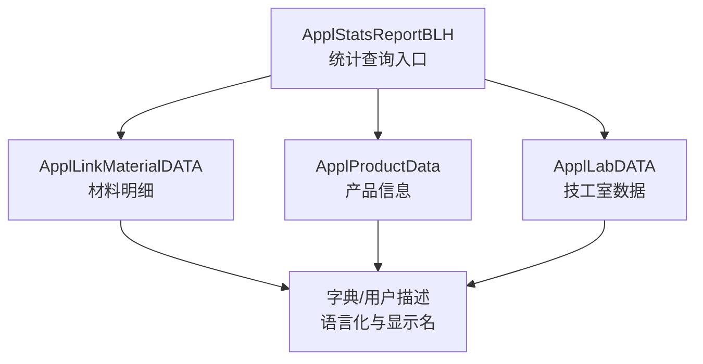
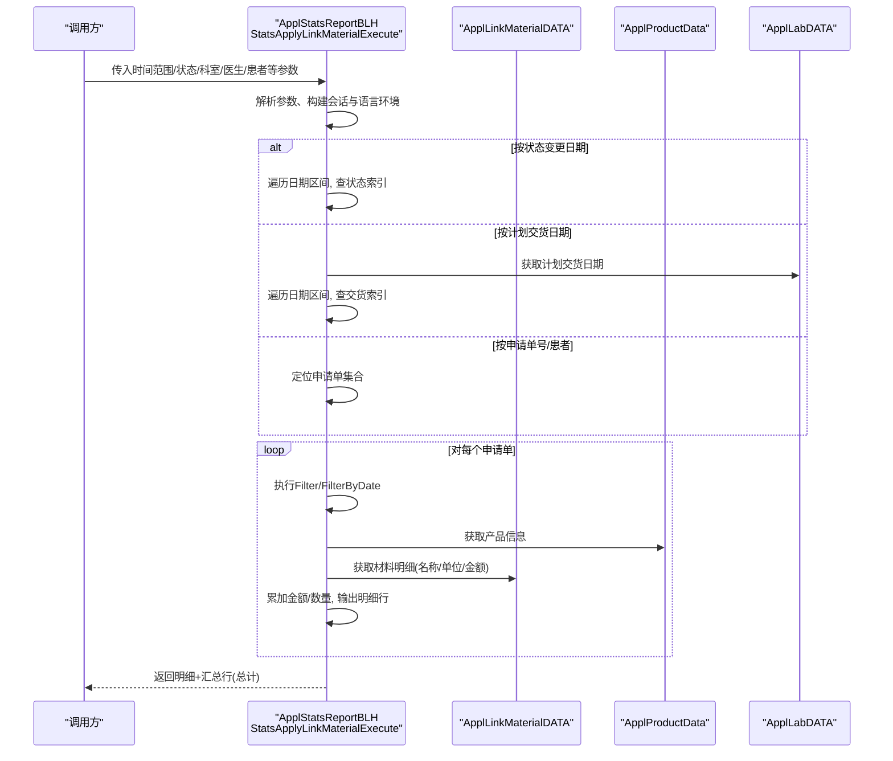
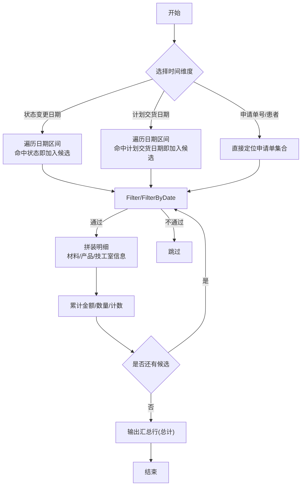
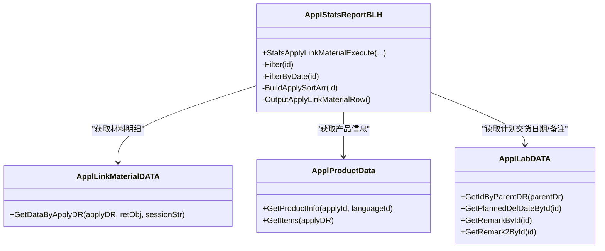

# 统计分析

<cite>
**本文引用的文件**
- [ApplStatsReportBLH.cls](file://src/backend/dental-ws/DHCDoc/Dental/TA/ApplStatsReportBLH.cls)
- [ApplLinkMaterialDATA.cls](file://src/backend/dental-ws/DHCDoc/Dental/TA/ApplLinkMaterialDATA.cls)
- [ApplProductData.cls](file://src/backend/dental-ws/DHCDoc/Dental/TA/ApplProductData.cls)
- [ApplLabDATA.cls](file://src/backend/dental-ws/DHCDoc/Dental/TA/ApplLabDATA.cls)
</cite>

## 目录
1. [简介](#简介)
2. [项目结构](#项目结构)
3. [核心组件](#核心组件)
4. [架构总览](#架构总览)
5. [详细组件分析](#详细组件分析)
6. [依赖关系分析](#依赖关系分析)
7. [性能与大数据优化](#性能与大数据优化)
8. [故障排查指南](#故障排查指南)
9. [结论](#结论)
10. [附录](#附录)

## 简介
本模块面向牙科技工申请单（含材料、产品、技工室信息）的统计与分析，提供申请量统计、材料使用分析、技工工作量统计等核心指标。支持按时间范围、状态变更、科室、医生、患者等多维度筛选，输出明细行并汇总金额与数量；同时提供计划交货日期、备注、技师评分等辅助字段，便于可视化展示与报表导出。

## 项目结构
牙科统计分析相关逻辑集中在后端 dental-ws 的 DHCDoc.Dental.TA 包中：
- 统计查询入口与聚合：ApplStatsReportBLH.cls
- 材料明细获取：ApplLinkMaterialDATA.cls
- 产品信息组装：ApplProductData.cls
- 技工室子表数据读取：ApplLabDATA.cls

图表来源
- [ApplStatsReportBLH.cls:1-243](file://src/backend/dental-ws/DHCDoc/Dental/TA/ApplStatsReportBLH.cls#L1-L243)
- [ApplLinkMaterialDATA.cls:1-54](file://src/backend/dental-ws/DHCDoc/Dental/TA/ApplLinkMaterialDATA.cls#L1-L54)
- [ApplProductData.cls:1-97](file://src/backend/dental-ws/DHCDoc/Dental/TA/ApplProductData.cls#L1-L97)
- [ApplLabDATA.cls:1-66](file://src/backend/dental-ws/DHCDoc/Dental/TA/ApplLabDATA.cls#L1-L66)

章节来源
- [ApplStatsReportBLH.cls:1-243](file://src/backend/dental-ws/DHCDoc/Dental/TA/ApplStatsReportBLH.cls#L1-L243)

## 核心组件
- 统计查询类：提供按多种条件扫描申请单、过滤、排序与逐条输出明细的能力，并在末尾输出汇总行（总计）。
- 材料数据类：根据申请单ID拉取关联材料，补充名称、单位、分类、创建人等信息。
- 产品信息类：将产品层级与牙齿位置、隔板类型等组合为可读的产品信息字符串。
- 技工室数据类：读取计划交货日期、备注等技工室扩展字段，用于时间过滤与展示。

章节来源
- [ApplStatsReportBLH.cls:1-243](file://src/backend/dental-ws/DHCDoc/Dental/TA/ApplStatsReportBLH.cls#L1-L243)
- [ApplLinkMaterialDATA.cls:1-54](file://src/backend/dental-ws/DHCDoc/Dental/TA/ApplLinkMaterialDATA.cls#L1-L54)
- [ApplProductData.cls:1-97](file://src/backend/dental-ws/DHCDoc/Dental/TA/ApplProductData.cls#L1-L97)
- [ApplLabDATA.cls:1-66](file://src/backend/dental-ws/DHCDoc/Dental/TA/ApplLabDATA.cls#L1-L66)

## 架构总览
统计流程以“查询入口”为中心，围绕“索引扫描 + 条件过滤 + 明细拼装 + 汇总输出”展开。支持三种主要时间维度：
- 按“状态变更日期”遍历指定日期区间，命中目标状态即纳入统计
- 按“计划交货日期”遍历指定日期区间，命中即纳入统计
- 按“申请单号或患者”直接定位后进入过滤与明细拼装

图表来源
- [ApplStatsReportBLH.cls:13-128](file://src/backend/dental-ws/DHCDoc/Dental/TA/ApplStatsReportBLH.cls#L13-L128)
- [ApplLinkMaterialDATA.cls:6-51](file://src/backend/dental-ws/DHCDoc/Dental/TA/ApplLinkMaterialDATA.cls#L6-L51)
- [ApplProductData.cls:30-56](file://src/backend/dental-ws/DHCDoc/Dental/TA/ApplProductData.cls#L30-L56)
- [ApplLabDATA.cls:32-47](file://src/backend/dental-ws/DHCDoc/Dental/TA/ApplLabDATA.cls#L32-L47)

## 详细组件分析

### 统计查询入口（ApplStatsReportBLH）
- 功能要点
  - 支持多路输入：按状态变更日期、按计划交货日期、按申请单号或患者
  - 多维度过滤：科室、处理单元、医生、患者姓名、状态串匹配
  - 明细拼装：申请单基础信息、产品、材料、技工室备注、计划交货日期、打印次数、技师评分等
  - 汇总输出：在结果集末尾追加一行“总计”，包含申请数、总金额、总数量
- 关键计算
  - 金额合计：遍历材料明细累加 amount
  - 数量合计：遍历材料明细累加 qty
  - 申请计数：每通过一次 Filter 且存在材料时计数
- 时间范围
  - 状态变更日期：sttDate~endDate 内任一状态变更即纳入
  - 计划交货日期：plannedDelDate 落在 sttDate~endDate 范围内才纳入
- 筛选条件
  - 必须存在材料（否则跳过）
  - 状态串匹配（可精确或模糊匹配）
  - 科室/处理单元/医生/患者姓名过滤

图表来源
- [ApplStatsReportBLH.cls:22-79](file://src/backend/dental-ws/DHCDoc/Dental/TA/ApplStatsReportBLH.cls#L22-L79)
- [ApplStatsReportBLH.cls:130-174](file://src/backend/dental-ws/DHCDoc/Dental/TA/ApplStatsReportBLH.cls#L130-L174)
- [ApplStatsReportBLH.cls:176-239](file://src/backend/dental-ws/DHCDoc/Dental/TA/ApplStatsReportBLH.cls#L176-L239)

章节来源
- [ApplStatsReportBLH.cls:13-128](file://src/backend/dental-ws/DHCDoc/Dental/TA/ApplStatsReportBLH.cls#L13-L128)
- [ApplStatsReportBLH.cls:130-174](file://src/backend/dental-ws/DHCDoc/Dental/TA/ApplStatsReportBLH.cls#L130-L174)
- [ApplStatsReportBLH.cls:176-239](file://src/backend/dental-ws/DHCDoc/Dental/TA/ApplStatsReportBLH.cls#L176-L239)

### 材料明细获取（ApplLinkMaterialDATA）
- 功能要点
  - 根据申请单ID查询关联材料
  - 补充材料名称、单位、分类、创建人描述等
- 复杂度
  - 线性于该申请单的材料条目数
- 错误处理
  - 无数据时返回空结果集

章节来源
- [ApplLinkMaterialDATA.cls:6-51](file://src/backend/dental-ws/DHCDoc/Dental/TA/ApplLinkMaterialDATA.cls#L6-L51)

### 产品信息组装（ApplProductData）
- 功能要点
  - 将产品层级（二级/三级/四级）与具体产品名称拼接为可读信息
  - 支持获取产品项列表与层级关系
- 复杂度
  - 线性于产品项数量

章节来源
- [ApplProductData.cls:30-56](file://src/backend/dental-ws/DHCDoc/Dental/TA/ApplProductData.cls#L30-L56)
- [ApplProductData.cls:58-88](file://src/backend/dental-ws/DHCDoc/Dental/TA/ApplProductData.cls#L58-L88)

### 技工室数据读取（ApplLabDATA）
- 功能要点
  - 根据申请单ID查找技工室子表记录
  - 读取计划交货日期、备注等字段
- 复杂度
  - 常数级（按主键或唯一索引打开）

章节来源
- [ApplLabDATA.cls:4-15](file://src/backend/dental-ws/DHCDoc/Dental/TA/ApplLabDATA.cls#L4-L15)
- [ApplLabDATA.cls:32-47](file://src/backend/dental-ws/DHCDoc/Dental/TA/ApplLabDATA.cls#L32-L47)

## 依赖关系分析
- 耦合关系
  - 统计入口强依赖材料、产品、技工室三个数据类，形成“一主三从”的结构
  - 语言化与显示名通过通用字典/用户服务完成，降低硬编码
- 外部依赖
  - 应用索引：^DOC.Dental.TA.ApplicationI、^DOC.Dental.TA.ApplLabI、^DOC.Dental.TA.ApplStatusI
  - 字典与用户服务：DictionaryData、User 描述、位置描述翻译

图表来源
- [ApplStatsReportBLH.cls:13-239](file://src/backend/dental-ws/DHCDoc/Dental/TA/ApplStatsReportBLH.cls#L13-L239)
- [ApplLinkMaterialDATA.cls:6-51](file://src/backend/dental-ws/DHCDoc/Dental/TA/ApplLinkMaterialDATA.cls#L6-L51)
- [ApplProductData.cls:30-88](file://src/backend/dental-ws/DHCDoc/Dental/TA/ApplProductData.cls#L30-L88)
- [ApplLabDATA.cls:4-63](file://src/backend/dental-ws/DHCDoc/Dental/TA/ApplLabDATA.cls#L4-L63)

章节来源
- [ApplStatsReportBLH.cls:13-239](file://src/backend/dental-ws/DHCDoc/Dental/TA/ApplStatsReportBLH.cls#L13-L239)

## 性能与大数据优化
- 索引利用
  - 状态变更：基于 ^DOC.Dental.TA.ApplStatusI 的 idxDataStatus 索引按日期+状态快速定位
  - 计划交货：基于 ^DOC.Dental.TA.ApplLabI 的 idxPDDPar 索引按日期快速定位
  - 申请单号/患者：基于 ^DOC.Dental.TA.ApplicationI 的 idxApplyNo/idxPatient 索引定位
- 过滤前置
  - 先进行轻量过滤（是否存在材料、状态串匹配、科室/处理单元/医生/患者姓名），减少后续材料/产品/技工室数据加载
- 增量汇总
  - 在循环中实时累加金额与数量，避免二次遍历
- 建议优化
  - 大时间范围查询时，优先使用“状态变更日期”或“计划交货日期”路径，避免全表扫描
  - 对高频筛选维度（如科室、处理单元）建立更细粒度的复合索引
  - 分页或分批输出：当明细行数过大时，采用游标式分批返回，降低内存占用
  - 缓存热点字典：对常用字典项（如状态、位置、材料分类）做短期缓存，减少重复翻译

[本节为通用性能建议，不直接引用具体代码]

## 故障排查指南
- 常见问题
  - 无数据：检查时间范围是否正确、是否存在材料、状态串是否匹配
  - 金额/数量为0：确认材料行是否存在有效金额与数量
  - 计划交货日期为空：技工室子表未维护或未保存计划交货日期
- 调试方法
  - 查看临时变量日志：^TEMP("StatsApplyLinkMaterialExecute") 记录了入参与会话信息
  - 逐步验证过滤：分别测试 Filter 与 FilterByDate 的返回值
  - 核对索引命中：确认按日期与状态的索引是否存在且可用

章节来源
- [ApplStatsReportBLH.cls:15-20](file://src/backend/dental-ws/DHCDoc/Dental/TA/ApplStatsReportBLH.cls#L15-L20)
- [ApplStatsReportBLH.cls:130-174](file://src/backend/dental-ws/DHCDoc/Dental/TA/ApplStatsReportBLH.cls#L130-L174)

## 结论
本统计分析模块围绕牙科技工申请单，提供了灵活的时间维度与多维筛选能力，能够稳定输出申请量、材料用量、金额汇总等核心指标，并附带产品、技工室、技师评分等丰富上下文，便于可视化与报表导出。通过索引驱动与前置过滤，具备较好的可扩展性与性能表现。

## 附录

### 统计指标定义与计算方法
- 申请量统计
  - 定义：满足时间范围与筛选条件的申请单数量
  - 计算：每次通过 Filter 且存在材料时计数
- 材料使用分析
  - 定义：各材料的使用数量与金额
  - 计算：遍历材料明细，累加 qty 与 amount
- 技工工作量统计
  - 定义：结合计划交货日期、实际/预期技师、技师评分等维度评估工作量
  - 计算：基于申请单与技工室数据，结合时间范围与筛选条件聚合

章节来源
- [ApplStatsReportBLH.cls:81-128](file://src/backend/dental-ws/DHCDoc/Dental/TA/ApplStatsReportBLH.cls#L81-L128)
- [ApplStatsReportBLH.cls:176-239](file://src/backend/dental-ws/DHCDoc/Dental/TA/ApplStatsReportBLH.cls#L176-L239)

### 时间范围与筛选条件
- 时间范围
  - 状态变更日期：sttDate~endDate
  - 计划交货日期：plannedDelDate 落在 sttDate~endDate
- 筛选条件
  - 科室：qApplyLocDR
  - 处理单元：qProcessUnitDR
  - 医生：qApplyDocDR
  - 患者：patientNo 或 qPatientName
  - 状态：statusDrStr（支持逗号分隔的多状态）
  - 申请单号：qApplyNo

章节来源
- [ApplStatsReportBLH.cls:22-79](file://src/backend/dental-ws/DHCDoc/Dental/TA/ApplStatsReportBLH.cls#L22-L79)
- [ApplStatsReportBLH.cls:130-174](file://src/backend/dental-ws/DHCDoc/Dental/TA/ApplStatsReportBLH.cls#L130-L174)

### 报表生成、导出与可视化
- 生成
  - 通过 StatsApplyLinkMaterialExecute 执行查询，返回明细行与汇总行
- 导出
  - 可将明细与汇总行导出为表格格式（由上层应用实现）
- 可视化
  - 基于返回字段（如金额、数量、状态、计划交货日期）绘制柱状图、折线图、饼图等

[本节为概念性说明，不直接引用具体代码]

### 自定义统计维度与模板配置
- 自定义维度
  - 可在 Filter 层增加新的筛选条件（如新增业务标签、优先级等）
  - 在 BuildApplySortArr 中扩展输出字段（如新增业务属性）
- 模板配置
  - 调整 ROWSPEC 以适配前端展示字段
  - 在汇总行中增加自定义合计项（如加权工时、等级分布）

[本节为概念性说明，不直接引用具体代码]