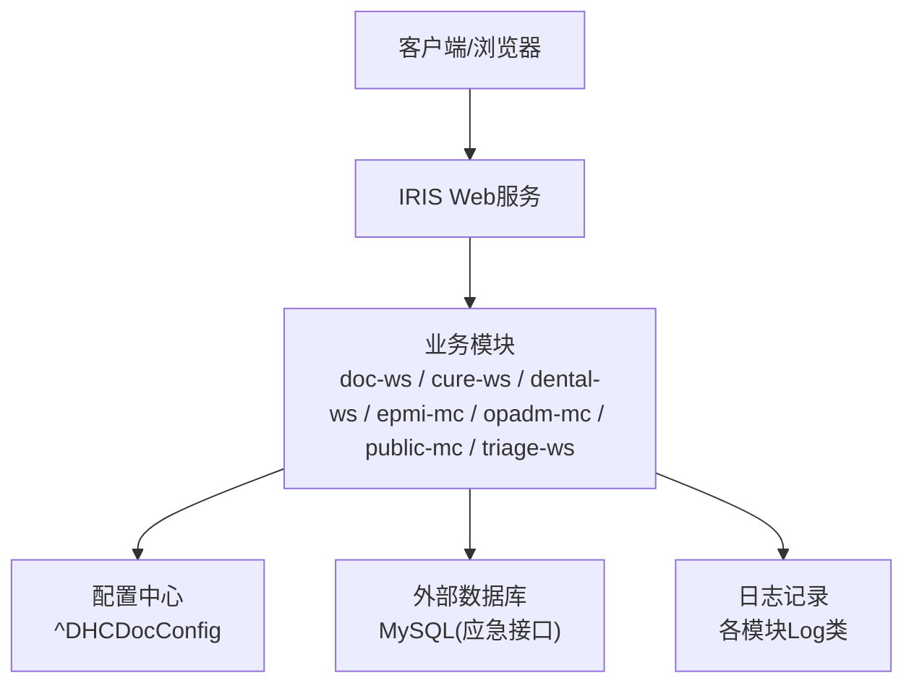
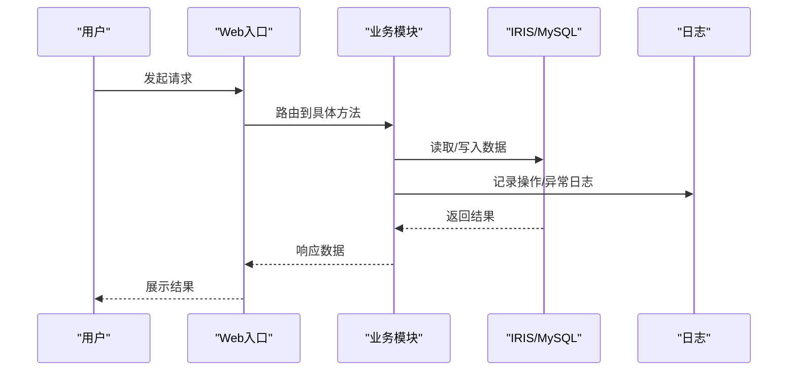
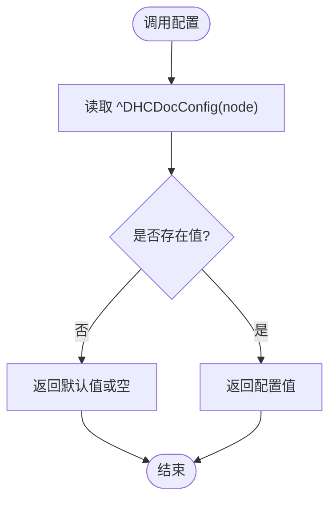
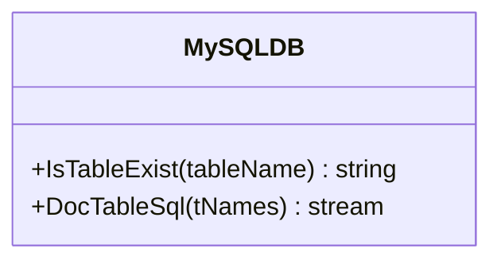
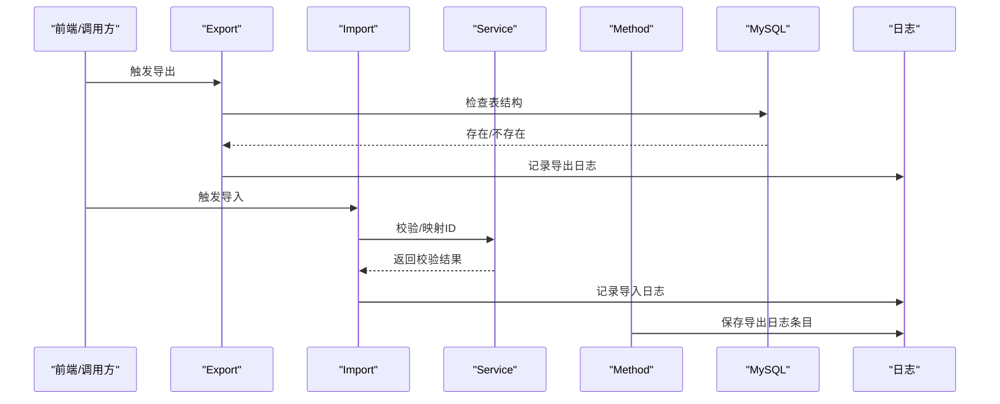
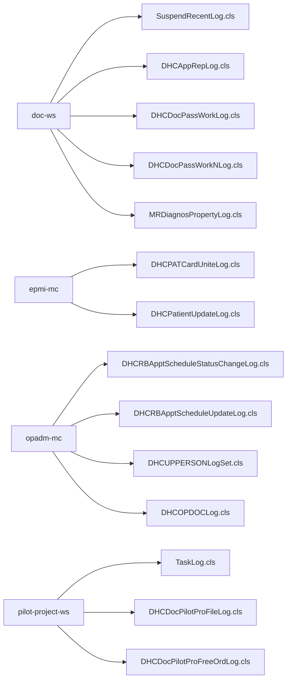
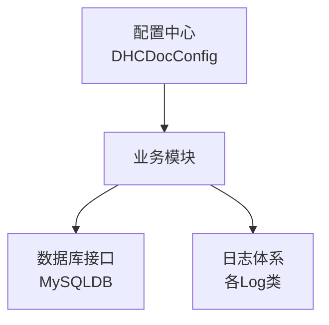

# 故障排查

<cite>
**本文引用的文件**
- [README.md](file://README.md)
- [DHCDocConfig.mac](file://src/backend/public-mc/DHCDocConfig.mac)
- [MySQLDB.cls](file://src/backend/conting-ws/DHCDoc/Interface/StandAlone/MySQLDB.cls)
- [Export.cls](file://src/backend/conting-ws/DHCDoc/Interface/StandAlone/Export.cls)
- [Import.cls](file://src/backend/conting-ws/DHCDoc/Interface/StandAlone/Import.cls)
- [Service.cls](file://src/backend/conting-ws/DHCDoc/Interface/StandAlone/Service.cls)
- [Method.cls](file://src/backend/conting-ws/DHCDoc/Interface/StandAlone/API/Method.cls)
- [SuspendRecentLog.cls](file://src/backend/doc-ws/DOC/OPDoc/SuspendRecentLog.cls)
- [DHCAppRepLog.cls](file://src/backend/doc-ws/User/DHCAppRepLog.cls)
- [DHCDocPassWorkLog.cls](file://src/backend/doc-ws/User/DHCDocPassWorkLog.cls)
- [DHCDocPassWorkNLog.cls](file://src/backend/doc-ws/User/DHCDocPassWorkNLog.cls)
- [MRDiagnosPropertyLog.cls](file://src/backend/doc-ws/User/MRDiagnosPropertyLog.cls)
- [DHCPATCardUniteLog.cls](file://src/backend/epmi-mc/User/DHCPATCardUniteLog.cls)
- [DHCPatientUpdateLog.cls](file://src/backend/epmi-mc/web/DHCBL/Patient/DHCPatientUpdateLog.cls)
- [DHCRBApptScheduleStatusChangeLog.cls](file://src/backend/opadm-mc/User/DHCRBApptScheduleStatusChangeLog.cls)
- [DHCRBApptScheduleUpdateLog.cls](file://src/backend/opadm-mc/User/DHCRBApptScheduleUpdateLog.cls)
- [DHCUPPERSONLogSet.cls](file://src/backend/opadm-mc/User/DHCUPPERSONLogSet.cls)
- [DHCOPDOCLog.cls](file://src/backend/opadm-mc/web/DHCOPDOCLog.cls)
- [TaskLog.cls](file://src/backend/pilot-project-ws/DHCDoc/GCPSW/BS/TaskLog.cls)
- [DHCDocPilotProFileLog.cls](file://src/backend/pilot-project-ws/User/DHCDocPilotProFileLog.cls)
- [DHCDocPilotProFreeOrdLog.cls](file://src/backend/pilot-project-ws/User/DHCDocPilotProFreeOrdLog.cls)
</cite>

## 目录
1. [简介](#简介)
2. [项目结构](#项目结构)
3. [核心组件](#核心组件)
4. [架构总览](#架构总览)
5. [详细组件分析](#详细组件分析)
6. [依赖关系分析](#依赖关系分析)
7. [性能注意事项](#性能注意事项)
8. [故障排查指南](#故障排查指南)
9. [结论](#结论)
10. [附录](#附录)

## 简介
本指南面向IRIS HIS系统的运维与研发人员，聚焦部署、性能、数据库连接等常见问题的诊断与解决；提供系统日志、应用日志、数据库日志的收集与分析方法；梳理错误类型与处理步骤；给出性能调优建议与瓶颈定位方法；并建立紧急恢复流程、备份恢复操作步骤以及问题分类与升级机制，确保问题及时有效闭环。

## 项目结构
- 后端：InterSystems IRIS ObjectScript（多产品模块），通过扩展直接编译上传至IRIS命名空间。
- 前端：传统CSP + jQuery/HISUI，通过脚本统一上传到服务器路径。
- 脚本：Git管理、SFTP同步、编码转换等辅助工具。

图表来源
- [README.md:1-549](file://README.md#L1-L549)
- [DHCDocConfig.mac:1-119](file://src/backend/public-mc/DHCDocConfig.mac#L1-L119)
- [MySQLDB.cls:1-800](file://src/backend/conting-ws/DHCDoc/Interface/StandAlone/MySQLDB.cls#L1-L800)

章节来源
- [README.md:1-549](file://README.md#L1-L549)

## 核心组件
- 配置中心：集中管理运行期配置项（如限制时长、院区相关开关等）。
- 数据库访问：应急接口通过MySQLDB封装表存在性检查与DDL生成，便于环境初始化与一致性校验。
- 日志体系：各子系统均提供日志类，用于操作审计、任务执行、排班变更、患者主索引更新等场景。
- 导入导出：应急接口提供数据导入/导出能力，内部调用日志与校验逻辑。

章节来源
- [DHCDocConfig.mac:1-119](file://src/backend/public-mc/DHCDocConfig.mac#L1-L119)
- [MySQLDB.cls:1-800](file://src/backend/conting-ws/DHCDoc/Interface/StandAlone/MySQLDB.cls#L1-L800)
- [Export.cls:1-1207](file://src/backend/conting-ws/DHCDoc/Interface/StandAlone/Export.cls#L1-L1207)
- [Import.cls:1-1207](file://src/backend/conting-ws/DHCDoc/Interface/StandAlone/Import.cls#L1-L1207)
- [Service.cls:1-1207](file://src/backend/conting-ws/DHCDoc/Interface/StandAlone/Service.cls#L1-L1207)
- [Method.cls:1-1207](file://src/backend/conting-ws/DHCDoc/Interface/StandAlone/API/Method.cls#L1-L1207)

## 架构总览
IRIS作为应用服务器承载ObjectScript业务逻辑，前端通过CSP页面交互；关键数据落库在IRIS对象数据库，部分外部系统对接使用MySQL；所有关键操作均有日志落库或全局变量记录，便于追踪与审计。

图表来源
- [README.md:1-549](file://README.md#L1-L549)
- [DHCDocConfig.mac:1-119](file://src/backend/public-mc/DHCDocConfig.mac#L1-L119)
- [MySQLDB.cls:1-800](file://src/backend/conting-ws/DHCDoc/Interface/StandAlone/MySQLDB.cls#L1-L800)

## 详细组件分析

### 配置中心（DHCDocConfig）
- 职责：提供配置的读写、节点枚举、授权检查、日期时间工具等。
- 关键点：
  - 全局配置节点 ^DHCDocConfig 存储运行时参数。
  - 提供按院区维度获取配置的方法（由上层封装）。
  - 包含常用时间函数与当前医院信息获取。

图表来源
- [DHCDocConfig.mac:1-119](file://src/backend/public-mc/DHCDocConfig.mac#L1-L119)

章节来源
- [DHCDocConfig.mac:1-119](file://src/backend/public-mc/DHCDocConfig.mac#L1-L119)

### 数据库访问（MySQLDB）
- 职责：为应急接口提供MySQL表存在性检查与DDL生成，保障外部数据表结构一致。
- 关键点：
  - IsTableExist 查询INFORMATION_SCHEMA判断表是否存在。
  - DocTableSql 输出建表语句，覆盖资源、医嘱、模板、排班等关键表。
  - 错误处理：设置$zt标记并在错误分支清理。

图表来源
- [MySQLDB.cls:1-800](file://src/backend/conting-ws/DHCDoc/Interface/StandAlone/MySQLDB.cls#L1-L800)

章节来源
- [MySQLDB.cls:1-800](file://src/backend/conting-ws/DHCDoc/Interface/StandAlone/MySQLDB.cls#L1-L800)

### 导入导出（Export/Import/Service/Method）
- 职责：实现应急数据导入导出，集成日志记录与校验。
- 关键点：
  - Export/Import 中多次调用MySQLDB进行表存在性检查。
  - Service 提供CES标志判断与ID映射。
  - Method 封装导出日志保存与终端有效性检查。

图表来源
- [Export.cls:1-1207](file://src/backend/conting-ws/DHCDoc/Interface/StandAlone/Export.cls#L1-L1207)
- [Import.cls:1-1207](file://src/backend/conting-ws/DHCDoc/Interface/StandAlone/Import.cls#L1-L1207)
- [Service.cls:1-1207](file://src/backend/conting-ws/DHCDoc/Interface/StandAlone/Service.cls#L1-L1207)
- [Method.cls:1-1207](file://src/backend/conting-ws/DHCDoc/Interface/StandAlone/API/Method.cls#L1-L1207)

章节来源
- [Export.cls:1-1207](file://src/backend/conting-ws/DHCDoc/Interface/StandAlone/Export.cls#L1-L1207)
- [Import.cls:1-1207](file://src/backend/conting-ws/DHCDoc/Interface/StandAlone/Import.cls#L1-L1207)
- [Service.cls:1-1207](file://src/backend/conting-ws/DHCDoc/Interface/StandAlone/Service.cls#L1-L1207)
- [Method.cls:1-1207](file://src/backend/conting-ws/DHCDoc/Interface/StandAlone/API/Method.cls#L1-L1207)

### 日志体系（各模块Log类）
- 职责：记录操作审计、任务执行、排班状态变更、患者主索引更新等。
- 覆盖范围：
  - 医生工作站：挂起最近日志、报表日志、工作流日志、诊断属性日志等。
  - 患者主索引：卡片统一、患者更新日志。
  - 门诊挂号：排班状态变更、排班更新、人员信息更新。
  - 试点项目：任务日志、档案与自由医嘱日志。

图表来源
- [SuspendRecentLog.cls](file://src/backend/doc-ws/DOC/OPDoc/SuspendRecentLog.cls)
- [DHCAppRepLog.cls](file://src/backend/doc-ws/User/DHCAppRepLog.cls)
- [DHCDocPassWorkLog.cls](file://src/backend/doc-ws/User/DHCDocPassWorkLog.cls)
- [DHCDocPassWorkNLog.cls](file://src/backend/doc-ws/User/DHCDocPassWorkNLog.cls)
- [MRDiagnosPropertyLog.cls](file://src/backend/doc-ws/User/MRDiagnosPropertyLog.cls)
- [DHCPATCardUniteLog.cls](file://src/backend/epmi-mc/User/DHCPATCardUniteLog.cls)
- [DHCPatientUpdateLog.cls](file://src/backend/epmi-mc/web/DHCBL/Patient/DHCPatientUpdateLog.cls)
- [DHCRBApptScheduleStatusChangeLog.cls](file://src/backend/opadm-mc/User/DHCRBApptScheduleStatusChangeLog.cls)
- [DHCRBApptScheduleUpdateLog.cls](file://src/backend/opadm-mc/User/DHCRBApptScheduleUpdateLog.cls)
- [DHCUPPERSONLogSet.cls](file://src/backend/opadm-mc/User/DHCUPPERSONLogSet.cls)
- [DHCOPDOCLog.cls](file://src/backend/opadm-mc/web/DHCOPDOCLog.cls)
- [TaskLog.cls](file://src/backend/pilot-project-ws/DHCDoc/GCPSW/BS/TaskLog.cls)
- [DHCDocPilotProFileLog.cls](file://src/backend/pilot-project-ws/User/DHCDocPilotProFileLog.cls)
- [DHCDocPilotProFreeOrdLog.cls](file://src/backend/pilot-project-ws/User/DHCDocPilotProFreeOrdLog.cls)

章节来源
- [SuspendRecentLog.cls](file://src/backend/doc-ws/DOC/OPDoc/SuspendRecentLog.cls)
- [DHCAppRepLog.cls](file://src/backend/doc-ws/User/DHCAppRepLog.cls)
- [DHCDocPassWorkLog.cls](file://src/backend/doc-ws/User/DHCDocPassWorkLog.cls)
- [DHCDocPassWorkNLog.cls](file://src/backend/doc-ws/User/DHCDocPassWorkNLog.cls)
- [MRDiagnosPropertyLog.cls](file://src/backend/doc-ws/User/MRDiagnosPropertyLog.cls)
- [DHCPATCardUniteLog.cls](file://src/backend/epmi-mc/User/DHCPATCardUniteLog.cls)
- [DHCPatientUpdateLog.cls](file://src/backend/epmi-mc/web/DHCBL/Patient/DHCPatientUpdateLog.cls)
- [DHCRBApptScheduleStatusChangeLog.cls](file://src/backend/opadm-mc/User/DHCRBApptScheduleStatusChangeLog.cls)
- [DHCRBApptScheduleUpdateLog.cls](file://src/backend/opadm-mc/User/DHCRBApptScheduleUpdateLog.cls)
- [DHCUPPERSONLogSet.cls](file://src/backend/opadm-mc/User/DHCUPPERSONLogSet.cls)
- [DHCOPDOCLog.cls](file://src/backend/opadm-mc/web/DHCOPDOCLog.cls)
- [TaskLog.cls](file://src/backend/pilot-project-ws/DHCDoc/GCPSW/BS/TaskLog.cls)
- [DHCDocPilotProFileLog.cls](file://src/backend/pilot-project-ws/User/DHCDocPilotProFileLog.cls)
- [DHCDocPilotProFreeOrdLog.cls](file://src/backend/pilot-project-ws/User/DHCDocPilotProFreeOrdLog.cls)

## 依赖关系分析
- 配置依赖：业务模块依赖 ^DHCDocConfig 获取运行期参数。
- 数据依赖：应急接口依赖MySQL，通过MySQLDB进行结构校验与DDL生成。
- 日志依赖：各模块通过各自Log类记录操作与异常，形成可追溯链路。

图表来源
- [DHCDocConfig.mac:1-119](file://src/backend/public-mc/DHCDocConfig.mac#L1-L119)
- [MySQLDB.cls:1-800](file://src/backend/conting-ws/DHCDoc/Interface/StandAlone/MySQLDB.cls#L1-L800)
- [SuspendRecentLog.cls](file://src/backend/doc-ws/DOC/OPDoc/SuspendRecentLog.cls)
- [DHCAppRepLog.cls](file://src/backend/doc-ws/User/DHCAppRepLog.cls)
- [DHCDocPassWorkLog.cls](file://src/backend/doc-ws/User/DHCDocPassWorkLog.cls)
- [DHCDocPassWorkNLog.cls](file://src/backend/doc-ws/User/DHCDocPassWorkNLog.cls)
- [MRDiagnosPropertyLog.cls](file://src/backend/doc-ws/User/MRDiagnosPropertyLog.cls)
- [DHCPATCardUniteLog.cls](file://src/backend/epmi-mc/User/DHCPATCardUniteLog.cls)
- [DHCPatientUpdateLog.cls](file://src/backend/epmi-mc/web/DHCBL/Patient/DHCPatientUpdateLog.cls)
- [DHCRBApptScheduleStatusChangeLog.cls](file://src/backend/opadm-mc/User/DHCRBApptScheduleStatusChangeLog.cls)
- [DHCRBApptScheduleUpdateLog.cls](file://src/backend/opadm-mc/User/DHCRBApptScheduleUpdateLog.cls)
- [DHCUPPERSONLogSet.cls](file://src/backend/opadm-mc/User/DHCUPPERSONLogSet.cls)
- [DHCOPDOCLog.cls](file://src/backend/opadm-mc/web/DHCOPDOCLog.cls)
- [TaskLog.cls](file://src/backend/pilot-project-ws/DHCDoc/GCPSW/BS/TaskLog.cls)
- [DHCDocPilotProFileLog.cls](file://src/backend/pilot-project-ws/User/DHCDocPilotProFileLog.cls)
- [DHCDocPilotProFreeOrdLog.cls](file://src/backend/pilot-project-ws/User/DHCDocPilotProFreeOrdLog.cls)

章节来源
- [DHCDocConfig.mac:1-119](file://src/backend/public-mc/DHCDocConfig.mac#L1-L119)
- [MySQLDB.cls:1-800](file://src/backend/conting-ws/DHCDoc/Interface/StandAlone/MySQLDB.cls#L1-L800)

## 性能注意事项
- 配置读取：避免频繁读取大配置节点，必要时缓存热点配置。
- 数据库访问：
  - 使用MySQLDB的表存在性检查减少无效DDL执行。
  - 批量导入时注意事务边界与批大小，避免长事务锁表。
- 日志写入：高并发场景下对日志写入进行异步化或批量化，降低阻塞。
- 前端资源：CSP页面与静态资源按需加载，减少首屏压力。

[本节为通用指导，不直接分析具体文件]

## 故障排查指南

### 一、部署问题
- 症状：前端无法访问、后端编译失败、SFTP上传失败。
- 排查步骤：
  - 确认VS Code ObjectScript扩展已正确配置IRIS实例与命名空间（参考README中的webServer与objectscript.export配置）。
  - 验证SFTP通道配置（host、port、username、password、remotePath）与实际服务器一致。
  - 使用封装脚本执行上传与编译，观察输出与错误码。
  - 若为后端代码变更未生效，确认已通过ObjectScript扩展编译上传至IRIS命名空间。
- 解决方案：
  - 修正连接信息与端口，重启IRIS服务或重新编译。
  - 清理本地与工作区不一致的文件，重新同步。
  - 对于CSP页面，确保完成编译后再访问。

章节来源
- [README.md:98-245](file://README.md#L98-L245)
- [README.md:256-278](file://README.md#L256-L278)

### 二、性能问题
- 症状：页面响应慢、接口超时、数据库查询缓慢。
- 排查步骤：
  - 查看业务模块日志（如工作流日志、排班日志、患者更新日志）定位耗时操作。
  - 检查MySQL表结构与索引（通过MySQLDB生成的DDL核对），确认高频查询字段有合适索引。
  - 评估导入/导出批次大小与事务粒度，调整批大小以减少锁竞争。
  - 监控IRIS与MySQL资源使用率（CPU、内存、IO、连接数）。
- 解决方案：
  - 优化SQL与查询条件，增加必要索引。
  - 拆分大事务为小批次提交。
  - 对日志写入进行异步化或合并写入。
  - 调整IRIS与MySQL的连接池与超时参数。

章节来源
- [MySQLDB.cls:1-800](file://src/backend/conting-ws/DHCDoc/Interface/StandAlone/MySQLDB.cls#L1-L800)
- [Export.cls:1-1207](file://src/backend/conting-ws/DHCDoc/Interface/StandAlone/Export.cls#L1-L1207)
- [Import.cls:1-1207](file://src/backend/conting-ws/DHCDoc/Interface/StandAlone/Import.cls#L1-L1207)
- [DHCDocPassWorkLog.cls](file://src/backend/doc-ws/User/DHCDocPassWorkLog.cls)
- [DHCRBApptScheduleUpdateLog.cls](file://src/backend/opadm-mc/User/DHCRBApptScheduleUpdateLog.cls)
- [DHCPatientUpdateLog.cls](file://src/backend/epmi-mc/web/DHCBL/Patient/DHCPatientUpdateLog.cls)

### 三、数据库连接问题
- 症状：MySQL连接失败、表不存在、DDL执行报错。
- 排查步骤：
  - 使用MySQLDB.IsTableExist检查目标表是否存在。
  - 若缺失，执行DocTableSql生成并执行对应DDL。
  - 检查IRIS到MySQL的网络连通性与凭据配置。
  - 查看导入/导出日志，定位具体失败的表或字段。
- 解决方案：
  - 补全缺失表结构，确保字符集与引擎一致。
  - 修复网络或权限问题，重连后重试。
  - 对导入数据进行清洗，避免非法值导致插入失败。

章节来源
- [MySQLDB.cls:1-800](file://src/backend/conting-ws/DHCDoc/Interface/StandAlone/MySQLDB.cls#L1-L800)
- [Export.cls:1-1207](file://src/backend/conting-ws/DHCDoc/Interface/StandAlone/Export.cls#L1-L1207)
- [Import.cls:1-1207](file://src/backend/conting-ws/DHCDoc/Interface/StandAlone/Import.cls#L1-L1207)

### 四、日志分析方法
- 系统日志：IRIS事件日志、Web服务日志，关注启动、编译、权限、端口占用等。
- 应用日志：
  - 医生工作站：挂起最近日志、工作流日志、报表日志、诊断属性日志。
  - 患者主索引：卡片统一、患者更新日志。
  - 门诊挂号：排班状态变更、排班更新、人员信息更新。
  - 试点项目：任务日志、档案与自由医嘱日志。
- 数据库日志：MySQL错误日志、慢查询日志、InnoDB状态。
- 收集与分析：
  - 按时间窗口聚合日志，过滤关键字（错误、异常、超时、锁等待）。
  - 结合业务上下文（患者ID、订单号、院区）定位问题根因。
  - 对重复出现的错误进行趋势分析，识别系统性风险。

章节来源
- [SuspendRecentLog.cls](file://src/backend/doc-ws/DOC/OPDoc/SuspendRecentLog.cls)
- [DHCAppRepLog.cls](file://src/backend/doc-ws/User/DHCAppRepLog.cls)
- [DHCDocPassWorkLog.cls](file://src/backend/doc-ws/User/DHCDocPassWorkLog.cls)
- [DHCDocPassWorkNLog.cls](file://src/backend/doc-ws/User/DHCDocPassWorkNLog.cls)
- [MRDiagnosPropertyLog.cls](file://src/backend/doc-ws/User/MRDiagnosPropertyLog.cls)
- [DHCPATCardUniteLog.cls](file://src/backend/epmi-mc/User/DHCPATCardUniteLog.cls)
- [DHCPatientUpdateLog.cls](file://src/backend/epmi-mc/web/DHCBL/Patient/DHCPatientUpdateLog.cls)
- [DHCRBApptScheduleStatusChangeLog.cls](file://src/backend/opadm-mc/User/DHCRBApptScheduleStatusChangeLog.cls)
- [DHCRBApptScheduleUpdateLog.cls](file://src/backend/opadm-mc/User/DHCRBApptScheduleUpdateLog.cls)
- [DHCUPPERSONLogSet.cls](file://src/backend/opadm-mc/User/DHCUPPERSONLogSet.cls)
- [DHCOPDOCLog.cls](file://src/backend/opadm-mc/web/DHCOPDOCLog.cls)
- [TaskLog.cls](file://src/backend/pilot-project-ws/DHCDoc/GCPSW/BS/TaskLog.cls)
- [DHCDocPilotProFileLog.cls](file://src/backend/pilot-project-ws/User/DHCDocPilotProFileLog.cls)
- [DHCDocPilotProFreeOrdLog.cls](file://src/backend/pilot-project-ws/User/DHCDocPilotProFreeOrdLog.cls)

### 五、错误代码含义与解决步骤
- 表不存在：
  - 现象：导入/导出时报表缺失。
  - 解决：执行MySQLDB.DocTableSql生成DDL并创建表。
- 连接失败：
  - 现象：MySQL连接错误或超时。
  - 解决：检查网络、凭据、防火墙与IRIS/MySQL服务状态。
- 权限不足：
  - 现象：无法写入日志或修改配置。
  - 解决：授予相应数据库与文件系统权限，确认IRIS用户名与角色。
- 配置错误：
  - 现象：功能异常或行为不符合预期。
  - 解决：核对 ^DHCDocConfig 节点值，修正后重启或刷新缓存。

章节来源
- [MySQLDB.cls:1-800](file://src/backend/conting-ws/DHCDoc/Interface/StandAlone/MySQLDB.cls#L1-L800)
- [DHCDocConfig.mac:1-119](file://src/backend/public-mc/DHCDocConfig.mac#L1-L119)

### 六、性能调优建议与瓶颈定位
- 建议：
  - 合理设置导入/导出批次大小，避免过大导致内存与锁竞争。
  - 对高频查询添加索引，减少全表扫描。
  - 日志写入异步化，降低主流程延迟。
  - 前端静态资源压缩与缓存，减少带宽占用。
- 定位：
  - 通过日志关联请求ID与用户会话，定位慢接口。
  - 使用MySQL慢查询日志定位低效SQL。
  - 监控IRIS进程与线程，识别热点方法与全局变量竞争。

[本节为通用指导，不直接分析具体文件]

### 七、紧急恢复流程
- 触发条件：重大故障影响业务连续性（如数据库不可用、核心功能瘫痪）。
- 步骤：
  - 立即切换只读或降级模式，保护数据一致性。
  - 回滚最近一次变更（代码或配置），优先恢复服务。
  - 启用备用数据库或临时方案，保证基本业务可用。
  - 通知相关干系人，建立应急沟通渠道。
- 恢复后：
  - 逐步恢复功能，验证数据完整性。
  - 复盘故障原因，完善预案与监控告警。

[本节为通用指导，不直接分析具体文件]

### 八、备份恢复操作步骤
- 备份策略：
  - IRIS命名空间定期快照与增量备份。
  - MySQL数据库全量与增量备份，保留足够历史版本。
  - 配置文件（^DHCDocConfig）与前端静态资源纳入备份范围。
- 恢复步骤：
  - 停止写操作，锁定数据一致性点。
  - 先恢复数据库，再恢复IRIS命名空间与前端资源。
  - 校验数据一致性与功能可用性，逐步开放服务。
- 验证：
  - 抽样核对关键业务数据。
  - 执行核心用例回归测试。

[本节为通用指导，不直接分析具体文件]

### 九、问题分类与升级机制
- 分类：
  - P0：系统不可用、数据丢失风险（立即响应，分钟级恢复）。
  - P1：核心功能受损（小时级恢复，临时方案先行）。
  - P2：非核心功能异常（当日解决，制定改进计划）。
  - P3：体验优化与缺陷（纳入迭代计划）。
- 升级机制：
  - 一线支持负责初步诊断与恢复，超过SLA自动升级至二线。
  - 涉及跨系统问题时，拉通相关团队联合排查。
  - 重大故障成立专项小组，持续跟踪直至闭环。

[本节为通用指导，不直接分析具体文件]

## 结论
本指南基于IRIS HIS的代码结构与日志体系，提供了从部署、性能、数据库连接到日志分析与恢复操作的完整排查方法。通过配置中心、数据库接口与日志体系的协同，能够快速定位问题并采取有效措施。建议在日常运维中完善监控与告警，持续优化性能与稳定性。

## 附录
- 快速命令参考：
  - 前端上传与编译：参考README中的封装脚本与编译命令。
  - 后端编译：通过ObjectScript扩展批量加载与编译。
- 常用日志位置：
  - IRIS事件日志、Web服务日志。
  - 各模块Log类对应的数据表或全局变量。
  - MySQL错误日志与慢查询日志。

章节来源
- [README.md:256-278](file://README.md#L256-L278)
- [SuspendRecentLog.cls](file://src/backend/doc-ws/DOC/OPDoc/SuspendRecentLog.cls)
- [DHCAppRepLog.cls](file://src/backend/doc-ws/User/DHCAppRepLog.cls)
- [DHCDocPassWorkLog.cls](file://src/backend/doc-ws/User/DHCDocPassWorkLog.cls)
- [DHCDocPassWorkNLog.cls](file://src/backend/doc-ws/User/DHCDocPassWorkNLog.cls)
- [MRDiagnosPropertyLog.cls](file://src/backend/doc-ws/User/MRDiagnosPropertyLog.cls)
- [DHCPATCardUniteLog.cls](file://src/backend/epmi-mc/User/DHCPATCardUniteLog.cls)
- [DHCPatientUpdateLog.cls](file://src/backend/epmi-mc/web/DHCBL/Patient/DHCPatientUpdateLog.cls)
- [DHCRBApptScheduleStatusChangeLog.cls](file://src/backend/opadm-mc/User/DHCRBApptScheduleStatusChangeLog.cls)
- [DHCRBApptScheduleUpdateLog.cls](file://src/backend/opadm-mc/User/DHCRBApptScheduleUpdateLog.cls)
- [DHCUPPERSONLogSet.cls](file://src/backend/opadm-mc/User/DHCUPPERSONLogSet.cls)
- [DHCOPDOCLog.cls](file://src/backend/opadm-mc/web/DHCOPDOCLog.cls)
- [TaskLog.cls](file://src/backend/pilot-project-ws/DHCDoc/GCPSW/BS/TaskLog.cls)
- [DHCDocPilotProFileLog.cls](file://src/backend/pilot-project-ws/User/DHCDocPilotProFileLog.cls)
- [DHCDocPilotProFreeOrdLog.cls](file://src/backend/pilot-project-ws/User/DHCDocPilotProFreeOrdLog.cls)