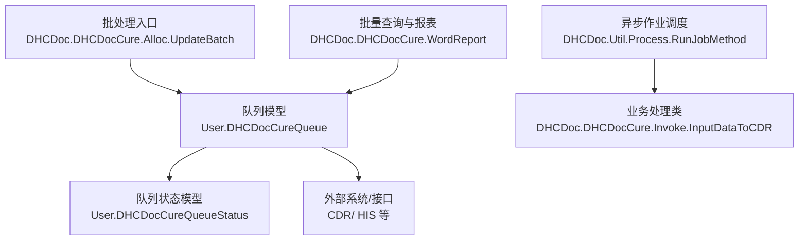
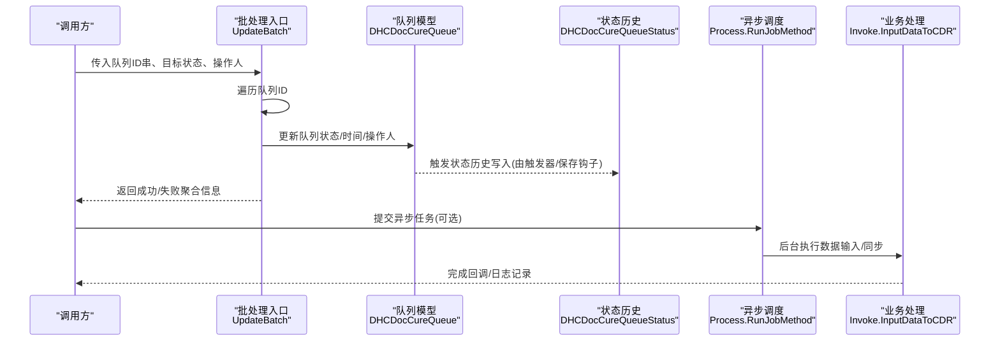
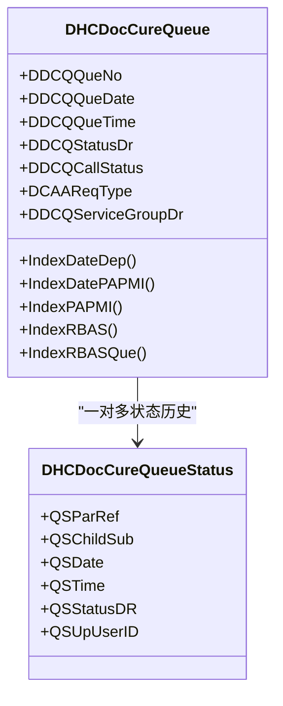
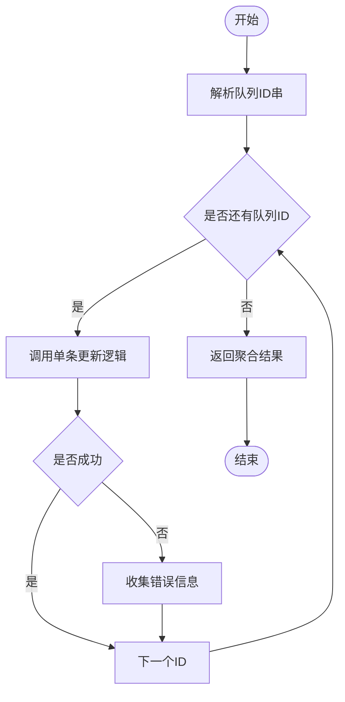
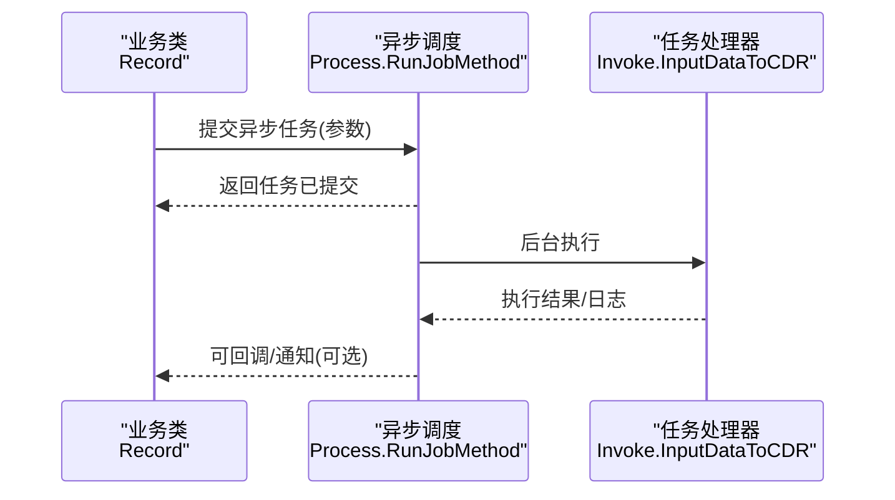
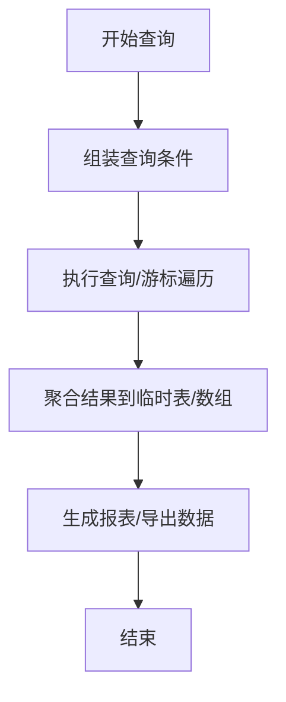
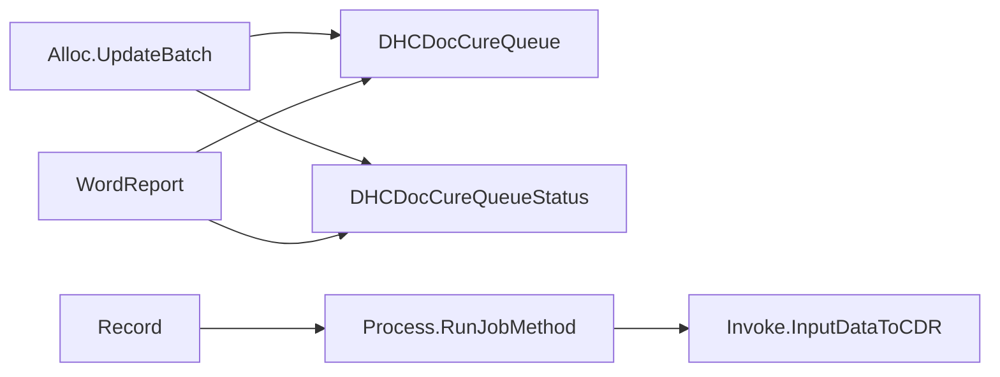

# 批量数据处理

<cite>
**本文引用的文件**
- [Alloc.cls](file://src/backend/cure-ws/DHCDoc/DHCDocCure/Alloc.cls)
- [DHCDocCureQueue.cls](file://src/backend/cure-ws/User/DHCDocCureQueue.cls)
- [DHCDocCureQueueStatus.cls](file://src/backend/cure-ws/User/DHCDocCureQueueStatus.cls)
- [Record.cls](file://src/backend/cure-ws/DHCDoc/DHCDocCure/Record.cls)
- [Process.cls](file://src/backend/public-mc/DHCDoc/Util/Process.cls)
- [WordReport.cls](file://src/backend/cure-ws/DHCDoc/DHCDocCure/WordReport.cls)
</cite>

## 目录
1. [简介](#简介)
2. [项目结构](#项目结构)
3. [核心组件](#核心组件)
4. [架构总览](#架构总览)
5. [详细组件分析](#详细组件分析)
6. [依赖关系分析](#依赖关系分析)
7. [性能考虑](#性能考虑)
8. [故障排查指南](#故障排查指南)
9. [结论](#结论)
10. [附录](#附录)

## 简介
本文件面向医疗信息系统中的“批量数据处理”能力，围绕批处理作业调度、任务队列管理、分布式处理能力、数据导入导出、ETL流程、数据同步与增量更新、配置与参数调优、性能监控、异常处理与重试、断点续传、数据一致性保证、日志与进度跟踪、结果报告生成以及大数据量处理的优化策略与资源管理进行系统化说明。文档基于仓库中实际存在的队列模型、批处理方法、异步作业调用与报表查询等代码片段进行分析与归纳，帮助读者理解系统如何处理大量数据交换任务。

## 项目结构
与批量数据处理直接相关的后端模块主要位于 cure-ws（康复/治疗业务）与 public-mc（公共工具与通用能力）下：
- 队列与状态模型：用于承载排队、状态流转与审计追踪
- 批处理入口：提供批量更新队列状态等方法
- 异步作业调度：通过统一进程工具类触发后台任务
- 报表与统计：提供按时间范围、科室、状态等多维度的批量查询与汇总

图表来源
- [DHCDocCureQueue.cls:1-80](file://src/backend/cure-ws/User/DHCDocCureQueue.cls#L1-L80)
- [DHCDocCureQueueStatus.cls:1-30](file://src/backend/cure-ws/User/DHCDocCureQueueStatus.cls#L1-L30)
- [Alloc.cls:45-65](file://src/backend/cure-ws/DHCDoc/DHCDocCure/Alloc.cls#L45-L65)
- [Process.cls:见引用路径](file://src/backend/public-mc/DHCDoc/Util/Process.cls)
- [WordReport.cls:1010-1185](file://src/backend/cure-ws/DHCDoc/DHCDocCure/WordReport.cls#L1010-L1185)

章节来源
- [DHCDocCureQueue.cls:1-80](file://src/backend/cure-ws/User/DHCDocCureQueue.cls#L1-L80)
- [DHCDocCureQueueStatus.cls:1-30](file://src/backend/cure-ws/User/DHCDocCureQueueStatus.cls#L1-L30)
- [Alloc.cls:45-65](file://src/backend/cure-ws/DHCDoc/DHCDocCure/Alloc.cls#L45-L65)
- [WordReport.cls:1010-1185](file://src/backend/cure-ws/DHCDoc/DHCDocCure/WordReport.cls#L1010-L1185)

## 核心组件
- 队列实体与索引：定义队列条目、状态、时间、人员、科室、预约资源与服务组等字段，并提供日期+科室、患者ID、资源等多维索引以支撑高效批量检索与排序。
- 队列状态历史：记录每次状态变更的时间、操作人、新状态，支持按日期、状态、操作人等维度回溯与审计。
- 批处理入口：提供批量更新队列状态的方法，内部循环调用单条更新逻辑并聚合错误信息。
- 异步作业调度：通过统一进程工具类将耗时或需要解耦的任务提交到后台执行，如数据输入到CDR等。
- 批量查询与报表：提供按时间范围、用户、状态、科室等条件的批量查询与结果集构建，用于统计与导出。

章节来源
- [DHCDocCureQueue.cls:1-80](file://src/backend/cure-ws/User/DHCDocCureQueue.cls#L1-L80)
- [DHCDocCureQueueStatus.cls:1-30](file://src/backend/cure-ws/User/DHCDocCureQueueStatus.cls#L1-L30)
- [Alloc.cls:45-65](file://src/backend/cure-ws/DHCDoc/DHCDocCure/Alloc.cls#L45-L65)
- [Record.cls:301-362](file://src/backend/cure-ws/DHCDoc/DHCDocCure/Record.cls#L301-L362)
- [WordReport.cls:1010-1185](file://src/backend/cure-ws/DHCDoc/DHCDocCure/WordReport.cls#L1010-L1185)

## 架构总览
系统采用“队列驱动 + 异步作业 + 报表统计”的批处理架构：
- 前端或上游系统产生队列项（预约/治疗任务），写入队列表并触发后续处理。
- 批处理入口对大批量队列项进行状态更新或业务编排。
- 耗时任务通过异步作业调度器提交至后台执行，避免阻塞主流程。
- 批量查询与报表模块提供多维统计与导出能力，支撑运营与合规需求。

图表来源
- [Alloc.cls:45-65](file://src/backend/cure-ws/DHCDoc/DHCDocCure/Alloc.cls#L45-L65)
- [DHCDocCureQueue.cls:83-101](file://src/backend/cure-ws/User/DHCDocCureQueue.cls#L83-L101)
- [DHCDocCureQueueStatus.cls:1-30](file://src/backend/cure-ws/User/DHCDocCureQueueStatus.cls#L1-L30)
- [Record.cls:301-362](file://src/backend/cure-ws/DHCDoc/DHCDocCure/Record.cls#L301-L362)

## 详细组件分析

### 队列模型与索引设计
- 字段覆盖：队列编号、患者、日期、时间、科室、状态、呼叫状态、请求类型、时间段、服务组等，满足排班与就诊全流程。
- 索引策略：按日期+科室、日期+患者、患者ID、资源ID、资源+序号等多维索引，提升批量筛选与排序效率。
- 触发机制：插入/更新后触发统一处理逻辑，便于扩展状态机或联动其他子系统。

图表来源
- [DHCDocCureQueue.cls:1-80](file://src/backend/cure-ws/User/DHCDocCureQueue.cls#L1-L80)
- [DHCDocCureQueueStatus.cls:1-30](file://src/backend/cure-ws/User/DHCDocCureQueueStatus.cls#L1-L30)

章节来源
- [DHCDocCureQueue.cls:1-80](file://src/backend/cure-ws/User/DHCDocCureQueue.cls#L1-L80)
- [DHCDocCureQueueStatus.cls:1-30](file://src/backend/cure-ws/User/DHCDocCureQueueStatus.cls#L1-L30)

### 批处理入口与批量更新
- 批量更新方法：接收“队列ID串 + 目标状态 + 操作人”，逐条调用单条更新逻辑，收集错误并返回聚合信息，便于上层重试与补偿。
- 单条更新逻辑：校验参数、解析状态码、计算/清理呼叫标志、更新队列状态与时间戳，返回SQL执行结果。

图表来源
- [Alloc.cls:45-65](file://src/backend/cure-ws/DHCDoc/DHCDocCure/Alloc.cls#L45-L65)
- [Alloc.cls:10-43](file://src/backend/cure-ws/DHCDoc/DHCDocCure/Alloc.cls#L10-L43)

章节来源
- [Alloc.cls:10-43](file://src/backend/cure-ws/DHCDoc/DHCDocCure/Alloc.cls#L10-L43)
- [Alloc.cls:45-65](file://src/backend/cure-ws/DHCDoc/DHCDocCure/Alloc.cls#L45-L65)

### 异步作业调度与ETL流程
- 异步调度：通过统一进程工具类将耗时任务（如数据输入到CDR）提交到后台执行，避免阻塞前台交互。
- ETL流程：在记录保存或业务节点处，构造参数并调用异步任务，实现跨系统数据同步与转换。

图表来源
- [Record.cls:301-362](file://src/backend/cure-ws/DHCDoc/DHCDocCure/Record.cls#L301-L362)
- [Process.cls:见引用路径](file://src/backend/public-mc/DHCDoc/Util/Process.cls)

章节来源
- [Record.cls:301-362](file://src/backend/cure-ws/DHCDoc/DHCDocCure/Record.cls#L301-L362)
- [Process.cls:见引用路径](file://src/backend/public-mc/DHCDoc/Util/Process.cls)

### 批量查询与结果报告
- 批量查询：提供按时间范围、用户、状态、科室等多维条件查询，构建临时结果集供报表使用。
- 结果报告：将查询结果组织为结构化数据，便于导出与分析。

图表来源
- [WordReport.cls:1010-1185](file://src/backend/cure-ws/DHCDoc/DHCDocCure/WordReport.cls#L1010-L1185)

章节来源
- [WordReport.cls:1010-1185](file://src/backend/cure-ws/DHCDoc/DHCDocCure/WordReport.cls#L1010-L1185)

## 依赖关系分析
- 批处理入口依赖队列模型与状态模型，负责状态变更与审计。
- 异步调度依赖统一进程工具类，解耦前台与后台任务。
- 报表模块依赖队列与状态模型，提供多维统计能力。
- 各组件间通过明确的接口与方法调用耦合，降低直接数据库访问带来的紧耦合风险。

图表来源
- [Alloc.cls:45-65](file://src/backend/cure-ws/DHCDoc/DHCDocCure/Alloc.cls#L45-L65)
- [DHCDocCureQueue.cls:1-80](file://src/backend/cure-ws/User/DHCDocCureQueue.cls#L1-L80)
- [DHCDocCureQueueStatus.cls:1-30](file://src/backend/cure-ws/User/DHCDocCureQueueStatus.cls#L1-L30)
- [Record.cls:301-362](file://src/backend/cure-ws/DHCDoc/DHCDocCure/Record.cls#L301-L362)
- [Process.cls:见引用路径](file://src/backend/public-mc/DHCDoc/Util/Process.cls)
- [WordReport.cls:1010-1185](file://src/backend/cure-ws/DHCDoc/DHCDocCure/WordReport.cls#L1010-L1185)

章节来源
- [Alloc.cls:45-65](file://src/backend/cure-ws/DHCDoc/DHCDocCure/Alloc.cls#L45-L65)
- [Record.cls:301-362](file://src/backend/cure-ws/DHCDoc/DHCDocCure/Record.cls#L301-L362)
- [WordReport.cls:1010-1185](file://src/backend/cure-ws/DHCDoc/DHCDocCure/WordReport.cls#L1010-L1185)

## 性能考虑
- 索引优化：利用日期+科室、患者ID、资源ID等索引加速批量筛选与排序。
- 分批处理：对超大队列ID串建议分批次提交，避免单次事务过大导致锁竞争与回滚成本上升。
- 异步解耦：将耗时任务（如外部系统同步）放入后台执行，减少前台响应时间。
- 查询裁剪：报表查询时尽量限定时间范围与必要字段，减少临时表体积与I/O压力。
- 并发控制：在高并发场景下，结合状态码与资源占用时间段避免重复处理与冲突。

[本节为通用指导，不直接分析具体文件]

## 故障排查指南
- 批量更新失败定位：检查返回的错误聚合信息，定位具体队列ID与失败原因；核对状态码映射与权限。
- 异步任务未执行：确认异步调度是否成功提交；查看后台任务日志与队列堆积情况。
- 状态不一致：通过状态历史模型回溯最近一次状态变更时间与操作人，定位问题环节。
- 报表数据缺失：检查查询条件与索引命中情况；必要时扩大时间范围或调整过滤条件。

章节来源
- [Alloc.cls:10-43](file://src/backend/cure-ws/DHCDoc/DHCDocCure/Alloc.cls#L10-L43)
- [DHCDocCureQueueStatus.cls:1-30](file://src/backend/cure-ws/User/DHCDocCureQueueStatus.cls#L1-L30)
- [WordReport.cls:1010-1185](file://src/backend/cure-ws/DHCDoc/DHCDocCure/WordReport.cls#L1010-L1185)

## 结论
本系统的批量数据处理以“队列模型 + 批处理入口 + 异步作业 + 报表统计”为核心，具备高可扩展性与良好的可观测性。通过合理的索引设计与分批策略，可在大数据量场景下保持稳定的吞吐与低延迟。异步解耦提升了用户体验与系统弹性，状态历史与报表能力保障了可追溯与可分析。建议在实施中结合业务规模持续优化索引、批大小与并发度，并完善监控与告警体系。

[本节为总结性内容，不直接分析具体文件]

## 附录
- 批处理配置建议
  - 批大小：根据系统负载与数据库性能设定合理批次大小，避免过大导致锁竞争或过小导致频繁提交。
  - 重试策略：对失败的队列项设置指数退避重试，限制最大重试次数并记录重试日志。
  - 断点续传：以队列ID与状态作为断点标识，重启后从上次失败位置继续处理。
  - 数据一致性：关键更新使用事务包裹，确保状态与历史一致；对外部系统调用增加幂等与补偿机制。
- 参数调优与监控
  - 监控指标：批处理吞吐量、平均耗时、失败率、队列堆积长度、异步任务积压。
  - 资源管理：限制并发线程数、数据库连接池大小，避免资源耗尽。
  - 日志与报告：记录每批次的开始/结束时间、处理数量、错误明细；定期生成运行报告。

[本节为通用指导，不直接分析具体文件]