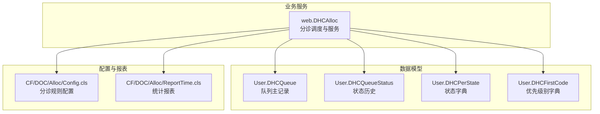
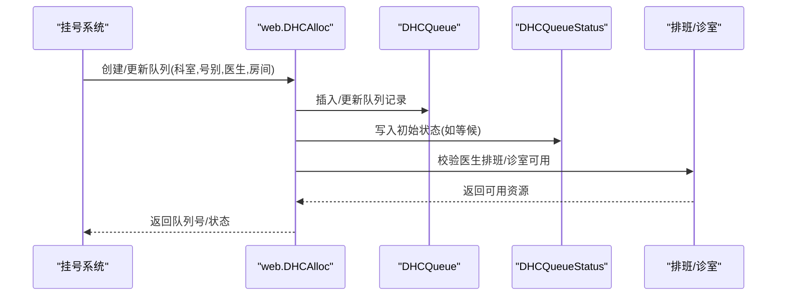
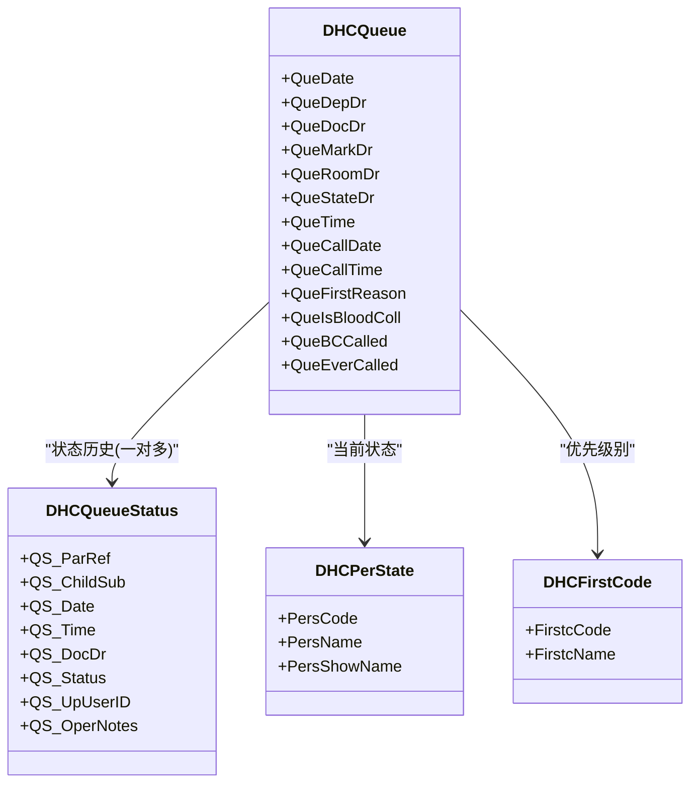
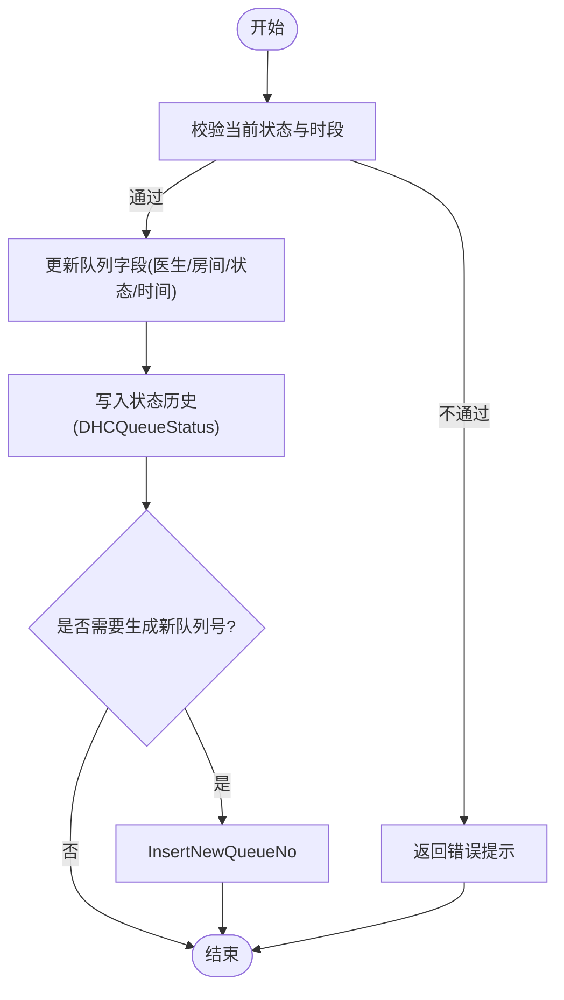
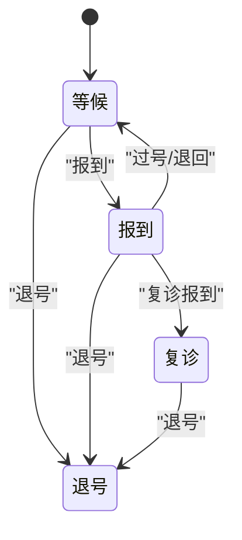
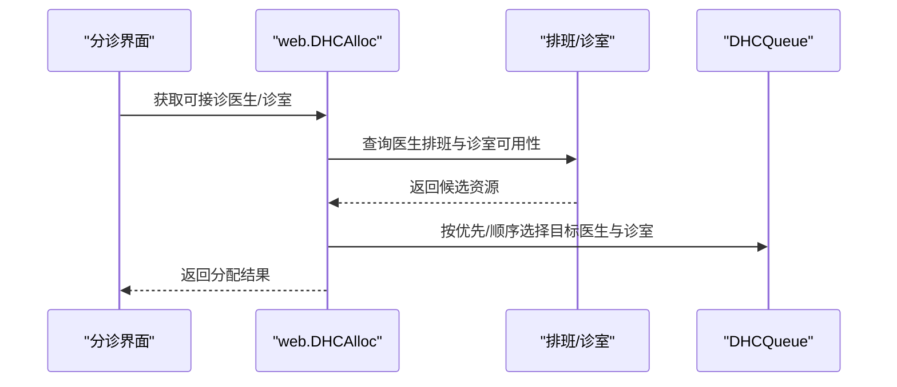
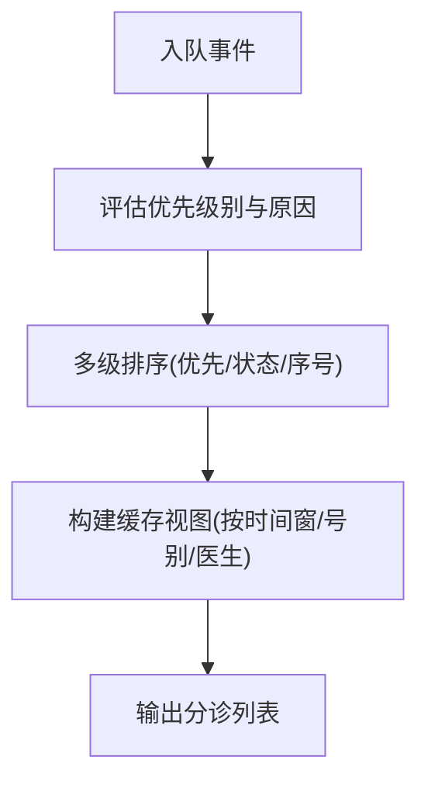
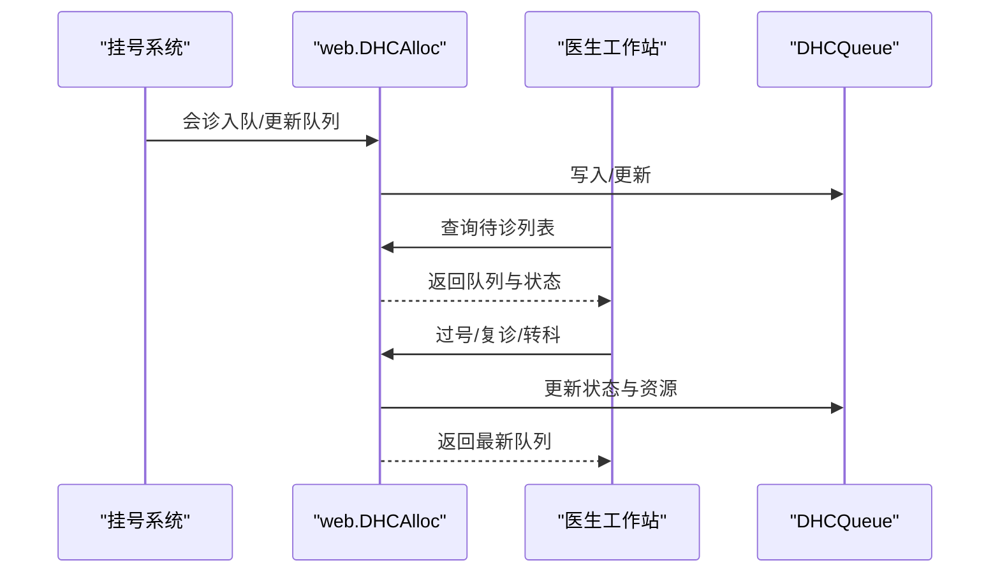
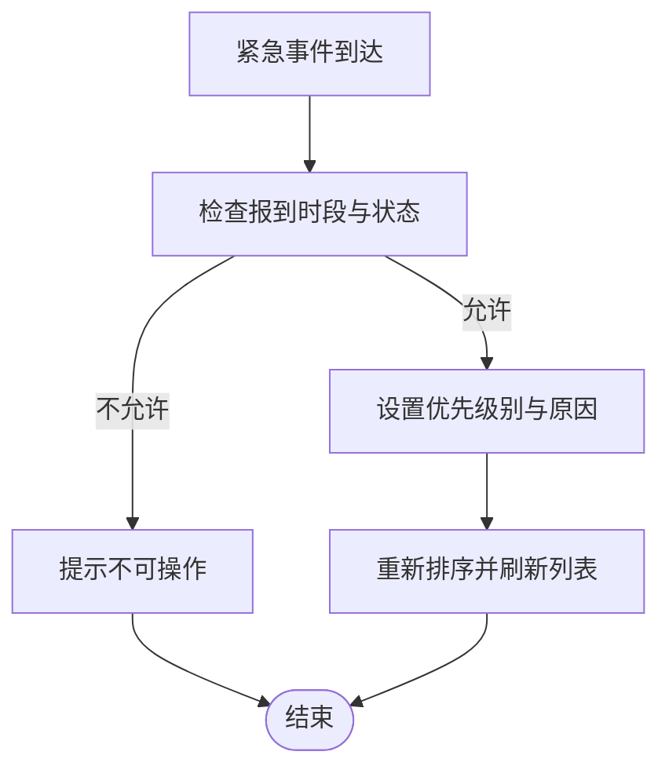
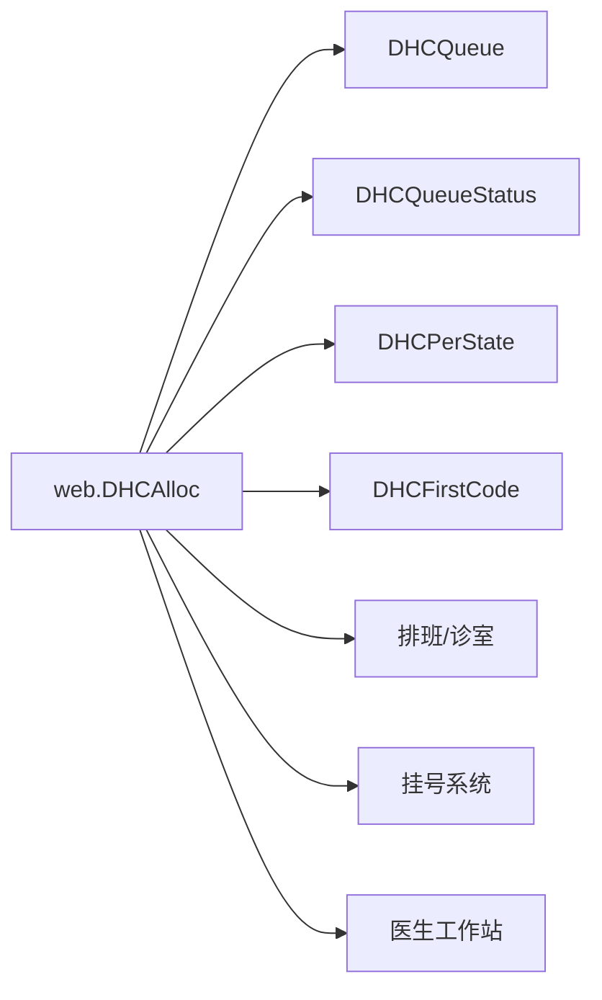

# 分诊系统模块架构

<cite>
**本文引用的文件**
- [DHCQueue.cls](file://src/backend/triage-ws/User/DHCQueue.cls)
- [DHCQueueStatus.cls](file://src/backend/triage-ws/User/DHCQueueStatus.cls)
- [DHCPerState.cls](file://src/backend/triage-ws/User/DHCPerState.cls)
- [DHCFirstCode.cls](file://src/backend/triage-ws/User/DHCFirstCode.cls)
- [DHCAlloc.cls](file://src/backend/triage-ws/web/DHCAlloc.cls)
- [Config.cls](file://src/backend/triage-ws/CF/DOC/Alloc/Config.cls)
- [ReportTime.cls](file://src/backend/triage-ws/CF/DOC/Alloc/ReportTime.cls)
</cite>

## 目录
1. [简介](#简介)
2. [项目结构](#项目结构)
3. [核心组件](#核心组件)
4. [架构总览](#架构总览)
5. [详细组件分析](#详细组件分析)
6. [依赖关系分析](#依赖关系分析)
7. [性能考虑](#性能考虑)
8. [故障排查指南](#故障排查指南)
9. [结论](#结论)
10. [附录](#附录)

## 简介
本文件面向triage-ws模块的分诊子系统，系统性阐述患者分流、优先级管理、排队与叫号、状态机与审计、资源（诊室/医生）分配、动态队列调整与紧急患者处理等核心能力。文档同时给出与挂号系统、医生工作站的交互要点、配置规则与统计报表能力说明，并提供流程图、状态机图与队列模型图，帮助读者快速理解并落地实现。

## 项目结构
triage-ws模块采用“数据模型 + 业务服务 + 配置/报表”的分层组织：
- 数据模型层：队列主表、状态历史、字典（状态码、优先级别）
- 业务服务层：分诊调度、报到/复诊/转科/优先、查询与列表
- 配置与报表：分诊规则配置、时间窗口与统计报表

图表来源
- [DHCQueue.cls:1-457](file://src/backend/triage-ws/User/DHCQueue.cls#L1-L457)
- [DHCQueueStatus.cls:1-197](file://src/backend/triage-ws/User/DHCQueueStatus.cls#L1-L197)
- [DHCPerState.cls:1-77](file://src/backend/triage-ws/User/DHCPerState.cls#L1-L77)
- [DHCFirstCode.cls:1-68](file://src/backend/triage-ws/User/DHCFirstCode.cls#L1-L68)
- [DHCAlloc.cls:1-800](file://src/backend/triage-ws/web/DHCAlloc.cls#L1-L800)
- [Config.cls](file://src/backend/triage-ws/CF/DOC/Alloc/Config.cls)
- [ReportTime.cls](file://src/backend/triage-ws/CF/DOC/Alloc/ReportTime.cls)

章节来源
- [DHCQueue.cls:1-457](file://src/backend/triage-ws/User/DHCQueue.cls#L1-L457)
- [DHCQueueStatus.cls:1-197](file://src/backend/triage-ws/User/DHCQueueStatus.cls#L1-L197)
- [DHCPerState.cls:1-77](file://src/backend/triage-ws/User/DHCPerState.cls#L1-L77)
- [DHCFirstCode.cls:1-68](file://src/backend/triage-ws/User/DHCFirstCode.cls#L1-L68)
- [DHCAlloc.cls:1-800](file://src/backend/triage-ws/web/DHCAlloc.cls#L1-L800)

## 核心组件
- 队列主记录（DHCQueue）：承载一次就诊的完整排队信息，包括日期、科室、号别、医生、房间、状态、呼叫时间、优先原因、是否采血/B超等扩展字段；提供多索引以支撑按日期/科室/医生/人员ID等多维查询。
- 状态历史（DHCQueueStatus）：记录每次状态变更的时间、操作人、备注，支持按医生、日期、状态维度检索，用于审计与统计。
- 状态字典（DHCPerState）：定义可流转的状态项（如等候、报到、过号、复诊、退号等），作为状态机节点。
- 优先级别（DHCFirstCode）：定义优先类别（如正常、优先等），驱动排序与插队策略。
- 分诊服务（web.DHCAlloc）：聚合队列读写、状态切换、查询列表、报到/复诊/转科/优先等业务逻辑，并与挂号、排班、诊室等资源进行交互。

章节来源
- [DHCQueue.cls:1-457](file://src/backend/triage-ws/User/DHCQueue.cls#L1-L457)
- [DHCQueueStatus.cls:1-197](file://src/backend/triage-ws/User/DHCQueueStatus.cls#L1-L197)
- [DHCPerState.cls:1-77](file://src/backend/triage-ws/User/DHCPerState.cls#L1-L77)
- [DHCFirstCode.cls:1-68](file://src/backend/triage-ws/User/DHCFirstCode.cls#L1-L68)
- [DHCAlloc.cls:1-800](file://src/backend/triage-ws/web/DHCAlloc.cls#L1-L800)

## 架构总览
分诊系统围绕“队列+状态机+资源”的闭环运行：
- 入口：挂号系统创建预约后，分诊服务将患者入队或更新队列。
- 规则引擎：依据优先级别、到院时间、号别/医生匹配、诊室可用性等进行排序与分配。
- 状态机：基于DHCPerState驱动状态流转，并通过DHCQueueStatus持久化审计。
- 资源分配：结合排班与诊室配置，动态选择医生与诊室。
- 交互：与挂号系统、医生工作站实时同步队列与状态，支持叫号、过号、复诊、转科等操作。

图表来源
- [DHCAlloc.cls:112-269](file://src/backend/triage-ws/web/DHCAlloc.cls#L112-L269)
- [DHCQueue.cls:102-121](file://src/backend/triage-ws/User/DHCQueue.cls#L102-L121)
- [DHCQueueStatus.cls:1-197](file://src/backend/triage-ws/User/DHCQueueStatus.cls#L1-L197)

## 详细组件分析

### 队列数据模型与索引设计
- 关键字段：日期、科室、号别、医生、房间、状态、创建/状态变更时间、呼叫时间、优先原因、是否采血/B超、是否已呼叫等。
- 索引策略：按日期+科室/医生/标记医生、人员ID、房间等多维索引，支撑高并发查询与排序。
- 触发器：在插入/更新后调用状态历史写入，保证审计一致性。

图表来源
- [DHCQueue.cls:1-457](file://src/backend/triage-ws/User/DHCQueue.cls#L1-L457)
- [DHCQueueStatus.cls:1-197](file://src/backend/triage-ws/User/DHCQueueStatus.cls#L1-L197)
- [DHCPerState.cls:1-77](file://src/backend/triage-ws/User/DHCPerState.cls#L1-L77)
- [DHCFirstCode.cls:1-68](file://src/backend/triage-ws/User/DHCFirstCode.cls#L1-L68)

章节来源
- [DHCQueue.cls:1-457](file://src/backend/triage-ws/User/DHCQueue.cls#L1-L457)
- [DHCQueueStatus.cls:1-197](file://src/backend/triage-ws/User/DHCQueueStatus.cls#L1-L197)

### 分诊服务与业务方法
- 列表查询（FindPatQueue）：按日期、诊区、状态、号别、房间、医生等条件筛选，构建多维缓存结构并按优先级别、状态、序号排序输出。
- 报到（PatArrive）：校验状态与时段限制，更新为等候/复诊报到，生成新队列号，写状态历史。
- 复诊（PatAgain）：校验允许复诊的条件，回置优先级别与状态。
- 转科/改医生（PatAdjDoc）：校验报到时段与医生停诊状态，更新医生与诊室，必要时重新报到。
- 优先（PatPrior）：对过号/报到中的患者设置优先级别与原因，必要时先报到再优先。
- 会诊队列（ConsultationQueueInsert）：封装会诊入队流程，统一走挂号入队接口。

图表来源
- [DHCAlloc.cls:350-472](file://src/backend/triage-ws/web/DHCAlloc.cls#L350-L472)
- [DHCQueueStatus.cls:1-197](file://src/backend/triage-ws/User/DHCQueueStatus.cls#L1-L197)

章节来源
- [DHCAlloc.cls:112-269](file://src/backend/triage-ws/web/DHCAlloc.cls#L112-L269)
- [DHCAlloc.cls:277-391](file://src/backend/triage-ws/web/DHCAlloc.cls#L277-L391)
- [DHCAlloc.cls:393-472](file://src/backend/triage-ws/web/DHCAlloc.cls#L393-L472)
- [DHCAlloc.cls:474-515](file://src/backend/triage-ws/web/DHCAlloc.cls#L474-L515)
- [DHCAlloc.cls:520-552](file://src/backend/triage-ws/web/DHCAlloc.cls#L520-L552)

### 状态机与审计
- 状态节点：由DHCPerState定义，常见包含“等候、报到、过号、复诊、退号”等。
- 流转约束：各业务方法在更新队列前校验当前状态与时段限制，确保合法转换。
- 审计追踪：每次状态变更通过触发器或显式调用写入DHCQueueStatus，记录时间、操作人、备注，便于追溯与统计。

图表来源
- [DHCPerState.cls:1-77](file://src/backend/triage-ws/User/DHCPerState.cls#L1-L77)
- [DHCQueueStatus.cls:1-197](file://src/backend/triage-ws/User/DHCQueueStatus.cls#L1-L197)
- [DHCAlloc.cls:393-472](file://src/backend/triage-ws/web/DHCAlloc.cls#L393-L472)

章节来源
- [DHCPerState.cls:1-77](file://src/backend/triage-ws/User/DHCPerState.cls#L1-L77)
- [DHCQueueStatus.cls:1-197](file://src/backend/triage-ws/User/DHCQueueStatus.cls#L1-L197)

### 资源分配与医生排班
- 医生选择：根据号别、科室、排班与可用性过滤，计算等待人数，支持默认医生与用户偏好。
- 诊室选择：结合诊区、医院、启用标志与有效期，选择合适诊室；支持跨诊区开关配置。
- 报告与统计：提供诊区/诊室查询接口，统计医生在线与离岗数量，辅助调度。

图表来源
- [DHCAlloc.cls:33-109](file://src/backend/triage-ws/web/DHCAlloc.cls#L33-L109)
- [DHCAlloc.cls:646-745](file://src/backend/triage-ws/web/DHCAlloc.cls#L646-L745)

章节来源
- [DHCAlloc.cls:33-109](file://src/backend/triage-ws/web/DHCAlloc.cls#L33-L109)
- [DHCAlloc.cls:646-745](file://src/backend/triage-ws/web/DHCAlloc.cls#L646-L745)

### 分诊规则引擎与优先级管理
- 优先级来源：DHCFirstCode定义优先类别，队列中维护优先原因与级别。
- 排序策略：按优先级别、状态、序列号等多级排序，支持“所有/等候/复诊/会诊”等视图过滤。
- 动态调整：支持过号恢复优先、报到时段的优先设置、转科后的重新排序。

图表来源
- [DHCAlloc.cls:112-269](file://src/backend/triage-ws/web/DHCAlloc.cls#L112-L269)
- [DHCFirstCode.cls:1-68](file://src/backend/triage-ws/User/DHCFirstCode.cls#L1-L68)

章节来源
- [DHCAlloc.cls:112-269](file://src/backend/triage-ws/web/DHCAlloc.cls#L112-L269)
- [DHCFirstCode.cls:1-68](file://src/backend/triage-ws/User/DHCFirstCode.cls#L1-L68)

### 与挂号系统与医生工作站的实时交互
- 与挂号系统：会诊入队统一调用挂号入队接口；报到/复诊/转科后可能触发新队列号生成，保持两端一致。
- 与医生工作站：通过队列状态与医生排班联动，医生端可见等待人数与状态；支持过号、复诊、转科等操作的即时反馈。

图表来源
- [DHCAlloc.cls:520-552](file://src/backend/triage-ws/web/DHCAlloc.cls#L520-L552)
- [DHCAlloc.cls:393-472](file://src/backend/triage-ws/web/DHCAlloc.cls#L393-L472)

章节来源
- [DHCAlloc.cls:520-552](file://src/backend/triage-ws/web/DHCAlloc.cls#L520-L552)
- [DHCAlloc.cls:393-472](file://src/backend/triage-ws/web/DHCAlloc.cls#L393-L472)

### 队列的动态调整与紧急患者处理
- 动态调整：支持转科、改医生、过号恢复、报到时段控制等，确保队列始终反映真实资源与患者需求。
- 紧急处理：通过优先级别与原因字段，结合报到/过号路径，快速提升紧急患者优先级；必要时先报到再优先。

图表来源
- [DHCAlloc.cls:474-515](file://src/backend/triage-ws/web/DHCAlloc.cls#L474-L515)
- [DHCAlloc.cls:393-472](file://src/backend/triage-ws/web/DHCAlloc.cls#L393-L472)

章节来源
- [DHCAlloc.cls:474-515](file://src/backend/triage-ws/web/DHCAlloc.cls#L474-L515)
- [DHCAlloc.cls:393-472](file://src/backend/triage-ws/web/DHCAlloc.cls#L393-L472)

### 配置规则与统计报表
- 配置规则：通过Config类集中管理分诊相关规则（如报到时段、诊区权限、是否允许跨诊区等）。
- 统计报表：ReportTime类提供时间维度统计（如到院量、候诊时长、过号率等），支撑运营分析与优化。

章节来源
- [Config.cls](file://src/backend/triage-ws/CF/DOC/Alloc/Config.cls)
- [ReportTime.cls](file://src/backend/triage-ws/CF/DOC/Alloc/ReportTime.cls)

## 依赖关系分析
- 内聚性：DHCQueue聚焦队列实体，DHCQueueStatus专注状态审计，职责清晰。
- 耦合点：web.DHCAlloc高度依赖DHCQueue、DHCQueueStatus、DHCPerState、DHCFirstCode以及排班/诊室资源。
- 外部依赖：挂号系统（入队/更新）、医生工作站（查询/操作）、排班与诊室配置。

图表来源
- [DHCAlloc.cls:1-800](file://src/backend/triage-ws/web/DHCAlloc.cls#L1-L800)
- [DHCQueue.cls:1-457](file://src/backend/triage-ws/User/DHCQueue.cls#L1-L457)
- [DHCQueueStatus.cls:1-197](file://src/backend/triage-ws/User/DHCQueueStatus.cls#L1-L197)
- [DHCPerState.cls:1-77](file://src/backend/triage-ws/User/DHCPerState.cls#L1-L77)
- [DHCFirstCode.cls:1-68](file://src/backend/triage-ws/User/DHCFirstCode.cls#L1-L68)

章节来源
- [DHCAlloc.cls:1-800](file://src/backend/triage-ws/web/DHCAlloc.cls#L1-L800)

## 性能考虑
- 索引优化：充分利用DHCQueue的多维索引（日期、科室、医生、人员ID、房间）提升查询效率。
- 缓存视图：FindPatQueue使用临时缓存结构按多维度排序，减少重复计算。
- 批量操作：状态历史写入采用触发器或批量调用，降低事务开销。
- 资源校验：提前校验排班与诊室可用性，避免无效更新。

[本节为通用性能建议，无需特定文件引用]

## 故障排查指南
- 报到失败：检查当前状态是否为“报到/过号”，并验证报到时段限制与医生停诊状态。
- 复诊失败：确认非“退号/等候”且医生存在；检查优先级别与状态回置逻辑。
- 转科失败：校验报到时段、医生停诊与诊室可用性；必要时重新报到。
- 优先设置失败：确认当前状态允许优先（过号/报到），并正确设置优先原因。
- 审计缺失：检查DHCQueueStatus写入是否成功，核对触发器与操作人记录。

章节来源
- [DHCAlloc.cls:393-472](file://src/backend/triage-ws/web/DHCAlloc.cls#L393-L472)
- [DHCAlloc.cls:350-391](file://src/backend/triage-ws/web/DHCAlloc.cls#L350-L391)
- [DHCAlloc.cls:277-348](file://src/backend/triage-ws/web/DHCAlloc.cls#L277-L348)
- [DHCQueueStatus.cls:1-197](file://src/backend/triage-ws/User/DHCQueueStatus.cls#L1-L197)

## 结论
triage-ws模块以“队列+状态机+资源”为核心，构建了完整的门诊分诊体系。通过严格的规则引擎与审计机制，保障患者分流、优先级管理与动态排队的准确性与可追溯性。与挂号系统和医生工作站的紧密集成，实现了端到端的实时协同。建议在实施中重点关注索引设计、缓存视图与资源校验，以提升整体性能与稳定性。

## 附录
- 代码片段路径参考（仅路径，不含内容）：
  - 列表查询与排序：[DHCAlloc.cls:112-269](file://src/backend/triage-ws/web/DHCAlloc.cls#L112-L269)
  - 报到流程：[DHCAlloc.cls:393-472](file://src/backend/triage-ws/web/DHCAlloc.cls#L393-L472)
  - 复诊流程：[DHCAlloc.cls:350-391](file://src/backend/triage-ws/web/DHCAlloc.cls#L350-L391)
  - 转科/改医生：[DHCAlloc.cls:277-348](file://src/backend/triage-ws/web/DHCAlloc.cls#L277-L348)
  - 优先设置：[DHCAlloc.cls:474-515](file://src/backend/triage-ws/web/DHCAlloc.cls#L474-L515)
  - 会诊入队：[DHCAlloc.cls:520-552](file://src/backend/triage-ws/web/DHCAlloc.cls#L520-L552)
  - 队列主表与触发器：[DHCQueue.cls:102-121](file://src/backend/triage-ws/User/DHCQueue.cls#L102-L121)
  - 状态历史模型：[DHCQueueStatus.cls:1-197](file://src/backend/triage-ws/User/DHCQueueStatus.cls#L1-L197)
  - 状态字典：[DHCPerState.cls:1-77](file://src/backend/triage-ws/User/DHCPerState.cls#L1-L77)
  - 优先字典：[DHCFirstCode.cls:1-68](file://src/backend/triage-ws/User/DHCFirstCode.cls#L1-L68)