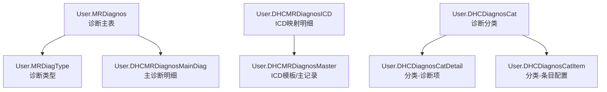
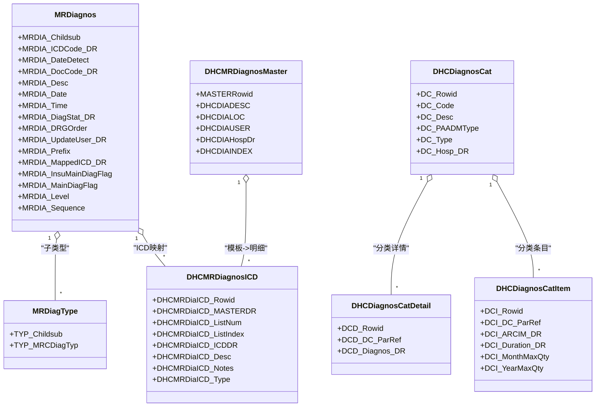
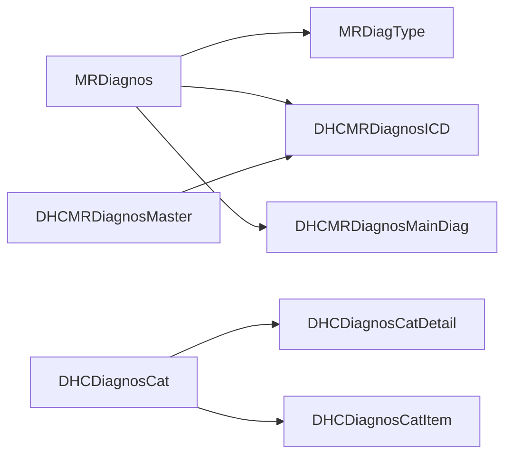

# 诊断管理表

<cite>
**本文引用的文件**
- [MRDiagnos.cls](file://src/backend/doc-ws/User/MRDiagnos.cls)
- [MRDiagType.cls](file://src/backend/doc-ws/User/MRDiagType.cls)
- [DHCDiagnosCat.cls](file://src/backend/doc-ws/User/DHCDiagnosCat.cls)
- [DHCDiagnosCatDetail.cls](file://src/backend/doc-ws/User/DHCDiagnosCatDetail.cls)
- [DHCDiagnosCatItem.cls](file://src/backend/doc-ws/User/DHCDiagnosCatItem.cls)
- [DHCMRDiagnosICD.cls](file://src/backend/doc-ws/User/DHCMRDiagnosICD.cls)
- [DHCMRDiagnosMaster.cls](file://src/backend/doc-ws/User/DHCMRDiagnosMaster.cls)
- [DHCMRDiagnosMainDiag.cls](file://src/backend/doc-ws/User/DHCMRDiagnosMainDiag.cls)
</cite>

## 目录
1. [简介](#简介)
2. [项目结构](#项目结构)
3. [核心组件](#核心组件)
4. [架构总览](#架构总览)
5. [详细组件分析](#详细组件分析)
6. [依赖关系分析](#依赖关系分析)
7. [性能考虑](#性能考虑)
8. [故障排查指南](#故障排查指南)
9. [结论](#结论)
10. [附录](#附录)

## 简介
本文件面向“诊断管理”相关数据模型与实现，围绕以下目标展开：
- 深入说明 MRDiagnos（诊断主表）、MRDiagType（诊断类型表）、DHCDiagnosCat（诊断分类表）等表的结构设计。
- 记录诊断编码体系、ICD标准集成、诊断模板管理等功能的数据实现。
- 提供诊断数据的标准化与质量控制机制说明。
- 给出诊断统计与分析的查询示例。
- 详细说明诊断主表的核心字段（诊断编码、诊断名称、确诊日期、诊断医师等）。
- 解释诊断类型的分类体系（主要诊断、次要诊断、并发症等）。
- 记录诊断分类的层级结构，支持按疾病类别组织与管理。
- 包含诊断编码与ICD标准的映射关系和更新机制。

## 项目结构
诊断管理相关代码位于后端 doc-ws 模块的 User 命名空间下，采用类定义映射到数据库表的方式组织。关键文件包括：
- 诊断主表与关联：User.MRDiagnos、User.MRDiagType、User.DHCMRDiagnosMainDiag
- ICD 映射与模板：User.DHCMRDiagnosICD、User.DHCMRDiagnosMaster
- 诊断分类：User.DHCDiagnosCat、User.DHCDiagnosCatDetail、User.DHCDiagnosCatItem

图表来源
- [MRDiagnos.cls:1-250](file://src/backend/doc-ws/User/MRDiagnos.cls#L1-L250)
- [MRDiagType.cls:1-107](file://src/backend/doc-ws/User/MRDiagType.cls#L1-L107)
- [DHCMRDiagnosICD.cls:1-132](file://src/backend/doc-ws/User/DHCMRDiagnosICD.cls#L1-L132)
- [DHCMRDiagnosMaster.cls:1-122](file://src/backend/doc-ws/User/DHCMRDiagnosMaster.cls#L1-L122)
- [DHCDiagnosCat.cls:1-84](file://src/backend/doc-ws/User/DHCDiagnosCat.cls#L1-L84)
- [DHCDiagnosCatDetail.cls:1-80](file://src/backend/doc-ws/User/DHCDiagnosCatDetail.cls#L1-L80)
- [DHCDiagnosCatItem.cls:1-73](file://src/backend/doc-ws/User/DHCDiagnosCatItem.cls#L1-L73)

章节来源
- [MRDiagnos.cls:1-250](file://src/backend/doc-ws/User/MRDiagnos.cls#L1-L250)
- [MRDiagType.cls:1-107](file://src/backend/doc-ws/User/MRDiagType.cls#L1-L107)
- [DHCDiagnosCat.cls:1-84](file://src/backend/doc-ws/User/DHCDiagnosCat.cls#L1-L84)

## 核心组件
本节聚焦三类核心实体及其职责：
- 诊断主表（MRDiagnos）：承载一次就诊的诊断记录，包含诊断编码、名称、时间、医师、状态、肿瘤分期、主次标识、医保主诊断标识等。
- 诊断类型（MRDiagType）：描述某条诊断记录的“类型”，如主要诊断、次要诊断、并发症等，通过字典引用进行统一管理。
- 诊断分类（DHCDiagnosCat）：用于对诊断进行归类管理，支持按科室/医院维度配置，并细分为“详情项”和“条目配置”。

此外，ICD 相关能力由以下表支撑：
- DHCMRDiagnosICD：诊断与 ICD 编码的映射明细，含列表序号、描述、备注、结构化中心词ID、显示ID串、诊断类型等。
- DHCMRDiagnosMaster：ICD 模板或主记录，用于集中管理诊断模板信息。
- DHCMRDiagnosMainDiag：主诊断变更明细，记录主诊断切换的时间与操作人。

章节来源
- [MRDiagnos.cls:1-250](file://src/backend/doc-ws/User/MRDiagnos.cls#L1-L250)
- [MRDiagType.cls:1-107](file://src/backend/doc-ws/User/MRDiagType.cls#L1-L107)
- [DHCDiagnosCat.cls:1-84](file://src/backend/doc-ws/User/DHCDiagnosCat.cls#L1-L84)
- [DHCMRDiagnosICD.cls:1-132](file://src/backend/doc-ws/User/DHCMRDiagnosICD.cls#L1-L132)
- [DHCMRDiagnosMaster.cls:1-122](file://src/backend/doc-ws/User/DHCMRDiagnosMaster.cls#L1-L122)
- [DHCMRDiagnosMainDiag.cls:1-122](file://src/backend/doc-ws/User/DHCMRDiagnosMainDiag.cls#L1-L122)

## 架构总览
下图展示诊断主表与其子表、ICD 映射及分类之间的关系，体现“主记录—类型—ICD映射—分类”的整体架构。

图表来源
- [MRDiagnos.cls:1-250](file://src/backend/doc-ws/User/MRDiagnos.cls#L1-L250)
- [MRDiagType.cls:1-107](file://src/backend/doc-ws/User/MRDiagType.cls#L1-L107)
- [DHCMRDiagnosICD.cls:1-132](file://src/backend/doc-ws/User/DHCMRDiagnosICD.cls#L1-L132)
- [DHCMRDiagnosMaster.cls:1-122](file://src/backend/doc-ws/User/DHCMRDiagnosMaster.cls#L1-L122)
- [DHCDiagnosCat.cls:1-84](file://src/backend/doc-ws/User/DHCDiagnosCat.cls#L1-L84)
- [DHCDiagnosCatDetail.cls:1-80](file://src/backend/doc-ws/User/DHCDiagnosCatDetail.cls#L1-L80)
- [DHCDiagnosCatItem.cls:1-73](file://src/backend/doc-ws/User/DHCDiagnosCatItem.cls#L1-L73)

## 详细组件分析

### 诊断主表（MRDiagnos）数据结构
- 诊断编码与名称
  - 诊断编码：通过引用 MRCICDDx 表示，用于对接 ICD 标准。
  - 诊断名称：使用多值字符串存储，便于扩展描述。
- 确诊时间与发现时间
  - 确诊日期/时间：用于记录诊断生效时间。
  - 发现日期/时间：用于记录首次识别诊断的时间点。
- 诊断医师与更新信息
  - 诊断医师：通过医生引用字段记录。
  - 更新用户/医院/时间：记录最近一次修改的来源。
- 诊断状态与分组
  - 诊断状态：通过字典引用管理。
  - 诊断分组：支持两组分组字段，便于统计分析。
- 肿瘤相关字段
  - 分期、淋巴结、转移、脉管侵犯、恶性程度、残留肿瘤、原发部位、肿瘤大小与备注等。
- 主次与顺序
  - 是否主诊断：标记是否为本次就诊的主要诊断。
  - 医保主诊断标识：用于医保结算的主诊断选择。
  - 诊断级别与顺序号：用于排序与展示。
- 其他业务字段
  - 工作相关标志、近似标志、前后缀文本、问卷、事故日期、风险评价、终止原因、修正关联诊断等。
- 关系与索引
  - 与 MRAdm（入院记录）建立父子关系。
  - 与诊断类型、主诊断明细存在一对多关系。
  - 定义了多个索引以优化按日期、更新时间、关联诊断等的查询。

章节来源
- [MRDiagnos.cls:1-250](file://src/backend/doc-ws/User/MRDiagnos.cls#L1-L250)
- [MRDiagnos.cls:282-792](file://src/backend/doc-ws/User/MRDiagnos.cls#L282-L792)

### 诊断类型（MRDiagType）
- 作用：为每条诊断记录附加“类型”标签，如主要诊断、次要诊断、并发症等。
- 关键字段
  - 子序号：用于在同一条诊断下区分多个类型。
  - 类型字典：通过 MRCDiagnosType 引用统一维护。
- 触发器：在增删改时触发审计与动作处理。

章节来源
- [MRDiagType.cls:1-107](file://src/backend/doc-ws/User/MRDiagType.cls#L1-L107)

### 诊断分类（DHCDiagnosCat）及其明细
- 分类主表（DHCDiagnosCat）
  - 分类编码/描述：用于标识与展示。
  - 适用场景：门诊/住院/急诊等。
  - 分类类型：专科/现金/慢病等。
  - 所属医院：支持院级隔离。
- 分类详情（DHCDiagnosCatDetail）
  - 将具体诊断（ICD）挂接到分类下，形成“分类—诊断项”的关系。
- 分类条目（DHCDiagnosCatItem）
  - 可绑定具体条目（如医嘱/治疗项），并设置时长、月/年用量上限等控制策略。

章节来源
- [DHCDiagnosCat.cls:1-84](file://src/backend/doc-ws/User/DHCDiagnosCat.cls#L1-L84)
- [DHCDiagnosCatDetail.cls:1-80](file://src/backend/doc-ws/User/DHCDiagnosCatDetail.cls#L1-L80)
- [DHCDiagnosCatItem.cls:1-73](file://src/backend/doc-ws/User/DHCDiagnosCatItem.cls#L1-L73)

### ICD 标准集成与模板管理
- ICD 映射明细（DHCMRDiagnosICD）
  - 模板主键：指向模板主记录。
  - 列表序号/总数：用于排序与分页。
  - ICD 编码与描述：标准编码与中文描述。
  - 备注与结构化中心词：便于检索与展示。
  - 诊断类型：用于区分不同用途的 ICD 映射。
- 模板主记录（DHCMRDiagnosMaster）
  - 描述、位置、用户、医院、索引等，作为模板聚合点。
- 主诊断变更明细（DHCMRDiagnosMainDiag）
  - 记录主诊断变更的时间、时间与操作人，支持追溯。

章节来源
- [DHCMRDiagnosICD.cls:1-132](file://src/backend/doc-ws/User/DHCMRDiagnosICD.cls#L1-L132)
- [DHCMRDiagnosMaster.cls:1-122](file://src/backend/doc-ws/User/DHCMRDiagnosMaster.cls#L1-L122)
- [DHCMRDiagnosMainDiag.cls:1-122](file://src/backend/doc-ws/User/DHCMRDiagnosMainDiag.cls#L1-L122)

### 诊断数据标准化与质量控制
- 标准化
  - 诊断编码统一通过 ICD 字典引用，确保编码规范。
  - 诊断名称采用多值存储，支持多语言或多表述。
  - 诊断类型通过字典统一管理，避免自由文本带来的不一致。
- 质量控制
  - 主诊断标识与医保主诊断标识分离，满足临床与结算双重需求。
  - 诊断状态、风险评价、严重程度等字段辅助质控规则。
  - 主诊断变更记录（时间、人员）保障可追溯性。
  - 分类与条目配置（时长、用量上限）用于事前/事中控制。

章节来源
- [MRDiagnos.cls:1-250](file://src/backend/doc-ws/User/MRDiagnos.cls#L1-L250)
- [MRDiagType.cls:1-107](file://src/backend/doc-ws/User/MRDiagType.cls#L1-L107)
- [DHCMRDiagnosMainDiag.cls:1-122](file://src/backend/doc-ws/User/DHCMRDiagnosMainDiag.cls#L1-L122)
- [DHCDiagnosCatItem.cls:1-73](file://src/backend/doc-ws/User/DHCDiagnosCatItem.cls#L1-L73)

### 诊断统计与分析查询示例
以下为常用统计与分析的 SQL 思路（基于现有表结构）：
- 统计某时间段内各诊断编码的出现次数（按诊断主表）
  - 思路：按诊断编码分组计数，过滤确诊日期范围。
- 统计主要诊断占比（结合主次标识）
  - 思路：筛选主诊断标志为是，按诊断编码分组计算比例。
- 统计医保主诊断分布
  - 思路：筛选医保主诊断标志为是，按编码分组统计。
- 查询某分类下的诊断项
  - 思路：从分类主表关联详情表，获取对应诊断编码集合。
- 查询 ICD 映射清单
  - 思路：从模板主记录关联明细，按列表序号排序输出。

注意：以上为查询思路与字段依据，实际 SQL 需根据数据库方言与索引策略优化。

章节来源
- [MRDiagnos.cls:1-250](file://src/backend/doc-ws/User/MRDiagnos.cls#L1-L250)
- [DHCDiagnosCatDetail.cls:1-80](file://src/backend/doc-ws/User/DHCDiagnosCatDetail.cls#L1-L80)
- [DHCMRDiagnosICD.cls:1-132](file://src/backend/doc-ws/User/DHCMRDiagnosICD.cls#L1-L132)

## 依赖关系分析
- 诊断主表依赖
  - 诊断类型：一对多，用于标注诊断角色。
  - ICD 映射：一对多，用于标准编码落地。
  - 主诊断明细：一对多，用于主诊断变更追踪。
- 分类体系依赖
  - 分类主表：一对多关联详情与条目，形成“分类—诊断项/条目”的树状结构。
- 模板管理依赖
  - 模板主记录：一对多关联 ICD 映射明细，支撑批量导入与复用。

图表来源
- [MRDiagnos.cls:1-250](file://src/backend/doc-ws/User/MRDiagnos.cls#L1-L250)
- [MRDiagType.cls:1-107](file://src/backend/doc-ws/User/MRDiagType.cls#L1-L107)
- [DHCMRDiagnosICD.cls:1-132](file://src/backend/doc-ws/User/DHCMRDiagnosICD.cls#L1-L132)
- [DHCMRDiagnosMaster.cls:1-122](file://src/backend/doc-ws/User/DHCMRDiagnosMaster.cls#L1-L122)
- [DHCDiagnosCat.cls:1-84](file://src/backend/doc-ws/User/DHCDiagnosCat.cls#L1-L84)
- [DHCDiagnosCatDetail.cls:1-80](file://src/backend/doc-ws/User/DHCDiagnosCatDetail.cls#L1-L80)
- [DHCDiagnosCatItem.cls:1-73](file://src/backend/doc-ws/User/DHCDiagnosCatItem.cls#L1-L73)

章节来源
- [MRDiagnos.cls:1-250](file://src/backend/doc-ws/User/MRDiagnos.cls#L1-L250)
- [DHCDiagnosCat.cls:1-84](file://src/backend/doc-ws/User/DHCDiagnosCat.cls#L1-L84)

## 性能考虑
- 索引策略
  - 诊断主表针对日期、更新时间、关联诊断等建立了索引，利于按时间范围与关联关系查询。
  - ICD 映射与模板主记录提供了按模板、列表序号的索引，便于批量加载与排序。
- 存储策略
  - 使用分片/全局索引与流式存储，降低大对象对查询的影响。
- 建议
  - 对高频查询字段（如诊断编码、主诊断标志、日期）建立合适索引。
  - 对大批量导入场景，优先使用模板主记录+明细的批量写入方式。

[本节为通用性能建议，不直接分析具体文件]

## 故障排查指南
- 主诊断变更无法追溯
  - 检查主诊断明细表是否记录了变更时间、时间与操作人。
- 诊断编码不匹配
  - 核对 ICD 映射明细中的编码与描述是否与字典一致。
- 分类未生效
  - 确认分类主表与详情表的关联是否正确，条目配置是否设置了合适的时长与用量限制。
- 审计日志缺失
  - 检查触发器是否启用，增删改事件是否触发了审计动作。

章节来源
- [DHCMRDiagnosMainDiag.cls:1-122](file://src/backend/doc-ws/User/DHCMRDiagnosMainDiag.cls#L1-L122)
- [DHCMRDiagnosICD.cls:1-132](file://src/backend/doc-ws/User/DHCMRDiagnosICD.cls#L1-L132)
- [DHCDiagnosCatDetail.cls:1-80](file://src/backend/doc-ws/User/DHCDiagnosCatDetail.cls#L1-L80)
- [DHCDiagnosCatItem.cls:1-73](file://src/backend/doc-ws/User/DHCDiagnosCatItem.cls#L1-L73)

## 结论
本方案通过“诊断主表—类型—ICD映射—分类—模板”的多层结构，实现了诊断数据的标准化、可追溯与可分析。借助字典化编码、模板化管理与分类体系，既能满足临床书写习惯，又能支撑医保结算与科研统计。建议在实施中重点关注：
- 编码与字典的一致性校验
- 主诊断变更的可追溯性
- 分类与条目配置的合理性与约束
- 查询性能与索引优化

[本节为总结性内容，不直接分析具体文件]

## 附录
- 术语说明
  - 诊断主表：记录一次就诊的所有诊断信息。
  - 诊断类型：标注诊断的角色（主要、次要、并发症等）。
  - 诊断分类：对诊断进行归类管理的层级结构。
  - ICD 映射：将本地诊断与 ICD 标准编码关联。
  - 模板管理：集中维护诊断模板与映射明细。

[本节为概念性说明，不直接分析具体文件]