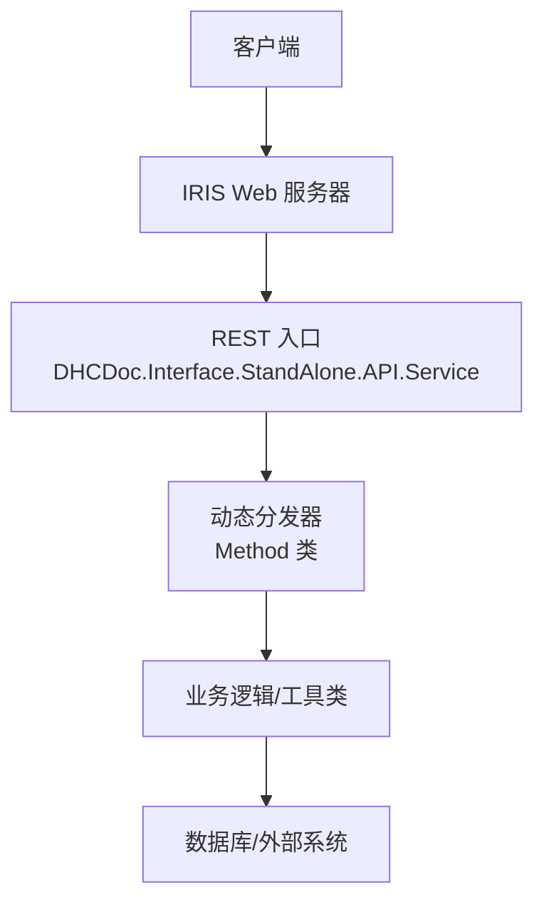
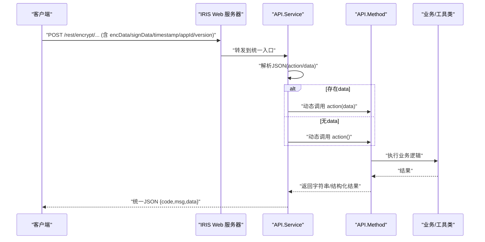
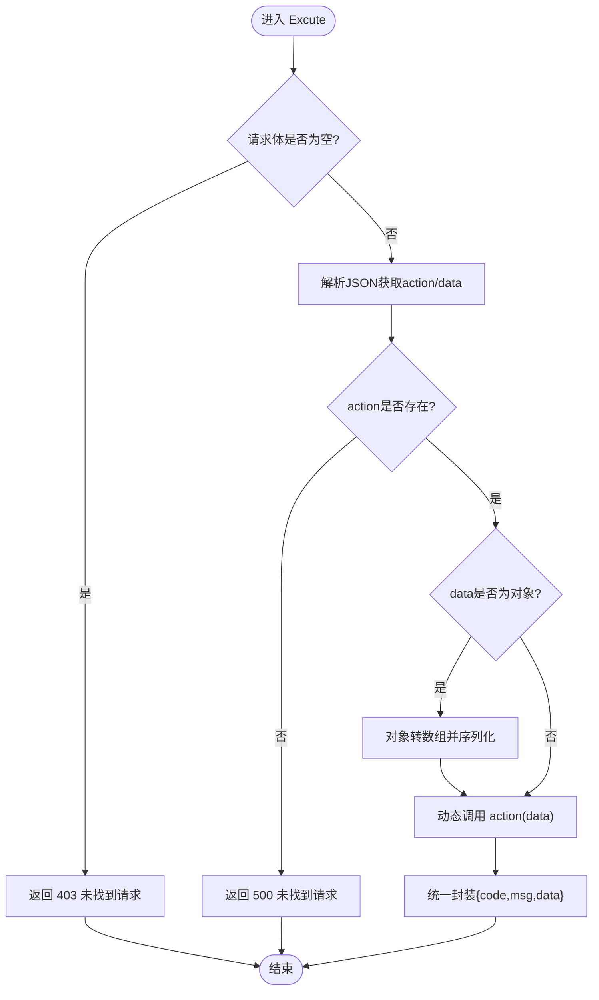
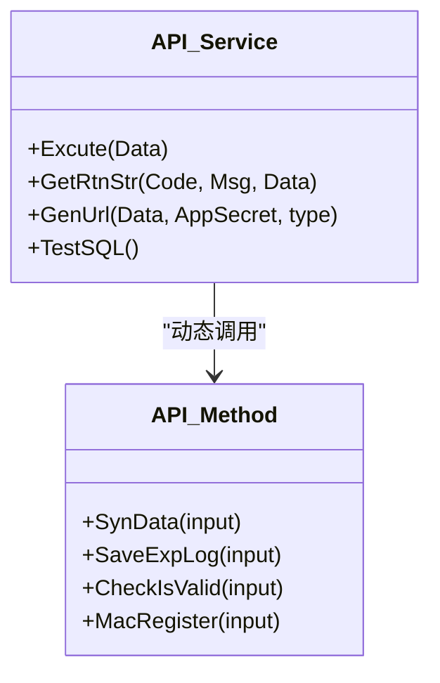
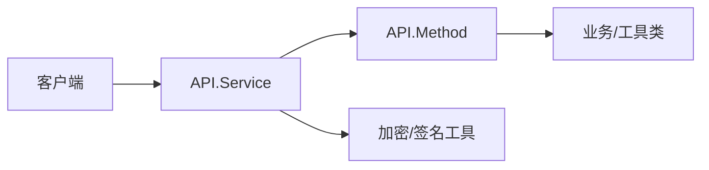

# API接口文档

<cite>
**本文引用的文件**
- [README.md](file://README.md)
- [Service.cls](file://src/backend/conting-ws/DHCDoc/Interface/StandAlone/API/Service.cls)
- [Method.cls](file://src/backend/conting-ws/DHCDoc/Interface/StandAlone/API/Method.cls)
</cite>

## 目录
1. [简介](#简介)
2. [项目结构](#项目结构)
3. [核心组件](#核心组件)
4. [架构总览](#架构总览)
5. [详细组件分析](#详细组件分析)
6. [依赖关系分析](#依赖关系分析)
7. [性能考虑](#性能考虑)
8. [故障排查指南](#故障排查指南)
9. [结论](#结论)
10. [附录](#附录)

## 简介
本文件为 IRIS HIS（医院信息系统）项目的 API 接口文档，聚焦后端提供的 Web 服务与数据交换格式。系统后端基于 InterSystems IRIS ObjectScript，前端采用 CSP + jQuery/HISUI。当前仓库中可明确识别的对外 RESTful 入口位于“应急系统”模块，提供统一的加密请求入口、动态方法分发、日志记录、终端校验与注册等能力。本文档将据此整理：
- RESTful API 的 HTTP 方法、URL 模式、请求/响应结构与认证方式
- 错误处理策略与安全注意事项
- 常见用例与客户端实现要点
- 调试与监控建议

说明：
- 本项目未在当前仓库中发现 WebSocket 相关代码；如后续引入，可在本文件中补充相应章节。
- 其他子系统（医生工作站、治疗、牙科、门诊挂号等）的前端通过 CSP 页面调用后端对象方法，但具体路由与参数契约需结合部署配置与页面脚本进一步确认；本文仅对已定位到的 REST 入口进行规范描述。

## 项目结构
- 后端代码位于 src/backend，按产品域划分（如 conting-ws 应急系统、doc-ws 医生工作站、cure-ws 治疗系统等）。
- 前端代码位于 src/frontend，按产品域划分，使用 CSP 页面与静态资源。
- 根 README 提供了部署、SFTP 上传、IRIS 连接与编译流程等上下文信息。

图表来源
- [Service.cls:1-158](file://src/backend/conting-ws/DHCDoc/Interface/StandAlone/API/Service.cls#L1-L158)
- [Method.cls:1-95](file://src/backend/conting-ws/DHCDoc/Interface/StandAlone/API/Method.cls#L1-L95)

章节来源
- [README.md:1-549](file://README.md#L1-L549)

## 核心组件
- 统一 REST 入口与服务编排：负责接收加密请求、解析 action、动态调用目标方法并统一封装返回结构。
- 方法调度与通用能力：提供数据下载、日志写入、终端校验与注册等通用方法。
- 安全与版本控制：在生成请求时包含时间戳、应用标识、加密与签名参数，并在 URL 中声明版本与算法类型。

章节来源
- [Service.cls:1-158](file://src/backend/conting-ws/DHCDoc/Interface/StandAlone/API/Service.cls#L1-L158)
- [Method.cls:1-95](file://src/backend/conting-ws/DHCDoc/Interface/StandAlone/API/Method.cls#L1-L95)

## 架构总览
下图展示了从客户端到后端的请求链路：客户端构造加密请求并携带签名与版本信息，IRIS Web 服务器路由至统一入口 Service，Service 解析 action 并动态调用 Method 中的对应方法，最终返回统一结构的 JSON 响应。

图表来源
- [Service.cls:8-36](file://src/backend/conting-ws/DHCDoc/Interface/StandAlone/API/Service.cls#L8-L36)
- [Service.cls:46-54](file://src/backend/conting-ws/DHCDoc/Interface/StandAlone/API/Service.cls#L46-L54)
- [Method.cls:16-37](file://src/backend/conting-ws/DHCDoc/Interface/StandAlone/API/Method.cls#L16-L37)

## 详细组件分析

### 统一REST入口（Service）
- 职责
  - 接收并解析 JSON 请求体，提取 action 与 data。
  - 根据 action 动态调用 Method 中的同名方法，支持带参与无参两种调用。
  - 统一封装返回结构 {code, msg, data}。
  - 提供辅助方法用于生成加密请求参数（GET/POST 两种模式）、测试 SQL 执行与测试 URL 生成。
- 关键行为
  - 异常捕获：发生异常时返回 500 及错误消息。
  - 空输入保护：当请求体为空或 action 缺失时返回 403/500 提示。
  - 数据转换：当 data 为对象时转换为数组再序列化为 JSON 字符串，便于动态调用。
- 安全与版本
  - 生成 GET 链接时拼接 version、encType、signType 等查询参数。
  - 使用 SM4 加密数据体，SM3 计算签名，附带 timestamp 与 appId。

图表来源
- [Service.cls:8-36](file://src/backend/conting-ws/DHCDoc/Interface/StandAlone/API/Service.cls#L8-L36)
- [Service.cls:46-54](file://src/backend/conting-ws/DHCDoc/Interface/StandAlone/API/Service.cls#L46-L54)

章节来源
- [Service.cls:8-36](file://src/backend/conting-ws/DHCDoc/Interface/StandAlone/API/Service.cls#L8-L36)
- [Service.cls:46-54](file://src/backend/conting-ws/DHCDoc/Interface/StandAlone/API/Service.cls#L46-L54)
- [Service.cls:114-133](file://src/backend/conting-ws/DHCDoc/Interface/StandAlone/API/Service.cls#L114-L133)

### 方法调度与通用能力（Method）
- 职责
  - 提供通用方法：数据下载（SynData）、日志写入（SaveExpLog）、终端有效性检查（CheckIsValid）、终端注册（MacRegister）。
  - 将 JSON 输入解析为键值数组，调用底层业务类完成操作。
- 典型流程
  - SynData：解析 classname/methodname/index/num，调用 Util 执行并分块输出流式数据。
  - SaveExpLog：解析 terminalNo/expStatus/msg/logRowId，写入日志表。
  - CheckIsValid/MacRegister：解析终端号或注册参数，返回 code^msg 形式的结果，再由 Service 统一包装。

图表来源
- [Method.cls:16-92](file://src/backend/conting-ws/DHCDoc/Interface/StandAlone/API/Method.cls#L16-L92)
- [Service.cls:8-36](file://src/backend/conting-ws/DHCDoc/Interface/StandAlone/API/Service.cls#L8-L36)

章节来源
- [Method.cls:16-92](file://src/backend/conting-ws/DHCDoc/Interface/StandAlone/API/Method.cls#L16-L92)

### 认证机制与安全
- 认证要素
  - appId：第三方系统标识。
  - encData：使用 SM4 加密的请求体。
  - signData：使用 SM3 对特定拼接串计算的签名。
  - timestamp：请求时间戳。
  - version：接口版本号。
  - encType/signType：加密与签名算法标识。
- 生成规则
  - 服务端提供 GenUrl 方法，用于生成 GET 请求的完整 URL 或 POST 所需的 JSON 参数集合。
  - 拼接串包含 Data、appId、AppSecret、timestamp，并使用 SM3 计算签名。
  - 请求体使用 SM4 加密。
- 安全建议
  - 传输层建议使用 HTTPS。
  - 严格校验 timestamp 防重放攻击（例如限定时间窗口）。
  - 限制 appId 与 AppSecret 的可见范围，避免泄露。
  - 对敏感字段进行最小化传输。

章节来源
- [Service.cls:114-133](file://src/backend/conting-ws/DHCDoc/Interface/StandAlone/API/Service.cls#L114-L133)

### RESTful API 清单

- 基础信息
  - 协议：HTTP/HTTPS
  - 内容类型：application/json
  - 字符编码：UTF-8
  - 版本：version=1.1.0（由服务端生成参数体现）

- 统一入口
  - 路径：/rest/encrypt/...（实际路径以部署为准，示例见服务端生成的 URL）
  - 方法：GET 或 POST
  - 认证：需在请求中携带 appId、encData、signData、timestamp、version、encType、signType
  - 请求体（POST）：JSON 字符串，至少包含 action，可选 data
  - 响应体：JSON 对象 {code, msg, data}

- 可用 action（基于 Method 暴露的方法）
  - action=SynData
    - 用途：分页下载指定类的数据
    - 请求参数（data 内）：classname、methodname、index、num
    - 响应：统一结构，data 为流式输出的数据片段
  - action=SaveExpLog
    - 用途：写入运行日志
    - 请求参数（data 内）：terminalNo、expStatus、msg、logRowId
    - 响应：统一结构
  - action=CheckIsValid
    - 用途：校验终端有效性
    - 请求参数（data 内）：terminalNo
    - 响应：统一结构
  - action=MacRegister
    - 用途：终端注册
    - 请求参数（data 内）：params（终端Mac地址^机器码^IP^备注）
    - 响应：统一结构

- 示例（概念性）
  - GET 示例（由服务端生成）：<external-url>
  - POST 示例：
    - URL：同上（不含查询参数）
    - Header：Content-Type: application/json
    - Body：{"action":"CheckIsValid","data":{"terminalNo":"A01"}}

注意：
- 上述 URL 与参数来源于服务端生成逻辑，实际部署路径可能不同。
- 所有 action 均通过统一入口分发，无需为每个功能单独定义路由。

章节来源
- [Service.cls:56-67](file://src/backend/conting-ws/DHCDoc/Interface/StandAlone/API/Service.cls#L56-L67)
- [Service.cls:69-82](file://src/backend/conting-ws/DHCDoc/Interface/StandAlone/API/Service.cls#L69-L82)
- [Service.cls:84-112](file://src/backend/conting-ws/DHCDoc/Interface/StandAlone/API/Service.cls#L84-L112)
- [Service.cls:114-133](file://src/backend/conting-ws/DHCDoc/Interface/StandAlone/API/Service.cls#L114-L133)
- [Method.cls:16-92](file://src/backend/conting-ws/DHCDoc/Interface/StandAlone/API/Method.cls#L16-L92)

### 错误处理
- 统一响应结构
  - code：状态码（如 403、500 等）
  - msg：人类可读的错误信息
  - data：业务数据或空
- 常见错误
  - 请求体为空或 action 缺失：返回 403/500
  - 运行时异常：捕获异常并返回 500 与错误消息
- 建议
  - 客户端应依据 code 判断成功与否，并对 msg 做用户友好展示。
  - 对 5xx 错误实施重试与退避策略。

章节来源
- [Service.cls:8-36](file://src/backend/conting-ws/DHCDoc/Interface/StandAlone/API/Service.cls#L8-L36)
- [Service.cls:46-54](file://src/backend/conting-ws/DHCDoc/Interface/StandAlone/API/Service.cls#L46-L54)

### 速率限制与并发
- 当前代码未内置速率限制逻辑。
- 建议在网关或 IRIS 层面实施限流与并发控制，防止恶意刷接口或突发流量冲击。
- 对于大数据量下载（SynData），建议客户端合理设置 index/num，避免单次拉取过大导致内存压力。

[本节为通用建议，不直接分析具体文件]

### 版本管理
- 接口版本通过 version 参数声明（示例为 1.1.0）。
- 建议客户端在升级时兼容旧版本，服务端保留历史版本路由或兼容逻辑。

章节来源
- [Service.cls:114-133](file://src/backend/conting-ws/DHCDoc/Interface/StandAlone/API/Service.cls#L114-L133)

### WebSocket API
- 当前仓库未发现 WebSocket 相关实现。
- 若未来引入实时交互需求，可在本文件中补充连接建立、消息协议、事件类型与断线重连策略。

[本节为占位说明，不直接分析具体文件]

## 依赖关系分析
- Service 依赖 Method 提供具体能力，并通过动态调用机制解耦 action 与实现。
- Method 依赖底层业务类（如 ExpLog、MacManager、Util）完成数据访问与业务处理。
- 安全相关依赖加密与哈希工具（SM4、SM3）用于数据机密性与完整性校验。

图表来源
- [Service.cls:8-36](file://src/backend/conting-ws/DHCDoc/Interface/StandAlone/API/Service.cls#L8-L36)
- [Method.cls:16-92](file://src/backend/conting-ws/DHCDoc/Interface/StandAlone/API/Method.cls#L16-L92)

章节来源
- [Service.cls:8-36](file://src/backend/conting-ws/DHCDoc/Interface/StandAlone/API/Service.cls#L8-L36)
- [Method.cls:16-92](file://src/backend/conting-ws/DHCDoc/Interface/StandAlone/API/Method.cls#L16-L92)

## 性能考虑
- 数据下载（SynData）采用流式读取与分块输出，降低内存占用。
- 建议客户端：
  - 合理设置分页参数，避免一次性拉取过多数据。
  - 对大响应进行增量处理，减少前端渲染压力。
- 服务端：
  - 关注数据库查询性能与索引优化。
  - 在高并发场景下评估锁竞争与事务粒度。

[本节为通用建议，不直接分析具体文件]

## 故障排查指南
- 常见问题
  - 403/500：检查请求体是否为空、action 是否正确、签名与加密是否匹配。
  - 数据下载不完整：检查 index/num 设置与流式读取逻辑。
  - 终端校验失败：核对 terminalNo 与注册信息。
- 调试建议
  - 使用服务端提供的测试 URL 生成方法验证加密与签名流程。
  - 开启服务端日志，记录请求体与返回体，便于定位问题。
  - 对网络层启用抓包，确认请求头与参数完整性。

章节来源
- [Service.cls:8-36](file://src/backend/conting-ws/DHCDoc/Interface/StandAlone/API/Service.cls#L8-L36)
- [Service.cls:114-133](file://src/backend/conting-ws/DHCDoc/Interface/StandAlone/API/Service.cls#L114-L133)
- [Method.cls:16-92](file://src/backend/conting-ws/DHCDoc/Interface/StandAlone/API/Method.cls#L16-L92)

## 结论
本仓库提供了基于 IRIS 的统一 REST 入口，通过加密与签名保障数据安全，并以动态分发的方式扩展新能力。客户端应遵循统一的请求结构与认证流程，合理处理分页与错误，并结合网关与服务器侧的限流与监控策略提升整体稳定性与可观测性。

[本节为总结性内容，不直接分析具体文件]

## 附录
- 快速上手
  - 使用服务端 GenUrl 生成 GET 请求 URL，验证加密与签名。
  - 构造 POST 请求，携带 JSON 请求体与必要认证参数。
  - 根据返回 code 判断成功与否，并处理 msg 提示。
- 参考
  - 项目 README 提供了部署、SFTP 上传与 IRIS 连接配置等背景信息。

章节来源
- [README.md:1-549](file://README.md#L1-L549)