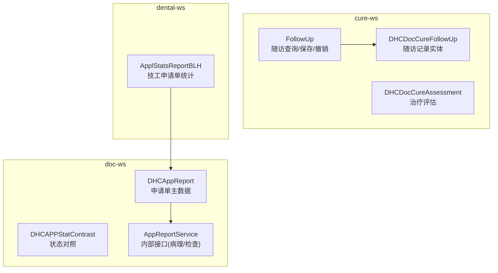
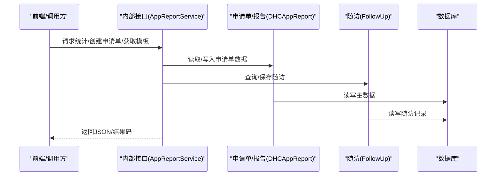
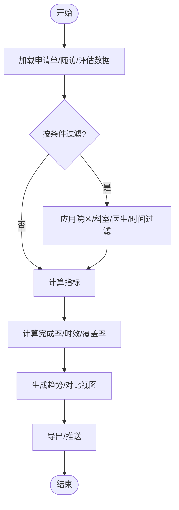
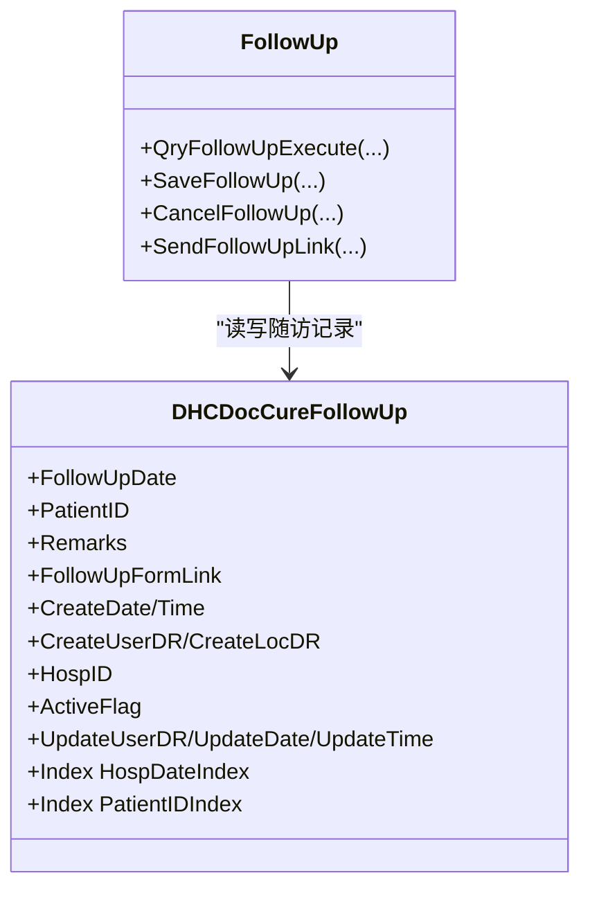
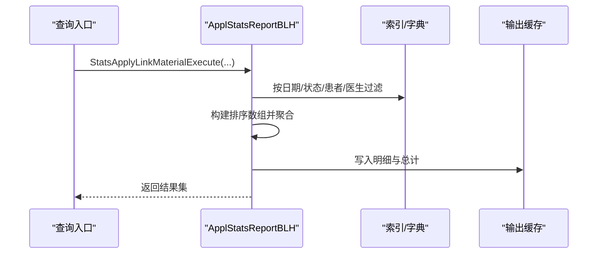
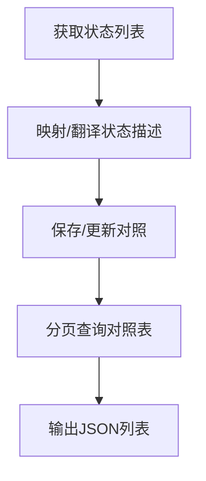
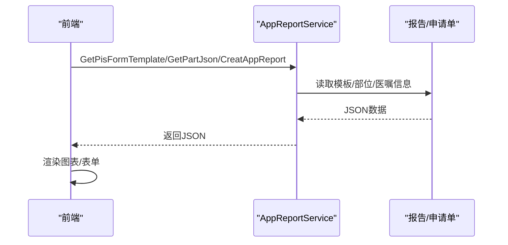
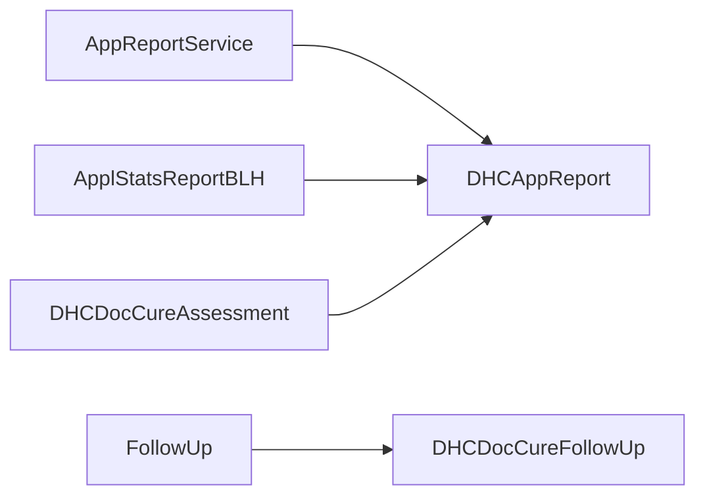

# 报表分析

<cite>
**本文引用的文件**
- [DHCAppReport.cls](file://src/backend/doc-ws/User/DHCAppReport.cls)
- [FollowUp.cls](file://src/backend/cure-ws/DHCDoc/DHCDocCure/FollowUp.cls)
- [DHCDocCureFollowUp.cls](file://src/backend/cure-ws/User/DHCDocCureFollowUp.cls)
- [ApplStatsReportBLH.cls](file://src/backend/dental-ws/DHCDoc/Dental/TA/ApplStatsReportBLH.cls)
- [DHCDocCureAssessment.cls](file://src/backend/cure-ws/User/DHCDocCureAssessment.cls)
- [DHCAPPStatContrast.cls](file://src/backend/doc-ws/web/DHCAPPStatContrast.cls)
- [AppReportService.cls](file://src/backend/public-mc/DHCDoc/Interface/Inside/AppReportService.cls)
</cite>

## 目录
1. [简介](#简介)
2. [项目结构](#项目结构)
3. [核心组件](#核心组件)
4. [架构总览](#架构总览)
5. [详细组件分析](#详细组件分析)
6. [依赖关系分析](#依赖关系分析)
7. [性能考虑](#性能考虑)
8. [故障排查指南](#故障排查指南)
9. [结论](#结论)
10. [附录](#附录)

## 简介
本文件围绕“报表分析”能力，系统梳理治疗完成率统计、随访管理、工作量分析等核心功能；说明随访计划的管理、自动提醒与结果收集机制；文档化各类统计报表的数据来源、计算逻辑与展示方式；解释治疗效果评估指标、趋势分析与对比报告；覆盖自定义报表配置、定时生成与数据导出；并给出权限控制、数据安全与访问审计要点，以及API接口与前端图表组件使用指南。

## 项目结构
后端以多子系统（doc-ws、cure-ws、dental-ws、public-mc）提供报表与随访相关能力：
- doc-ws：申请单与报告主数据、状态对照、内部服务接口
- cure-ws：治疗随访、治疗评估、队列与执行状态
- dental-ws：技工申请单统计报表
- public-mc：跨系统内部接口（如病理申请单创建、模板获取）

**图示来源**
- [DHCAppReport.cls:1-275](file://src/backend/doc-ws/User/DHCAppReport.cls#L1-L275)
- [FollowUp.cls:1-228](file://src/backend/cure-ws/DHCDoc/DHCDocCure/FollowUp.cls#L1-L228)
- [DHCDocCureFollowUp.cls:1-106](file://src/backend/cure-ws/User/DHCDocCureFollowUp.cls#L1-L106)
- [ApplStatsReportBLH.cls:1-243](file://src/backend/dental-ws/DHCDoc/Dental/TA/ApplStatsReportBLH.cls#L1-L243)
- [AppReportService.cls:1-521](file://src/backend/public-mc/DHCDoc/Interface/Inside/AppReportService.cls#L1-L521)

**章节来源**
- [DHCAppReport.cls:1-275](file://src/backend/doc-ws/User/DHCAppReport.cls#L1-L275)
- [FollowUp.cls:1-228](file://src/backend/cure-ws/DHCDoc/DHCDocCure/FollowUp.cls#L1-L228)
- [DHCDocCureFollowUp.cls:1-106](file://src/backend/cure-ws/User/DHCDocCureFollowUp.cls#L1-L106)
- [ApplStatsReportBLH.cls:1-243](file://src/backend/dental-ws/DHCDoc/Dental/TA/ApplStatsReportBLH.cls#L1-L243)
- [AppReportService.cls:1-521](file://src/backend/public-mc/DHCDoc/Interface/Inside/AppReportService.cls#L1-L521)

## 核心组件
- 申请单与报告主数据：用于统计申请量、完成量、时效等指标
- 随访管理与评估：支撑治疗完成率、随访覆盖率、疗效评估
- 工作量统计：按科室/医生/患者维度聚合工作量与材料金额
- 内部接口：为外部系统提供表单模板、申请单创建等能力

**章节来源**
- [DHCAppReport.cls:1-275](file://src/backend/doc-ws/User/DHCAppReport.cls#L1-L275)
- [FollowUp.cls:1-228](file://src/backend/cure-ws/DHCDoc/DHCDocCure/FollowUp.cls#L1-L228)
- [DHCDocCureFollowUp.cls:1-106](file://src/backend/cure-ws/User/DHCDocCureFollowUp.cls#L1-L106)
- [ApplStatsReportBLH.cls:1-243](file://src/backend/dental-ws/DHCDoc/Dental/TA/ApplStatsReportBLH.cls#L1-L243)
- [AppReportService.cls:1-521](file://src/backend/public-mc/DHCDoc/Interface/Inside/AppReportService.cls#L1-L521)

## 架构总览

**图示来源**
- [AppReportService.cls:72-279](file://src/backend/public-mc/DHCDoc/Interface/Inside/AppReportService.cls#L72-L279)
- [DHCAppReport.cls:1-275](file://src/backend/doc-ws/User/DHCAppReport.cls#L1-L275)
- [FollowUp.cls:13-120](file://src/backend/cure-ws/DHCDoc/DHCDocCure/FollowUp.cls#L13-L120)

## 详细组件分析

### 治疗完成率统计（基于申请单与随访/评估）
- 数据来源
  - 申请单主数据：申请号、申请日期/时间、预约日期/时间、登记日期/时间、报告日期/时间、审核日期/时间、是否加急、发送标志、报告状态、执行科室、申请科室、诊断等
  - 随访记录：随访日期、备注、表单链接、有效标志、院区、创建/更新信息
  - 治疗评估：评估内容、提交状态、有效状态、关联执行记录、模板ID/类型
- 计算逻辑
  - 完成率 = 已审核/已报告的申请单数 / 应完成的申请单数（可按院区、科室、医生、时间段筛选）
  - 时效指标：从申请到登记、从登记到报告、从报告到审核的耗时分布
  - 随访覆盖率：有随访记录的申请单占比
  - 疗效评估：基于评估提交状态与内容字段进行汇总
- 展示方式
  - 列表：申请单明细、随访明细、评估明细
  - 汇总：按维度聚合数量、金额、时效区间分布
  - 趋势：按月/周/日绘制完成率、时效变化曲线

**图示来源**
- [DHCAppReport.cls:1-275](file://src/backend/doc-ws/User/DHCAppReport.cls#L1-L275)
- [FollowUp.cls:13-120](file://src/backend/cure-ws/DHCDoc/DHCDocCure/FollowUp.cls#L13-L120)
- [DHCDocCureAssessment.cls:1-164](file://src/backend/cure-ws/User/DHCDocCureAssessment.cls#L1-L164)

**章节来源**
- [DHCAppReport.cls:1-275](file://src/backend/doc-ws/User/DHCAppReport.cls#L1-L275)
- [FollowUp.cls:13-120](file://src/backend/cure-ws/DHCDoc/DHCDocCure/FollowUp.cls#L13-L120)
- [DHCDocCureAssessment.cls:1-164](file://src/backend/cure-ws/User/DHCDocCureAssessment.cls#L1-L164)

### 随访管理（计划、提醒、结果收集）
- 管理能力
  - 查询：支持按患者、姓名、日期范围、院区等多维检索
  - 保存：新建或更新随访记录，含日期、备注、表单链接、院区、操作人
  - 撤销：将记录置为无效并记录更新信息
  - 发送链接：将随访表单链接发送给外部系统（预留扩展点）
- 数据结构
  - 随访记录实体包含随访日期、患者ID、备注、表单链接、创建/更新时间与人员、院区、有效标志等
  - 索引：按院区+随访日期、患者ID建立索引以提升查询效率
- 自动提醒与结果收集
  - 通过索引遍历与日期范围扫描定位待随访任务
  - 可结合外部消息接口发送提醒（代码中预留扩展点）
  - 结果收集通过表单链接回写至随访记录

**图示来源**
- [FollowUp.cls:13-224](file://src/backend/cure-ws/DHCDoc/DHCDocCure/FollowUp.cls#L13-L224)
- [DHCDocCureFollowUp.cls:1-106](file://src/backend/cure-ws/User/DHCDocCureFollowUp.cls#L1-L106)

**章节来源**
- [FollowUp.cls:13-224](file://src/backend/cure-ws/DHCDoc/DHCDocCure/FollowUp.cls#L13-L224)
- [DHCDocCureFollowUp.cls:1-106](file://src/backend/cure-ws/User/DHCDocCureFollowUp.cls#L1-L106)

### 工作量分析（技工申请单统计）
- 统计维度
  - 按患者、申请单号、状态、接收单位、申请医生、计划交货日期等筛选
  - 输出材料明细（名称、数量、单价、金额）、技工评分、打印次数、备注等
- 计算逻辑
  - 根据计划交货日期或状态变更日期遍历索引，过滤后聚合
  - 累计材料金额与数量，输出总计行
- 展示方式
  - 列表：每条申请单的材料明细与汇总
  - 汇总：按科室/医生/患者分组统计数量与金额

**图示来源**
- [ApplStatsReportBLH.cls:13-128](file://src/backend/dental-ws/DHCDoc/Dental/TA/ApplStatsReportBLH.cls#L13-L128)
- [ApplStatsReportBLH.cls:130-239](file://src/backend/dental-ws/DHCDoc/Dental/TA/ApplStatsReportBLH.cls#L130-L239)

**章节来源**
- [ApplStatsReportBLH.cls:13-239](file://src/backend/dental-ws/DHCDoc/Dental/TA/ApplStatsReportBLH.cls#L13-L239)

### 治疗效果评估与对比报告
- 评估数据
  - 评估内容、提交状态、有效状态、关联执行记录、模板ID/类型
- 对比报告
  - 状态对照维护：映射外部系统状态与本系统状态，便于统一统计
  - 支持新增/修改/删除对照项，并提供分页查询

**图示来源**
- [DHCDocCureAssessment.cls:1-164](file://src/backend/cure-ws/User/DHCDocCureAssessment.cls#L1-L164)
- [DHCAPPStatContrast.cls:14-204](file://src/backend/doc-ws/web/DHCAPPStatContrast.cls#L14-L204)

**章节来源**
- [DHCDocCureAssessment.cls:1-164](file://src/backend/cure-ws/User/DHCDocCureAssessment.cls#L1-L164)
- [DHCAPPStatContrast.cls:14-204](file://src/backend/doc-ws/web/DHCAPPStatContrast.cls#L14-L204)

### 自定义报表配置、定时生成与导出
- 配置
  - 通过状态对照与模板字段定义报表维度与展示字段
  - 利用索引与过滤条件组合实现灵活查询
- 定时生成
  - 可通过后台任务按日期范围触发统计流程（参考统计查询的执行模式）
- 导出
  - 将查询结果序列化为JSON或CSV供前端下载或第三方系统消费

[本节为通用实践说明，不直接引用具体文件]

### 权限控制、数据安全与访问审计
- 权限控制
  - 会话中包含院区、用户、科室等信息，查询时按院区过滤
  - 对敏感字段（如诊断、备注）进行最小化暴露
- 数据安全
  - 使用索引减少全表扫描，降低泄露面
  - 对外部系统调用采用白名单与签名校验（建议）
- 访问审计
  - 记录创建/更新人与时间，便于追溯
  - 关键操作（如撤销随访、发送链接）需记录日志

**章节来源**
- [FollowUp.cls:123-179](file://src/backend/cure-ws/DHCDoc/DHCDocCure/FollowUp.cls#L123-L179)
- [DHCDocCureFollowUp.cls:1-106](file://src/backend/cure-ws/User/DHCDocCureFollowUp.cls#L1-L106)

### API接口与前端图表组件使用指南
- 内部接口（AppReportService）
  - 获取部位/体位/后处理信息：GetPartJson
  - 获取申请单信息：GetAppReportInfo
  - 创建申请单：CreatAppReport
  - 创建病理申请单：CreatPisReport
  - 获取病理表单模板：GetPisFormTemplate
- 前端图表
  - 基于返回的JSON数据渲染折线/柱状/饼图
  - 支持按维度切换、时间轴滑动、下钻明细

**图示来源**
- [AppReportService.cls:7-70](file://src/backend/public-mc/DHCDoc/Interface/Inside/AppReportService.cls#L7-L70)
- [AppReportService.cls:72-279](file://src/backend/public-mc/DHCDoc/Interface/Inside/AppReportService.cls#L72-L279)
- [AppReportService.cls:282-521](file://src/backend/public-mc/DHCDoc/Interface/Inside/AppReportService.cls#L282-L521)

**章节来源**
- [AppReportService.cls:7-521](file://src/backend/public-mc/DHCDoc/Interface/Inside/AppReportService.cls#L7-L521)

## 依赖关系分析

**图示来源**
- [AppReportService.cls:1-521](file://src/backend/public-mc/DHCDoc/Interface/Inside/AppReportService.cls#L1-L521)
- [DHCAppReport.cls:1-275](file://src/backend/doc-ws/User/DHCAppReport.cls#L1-L275)
- [FollowUp.cls:1-228](file://src/backend/cure-ws/DHCDoc/DHCDocCure/FollowUp.cls#L1-L228)
- [DHCDocCureFollowUp.cls:1-106](file://src/backend/cure-ws/User/DHCDocCureFollowUp.cls#L1-L106)
- [ApplStatsReportBLH.cls:1-243](file://src/backend/dental-ws/DHCDoc/Dental/TA/ApplStatsReportBLH.cls#L1-L243)
- [DHCDocCureAssessment.cls:1-164](file://src/backend/cure-ws/User/DHCDocCureAssessment.cls#L1-L164)

**章节来源**
- [AppReportService.cls:1-521](file://src/backend/public-mc/DHCDoc/Interface/Inside/AppReportService.cls#L1-L521)
- [DHCAppReport.cls:1-275](file://src/backend/doc-ws/User/DHCAppReport.cls#L1-L275)
- [FollowUp.cls:1-228](file://src/backend/cure-ws/DHCDoc/DHCDocCure/FollowUp.cls#L1-L228)
- [DHCDocCureFollowUp.cls:1-106](file://src/backend/cure-ws/User/DHCDocCureFollowUp.cls#L1-L106)
- [ApplStatsReportBLH.cls:1-243](file://src/backend/dental-ws/DHCDoc/Dental/TA/ApplStatsReportBLH.cls#L1-L243)
- [DHCDocCureAssessment.cls:1-164](file://src/backend/cure-ws/User/DHCDocCureAssessment.cls#L1-L164)

## 性能考虑
- 索引优化
  - 随访记录按院区+日期、患者ID建索引，避免全表扫描
  - 申请单按申请日期、就诊ID、申请号建索引，提升查询速度
- 查询策略
  - 优先使用索引遍历与日期范围过滤，减少内存占用
  - 大结果集分批输出，避免一次性加载
- 缓存与聚合
  - 统计结果可缓存于临时全局变量，减少重复计算
  - 聚合前尽量在数据库层过滤，降低网络传输

[本节为通用实践说明，不直接引用具体文件]

## 故障排查指南
- 随访查询为空
  - 检查院区与会话参数是否正确
  - 确认随访记录有效标志为“Y”
  - 核对日期范围与索引是否存在
- 统计结果为空或异常
  - 检查过滤条件（状态、医生、科室、日期）
  - 确认索引是否完整，必要时重建索引
- 接口报错
  - 校验入参格式（医嘱串、JSON结构）
  - 查看错误码与提示信息，定位失败阶段

**章节来源**
- [FollowUp.cls:13-120](file://src/backend/cure-ws/DHCDoc/DHCDocCure/FollowUp.cls#L13-L120)
- [ApplStatsReportBLH.cls:13-128](file://src/backend/dental-ws/DHCDoc/Dental/TA/ApplStatsReportBLH.cls#L13-L128)
- [AppReportService.cls:118-279](file://src/backend/public-mc/DHCDoc/Interface/Inside/AppReportService.cls#L118-L279)

## 结论
本方案以申请单主数据为核心，结合随访与评估数据，形成完整的报表分析体系。通过索引优化与分层查询，保障统计准确性与性能；借助内部接口与模板机制，支持外部系统集成与前端可视化。建议在生产环境完善权限控制、审计日志与监控告警，确保数据安全与稳定运行。

## 附录
- 术语
  - 申请单：检查/检验/病理等业务的申请记录
  - 随访：治疗后对患者进行的跟踪记录
  - 评估：治疗效果的量化记录
  - 状态对照：外部系统与内部系统状态的映射关系
- 最佳实践
  - 明确统计口径与时间边界
  - 使用索引与分页提升性能
  - 对外部接口进行幂等与重试设计

[本节为通用实践说明，不直接引用具体文件]