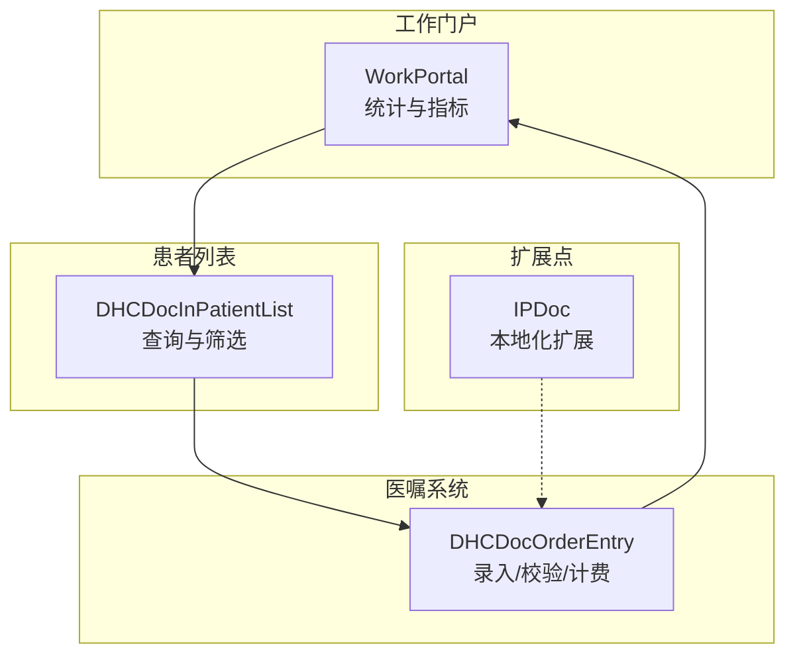
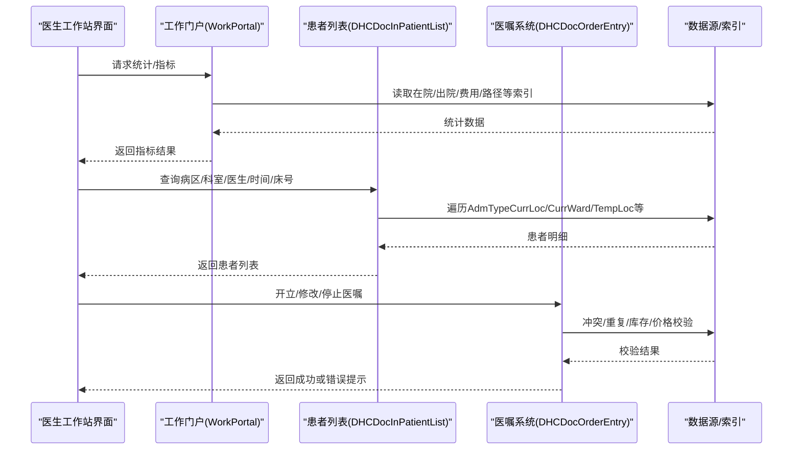
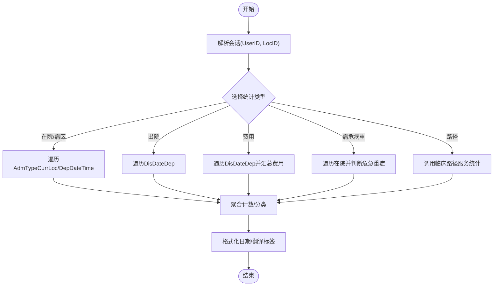
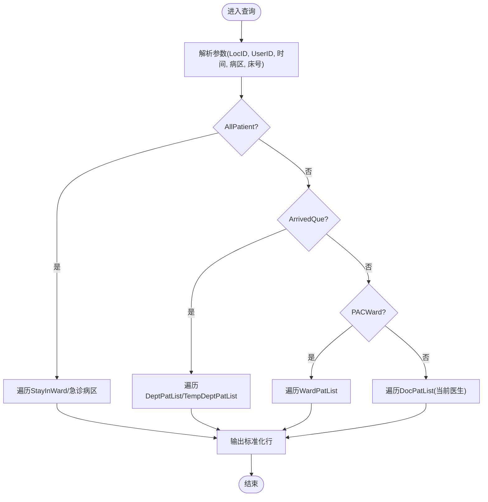
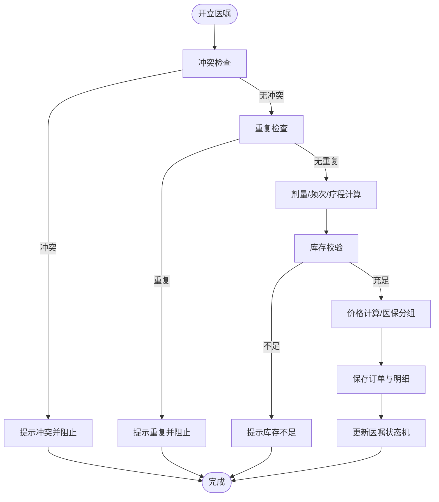
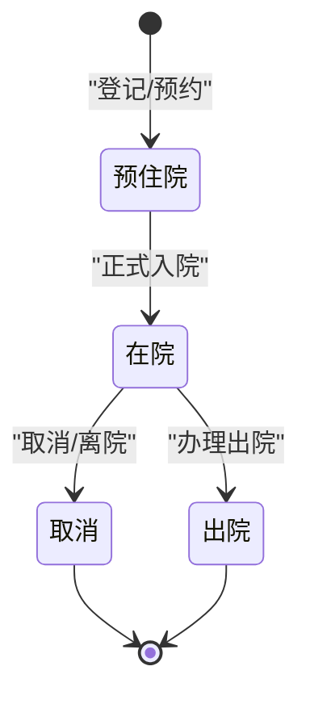
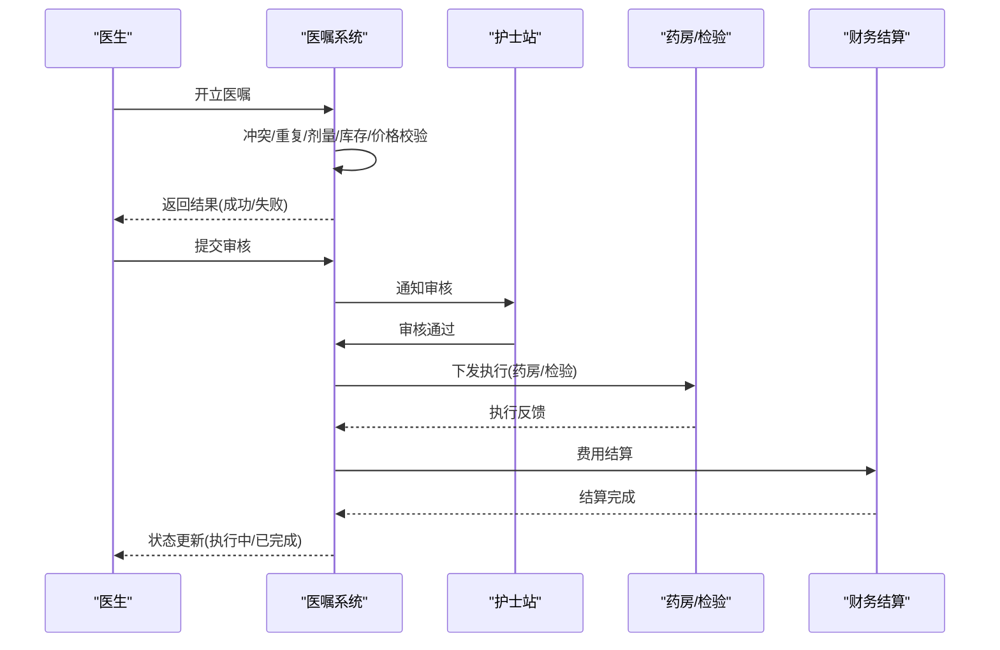
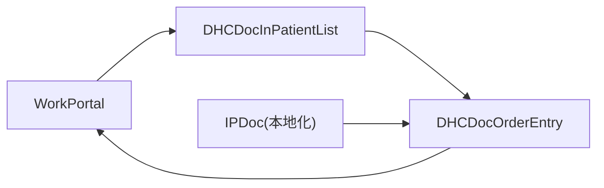

# 住院医生工作流

<cite>
**本文引用的文件**
- [WorkPortal.cls](file://src/backend/doc-ws/DHCDoc/IPDoc/WorkPortal.cls)
- [DHCDocInPatientList.cls](file://src/backend/doc-ws/web/DHCDocInPatientList.cls)
- [DHCDocOrderEntry.cls](file://src/backend/doc-ws/web/DHCDocOrderEntry.cls)
- [IPDoc.cls](file://src/backend/public-mc/DHCDoc/Local/IPDoc.cls)
</cite>

## 目录
1. [简介](#简介)
2. [项目结构](#项目结构)
3. [核心组件](#核心组件)
4. [架构总览](#架构总览)
5. [详细组件分析](#详细组件分析)
6. [依赖关系分析](#依赖关系分析)
7. [性能考虑](#性能考虑)
8. [故障排查指南](#故障排查指南)
9. [结论](#结论)
10. [附录](#附录)

## 简介
本文件面向住院医生的完整工作流，覆盖查房管理、医嘱处理、病程记录、会诊申请、出院管理等核心功能；解释住院患者状态管理机制与病房患者列表的查询筛选逻辑；描述住院工作界面的特殊功能与交互设计；并提供业务流程图、患者状态转换图与医嘱执行流程图。同时阐述权限控制、病区管理与跨科室协作机制，并给出关键实现的代码片段路径以便定位实现细节。

## 项目结构
围绕住院医生工作流的关键后端能力集中在以下模块：
- 工作门户与统计：提供当前在院患者、出入院统计、费用统计、病危病重统计、床位使用率等指标计算与查询。
- 住院患者列表：支持按病区、科室、医生、时间范围、床号等多维度查询与筛选，输出标准化行数据供前端展示。
- 医嘱录入与校验：负责医嘱冲突检查、重复医嘱检测、剂量换算、库存校验、价格计算、套组展开等。
- 本地化扩展点：提供住院医嘱系统的本地化扩展入口。

图表来源
- [WorkPortal.cls:1-434](file://src/backend/doc-ws/DHCDoc/IPDoc/WorkPortal.cls#L1-L434)
- [DHCDocInPatientList.cls:1-800](file://src/backend/doc-ws/web/DHCDocInPatientList.cls#L1-L800)
- [DHCDocOrderEntry.cls:1-800](file://src/backend/doc-ws/web/DHCDocOrderEntry.cls#L1-L800)
- [IPDoc.cls:1-19](file://src/backend/public-mc/DHCDoc/Local/IPDoc.cls#L1-L19)

章节来源
- [WorkPortal.cls:1-434](file://src/backend/doc-ws/DHCDoc/IPDoc/WorkPortal.cls#L1-L434)
- [DHCDocInPatientList.cls:1-800](file://src/backend/doc-ws/web/DHCDocInPatientList.cls#L1-L800)
- [DHCDocOrderEntry.cls:1-800](file://src/backend/doc-ws/web/DHCDocOrderEntry.cls#L1-L800)
- [IPDoc.cls:1-19](file://src/backend/public-mc/DHCDoc/Local/IPDoc.cls#L1-L19)

## 核心组件
- 工作门户（WorkPortal）
  - 职责：聚合当前在院患者、出入院人数、出院费用、病危病重分布、床位使用率、临床路径入径/出径等统计指标；提供按日期区间与病区维度的查询接口。
  - 关键点：基于会话解析用户与病区信息；通过索引表遍历在院/出院事件；调用外部服务获取临床路径数据；对护理等级、危急重症进行归类统计。
- 住院患者列表（DHCDocInPatientList）
  - 职责：根据病区、科室、医生、时间、床号、是否全病区/本科/临时等条件，返回标准化患者行数据；维护叫号、接诊、跳过等队列状态；支持特殊科室（如产房）的自定义医嘱显示策略。
  - 关键点：多索引遍历（当前病区、当前医生、临时病区）；过滤预住院与已出院；统一输出字段包含基本信息、就诊信息、诊断、优先级、叫号状态等。
- 医嘱录入（DHCDocOrderEntry）
  - 职责：医嘱项查找与展开、冲突与重复检查、剂量与频次换算、库存校验、价格计算、套组递归展开、出院/死亡相关医嘱识别等。
  - 关键点：严格的状态机驱动（有效/执行中/停用/作废），结合配置项控制行为（如皮试豁免、停止联动、重复天数）。
- 本地化扩展（IPDoc）
  - 职责：为住院医嘱系统提供本地化扩展方法入口，便于医院定制。

章节来源
- [WorkPortal.cls:1-434](file://src/backend/doc-ws/DHCDoc/IPDoc/WorkPortal.cls#L1-L434)
- [DHCDocInPatientList.cls:1-800](file://src/backend/doc-ws/web/DHCDocInPatientList.cls#L1-L800)
- [DHCDocOrderEntry.cls:1-800](file://src/backend/doc-ws/web/DHCDocOrderEntry.cls#L1-L800)
- [IPDoc.cls:1-19](file://src/backend/public-mc/DHCDoc/Local/IPDoc.cls#L1-L19)

## 架构总览
住院医生工作流由“工作门户—患者列表—医嘱系统”构成闭环：
- 工作门户提供宏观指标与快捷入口，驱动前端渲染看板与导航。
- 患者列表承载查房与分诊的核心数据，支撑医生快速定位目标患者。
- 医嘱系统贯穿治疗全过程，从开立到执行、停嘱、结算，形成完整的业务闭环。

图表来源
- [WorkPortal.cls:1-434](file://src/backend/doc-ws/DHCDoc/IPDoc/WorkPortal.cls#L1-L434)
- [DHCDocInPatientList.cls:1-800](file://src/backend/doc-ws/web/DHCDocInPatientList.cls#L1-L800)
- [DHCDocOrderEntry.cls:1-800](file://src/backend/doc-ws/web/DHCDocOrderEntry.cls#L1-L800)

## 详细组件分析

### 工作门户（WorkPortal）分析
- 能力概览
  - 当前在院患者查询：按病区与医生范围检索，返回EpisodeID、PatientID、MRAdm等关键字段。
  - 统计指标：在院人数、病区人数、出院人数、出院费用、病危病重分布、床位使用率、临床路径入/出径统计。
  - 查询接口：以Query形式暴露，内部通过Execute实现逐行迭代，减少一次性内存占用。
- 关键流程
  - 会话解析：从SessionStr提取UserID、LocID等信息，用于权限与范围限定。
  - 索引遍历：利用PAADMi的多级索引（AdmTypeCurrLoc、DepDateTime、DisDateDep等）高效扫描。
  - 外部集成：调用临床路径服务统计入径/出径；调用账单接口获取住院天数与费用。
  - 翻译与格式化：统一使用Indicate工具类生成月份描述，并使用本地化翻译函数输出中文标签。

图表来源
- [WorkPortal.cls:1-434](file://src/backend/doc-ws/DHCDoc/IPDoc/WorkPortal.cls#L1-L434)

章节来源
- [WorkPortal.cls:1-434](file://src/backend/doc-ws/DHCDoc/IPDoc/WorkPortal.cls#L1-L434)

### 住院患者列表（DHCDocInPatientList）分析
- 能力概览
  - 多维度查询：支持全病区、本科、指定病区、时间范围、床号、医生、姓名/工号等筛选。
  - 状态过滤：排除预住院与已出院；仅返回有效在院患者。
  - 队列与叫号：支持设置接诊、跳过、呼叫状态，并与会诊室关联。
  - 特殊科室策略：针对产房等特殊场景，按未执行特定医嘱显示患者。
- 关键流程
  - 参数解析与默认值：从请求或会话中解析LocID、UserID、时间范围、病区等。
  - 索引遍历：优先使用AdmTypeCurrLoc、CurrWard、TempLoc等索引，保证查询性能。
  - 输出行组装：统一构造标准行数据，包含患者基本信息、就诊信息、诊断、优先级、叫号状态等。
  - 权限与范围：依据登录医院、病区、医生团队限制可见范围。

图表来源
- [DHCDocInPatientList.cls:1-800](file://src/backend/doc-ws/web/DHCDocInPatientList.cls#L1-L800)

章节来源
- [DHCDocInPatientList.cls:1-800](file://src/backend/doc-ws/web/DHCDocInPatientList.cls#L1-L800)

### 医嘱录入与校验（DHCDocOrderEntry）分析
- 能力概览
  - 冲突与重复：根据配置检查互斥医嘱与重复医嘱，支持跨就诊与不同优先级策略。
  - 剂量与频次：支持单位换算、等效剂量、取整偏好（半量/向上/向下）、疗程与频次组合计算。
  - 库存与价格：库存校验、价格计算、医保/自费分组、折扣与折后价。
  - 套组与嵌套：支持医嘱套组展开与递归展开。
  - 出院/死亡：识别出院带药与死亡相关医嘱，触发相应流程。
- 关键流程
  - 输入校验：剂量、频次、疗程、优先级、接收科室、库存等。
  - 规则引擎：冲突/重复/限制天数/皮试豁免/停止联动等。
  - 计费与结算：价格计算、医保分组、折扣、打包数量。
  - 持久化与状态：写入订单与明细，更新状态机（有效/执行中/停用/作废）。

图表来源
- [DHCDocOrderEntry.cls:1-800](file://src/backend/doc-ws/web/DHCDocOrderEntry.cls#L1-L800)

章节来源
- [DHCDocOrderEntry.cls:1-800](file://src/backend/doc-ws/web/DHCDocOrderEntry.cls#L1-L800)

### 患者状态管理机制
- 状态定义
  - 在院：VisitStatus="A"，表示当前在院患者。
  - 出院：VisitStatus="D"，表示已出院患者。
  - 预住院：VisitStatus="P"，在患者列表中应被过滤。
  - 其他：如"C"表示离院或取消，具体依业务索引而定。
- 状态流转
  - 入院：创建PAADM记录，VisitStatus置为"A"。
  - 出院：更新VisitStatus为"D"，并记录出院日期与原因。
  - 预住院转在院：调整VisitStatus从"P"到"A"。
  - 取消/离院：根据业务需要置为"C"或其他状态。

图表来源
- [DHCDocInPatientList.cls:1-800](file://src/backend/doc-ws/web/DHCDocInPatientList.cls#L1-L800)
- [WorkPortal.cls:1-434](file://src/backend/doc-ws/DHCDoc/IPDoc/WorkPortal.cls#L1-L434)

章节来源
- [DHCDocInPatientList.cls:1-800](file://src/backend/doc-ws/web/DHCDocInPatientList.cls#L1-L800)
- [WorkPortal.cls:1-434](file://src/backend/doc-ws/DHCDoc/IPDoc/WorkPortal.cls#L1-L434)

### 医嘱执行流程
- 流程要点
  - 开立：校验冲突、重复、剂量、库存、价格后保存。
  - 审核：护士或药师审核，状态转为可执行。
  - 执行：执行记录生成，状态转为执行中。
  - 停嘱：根据配置可能联动停止同类或相关医嘱。
  - 结算：费用结算，状态最终归档。
- 序列图

图表来源
- [DHCDocOrderEntry.cls:1-800](file://src/backend/doc-ws/web/DHCDocOrderEntry.cls#L1-L800)

章节来源
- [DHCDocOrderEntry.cls:1-800](file://src/backend/doc-ws/web/DHCDocOrderEntry.cls#L1-L800)

### 权限控制、病区管理与跨科室协作
- 权限控制
  - 基于会话的用户ID与病区ID，限制可访问的患者范围与统计指标。
  - 医生团队与单元（MU/CP）配置决定可操作范围与组长身份。
- 病区管理
  - 支持全病区、本科、指定病区三种视图；支持床号精确筛选。
  - 特殊科室（如产房）可按未执行特定医嘱显示患者。
- 跨科室协作
  - 通过队列与会诊室关联，支持叫号、接诊、跳过等操作。
  - 医嘱系统支持跨科室接收与执行，确保医嘱流向正确。

章节来源
- [DHCDocInPatientList.cls:1-800](file://src/backend/doc-ws/web/DHCDocInPatientList.cls#L1-L800)
- [WorkPortal.cls:1-434](file://src/backend/doc-ws/DHCDoc/IPDoc/WorkPortal.cls#L1-L434)

## 依赖关系分析
- 组件耦合
  - WorkPortal依赖患者与账单索引，以及临床路径服务。
  - DHCDocInPatientList依赖多类索引与队列与会诊室配置。
  - DHCDocOrderEntry依赖配置、字典、库存与价格服务。
- 直接依赖
  - 工作门户→患者列表：通过统计与指标驱动列表刷新。
  - 患者列表→医嘱系统：通过患者上下文触发医嘱操作。
  - 医嘱系统→工作门户：通过统计更新看板数据。
- 间接依赖
  - 本地化扩展点为医嘱系统提供定制能力，影响冲突/重复/价格等规则。

图表来源
- [WorkPortal.cls:1-434](file://src/backend/doc-ws/DHCDoc/IPDoc/WorkPortal.cls#L1-L434)
- [DHCDocInPatientList.cls:1-800](file://src/backend/doc-ws/web/DHCDocInPatientList.cls#L1-L800)
- [DHCDocOrderEntry.cls:1-800](file://src/backend/doc-ws/web/DHCDocOrderEntry.cls#L1-L800)
- [IPDoc.cls:1-19](file://src/backend/public-mc/DHCDoc/Local/IPDoc.cls#L1-L19)

章节来源
- [WorkPortal.cls:1-434](file://src/backend/doc-ws/DHCDoc/IPDoc/WorkPortal.cls#L1-L434)
- [DHCDocInPatientList.cls:1-800](file://src/backend/doc-ws/web/DHCDocInPatientList.cls#L1-L800)
- [DHCDocOrderEntry.cls:1-800](file://src/backend/doc-ws/web/DHCDocOrderEntry.cls#L1-L800)
- [IPDoc.cls:1-19](file://src/backend/public-mc/DHCDoc/Local/IPDoc.cls#L1-L19)

## 性能考虑
- 索引优化
  - 使用AdmTypeCurrLoc、DepDateTime、DisDateDep、CurrWard、TempLoc等多级索引，避免全表扫描。
  - 分页与游标：通过Query的Execute/Fetch模式，逐行返回，降低内存占用。
- 缓存与临时表
  - 使用^CacheTemp与^TMP存储中间结果，减少重复计算。
- 批量处理
  - 统计指标采用聚合计算，减少多次往返数据库。
- 配置驱动
  - 通过配置控制重复天数、皮试豁免、停止联动等，平衡准确性与性能。

[本节为通用性能建议，不直接分析具体文件]

## 故障排查指南
- 常见问题
  - 患者列表为空：检查LocID、UserID、时间范围、病区与床号参数是否正确；确认患者状态是否为在院。
  - 医嘱冲突/重复：查看配置中的互斥与重复规则；核对优先级与接收科室。
  - 库存不足：检查库存配置与接收科室；确认包装数量与单位换算。
  - 价格异常：核对医保分组、折扣与折后价配置；确认计价时间与患者类型。
- 定位方法
  - 通过日志与调试变量追踪参数传递与中间结果。
  - 使用Query的Fetch逐步验证数据源与过滤条件。
  - 检查会话信息与权限配置，确保范围正确。

章节来源
- [DHCDocInPatientList.cls:1-800](file://src/backend/doc-ws/web/DHCDocInPatientList.cls#L1-L800)
- [DHCDocOrderEntry.cls:1-800](file://src/backend/doc-ws/web/DHCDocOrderEntry.cls#L1-L800)

## 结论
住院医生工作流以工作门户、患者列表与医嘱系统为核心，形成从统计到操作再到结算的完整闭环。通过索引优化、配置驱动与状态机管理，保障高并发与复杂业务场景下的稳定性与可扩展性。未来可进一步引入更细粒度的权限控制与智能推荐，提升医生工作效率与医疗质量。

[本节为总结性内容，不直接分析具体文件]

## 附录
- 关键实现代码片段路径
  - 工作门户统计与查询：[WorkPortal.cls:1-434](file://src/backend/doc-ws/DHCDoc/IPDoc/WorkPortal.cls#L1-L434)
  - 住院患者列表查询与筛选：[DHCDocInPatientList.cls:1-800](file://src/backend/doc-ws/web/DHCDocInPatientList.cls#L1-L800)
  - 医嘱录入与校验：[DHCDocOrderEntry.cls:1-800](file://src/backend/doc-ws/web/DHCDocOrderEntry.cls#L1-L800)
  - 本地化扩展点：[IPDoc.cls:1-19](file://src/backend/public-mc/DHCDoc/Local/IPDoc.cls#L1-L19)

[本节为参考路径，不直接分析具体文件]