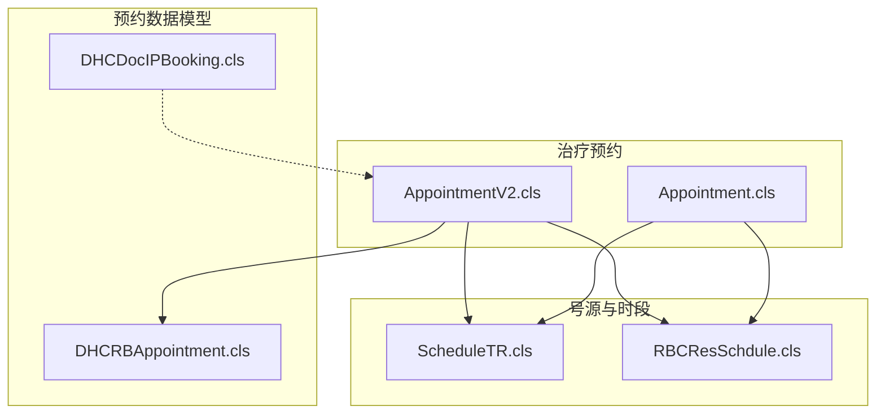
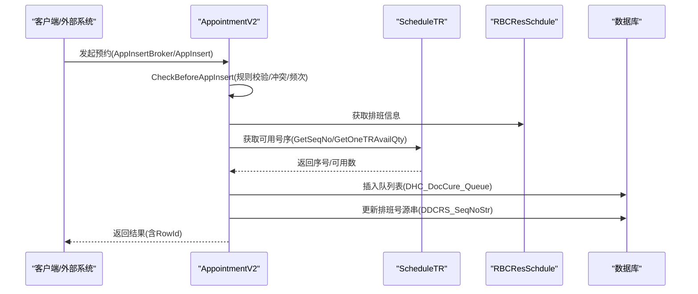
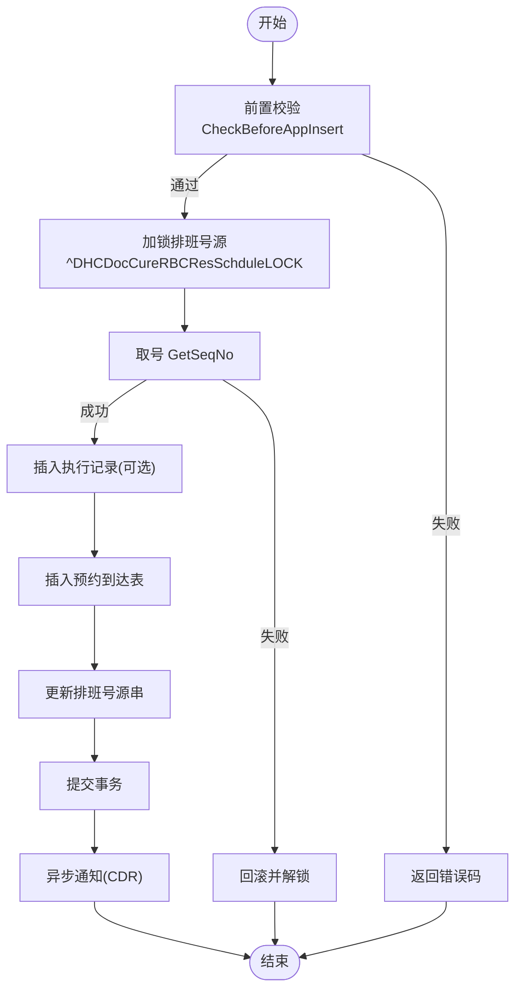
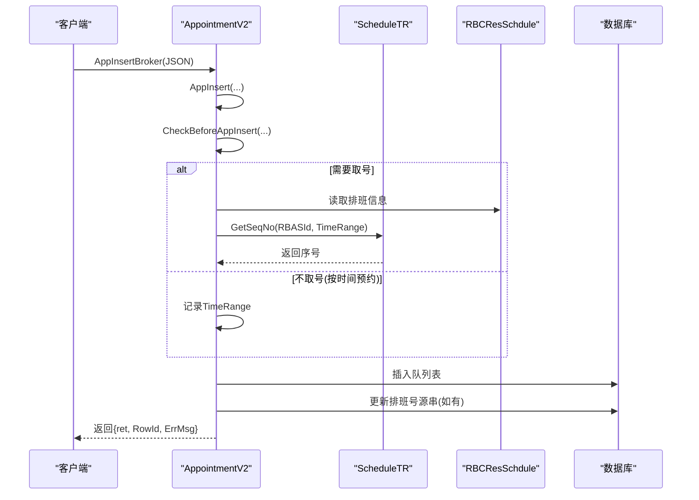
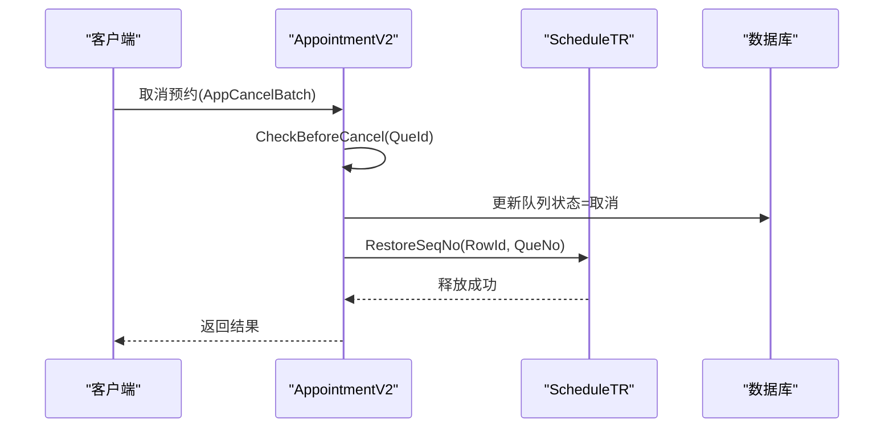
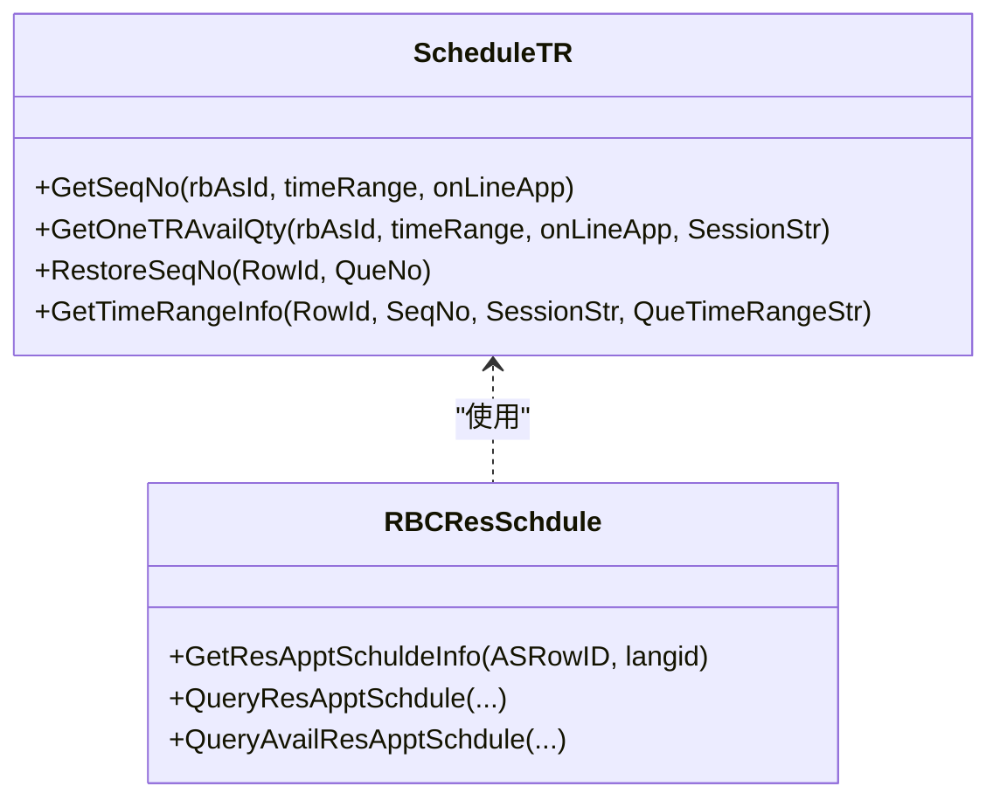
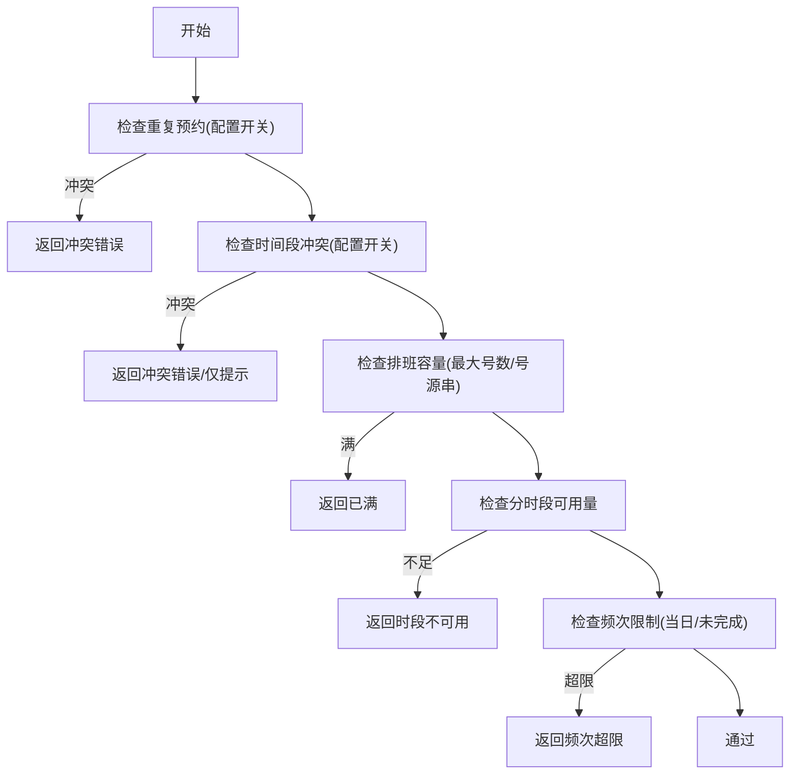
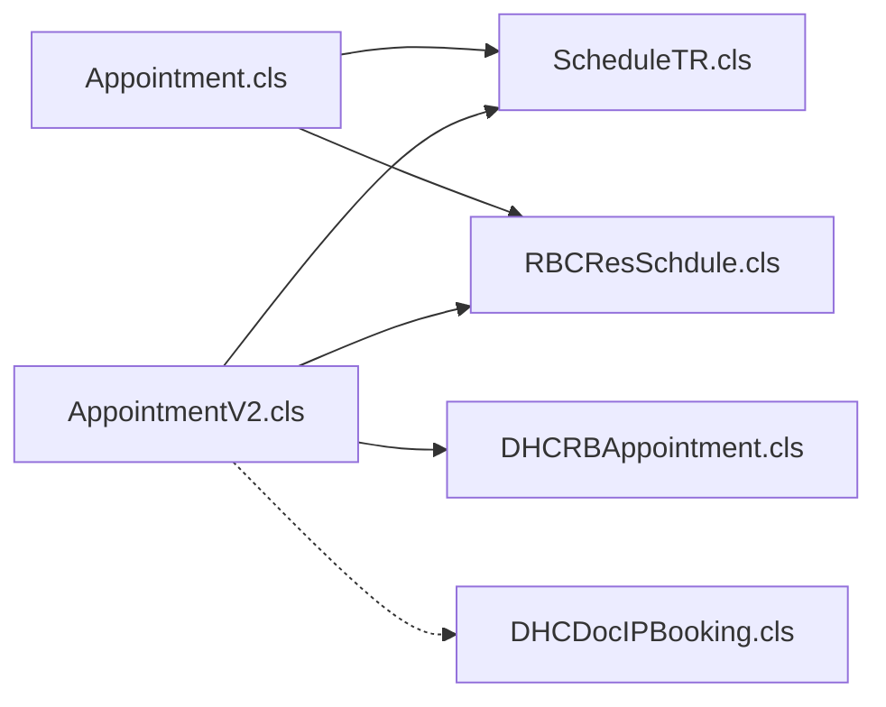

# 挂号接口集成

<cite>
**本文引用的文件**
- [Appointment.cls](file://src/backend/cure-ws/DHCDoc/DHCDocCure/Appointment.cls)
- [AppointmentV2.cls](file://src/backend/cure-ws/DHCDoc/DHCDocCure/AppointmentV2.cls)
- [ScheduleTR.cls](file://src/backend/cure-ws/DHCDoc/DHCDocCure/ScheduleTR.cls)
- [RBCResSchdule.cls](file://src/backend/cure-ws/DHCDoc/DHCDocCure/RBCResSchdule.cls)
- [DHCRBAppointment.cls](file://src/backend/opadm-mc/User/DHCRBAppointment.cls)
- [DHCDocIPBooking.cls](file://src/backend/doc-ws/User/DHCDocIPBooking.cls)
</cite>

## 目录
1. [简介](#简介)
2. [项目结构](#项目结构)
3. [核心组件](#核心组件)
4. [架构总览](#架构总览)
5. [详细组件分析](#详细组件分析)
6. [依赖关系分析](#依赖关系分析)
7. [性能与并发控制](#性能与并发控制)
8. [故障排查指南](#故障排查指南)
9. [结论](#结论)
10. [附录](#附录)

## 简介
本文件面向“挂号接口集成”，聚焦治疗预约（挂号）与预约平台/系统的对接实现，覆盖预约挂号、退号改签、号源管理、号源同步机制、冲突检测与容量控制；提供预约创建、状态查询、取消操作的流程示例；说明高并发场景下的锁机制与事务处理；并给出数据统计、报表生成与异常处理方案。

## 项目结构
围绕治疗预约的核心代码主要分布在以下模块：
- 治疗预约核心类：Appointment.cls、AppointmentV2.cls
- 号源与时段管理：ScheduleTR.cls、RBCResSchdule.cls
- 门诊/住院预约数据模型：DHCRBAppointment.cls、DHCDocIPBooking.cls

图表来源
- [Appointment.cls:328-530](file://src/backend/cure-ws/DHCDoc/DHCDocCure/Appointment.cls#L328-L530)
- [AppointmentV2.cls:978-1110](file://src/backend/cure-ws/DHCDoc/DHCDocCure/AppointmentV2.cls#L978-L1110)
- [ScheduleTR.cls:7-77](file://src/backend/cure-ws/DHCDoc/DHCDocCure/ScheduleTR.cls#L7-L77)
- [RBCResSchdule.cls:1-71](file://src/backend/cure-ws/DHCDoc/DHCDocCure/RBCResSchdule.cls#L1-L71)

章节来源
- [Appointment.cls:328-530](file://src/backend/cure-ws/DHCDoc/DHCDocCure/Appointment.cls#L328-L530)
- [AppointmentV2.cls:978-1110](file://src/backend/cure-ws/DHCDoc/DHCDocCure/AppointmentV2.cls#L978-L1110)
- [ScheduleTR.cls:7-77](file://src/backend/cure-ws/DHCDoc/DHCDocCure/ScheduleTR.cls#L7-L77)
- [RBCResSchdule.cls:1-71](file://src/backend/cure-ws/DHCDoc/DHCDocCure/RBCResSchdule.cls#L1-L71)

## 核心组件
- 预约主流程（旧版）：Appointment.cls
  - 预约前校验、取号、插入执行记录、更新排班号源串、异步回写等
- 预约主流程（新版）：AppointmentV2.cls
  - 不直接产生预约表，而是写入队列表；支持多日多选时段、患者维度冲突检测、频次限制、权限校验
- 号源与时段：ScheduleTR.cls
  - 获取可用序号、释放序号、计算分时段可用量、根据序号反查时段
- 资源排班：RBCResSchdule.cls
  - 排班信息查询、批量生成、停诊/恢复、可预约资源查询
- 数据模型
  - DHCRBAppointment.cls：门诊预约实体
  - DHCDocIPBooking.cls：住院证/住院预约实体

章节来源
- [Appointment.cls:328-530](file://src/backend/cure-ws/DHCDoc/DHCDocCure/Appointment.cls#L328-L530)
- [AppointmentV2.cls:978-1110](file://src/backend/cure-ws/DHCDoc/DHCDocCure/AppointmentV2.cls#L978-L1110)
- [ScheduleTR.cls:7-77](file://src/backend/cure-ws/DHCDoc/DHCDocCure/ScheduleTR.cls#L7-L77)
- [RBCResSchdule.cls:487-585](file://src/backend/cure-ws/DHCDoc/DHCDocCure/RBCResSchdule.cls#L487-L585)
- [DHCRBAppointment.cls:1-424](file://src/backend/opadm-mc/User/DHCRBAppointment.cls#L1-L424)
- [DHCDocIPBooking.cls:1-641](file://src/backend/doc-ws/User/DHCDocIPBooking.cls#L1-L641)

## 架构总览
治疗预约整体由“前端/外部系统”调用后端服务，进入预约入口后，依次完成：
- 参数校验与业务规则检查（就诊类型、医嘱状态、排班有效性、截止预约时间、权限、频次、冲突）
- 号源分配（全局或分时段）
- 持久化（旧版：执行记录+预约到达表；新版：队列表+排班号源串）
- 事务提交与异步通知（CDR等）

图表来源
- [AppointmentV2.cls:978-1110](file://src/backend/cure-ws/DHCDoc/DHCDocCure/AppointmentV2.cls#L978-L1110)
- [ScheduleTR.cls:7-77](file://src/backend/cure-ws/DHCDoc/DHCDocCure/ScheduleTR.cls#L7-L77)
- [RBCResSchdule.cls:1-71](file://src/backend/cure-ws/DHCDoc/DHCDocCure/RBCResSchdule.cls#L1-L71)

## 详细组件分析

### 预约挂号（旧版）流程
- 入口：AppInsertHUI
- 关键步骤
  - 前置校验：CheckBeforeAppInsert（就诊类型、医嘱状态、排班有效性、截止预约时间、最大预约数、申请单剩余次数、分时段可用号）
  - 取号：在排班锁下调用 ScheduleTR.GetSeqNo
  - 插入执行记录：按配置决定是否生成执行记录
  - 写入预约到达表：DHC_DocCureAppArrive
  - 更新排班号源串：DDCRS_SeqNoStr
  - 事务提交与异步通知：Job InputDataToCDR

图表来源
- [Appointment.cls:328-530](file://src/backend/cure-ws/DHCDoc/DHCDocCure/Appointment.cls#L328-L530)
- [ScheduleTR.cls:7-77](file://src/backend/cure-ws/DHCDoc/DHCDocCure/ScheduleTR.cls#L7-L77)

章节来源
- [Appointment.cls:328-530](file://src/backend/cure-ws/DHCDoc/DHCDocCure/Appointment.cls#L328-L530)
- [ScheduleTR.cls:7-77](file://src/backend/cure-ws/DHCDoc/DHCDocCure/ScheduleTR.cls#L7-L77)

### 预约挂号（新版）流程
- 入口：AppInsertBroker -> AppInsert
- 关键步骤
  - 校验：CheckBeforeAppInsert（就诊类型、排班有效性、截止预约时间、权限、频次、冲突）
  - 取号：非“按时间预约”时，加锁并调用 ScheduleTR.GetSeqNo；否则不取具体序号
  - 写入队列：DHC_DocCure_Queue
  - 更新排班号源串：DDCRS_SeqNoStr（如已取号）
  - 事务提交与异步通知

图表来源
- [AppointmentV2.cls:950-1110](file://src/backend/cure-ws/DHCDoc/DHCDocCure/AppointmentV2.cls#L950-L1110)
- [ScheduleTR.cls:7-77](file://src/backend/cure-ws/DHCDoc/DHCDocCure/ScheduleTR.cls#L7-L77)

章节来源
- [AppointmentV2.cls:950-1110](file://src/backend/cure-ws/DHCDoc/DHCDocCure/AppointmentV2.cls#L950-L1110)

### 退号与改签
- 旧版取消：AppCancelBatch -> AppCancelHUI
  - 更新预约到达表状态为“取消”
  - 释放号源：ScheduleTR.RestoreSeqNo
  - 视配置撤销执行记录
- 新版取消：AppCancelBatch -> AppCancel
  - 校验：CheckBeforeCancel（已取消、已完成且当日有治疗记录、报到状态等）
  - 更新队列状态为“取消”
  - 释放号源：ScheduleTR.RestoreSeqNo

图表来源
- [AppointmentV2.cls:1112-1276](file://src/backend/cure-ws/DHCDoc/DHCDocCure/AppointmentV2.cls#L1112-L1276)
- [ScheduleTR.cls:192-214](file://src/backend/cure-ws/DHCDoc/DHCDocCure/ScheduleTR.cls#L192-L214)

章节来源
- [AppointmentV2.cls:1112-1276](file://src/backend/cure-ws/DHCDoc/DHCDocCure/AppointmentV2.cls#L1112-L1276)
- [ScheduleTR.cls:192-214](file://src/backend/cure-ws/DHCDoc/DHCDocCure/ScheduleTR.cls#L192-L214)

### 号源管理与同步
- 号源存储：排班记录的号源串字段 DDCRS_SeqNoStr
- 取号逻辑：ScheduleTR.GetSeqNo
  - 支持分时段保留号、线上/线下差异
- 可用数量：ScheduleTR.GetOneTRAvailQty
  - 支持按时间配置模式统计
- 排班查询：RBCResSchdule.QueryResApptSchdule / QueryAvailResApptSchdule
  - 输出包含最大号数、已约数、剩余号数、时段信息等

图表来源
- [ScheduleTR.cls:7-77](file://src/backend/cure-ws/DHCDoc/DHCDocCure/ScheduleTR.cls#L7-L77)
- [RBCResSchdule.cls:1-71](file://src/backend/cure-ws/DHCDoc/DHCDocCure/RBCResSchdule.cls#L1-L71)
- [RBCResSchdule.cls:487-585](file://src/backend/cure-ws/DHCDoc/DHCDocCure/RBCResSchdule.cls#L487-L585)

章节来源
- [ScheduleTR.cls:7-77](file://src/backend/cure-ws/DHCDoc/DHCDocCure/ScheduleTR.cls#L7-L77)
- [RBCResSchdule.cls:487-585](file://src/backend/cure-ws/DHCDoc/DHCDocCure/RBCResSchdule.cls#L487-L585)

### 冲突检测与容量控制
- 重复预约检测：CheckAppointConflict
  - 相同排班是否允许重复（配置项）
  - 时间段冲突检测（配置项：禁止/仅提示）
- 容量控制
  - 排班最大号数 vs 已占用号源串长度
  - 分时段可用量检查（GetOneTRAvailQty）
- 频次控制：CheckAppointNum
  - 当日频次限制（考虑长期/PRN/首次频次）
  - 未完成次数限制（结合未治疗次数）

图表来源
- [AppointmentV2.cls:1278-1376](file://src/backend/cure-ws/DHCDoc/DHCDocCure/AppointmentV2.cls#L1278-L1376)
- [AppointmentV2.cls:787-948](file://src/backend/cure-ws/DHCDoc/DHCDocCure/AppointmentV2.cls#L787-L948)
- [ScheduleTR.cls:125-190](file://src/backend/cure-ws/DHCDoc/DHCDocCure/ScheduleTR.cls#L125-L190)

章节来源
- [AppointmentV2.cls:787-948](file://src/backend/cure-ws/DHCDoc/DHCDocCure/AppointmentV2.cls#L787-L948)
- [AppointmentV2.cls:1278-1376](file://src/backend/cure-ws/DHCDoc/DHCDocCure/AppointmentV2.cls#L1278-L1376)
- [ScheduleTR.cls:125-190](file://src/backend/cure-ws/DHCDoc/DHCDocCure/ScheduleTR.cls#L125-L190)

### 挂号流程示例
- 预约创建
  - 调用 AppInsertBroker，传入 PatientID、RBASId、RegType、LongFlag、TimeRange、DCARowID、SessionStr
  - 返回 ret、RowId、ErrMsg
- 状态查询
  - 使用 FindAppointmentList 或 FindAppList 查询患者/科室/日期范围下的预约列表
  - 支持按项目明细显示或按预约汇总显示
- 取消操作
  - 调用 AppCancelBatch，传入队列ID串（支持按项目取消）
  - 返回合并的错误消息

章节来源
- [AppointmentV2.cls:950-1110](file://src/backend/cure-ws/DHCDoc/DHCDocCure/AppointmentV2.cls#L950-L1110)
- [AppointmentV2.cls:444-617](file://src/backend/cure-ws/DHCDoc/DHCDocCure/AppointmentV2.cls#L444-L617)
- [AppointmentV2.cls:1112-1276](file://src/backend/cure-ws/DHCDoc/DHCDocCure/AppointmentV2.cls#L1112-L1276)

### 高并发挂号的锁机制与事务处理
- 排班号源锁：^DHCDocCureRBCResSchduleLOCK(RBASId)
  - 用于并发取号与更新号源串，避免超卖
- 事务边界
  - 旧版：Tstart/Tcommit/Trollback 包裹执行记录插入、到达表写入、号源串更新
  - 新版：队列插入与号源串更新在同一事务中提交
- 异步解耦
  - 成功后通过 Job 调用 InputDataToCDR 进行异步回写，降低主流程耗时

章节来源
- [Appointment.cls:383-530](file://src/backend/cure-ws/DHCDoc/DHCDocCure/Appointment.cls#L383-L530)
- [AppointmentV2.cls:1044-1110](file://src/backend/cure-ws/DHCDoc/DHCDocCure/AppointmentV2.cls#L1044-L1110)
- [ScheduleTR.cls:192-214](file://src/backend/cure-ws/DHCDoc/DHCDocCure/ScheduleTR.cls#L192-L214)

### 挂号数据统计与报表
- 预约列表导出：FindAppointmentListExportExecute
  - 基于 FindAppointmentList 的结果集导出
- 排班查询：QueryResApptSchdule / QueryAvailResApptSchdule
  - 输出包含已约数、剩余号数、时段信息等，便于统计与展示

章节来源
- [AppointmentV2.cls:1492-1554](file://src/backend/cure-ws/DHCDoc/DHCDocCure/AppointmentV2.cls#L1492-L1554)
- [RBCResSchdule.cls:487-585](file://src/backend/cure-ws/DHCDoc/DHCDocCure/RBCResSchdule.cls#L487-L585)

### 异常处理方案
- 统一错误码映射与国际化翻译
  - 旧版：AppInsertBroker 将错误码转换为可读消息，支持多语言
  - 新版：CheckBeforeAppInsert、CheckAppointConflict、CheckAppointNum 等返回明确错误码与消息
- 常见错误
  - 参数为空、排班无效、停诊、超过截止预约时间、号源已满、时段不可用、重复预约、时间冲突、频次超限、队列状态不允许取消等

章节来源
- [Appointment.cls:48-127](file://src/backend/cure-ws/DHCDoc/DHCDocCure/Appointment.cls#L48-L127)
- [AppointmentV2.cls:722-785](file://src/backend/cure-ws/DHCDoc/DHCDocCure/AppointmentV2.cls#L722-L785)
- [AppointmentV2.cls:1185-1276](file://src/backend/cure-ws/DHCDoc/DHCDocCure/AppointmentV2.cls#L1185-L1276)

## 依赖关系分析
- Appointment.cls 依赖 ScheduleTR 与 RBCResSchdule，负责旧版预约全流程
- AppointmentV2.cls 依赖 ScheduleTR、RBCResSchdule，负责新版队列式预约
- 数据模型 DHCRBAppointment.cls、DHCDocIPBooking.cls 提供预约相关实体定义

图表来源
- [Appointment.cls:328-530](file://src/backend/cure-ws/DHCDoc/DHCDocCure/Appointment.cls#L328-L530)
- [AppointmentV2.cls:978-1110](file://src/backend/cure-ws/DHCDoc/DHCDocCure/AppointmentV2.cls#L978-L1110)
- [ScheduleTR.cls:7-77](file://src/backend/cure-ws/DHCDoc/DHCDocCure/ScheduleTR.cls#L7-L77)
- [RBCResSchdule.cls:1-71](file://src/backend/cure-ws/DHCDoc/DHCDocCure/RBCResSchdule.cls#L1-L71)
- [DHCRBAppointment.cls:1-424](file://src/backend/opadm-mc/User/DHCRBAppointment.cls#L1-L424)
- [DHCDocIPBooking.cls:1-641](file://src/backend/doc-ws/User/DHCDocIPBooking.cls#L1-L641)

章节来源
- [Appointment.cls:328-530](file://src/backend/cure-ws/DHCDoc/DHCDocCure/Appointment.cls#L328-L530)
- [AppointmentV2.cls:978-1110](file://src/backend/cure-ws/DHCDoc/DHCDocCure/AppointmentV2.cls#L978-L1110)
- [ScheduleTR.cls:7-77](file://src/backend/cure-ws/DHCDoc/DHCDocCure/ScheduleTR.cls#L7-L77)
- [RBCResSchdule.cls:1-71](file://src/backend/cure-ws/DHCDoc/DHCDocCure/RBCResSchdule.cls#L1-L71)
- [DHCRBAppointment.cls:1-424](file://src/backend/opadm-mc/User/DHCRBAppointment.cls#L1-L424)
- [DHCDocIPBooking.cls:1-641](file://src/backend/doc-ws/User/DHCDocIPBooking.cls#L1-L641)

## 性能与并发控制
- 锁粒度
  - 以排班为单位加锁，减少热点竞争
- 事务最小化
  - 仅在必要范围内开启事务，提高吞吐
- 异步处理
  - 非关键路径（如CDR回写）采用异步任务，缩短响应时间
- 查询优化
  - 使用索引化的队列与排班视图，支持分页与过滤

[本节为通用指导，无需特定文件引用]

## 故障排查指南
- 常见问题定位
  - 取号失败：检查排班号源串是否已满、分时段可用量是否为0
  - 冲突报错：检查重复预约与时间段冲突配置
  - 取消失败：检查队列状态、是否已报到、是否存在当日治疗记录
- 日志与调试
  - 关键方法均记录临时变量到 ^TMP 或 ^tmplog，便于回溯
- 建议
  - 在高并发场景优先使用新版预约流程（队列式），并结合分时段号源策略

章节来源
- [AppointmentV2.cls:1044-1110](file://src/backend/cure-ws/DHCDoc/DHCDocCure/AppointmentV2.cls#L1044-L1110)
- [AppointmentV2.cls:1185-1276](file://src/backend/cure-ws/DHCDoc/DHCDocCure/AppointmentV2.cls#L1185-L1276)
- [ScheduleTR.cls:125-190](file://src/backend/cure-ws/DHCDoc/DHCDocCure/ScheduleTR.cls#L125-L190)

## 结论
本集成方案通过新旧两套预约流程与统一的号源管理模块，实现了灵活可控的挂号能力。新版流程以队列为核心，配合严格的冲突检测、频次控制与分时段号源管理，满足高并发与复杂业务场景需求。同时，借助事务与锁机制保障一致性，并通过异步解耦提升性能。

[本节为总结性内容，无需特定文件引用]

## 附录
- 术语
  - RBASId：排班资源ID
  - DCARowId：治疗申请单ID
  - QueId：队列记录ID
  - DDCRS_SeqNoStr：排班号源串
- 参考接口
  - 预约创建：AppInsertBroker / AppInsert
  - 状态查询：FindAppointmentList / FindAppList
  - 取消预约：AppCancelBatch / AppCancel
  - 号源查询：ScheduleTR.GetOneTRAvailQty / RBCResSchdule.QueryResApptSchdule

[本节为补充信息，无需特定文件引用]