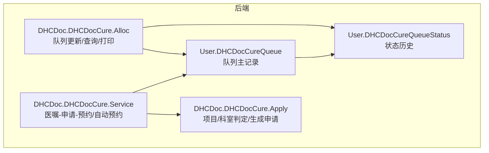
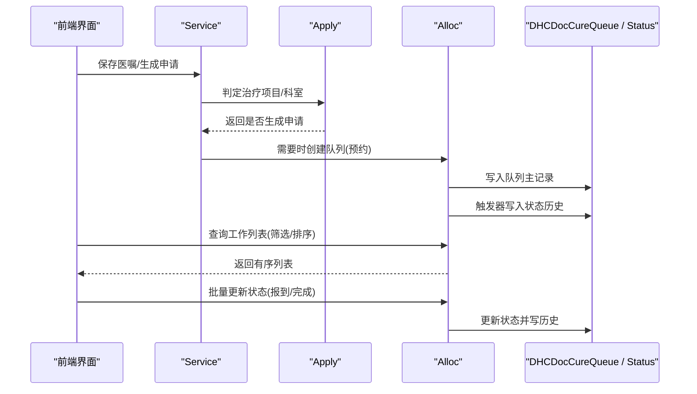
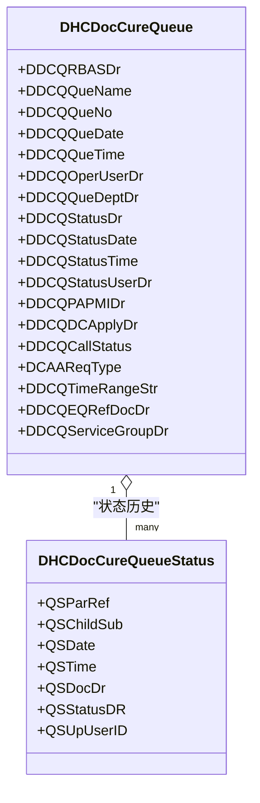
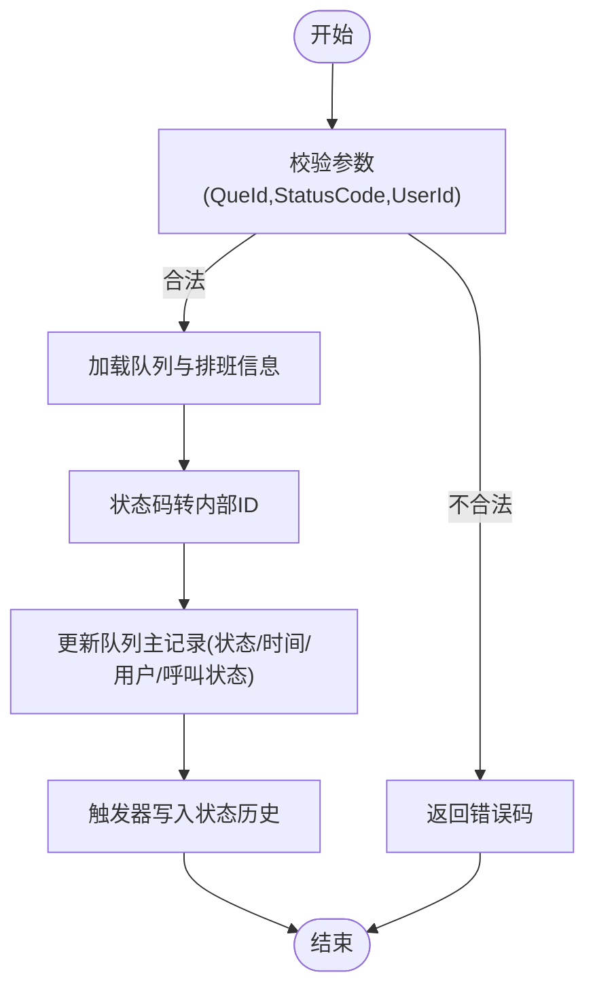
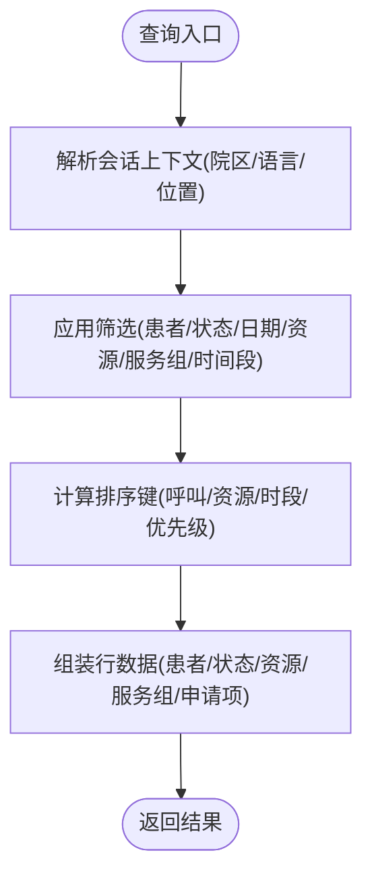
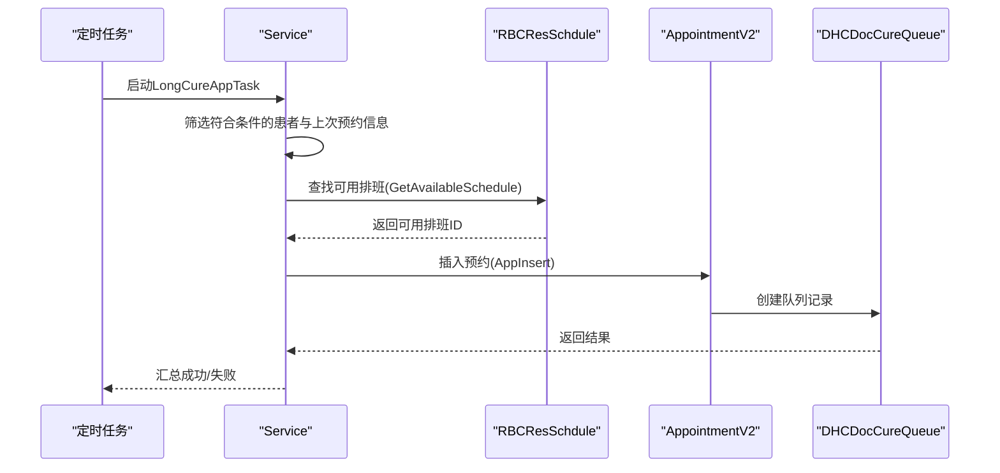
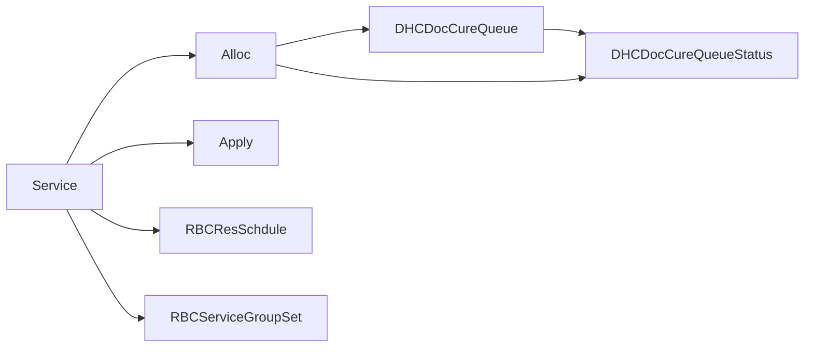

# 工作列表管理

<cite>
**本文引用的文件**
- [DHCDocCureQueue.cls](file://src/backend/cure-ws/User/DHCDocCureQueue.cls)
- [DHCDocCureQueueStatus.cls](file://src/backend/cure-ws/User/DHCDocCureQueueStatus.cls)
- [Alloc.cls](file://src/backend/cure-ws/DHCDoc/DHCDocCure/Alloc.cls)
- [Service.cls](file://src/backend/cure-ws/DHCDoc/DHCDocCure/Service.cls)
- [Apply.cls](file://src/backend/cure-ws/DHCDoc/DHCDocCure/Apply.cls)
</cite>

## 目录
1. [简介](#简介)
2. [项目结构](#项目结构)
3. [核心组件](#核心组件)
4. [架构总览](#架构总览)
5. [详细组件分析](#详细组件分析)
6. [依赖关系分析](#依赖关系分析)
7. [性能考量](#性能考量)
8. [故障排查指南](#故障排查指南)
9. [结论](#结论)
10. [附录](#附录)

## 简介
本文件围绕“治疗队列与工作列表”能力，系统化说明治疗队列的创建、排序与调度、执行流程、状态跟踪、异常处理与重试机制；并覆盖筛选、搜索、批量操作与导出等前端交互要点。重点解析 DHCDocCureQueue 与 DHCDocCureQueueStatus 的数据模型与触发逻辑，以及 Alloc 与 Service 在查询、更新、自动预约等方面的实现。

## 项目结构
[REDACTED: environment-specific example]
  - 数据实体：DHCDocCureQueue（队列主表）、DHCDocCureQueueStatus（状态历史）
  - 业务编排：Alloc（队列状态更新、查询、打印、触发器联动）、Service（医嘱-申请-预约联动、自动预约任务）
  - 申请单：Apply（治疗项目判定、科室匹配、自动生成申请）
- 前端界面通过 CSP/脚本调用上述服务方法，完成工作列表展示、筛选、批量操作与导出。

图表来源
- [DHCDocCureQueue.cls:1-320](file://src/backend/cure-ws/User/DHCDocCureQueue.cls#L1-L320)
- [DHCDocCureQueueStatus.cls:1-164](file://src/backend/cure-ws/User/DHCDocCureQueueStatus.cls#L1-L164)
- [Alloc.cls:1-609](file://src/backend/cure-ws/DHCDoc/DHCDocCure/Alloc.cls#L1-L609)
- [Service.cls:1-721](file://src/backend/cure-ws/DHCDoc/DHCDocCure/Service.cls#L1-L721)
- [Apply.cls:1-200](file://src/backend/cure-ws/DHCDoc/DHCDocCure/Apply.cls#L1-L200)

章节来源
- [DHCDocCureQueue.cls:1-320](file://src/backend/cure-ws/User/DHCDocCureQueue.cls#L1-L320)
- [DHCDocCureQueueStatus.cls:1-164](file://src/backend/cure-ws/User/DHCDocCureQueueStatus.cls#L1-L164)
- [Alloc.cls:1-609](file://src/backend/cure-ws/DHCDoc/DHCDocCure/Alloc.cls#L1-L609)
- [Service.cls:1-721](file://src/backend/cure-ws/DHCDoc/DHCDocCure/Service.cls#L1-L721)
- [Apply.cls:1-200](file://src/backend/cure-ws/DHCDoc/DHCDocCure/Apply.cls#L1-L200)

## 核心组件
- 队列主记录（DHCDocCureQueue）
  - 关键字段：患者ID、排队序号、预约日期/时间、科室、状态及变更时间/用户、呼叫状态、请求类型（手工/接口/长期）、时间段、服务组、设备关联治疗师等
  - 索引：按日期+科室、日期+患者、患者、排班、排班+序号等多维索引，支撑高效筛选与排序
  - 触发器：插入/更新后回调 Alloc.OnTrigger，写入状态历史
- 状态历史（DHCDocCureQueueStatus）
  - 以父引用+子序号为主键，记录每次状态变更的时间、医生、状态码、操作人
  - 提供按日期、状态、操作人的多维索引，便于审计与统计
- 队列编排（Alloc）
  - 更新队列状态（含报到/完成/取消等），批量更新
  - 查询工作列表（支持多条件过滤、排序、分页输出）
  - 获取队列详情、打印数据
  - 触发器联动：将队列状态变更持久化到状态历史表
- 服务编排（Service）
  - 医嘱-治疗申请-预约联动（保存医嘱同时生成申请、判断是否直接执行）
  - 长期医嘱自动预约任务（定时扫描、匹配可用排班、批量插入预约）
  - 撤销/取消相关能力
- 申请单（Apply）
  - 判定是否为治疗项目、是否归属治疗科室
  - 自动生成治疗申请单

章节来源
- [DHCDocCureQueue.cls:1-320](file://src/backend/cure-ws/User/DHCDocCureQueue.cls#L1-L320)
- [DHCDocCureQueueStatus.cls:1-164](file://src/backend/cure-ws/User/DHCDocCureQueueStatus.cls#L1-L164)
- [Alloc.cls:1-609](file://src/backend/cure-ws/DHCDoc/DHCDocCure/Alloc.cls#L1-L609)
- [Service.cls:1-721](file://src/backend/cure-ws/DHCDoc/DHCDocCure/Service.cls#L1-L721)
- [Apply.cls:1-200](file://src/backend/cure-ws/DHCDoc/DHCDocCure/Apply.cls#L1-L200)

## 架构总览
工作列表的核心链路包括：
- 创建：医嘱审核或外部接口触发 → 生成治疗申请 → 根据配置决定是否自动预约 → 生成队列记录
- 排序与调度：基于呼叫状态、排班资源、时间段、状态优先级进行排序；支持分时段与非分时段策略
- 执行与状态：报到/开始/完成等操作更新队列状态，并落库状态历史
- 查询与展示：按日期、科室、患者、资源、时间段、服务组等维度筛选，返回排序后的工作列表
- 自动预约：定时任务扫描长期医嘱，匹配可用排班并插入预约

图表来源
- [Service.cls:26-116](file://src/backend/cure-ws/DHCDoc/DHCDocCure/Service.cls#L26-L116)
- [Apply.cls:175-200](file://src/backend/cure-ws/DHCDoc/DHCDocCure/Apply.cls#L175-L200)
- [Alloc.cls:10-65](file://src/backend/cure-ws/DHCDoc/DHCDocCure/Alloc.cls#L10-L65)
- [DHCDocCureQueue.cls:83-101](file://src/backend/cure-ws/User/DHCDocCureQueue.cls#L83-L101)
- [DHCDocCureQueueStatus.cls:1-164](file://src/backend/cure-ws/User/DHCDocCureQueueStatus.cls#L1-L164)

## 详细组件分析

### 数据模型：DHCDocCureQueue 与 DHCDocCureQueueStatus
- DHCDocCureQueue
  - 字段涵盖：预约排班、患者信息、排队序号、日期/时间、操作者、科室、状态及变更时间/用户、呼叫状态、请求类型、时间段、设备关联治疗师、服务组等
  - 索引设计：IndexDateDep、IndexDatePAPMI、IndexPAPMI、IndexRBAS、IndexRBASQue，支撑按日期/科室/患者/排班的快速检索
  - 触发器：TAfterIns/TAfterUpd 统一回调 Alloc.OnTrigger，确保状态历史一致性
- DHCDocCureQueueStatus
  - 主键：QSParRef + QSChildSub（唯一）
  - 字段：父引用、子序号、日期、时间、状态、操作人
  - 索引：按日期、状态、操作人建立多维索引，便于审计与统计

图表来源
- [DHCDocCureQueue.cls:1-320](file://src/backend/cure-ws/User/DHCDocCureQueue.cls#L1-L320)
- [DHCDocCureQueueStatus.cls:1-164](file://src/backend/cure-ws/User/DHCDocCureQueueStatus.cls#L1-L164)

章节来源
- [DHCDocCureQueue.cls:1-320](file://src/backend/cure-ws/User/DHCDocCureQueue.cls#L1-L320)
- [DHCDocCureQueueStatus.cls:1-164](file://src/backend/cure-ws/User/DHCDocCureQueueStatus.cls#L1-L164)

### 队列状态更新与批量操作（Alloc.UpdateCureQue / UpdateBatch）
- 单条更新
  - 校验参数、解析当前时间与日期、读取队列基础信息与排班时间段
  - 将状态码转换为内部状态行ID，更新队列主记录的状态、时间戳、操作人、呼叫状态
  - 错误路径统一捕获并返回错误码
- 批量更新
  - 遍历队列ID串，逐条调用单条更新，聚合失败信息
- 触发器联动
  - 队列插入/更新后，通过 Alloc.OnTrigger 写入状态历史

图表来源
- [Alloc.cls:10-65](file://src/backend/cure-ws/DHCDoc/DHCDocCure/Alloc.cls#L10-L65)
- [DHCDocCureQueue.cls:83-101](file://src/backend/cure-ws/User/DHCDocCureQueue.cls#L83-L101)
- [DHCDocCureQueueStatus.cls:577-588](file://src/backend/cure-ws/DHCDoc/DHCDocCure/Alloc.cls#L577-L588)

章节来源
- [Alloc.cls:10-65](file://src/backend/cure-ws/DHCDoc/DHCDocCure/Alloc.cls#L10-L65)
- [DHCDocCureQueue.cls:83-101](file://src/backend/cure-ws/User/DHCDocCureQueue.cls#L83-L101)
- [DHCDocCureQueueStatus.cls:577-588](file://src/backend/cure-ws/DHCDoc/DHCDocCure/Alloc.cls#L577-L588)

### 工作列表查询与排序（Alloc.FindCureAllocListExecute）
- 输入参数：患者ID、状态、日期、时间段、资源、表达式（扩展筛选）、会话串
- 过滤逻辑
  - 按登录位置/院区/语言等上下文构建查询范围
  - 支持按患者姓名/医保号、状态、资源、服务组、时间段等筛选
  - 针对设备/人员资源的不同匹配策略（设备时考虑关联治疗师）
- 排序规则
  - 优先呼叫状态（已呼叫 > 未呼叫 > 其他）
  - 其次按排班资源、时间段、状态优先级组合排序
- 输出
  - 逐行构造结果集，包含患者信息、排队号、状态、资源、时间段、服务组、申请项描述等

图表来源
- [Alloc.cls:71-261](file://src/backend/cure-ws/DHCDoc/DHCDocCure/Alloc.cls#L71-L261)

章节来源
- [Alloc.cls:71-261](file://src/backend/cure-ws/DHCDoc/DHCDocCure/Alloc.cls#L71-L261)

### 队列详情与打印（Alloc.GetQueueInfo / GetPrintData）
- GetQueueInfo：封装队列关键信息为结构化数组并转为JSON
- GetPrintData：用于报到打印，收集患者基本信息、排队号、科室、时间段、服务组、申请项明细等，拼接模板参数

章节来源
- [Alloc.cls:264-269](file://src/backend/cure-ws/DHCDoc/DHCDocCure/Alloc.cls#L264-L269)
- [Alloc.cls:431-535](file://src/backend/cure-ws/DHCDoc/DHCDocCure/Alloc.cls#L431-L535)

### 医嘱-申请-预约联动（Service.SaveCureApplyOrd / SaveDHCDocCureApply）
- SaveCureApplyOrd：保存医嘱的同时生成治疗申请，回填申请ID，返回成功/失败信息
- SaveDHCDocCureApply：根据医嘱项与接收科室判定是否需要生成治疗申请，必要时批量创建申请单

章节来源
- [Service.cls:26-116](file://src/backend/cure-ws/DHCDoc/DHCDocCure/Service.cls#L26-L116)
- [Apply.cls:175-200](file://src/backend/cure-ws/DHCDoc/DHCDocCure/Apply.cls#L175-L200)

### 自动预约任务（Service.LongCureAppTask / GetAvailableSchedule）
- LongCureAppTask：定时任务扫描在院且有长期有效治疗医嘱的患者，结合上次预约信息匹配当天可用排班，批量插入预约
- GetAvailableSchedule：按严格/宽松策略查找可用排班（分时段/非分时段、相同科室/资源/服务组）

图表来源
- [Service.cls:452-664](file://src/backend/cure-ws/DHCDoc/DHCDocCure/Service.cls#L452-L664)

章节来源
- [Service.cls:452-664](file://src/backend/cure-ws/DHCDoc/DHCDocCure/Service.cls#L452-L664)

### 治疗项目与科室判定（Apply.CheckItem / GetCureLocFlag）
- CheckItem：判断医嘱项是否属于治疗项目，并结合科室配置确认是否可生成申请
- GetCureLocFlag：按医嘱项-子类-治疗科室层级或全局配置判定科室是否允许

章节来源
- [Apply.cls:7-32](file://src/backend/cure-ws/DHCDoc/DHCDocCure/Apply.cls#L7-L32)
- [Apply.cls:61-173](file://src/backend/cure-ws/DHCDoc/DHCDocCure/Apply.cls#L61-L173)

## 依赖关系分析
- 数据层
  - DHCDocCureQueue 与 DHCDocCureQueueStatus 通过触发器与业务方法紧密耦合，保证状态变更的可追溯性
- 业务层
  - Alloc 依赖队列与状态历史，提供查询、更新、打印能力
  - Service 依赖 Apply 进行项目/科室判定，并与预约模块协作完成自动预约
- 外部依赖
  - 排班资源（RBCResSchdule）、服务组（RBCServiceGroupSet）、患者主档（PAPER）、用户/科室字典等

图表来源
- [DHCDocCureQueue.cls:1-320](file://src/backend/cure-ws/User/DHCDocCureQueue.cls#L1-L320)
- [DHCDocCureQueueStatus.cls:1-164](file://src/backend/cure-ws/User/DHCDocCureQueueStatus.cls#L1-L164)
- [Alloc.cls:1-609](file://src/backend/cure-ws/DHCDoc/DHCDocCure/Alloc.cls#L1-L609)
- [Service.cls:1-721](file://src/backend/cure-ws/DHCDoc/DHCDocCure/Service.cls#L1-L721)
- [Apply.cls:1-200](file://src/backend/cure-ws/DHCDoc/DHCDocCure/Apply.cls#L1-L200)

章节来源
- [DHCDocCureQueue.cls:1-320](file://src/backend/cure-ws/User/DHCDocCureQueue.cls#L1-L320)
- [DHCDocCureQueueStatus.cls:1-164](file://src/backend/cure-ws/User/DHCDocCureQueueStatus.cls#L1-L164)
- [Alloc.cls:1-609](file://src/backend/cure-ws/DHCDoc/DHCDocCure/Alloc.cls#L1-L609)
- [Service.cls:1-721](file://src/backend/cure-ws/DHCDoc/DHCDocCure/Service.cls#L1-L721)
- [Apply.cls:1-200](file://src/backend/cure-ws/DHCDoc/DHCDocCure/Apply.cls#L1-L200)

## 性能考量
- 索引优化
  - 队列主表按日期+科室、日期+患者、患者、排班、排班+序号建立索引，显著降低筛选成本
  - 状态历史表按日期、状态、操作人建立索引，提升审计查询效率
- 查询优化
  - 使用游标式查询（FindCureAllocListExecute/Fetch）避免一次性加载全部数据
  - 排序键预计算，减少内存排序开销
- 批处理
  - 批量状态更新采用循环逐条处理，聚合错误信息，便于定位问题
- 自动预约
  - 分轮次匹配排班（严格/宽松），减少无效扫描次数
  - 仅对符合条件的长期医嘱进行处理，降低任务负载

[本节为通用性能建议，无需特定文件引用]

## 故障排查指南
- 状态更新失败
  - 检查参数合法性（QueId、StatusCode、UserId）
  - 核对状态码是否能映射到内部状态行ID
  - 查看SQLCODE与消息定位数据库错误
- 批量更新部分失败
  - 聚合错误信息中包含患者名与错误码，逐项排查
- 自动预约失败
  - 检查系统参数是否启用自动预约、跨服务组策略、分时段策略
  - 查看可用排班匹配逻辑与错误日志
- 触发器写入状态历史失败
  - 检查状态历史表结构与权限
  - 核对队列主记录是否存在且状态确实发生变更

章节来源
- [Alloc.cls:10-65](file://src/backend/cure-ws/DHCDoc/DHCDocCure/Alloc.cls#L10-L65)
- [Alloc.cls:537-588](file://src/backend/cure-ws/DHCDoc/DHCDocCure/Alloc.cls#L537-L588)
- [Service.cls:452-664](file://src/backend/cure-ws/DHCDoc/DHCDocCure/Service.cls#L452-L664)

## 结论
工作列表管理以 DHCDocCureQueue 与 DHCDocCureQueueStatus 为核心数据模型，配合 Alloc 与 Service 提供的查询、更新、自动预约能力，形成完整的“创建-排序-调度-执行-追踪”闭环。通过合理的索引设计与批处理策略，兼顾了高并发场景下的性能与稳定性。前端可通过筛选、搜索、批量操作与导出等功能，高效管理工作队列。

[本节为总结性内容，无需特定文件引用]

## 附录

### API 与方法参考（后端）
- 队列状态更新
  - UpdateCureQue(QueId, StatusCode, UserId)
  - UpdateBatch(QueStr, StatusCode, UserId)
- 工作列表查询
  - FindCureAllocListExecute(qPatientID, qStatus, qQueDate, qTimeRange, qResource, qExpStr, SessionStr)
  - FindCureAllocListFetch(ByRef qHandle, ByRef Row, ByRef AtEnd)
- 队列详情与打印
  - GetQueueInfo(QueId)
  - GetPrintData(QueId, SessionStr)
- 医嘱-申请-预约
  - SaveCureApplyOrd(EpisodeID, OrdItemStr, USERID, CTLOCID, GroupID, ExpStr, SessionStr)
  - SaveDHCDocCureApply(EpisodeID, OrdItemStr, UserID)
- 自动预约
  - LongCureAppTask(adm, day, hosp)
  - GetAvailableSchedule(RBASId, ResDate, HospId, ByRef TimeRange)

章节来源
- [Alloc.cls:10-65](file://src/backend/cure-ws/DHCDoc/DHCDocCure/Alloc.cls#L10-L65)
- [Alloc.cls:71-261](file://src/backend/cure-ws/DHCDoc/DHCDocCure/Alloc.cls#L71-L261)
- [Alloc.cls:264-269](file://src/backend/cure-ws/DHCDoc/DHCDocCure/Alloc.cls#L264-L269)
- [Alloc.cls:431-535](file://src/backend/cure-ws/DHCDoc/DHCDocCure/Alloc.cls#L431-L535)
- [Service.cls:26-116](file://src/backend/cure-ws/DHCDoc/DHCDocCure/Service.cls#L26-L116)
- [Service.cls:452-664](file://src/backend/cure-ws/DHCDoc/DHCDocCure/Service.cls#L452-L664)

### 前端交互要点（工作列表）
- 筛选与搜索
  - 支持按日期、科室、患者姓名/医保号、状态、资源、服务组、时间段等维度筛选
- 排序与展示
  - 按呼叫状态、资源、时间段、状态优先级排序显示
- 批量操作
  - 支持批量更新状态（如报到、完成），失败项聚合提示
- 导出
  - 通过打印数据接口导出报到清单或工作列表
- 实时状态更新
  - 通过状态更新接口即时刷新队列状态，并在状态历史中留痕

[本节为概念性说明，无需特定文件引用]