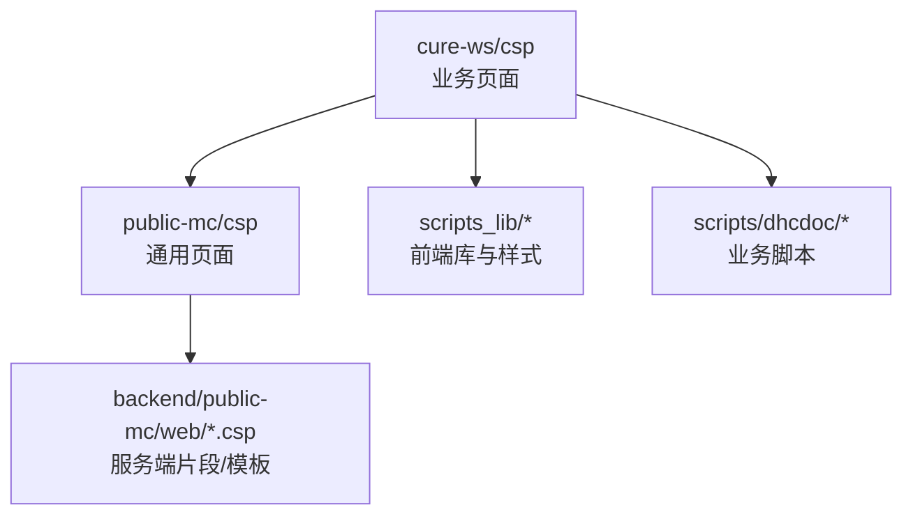
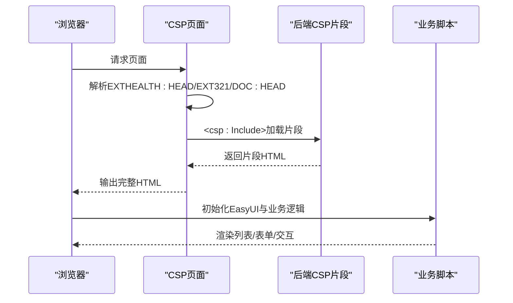
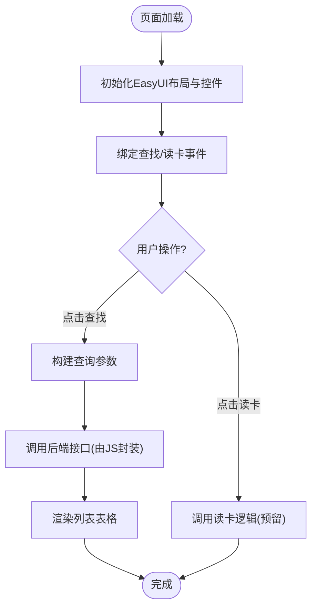
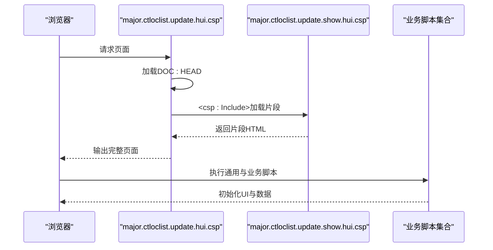
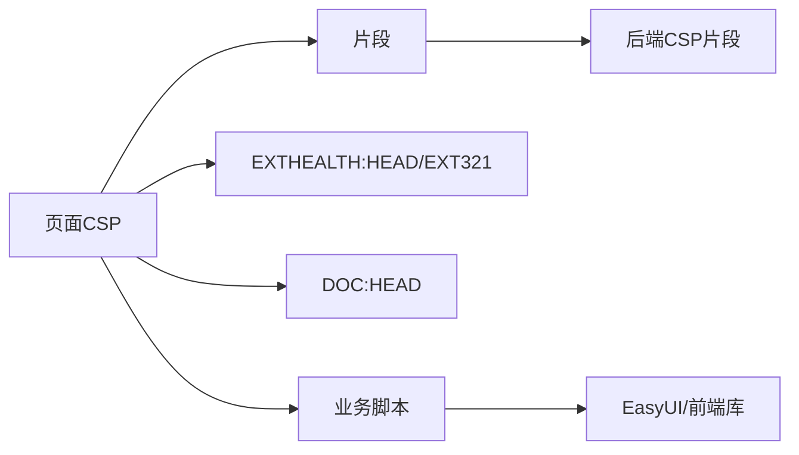

# CSP页面结构

<cite>
**本文引用的文件**
- [dhcdoc.cure.applyarrivelist.csp](file://src/frontend/cure-ws/csp/dhcdoc.cure.applyarrivelist.csp)
- [major.ctloclist.update.hui.csp](file://src/frontend/public-mc/csp/major.ctloclist.update.hui.csp)
- [major.ctloclist.update.show.hui.csp](file://src/backend/public-mc/web/major.ctloclist.update.show.hui.csp)
</cite>

## 目录
1. [简介](#简介)
2. [项目结构](#项目结构)
3. [核心组件](#核心组件)
4. [架构总览](#架构总览)
5. [详细组件分析](#详细组件分析)
6. [依赖关系分析](#依赖关系分析)
7. [性能考虑](#性能考虑)
8. [故障排查指南](#故障排查指南)
9. [结论](#结论)
10. [附录](#附录)

## 简介
本文件面向InterSystems CSP页面的组织方式、模板结构与页面生命周期，结合仓库中的实际CSP文件，说明命名规范、文件组织结构、页面间导航机制，以及CSP与ObjectScript后端的交互模式、数据绑定、事件处理。同时给出权限控制、会话管理、错误处理策略，并提供开发最佳实践、性能优化建议与调试技巧。

## 项目结构
- 前端CSP页面按业务域分目录存放：
  - cure-ws/csp：治疗相关页面
  - public-mc/csp：公共/通用页面
  - doc-ws/csp、opadm-mc/csp等：其他业务域（本仓库中未直接展开）
- 每个CSP页面通常包含：
  - 标准HTML头部与EXTHEALTH:HEAD扩展头
  - 通过EXTHEALTH:TRANSLATE或%session.Get("TITLE")注入标题
  - 引入EasyUI等前端库与业务JS脚本
  - 使用EXTHEALTH:EXT321或DOC:HEAD等标签统一注入系统级资源
  - 通过<csp:Include>嵌入子页面或片段，实现模块化拼装

**图表来源**
- [dhcdoc.cure.applyarrivelist.csp:1-52](file://src/frontend/cure-ws/csp/dhcdoc.cure.applyarrivelist.csp#L1-L52)
- [major.ctloclist.update.hui.csp:1-14](file://src/frontend/public-mc/csp/major.ctloclist.update.hui.csp#L1-L14)
- [major.ctloclist.update.show.hui.csp:1-14](file://src/backend/public-mc/web/major.ctloclist.update.show.hui.csp#L1-L14)

**章节来源**
- [dhcdoc.cure.applyarrivelist.csp:1-52](file://src/frontend/cure-ws/csp/dhcdoc.cure.applyarrivelist.csp#L1-L52)
- [major.ctloclist.update.hui.csp:1-14](file://src/frontend/public-mc/csp/major.ctloclist.update.hui.csp#L1-L14)
- [major.ctloclist.update.show.hui.csp:1-14](file://src/backend/public-mc/web/major.ctloclist.update.show.hui.csp#L1-L14)

## 核心组件
- 页面模板与扩展头
  - EXTHEALTH:HEAD：统一注入系统级CSS/JS与国际化资源
  - EXTHEALTH:EXT321：用于兼容或扩展特定版本的前端能力
  - DOC:HEAD：在部分页面中作为统一入口，负责加载公共脚本与样式
- 标题与国际化
  - 通过<EXTHEALTH:TRANSLATE id=title>与%session.Get("TITLE")组合，实现动态标题与多语言支持
- 页面片段复用
  - <csp:Include Page="...">：将后端CSP片段嵌入当前页面，便于拆分复杂页面为可维护的模块
- 前端框架集成
  - EasyUI布局与控件：通过data-options与class进行声明式配置
  - 业务脚本：scripts/dhcdoc/*下按功能模块组织，如applyarrivelist.js

**章节来源**
- [dhcdoc.cure.applyarrivelist.csp:1-52](file://src/frontend/cure-ws/csp/dhcdoc.cure.applyarrivelist.csp#L1-L52)
- [major.ctloclist.update.hui.csp:1-14](file://src/frontend/public-mc/csp/major.ctloclist.update.hui.csp#L1-L14)
- [major.ctloclist.update.show.hui.csp:1-14](file://src/backend/public-mc/web/major.ctloclist.update.show.hui.csp#L1-L14)

## 架构总览
CSP页面作为视图层，负责渲染HTML并与前端脚本交互；通过<csp:Include>或直接调用后端CSP片段，完成与服务端逻辑的耦合。页面生命周期由CSP引擎驱动，从解析标签、执行服务器端代码到输出最终HTML。

**图表来源**
- [major.ctloclist.update.hui.csp:1-14](file://src/frontend/public-mc/csp/major.ctloclist.update.hui.csp#L1-L14)
- [major.ctloclist.update.show.hui.csp:1-14](file://src/backend/public-mc/web/major.ctloclist.update.show.hui.csp#L1-L14)
- [dhcdoc.cure.applyarrivelist.csp:1-52](file://src/frontend/cure-ws/csp/dhcdoc.cure.applyarrivelist.csp#L1-L52)

## 详细组件分析

### 治疗预约候诊列表页面（dhcdoc.cure.applyarrivelist.csp）
- 模板结构
  - 使用EXTHEALTH:HEAD与EXTHEALTH:EXT321注入系统资源
  - 标题通过<EXTHEALTH:TRANSLATE id=title>与%session.Get("TITLE")设置
- 前端资源
  - 引入jQuery与EasyUI主题与中文本地化
  - 引入业务脚本dhcdoc.cure.commonutil.js与dhcdoc.cure.applyarrivelist.js
- 页面布局
  - 使用EasyUI layout，north区域放置查询条件面板，center区域放置列表表格
  - 表格id为tabCureApplyAppArriveList，由对应JS初始化并绑定数据
- 数据绑定与事件
  - 通过EasyUI控件（datebox、linkbutton等）收集输入
  - 查找按钮触发JS函数，调用后端接口获取数据并刷新表格
  - 读卡按钮预留读取设备数据的交互点

**图表来源**
- [dhcdoc.cure.applyarrivelist.csp:1-52](file://src/frontend/cure-ws/csp/dhcdoc.cure.applyarrivelist.csp#L1-L52)

**章节来源**
- [dhcdoc.cure.applyarrivelist.csp:1-52](file://src/frontend/cure-ws/csp/dhcdoc.cure.applyarrivelist.csp#L1-L52)

### 通用更新列表页面（major.ctloclist.update.hui.csp / show.hui.csp）
- 模板结构
  - 使用DOC:HEAD统一注入公共资源
  - 通过<csp:Include Page="major.ctloclist.update.show.hui.csp">嵌入具体展示片段
- 脚本组织
  - 引入hisui/websys.comm.js、DHCWeb.OPCommon.js、tools.hui.js、OPRegLocList.Update.hui.js、sortcomponent.js
  - 这些脚本提供通用通信、排序、业务逻辑与UI增强
- 页面生命周期
  - 主页面负责装载公共头与脚本，片段页面负责渲染具体内容
  - 通过include机制实现“壳+内容”的解耦，便于复用与维护

**图表来源**
- [major.ctloclist.update.hui.csp:1-14](file://src/frontend/public-mc/csp/major.ctloclist.update.hui.csp#L1-L14)
- [major.ctloclist.update.show.hui.csp:1-14](file://src/backend/public-mc/web/major.ctloclist.update.show.hui.csp#L1-L14)

**章节来源**
- [major.ctloclist.update.hui.csp:1-14](file://src/frontend/public-mc/csp/major.ctloclist.update.hui.csp#L1-L14)
- [major.ctloclist.update.show.hui.csp:1-14](file://src/backend/public-mc/web/major.ctloclist.update.show.hui.csp#L1-L14)

## 依赖关系分析
- 页面与脚本
  - 页面通过<script>标签引入业务脚本，脚本负责DOM操作与数据交互
- 页面与后端片段
  - 通过<csp:Include>将后端CSP片段嵌入，减少重复代码，提升可维护性
- 系统与扩展
  - EXTHEALTH:HEAD/EXT321与DOC:HEAD提供统一的系统资源注入点
  - 标题与国际化通过EXTHEALTH:TRANSLATE与%session.Get("TITLE")实现

**图表来源**
- [major.ctloclist.update.hui.csp:1-14](file://src/frontend/public-mc/csp/major.ctloclist.update.hui.csp#L1-L14)
- [major.ctloclist.update.show.hui.csp:1-14](file://src/backend/public-mc/web/major.ctloclist.update.show.hui.csp#L1-L14)
- [dhcdoc.cure.applyarrivelist.csp:1-52](file://src/frontend/cure-ws/csp/dhcdoc.cure.applyarrivelist.csp#L1-L52)

**章节来源**
- [major.ctloclist.update.hui.csp:1-14](file://src/frontend/public-mc/csp/major.ctloclist.update.hui.csp#L1-L14)
- [major.ctloclist.update.show.hui.csp:1-14](file://src/backend/public-mc/web/major.ctloclist.update.show.hui.csp#L1-L14)
- [dhcdoc.cure.applyarrivelist.csp:1-52](file://src/frontend/cure-ws/csp/dhcdoc.cure.applyarrivelist.csp#L1-L52)

## 性能考虑
- 资源加载
  - 将公共样式与脚本集中通过EXTHEALTH:HEAD/DOC:HEAD注入，避免重复加载
  - 按需引入业务脚本，减少首屏体积
- 前端渲染
  - 使用EasyUI的延迟渲染与分页，降低大数据量下的渲染压力
  - 合理划分north/center等区域，减少重排重绘
- 后端片段
  - 通过<csp:Include>拆分大页面为小片段，提高缓存命中率与并行加载能力
- 网络请求
  - 合并请求、使用缓存策略，减少频繁往返

[本节为通用指导，不直接分析具体文件]

## 故障排查指南
- 标题为空或未翻译
  - 检查<EXTHEALTH:TRANSLATE id=title>与%session.Get("TITLE")是否正确设置
- 页面空白或样式缺失
  - 确认EXTHEALTH:HEAD/EXT321或DOC:HEAD是否成功加载
  - 检查<csp:Include>的目标片段是否存在且路径正确
- 列表不显示或报错
  - 查看对应JS是否被加载，控制台是否有错误
  - 检查表格id是否与JS初始化一致
- 事件无响应
  - 确认控件初始化顺序与事件绑定时机
  - 检查网络请求是否成功，后端接口是否返回预期数据

**章节来源**
- [dhcdoc.cure.applyarrivelist.csp:1-52](file://src/frontend/cure-ws/csp/dhcdoc.cure.applyarrivelist.csp#L1-L52)
- [major.ctloclist.update.hui.csp:1-14](file://src/frontend/public-mc/csp/major.ctloclist.update.hui.csp#L1-L14)
- [major.ctloclist.update.show.hui.csp:1-14](file://src/backend/public-mc/web/major.ctloclist.update.show.hui.csp#L1-L14)

## 结论
该项目的CSP页面采用“壳+片段”的组织方式，借助EXTHEALTH与DOC扩展头统一注入系统资源，通过<csp:Include>实现页面模块化。页面以EasyUI为基础构建界面，业务脚本负责数据绑定与事件处理。通过合理的资源管理与片段拆分，可在保证可维护性的同时提升性能与用户体验。

[本节为总结性内容，不直接分析具体文件]

## 附录
- 命名规范建议
  - 页面文件以业务域前缀开头，如dhcdoc.cure.*、major.*
  - 片段文件以show/update/list等后缀区分用途
- 文件组织建议
  - 将公共脚本与样式放在scripts_lib或公共目录下
  - 业务脚本按功能模块组织，与页面一一对应
- 页面间导航机制
  - 通过URL参数传递上下文，或在会话中保存状态
  - 使用<csp:Include>在不同页面间复用片段，减少重复逻辑
- 与ObjectScript后端交互
  - 通过<csp:Include>直接嵌入后端CSP片段
  - 前端JS调用后端接口（由业务脚本封装），实现异步数据交互
- 数据绑定方式
  - 使用EasyUI控件的value属性与JS方法读写数据
  - 表格通过列定义与数据源绑定，支持分页与搜索
- 事件处理机制
  - 通过EasyUI的事件回调与自定义JS函数处理用户操作
  - 将业务逻辑集中在脚本文件中，保持页面简洁
- 权限控制与会话管理
  - 利用%session.Get("TITLE")等会话变量传递上下文
  - 在后端片段中进行权限校验，确保数据安全
- 错误处理策略
  - 在前端捕获异常并提示用户
  - 在后端记录错误日志，提供友好的错误页面
- 调试技巧
  - 使用浏览器开发者工具检查网络请求与控制台错误
  - 逐步注释脚本定位问题
- 常见问题解决方案
  - 资源未加载：检查路径与服务器映射
  - 片段未显示：确认Include路径与片段存在
  - 数据不刷新：检查接口返回与表格绑定逻辑

[本节为通用指导，不直接分析具体文件]