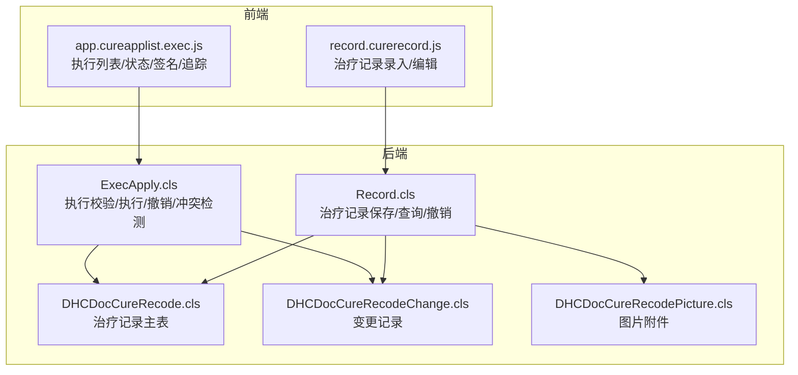
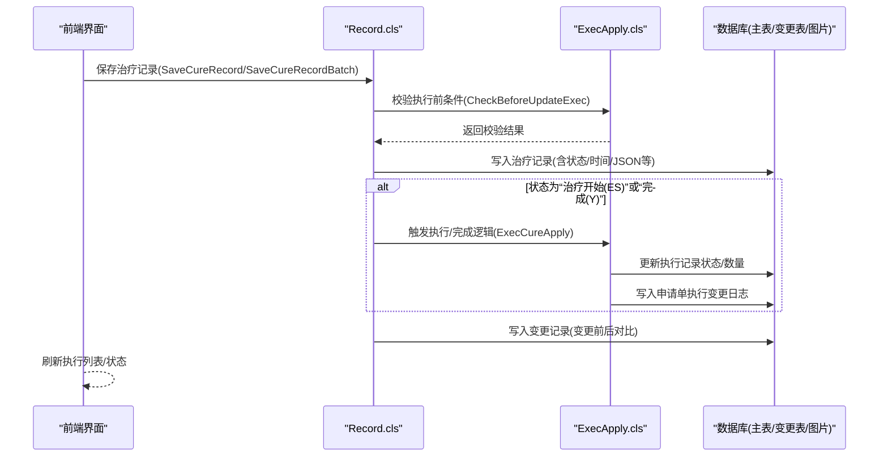
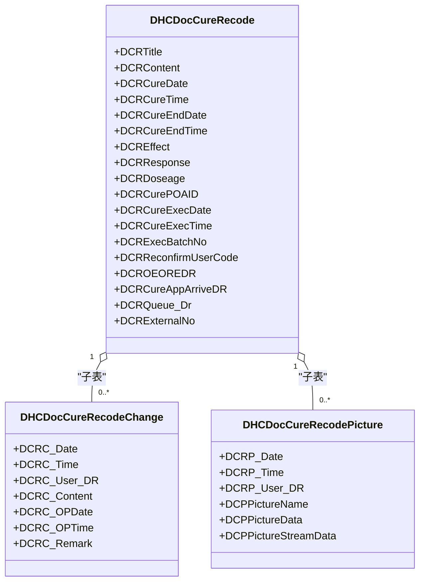
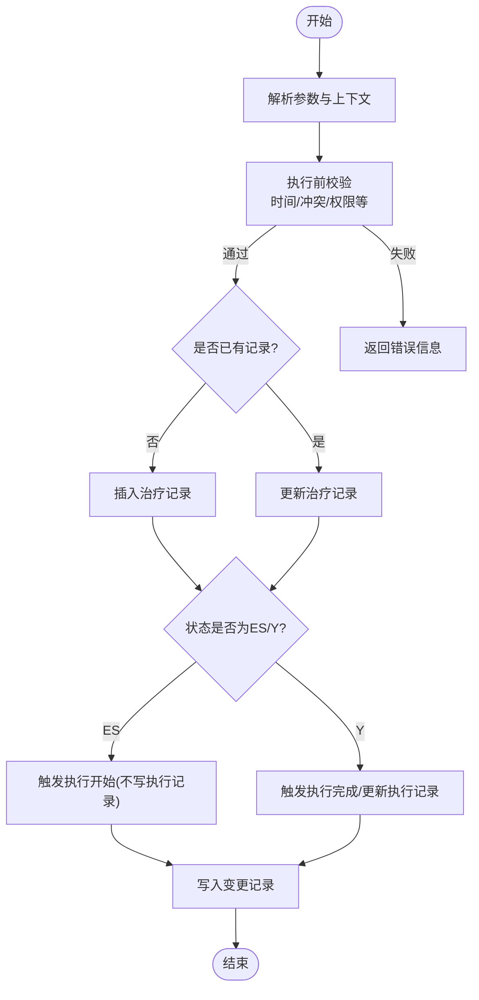
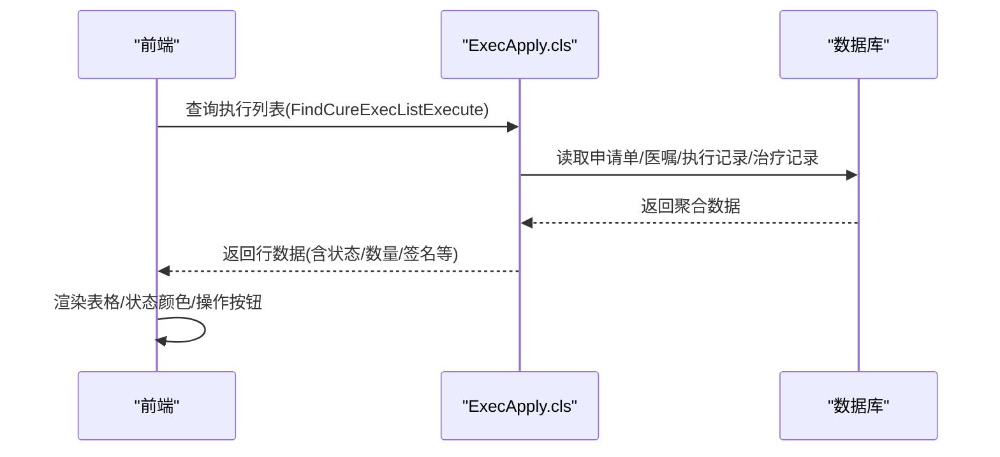
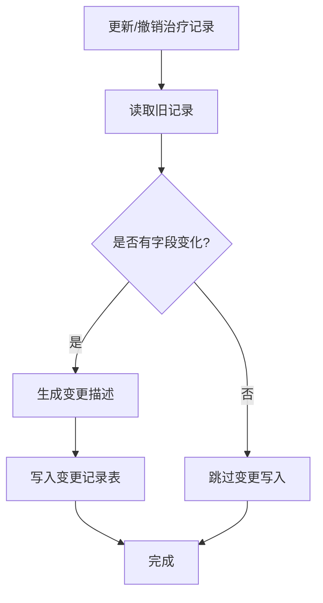
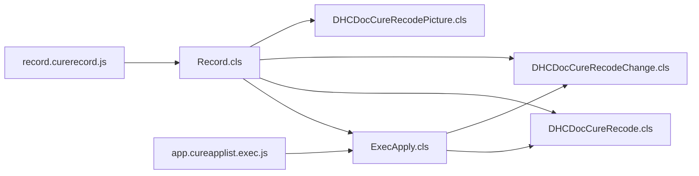

# 治疗执行跟踪

<cite>
**本文引用的文件**
- [DHCDocCureRecode.cls](file://src/backend/cure-ws/User/DHCDocCureRecode.cls)
- [DHCDocCureRecodeChange.cls](file://src/backend/cure-ws/User/DHCDocCureRecodeChange.cls)
- [Record.cls](file://src/backend/cure-ws/DHCDoc/DHCDocCure/Record.cls)
- [ExecApply.cls](file://src/backend/cure-ws/DHCDoc/DHCDocCure/ExecApply.cls)
- [DHCDocCureRecodePicture.cls](file://src/backend/cure-ws/User/DHCDocCureRecodePicture.cls)
- [record.curerecord.js](file://src/frontend/cure-ws/scripts/dhcdoc/dhcdoccure_hui/record.curerecord.js)
- [app.cureapplist.exec.js](file://src/frontend/cure-ws/scripts/dhcdoc/dhcdoccure_hui/app.cureapplist.exec.js)
</cite>

## 目录
1. [简介](#简介)
2. [项目结构](#项目结构)
3. [核心组件](#核心组件)
4. [架构总览](#架构总览)
5. [详细组件分析](#详细组件分析)
6. [依赖关系分析](#依赖关系分析)
7. [性能考虑](#性能考虑)
8. [故障排查指南](#故障排查指南)
9. [结论](#结论)
10. [附录](#附录)

## 简介
本文件围绕“治疗执行跟踪”能力，系统化说明治疗记录管理、执行状态跟踪、变更记录追踪等核心功能；解释 DHCDocCureRecode 与 DHCDocCureRecodeChange 的业务逻辑；覆盖治疗记录的创建、更新、审核与归档流程；说明实时状态监控、异常处理机制与执行日志记录；并给出治疗完成确认、效果评估、质量检查等业务环节的实现要点。同时提供工作流设计、权限控制与审计追踪的说明，以及前端界面使用说明与后端接口调用路径指引。

## 项目结构
- 后端服务（cure-ws）
  - 数据模型：治疗记录主表、变更记录、图片附件等实体类
  - 业务逻辑：治疗记录保存/查询/撤销、执行申请校验与执行、时间冲突检测、批量操作等
- 前端界面（cure-ws）
  - 治疗记录录入与编辑页面
  - 治疗执行列表与状态展示、患者签名、过程追踪入口等

**图表来源**
- [Record.cls:126-379](file://src/backend/cure-ws/DHCDoc/DHCDocCure/Record.cls#L126-L379)
- [ExecApply.cls:316-708](file://src/backend/cure-ws/DHCDoc/DHCDocCure/ExecApply.cls#L316-L708)
- [DHCDocCureRecode.cls:1-105](file://src/backend/cure-ws/User/DHCDocCureRecode.cls#L1-L105)
- [DHCDocCureRecodeChange.cls:1-47](file://src/backend/cure-ws/User/DHCDocCureRecodeChange.cls#L1-L47)
- [DHCDocCureRecodePicture.cls:1-31](file://src/backend/cure-ws/User/DHCDocCureRecodePicture.cls#L1-L31)
- [record.curerecord.js:1-200](file://src/frontend/cure-ws/scripts/dhcdoc/dhcdoccure_hui/record.curerecord.js#L1-L200)
- [app.cureapplist.exec.js:1-200](file://src/frontend/cure-ws/scripts/dhcdoc/dhcdoccure_hui/app.cureapplist.exec.js#L1-L200)

**章节来源**
- [Record.cls:126-379](file://src/backend/cure-ws/DHCDoc/DHCDocCure/Record.cls#L126-L379)
- [ExecApply.cls:316-708](file://src/backend/cure-ws/DHCDoc/DHCDocCure/ExecApply.cls#L316-L708)
- [DHCDocCureRecode.cls:1-105](file://src/backend/cure-ws/User/DHCDocCureRecode.cls#L1-L105)
- [DHCDocCureRecodeChange.cls:1-47](file://src/backend/cure-ws/User/DHCDocCureRecodeChange.cls#L1-L47)
- [DHCDocCureRecodePicture.cls:1-31](file://src/backend/cure-ws/User/DHCDocCureRecodePicture.cls#L1-L31)
- [record.curerecord.js:1-200](file://src/frontend/cure-ws/scripts/dhcdoc/dhcdoccure_hui/record.curerecord.js#L1-L200)
- [app.cureapplist.exec.js:1-200](file://src/frontend/cure-ws/scripts/dhcdoc/dhcdoccure_hui/app.cureapplist.exec.js#L1-L200)

## 核心组件
- 治疗记录主表（DHCDocCureRecode）
  - 关联预约、医嘱执行、队列、模板、复核人、执行批次号、外部执行号等
  - 关键字段：标题、内容、创建/更新信息、是否有效、是否存在图片、治疗起止时间、反应、效果、剂量、执行日期/时间、队列、批次号、结束人、外部号等
- 变更记录表（DHCDocCureRecodeChange）
  - 记录每次修改的时间、用户、内容、备注等，支持审计追溯
- 图片附件（DHCDocCureRecodePicture）
  - 支持上传名称、二进制数据与流式数据，关联到具体治疗记录
- 记录服务（Record.cls）
  - 保存/批量保存、获取单条记录、查询列表、撤销记录、写入变更日志、自动插入预约等
- 执行服务（ExecApply.cls）
  - 执行前校验、执行/撤销执行、数量计算、时间冲突检测、执行结果查询、执行变更日志等

**章节来源**
- [DHCDocCureRecode.cls:1-105](file://src/backend/cure-ws/User/DHCDocCureRecode.cls#L1-L105)
- [DHCDocCureRecodeChange.cls:1-47](file://src/backend/cure-ws/User/DHCDocCureRecodeChange.cls#L1-L47)
- [DHCDocCureRecodePicture.cls:1-31](file://src/backend/cure-ws/User/DHCDocCureRecodePicture.cls#L1-L31)
- [Record.cls:126-379](file://src/backend/cure-ws/DHCDoc/DHCDocCure/Record.cls#L126-L379)
- [ExecApply.cls:316-708](file://src/backend/cure-ws/DHCDoc/DHCDocCure/ExecApply.cls#L316-L708)

## 架构总览
治疗执行跟踪由“前端交互层 + 后端服务层 + 持久化存储”构成：
- 前端负责表单校验、电子签名、调用后端方法、渲染执行列表与状态
- 后端服务负责业务规则校验、事务性写入、并发冲突检测、状态同步、审计日志
- 存储层以SQL存储为主，包含主表、变更表、图片附件及索引

**图表来源**
- [Record.cls:126-379](file://src/backend/cure-ws/DHCDoc/DHCDocCure/Record.cls#L126-L379)
- [ExecApply.cls:572-708](file://src/backend/cure-ws/DHCDoc/DHCDocCure/ExecApply.cls#L572-L708)
- [DHCDocCureRecodeChange.cls:1-47](file://src/backend/cure-ws/User/DHCDocCureRecodeChange.cls#L1-L47)

## 详细组件分析

### 数据模型与关系
- 治疗记录主表（DHCDocCureRecode）
  - 字段涵盖：关联预约/医嘱执行、标题/内容、创建/更新信息、有效性、图片标记、治疗起止时间、反应/效果/剂量、模板ID、JSON扩展、穴位/部位、复核人工号、执行日期/时间、队列、批次号、结束人、外部执行号等
- 变更记录表（DHCDocCureRecodeChange）
  - 字段涵盖：修改日期/时间、修改用户、修改内容、操作日期/时间、最后更新信息与备注等
- 图片附件表（DHCDocCureRecodePicture）
  - 字段涵盖：上传日期/时间、上传用户、图片名称、二进制数据、流式数据

**图表来源**
- [DHCDocCureRecode.cls:1-105](file://src/backend/cure-ws/User/DHCDocCureRecode.cls#L1-L105)
- [DHCDocCureRecodeChange.cls:1-47](file://src/backend/cure-ws/User/DHCDocCureRecodeChange.cls#L1-L47)
- [DHCDocCureRecodePicture.cls:1-31](file://src/backend/cure-ws/User/DHCDocCureRecodePicture.cls#L1-L31)

**章节来源**
- [DHCDocCureRecode.cls:1-105](file://src/backend/cure-ws/User/DHCDocCureRecode.cls#L1-L105)
- [DHCDocCureRecodeChange.cls:1-47](file://src/backend/cure-ws/User/DHCDocCureRecodeChange.cls#L1-L47)
- [DHCDocCureRecodePicture.cls:1-31](file://src/backend/cure-ws/User/DHCDocCureRecodePicture.cls#L1-L31)

### 治疗记录保存与更新流程
- 保存入口：Record.SaveCureRecord / SaveCureRecordBatch
- 关键步骤
  - 解析参数（标题、内容、时间、反应、效果、剂量、模板、JSON扩展、穴位、复核人、执行批次号等）
  - 校验：执行前检查（CheckBeforeUpdateExec）、时间冲突检测（CheckExecTimeConflict）、时间合法性校验
  - 新增或更新：根据是否存在已有记录决定插入或更新
  - 状态流转：当状态为“治疗开始(ES)”时仅缓存记录；当状态为“完成(Y)”时触发执行/完成逻辑，并更新预约状态
  - 审计：写入变更记录（SaveFileLog），记录字段级变化
  - 异步：必要时通过作业将数据输入CDR

**图表来源**
- [Record.cls:126-379](file://src/backend/cure-ws/DHCDoc/DHCDocCure/Record.cls#L126-L379)
- [ExecApply.cls:316-708](file://src/backend/cure-ws/DHCDoc/DHCDocCure/ExecApply.cls#L316-L708)

**章节来源**
- [Record.cls:126-379](file://src/backend/cure-ws/DHCDoc/DHCDocCure/Record.cls#L126-L379)
- [ExecApply.cls:316-708](file://src/backend/cure-ws/DHCDoc/DHCDocCure/ExecApply.cls#L316-L708)

### 执行状态跟踪与实时监控
- 执行列表查询：ExecApply.FindCureExecListExecute
  - 聚合患者、医嘱、执行记录、治疗记录、预约状态、执行数量、执行时间、执行人员、导出标志、患者签名状态等
  - 支持按日期范围过滤、仅未执行/已执行筛选、队列过滤
- 状态展示：前端根据执行状态码着色显示（完成/取消/停止/治疗开始等）
- 实时性：列表加载后即时反映执行状态与签名状态，支持刷新

**图表来源**
- [ExecApply.cls:13-177](file://src/backend/cure-ws/DHCDoc/DHCDocCure/ExecApply.cls#L13-L177)
- [app.cureapplist.exec.js:45-200](file://src/frontend/cure-ws/scripts/dhcdoc/dhcdoccure_hui/app.cureapplist.exec.js#L45-L200)

**章节来源**
- [ExecApply.cls:13-177](file://src/backend/cure-ws/DHCDoc/DHCDocCure/ExecApply.cls#L13-L177)
- [app.cureapplist.exec.js:45-200](file://src/frontend/cure-ws/scripts/dhcdoc/dhcdoccure_hui/app.cureapplist.exec.js#L45-L200)

### 变更记录追踪与审计
- 变更写入：Record.SaveFileLog
  - 比较旧值与新值，生成变更描述（标题、内容、时间、反应、效果、剂量等）
  - 写入变更记录表（DHCDocCureRecodeChange）
- 撤销记录：Record.CancelRecord / CancelRecordBatch
  - 将记录置为无效，并可选择撤销执行记录
  - 同样写入变更记录

**图表来源**
- [Record.cls:693-800](file://src/backend/cure-ws/DHCDoc/DHCDocCure/Record.cls#L693-L800)
- [DHCDocCureRecodeChange.cls:1-47](file://src/backend/cure-ws/User/DHCDocCureRecodeChange.cls#L1-L47)

**章节来源**
- [Record.cls:693-800](file://src/backend/cure-ws/DHCDoc/DHCDocCure/Record.cls#L693-L800)
- [DHCDocCureRecodeChange.cls:1-47](file://src/backend/cure-ws/User/DHCDocCureRecodeChange.cls#L1-L47)

### 治疗完成确认、效果评估与质量检查
- 完成确认
  - 当记录状态从“治疗开始(ES)”更新为“完成(Y)”时，触发执行完成逻辑，更新执行记录状态与数量，并写入执行变更日志
- 效果评估
  - 记录中“治疗效果”“治疗反应”“剂量”等字段用于评估与统计
- 质量检查
  - 执行前校验（CheckBeforeUpdateExec）确保医嘱/患者/费用/排班等前置条件满足
  - 时间冲突检测（CheckExecTimeConflict）避免同一患者多治疗时间重叠
  - 住院场景下可配置需护士先处理医嘱再执行

**章节来源**
- [ExecApply.cls:316-708](file://src/backend/cure-ws/DHCDoc/DHCDocCure/ExecApply.cls#L316-L708)
- [Record.cls:126-379](file://src/backend/cure-ws/DHCDoc/DHCDocCure/Record.cls#L126-L379)

### 工作流设计与权限控制
- 工作流
  - 创建治疗记录 → 校验 → 保存（ES缓存或Y完成）→ 触发执行/完成 → 写入审计 → 刷新状态
- 权限控制
  - 前端在保存前进行角色校验（如只有治疗医师可修改）
  - 后端在执行前校验患者状态、医嘱状态、费用控制、护士处理要求等

**章节来源**
- [record.curerecord.js:124-172](file://src/frontend/cure-ws/scripts/dhcdoc/dhcdoccure_hui/record.curerecord.js#L124-L172)
- [ExecApply.cls:316-452](file://src/backend/cure-ws/DHCDoc/DHCDocCure/ExecApply.cls#L316-L452)

### API 接口与前端使用说明
- 后端方法（通过前端调用）
  - Record.GetCureRecord：获取单条治疗记录详情
  - Record.SaveCureRecord / SaveCureRecordBatch：保存/批量保存治疗记录
  - Record.CancelRecord / CancelRecordBatch：撤销治疗记录
  - ExecApply.FindCureExecListExecute：查询治疗执行列表
  - ExecApply.CheckBeforeUpdateExec：执行前校验
  - ExecApply.ExecCureApply：执行/撤销执行
- 前端页面
  - record.curerecord.js：治疗记录录入与编辑，包含表单校验、电子签名、保存调用
  - app.cureapplist.exec.js：执行列表展示、状态渲染、患者签名入口、过程追踪入口

**章节来源**
- [record.curerecord.js:1-200](file://src/frontend/cure-ws/scripts/dhcdoc/dhcdoccure_hui/record.curerecord.js#L1-L200)
- [app.cureapplist.exec.js:1-200](file://src/frontend/cure-ws/scripts/dhcdoc/dhcdoccure_hui/app.cureapplist.exec.js#L1-L200)
- [Record.cls:126-379](file://src/backend/cure-ws/DHCDoc/DHCDocCure/Record.cls#L126-L379)
- [ExecApply.cls:13-177](file://src/backend/cure-ws/DHCDoc/DHCDocCure/ExecApply.cls#L13-L177)

## 依赖关系分析
- Record 依赖 ExecApply 进行执行前校验与执行/完成逻辑
- Record 与 ExecApply 均依赖持久化存储（主表、变更表、图片附件）
- 前端依赖后端方法实现数据读写与状态刷新

**图表来源**
- [Record.cls:126-379](file://src/backend/cure-ws/DHCDoc/DHCDocCure/Record.cls#L126-L379)
- [ExecApply.cls:316-708](file://src/backend/cure-ws/DHCDoc/DHCDocCure/ExecApply.cls#L316-L708)
- [DHCDocCureRecode.cls:1-105](file://src/backend/cure-ws/User/DHCDocCureRecode.cls#L1-L105)
- [DHCDocCureRecodeChange.cls:1-47](file://src/backend/cure-ws/User/DHCDocCureRecodeChange.cls#L1-L47)
- [DHCDocCureRecodePicture.cls:1-31](file://src/backend/cure-ws/User/DHCDocCureRecodePicture.cls#L1-L31)
- [record.curerecord.js:1-200](file://src/frontend/cure-ws/scripts/dhcdoc/dhcdoccure_hui/record.curerecord.js#L1-L200)
- [app.cureapplist.exec.js:1-200](file://src/frontend/cure-ws/scripts/dhcdoc/dhcdoccure_hui/app.cureapplist.exec.js#L1-L200)

**章节来源**
- [Record.cls:126-379](file://src/backend/cure-ws/DHCDoc/DHCDocCure/Record.cls#L126-L379)
- [ExecApply.cls:316-708](file://src/backend/cure-ws/DHCDoc/DHCDocCure/ExecApply.cls#L316-L708)
- [DHCDocCureRecode.cls:1-105](file://src/backend/cure-ws/User/DHCDocCureRecode.cls#L1-L105)
- [DHCDocCureRecodeChange.cls:1-47](file://src/backend/cure-ws/User/DHCDocCureRecodeChange.cls#L1-L47)
- [DHCDocCureRecodePicture.cls:1-31](file://src/backend/cure-ws/User/DHCDocCureRecodePicture.cls#L1-L31)
- [record.curerecord.js:1-200](file://src/frontend/cure-ws/scripts/dhcdoc/dhcdoccure_hui/record.curerecord.js#L1-L200)
- [app.cureapplist.exec.js:1-200](file://src/frontend/cure-ws/scripts/dhcdoc/dhcdoccure_hui/app.cureapplist.exec.js#L1-L200)

## 性能考虑
- 批量保存：使用 SaveCureRecordBatch 减少往返次数，提升吞吐
- 索引优化：主表与变更表定义多个索引（如按预约、执行日期、医嘱执行等），提高查询效率
- 分页与过滤：执行列表支持分页与日期范围过滤，降低单次数据量
- 异步处理：必要时通过作业将数据输入CDR，避免阻塞主流程

[本节为通用指导，无需特定文件引用]

## 故障排查指南
- 常见错误码与提示
  - 101：一个预约仅限添加一条治疗记录
  - 102：预约记录没有对应的执行记录，不能做治疗
  - 103：已取消预约的不能够添加治疗记录
  - 104：治疗结束时间不能早于治疗开始时间
  - -303：该预约记录已被执行
- 排查步骤
  - 检查执行前校验返回值（CheckBeforeUpdateExec）
  - 核对时间字段与医嘱开始时间的关系
  - 查看变更记录表定位最近一次修改内容与用户
  - 检查执行列表状态与数量是否正确更新

**章节来源**
- [Record.cls:107-124](file://src/backend/cure-ws/DHCDoc/DHCDocCure/Record.cls#L107-L124)
- [Record.cls:693-800](file://src/backend/cure-ws/DHCDoc/DHCDocCure/Record.cls#L693-L800)

## 结论
治疗执行跟踪通过清晰的数据模型与严谨的服务逻辑，实现了治疗记录的创建、更新、审核与归档全流程；借助执行前校验、时间冲突检测与审计日志，保障了执行的准确性与可追溯性；前端界面提供了直观的状态展示与便捷的操作入口。整体架构具备良好的扩展性与可维护性，适用于复杂临床场景下的治疗执行管理。

[本节为总结，无需特定文件引用]

## 附录
- 关键方法路径参考
  - 保存治疗记录：Record.SaveCureRecord / SaveCureRecordBatch
  - 获取治疗记录：Record.GetCureRecord
  - 撤销治疗记录：Record.CancelRecord / CancelRecordBatch
  - 执行前校验：ExecApply.CheckBeforeUpdateExec
  - 执行/撤销执行：ExecApply.ExecCureApply
  - 执行列表查询：ExecApply.FindCureExecListExecute
- 前端页面参考
  - 治疗记录录入：record.curerecord.js
  - 执行列表与状态：app.cureapplist.exec.js

[本节为参考索引，无需特定文件引用]