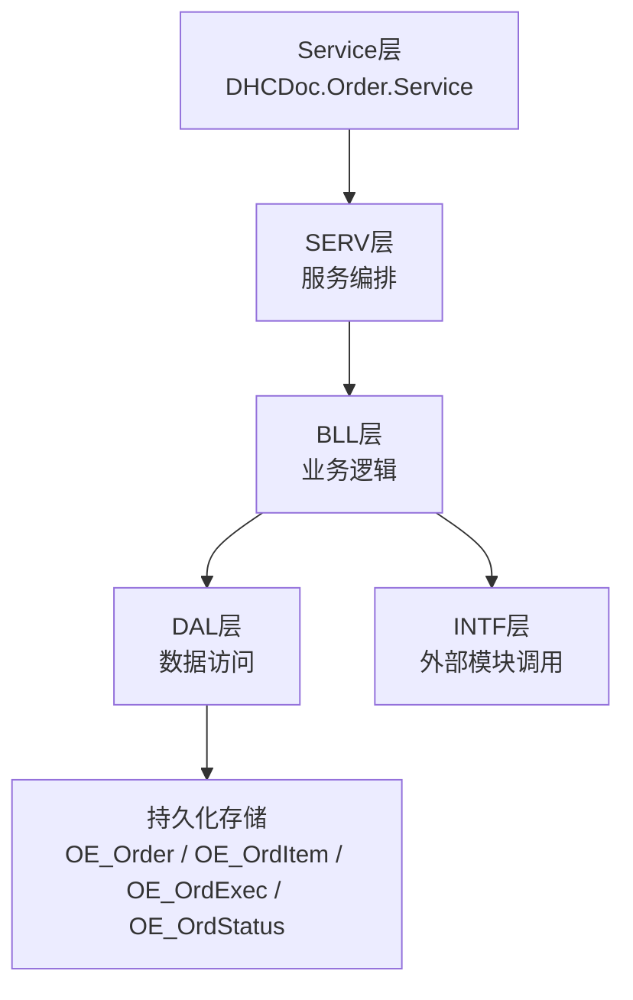
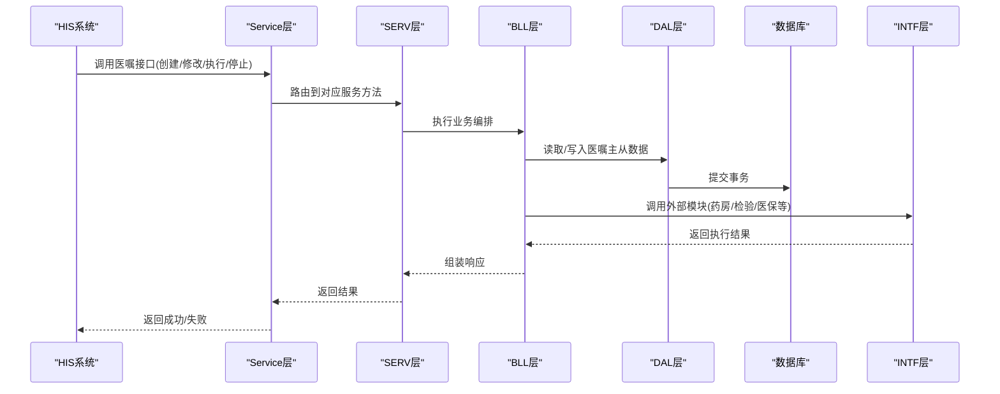
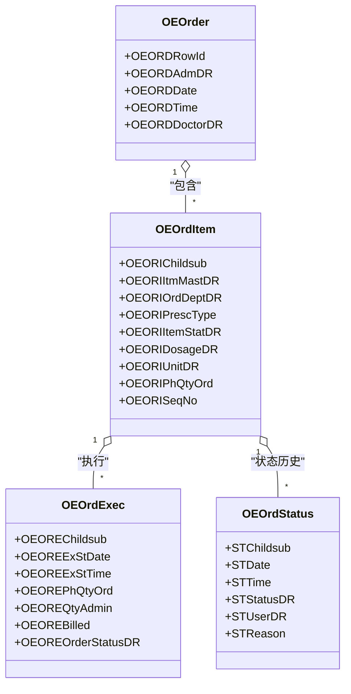
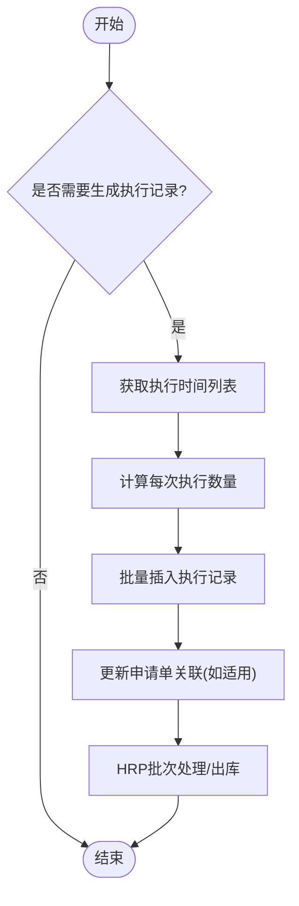
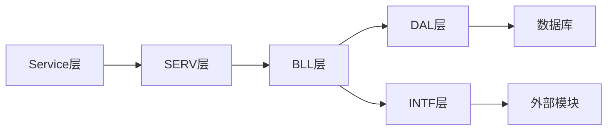

# 医嘱数据交换

<cite>
**本文引用的文件**
- [Service.cls](file://src/backend/doc-ws/DHCDoc/Order/Service.cls)
- [Exec.cls](file://src/backend/doc-ws/DHCDoc/Order/Exec.cls)
- [OEOrder.cls](file://src/backend/doc-ws/User/OEOrder.cls)
- [OEOrdItem.cls](file://src/backend/doc-ws/User/OEOrdItem.cls)
- [OEOrdExec.cls](file://src/backend/doc-ws/User/OEOrdExec.cls)
- [OEOrdStatus.cls](file://src/backend/doc-ws/User/OEOrdStatus.cls)
</cite>

## 目录
1. [简介](#简介)
2. [项目结构](#项目结构)
3. [核心组件](#核心组件)
4. [架构总览](#架构总览)
5. [详细组件分析](#详细组件分析)
6. [依赖关系分析](#依赖关系分析)
7. [性能考虑](#性能考虑)
8. [故障排查指南](#故障排查指南)
9. [结论](#结论)
10. [附录](#附录)

## 简介
本文件面向与HIS系统的医嘱数据交换，聚焦医嘱全生命周期管理（创建、修改、执行、停止）以及订单状态同步、费用信息传递、执行结果反馈等核心能力。文档基于代码库中的医嘱服务入口、执行记录生成与持久化、医嘱主从模型及状态追踪等实现，给出接口调用示例、事务与并发控制策略、异常处理与回滚机制，并提供可视化架构图与时序图，帮助读者快速理解并集成。

## 项目结构
医嘱子系统采用分层架构：
- Service层：统一对外服务入口，负责请求路由到具体服务实现类。
- SERV层：服务编排与调度，组合BLL方法、控制调用顺序与结果组装。
- BLL层：业务规则校验与流程处理。
- DAL层：数据访问封装，禁止绕过DAL直接操作数据库。
- INTF层：统一封装外部模块调用（病历、医保、药房、检验、护理等）。
- COM层：公共基础组件与版本路由。

图表来源
- [Service.cls:1-95](file://src/backend/doc-ws/DHCDoc/Order/Service.cls#L1-L95)

章节来源
- [Service.cls:1-95](file://src/backend/doc-ws/DHCDoc/Order/Service.cls#L1-L95)

## 核心组件
- 医嘱主表（OEOrder）：承载患者、开嘱医生、日期时间、账单信息等主数据。
- 医嘱明细（OEOrdItem）：承载医嘱项、频次、剂量、部门、计费描述、优先级等。
- 执行记录（OEOrdExec）：承载每次执行的开始时间、数量、计费标志、结果等。
- 状态历史（OEOrdStatus）：记录医嘱状态变更的时间、用户、原因等。
- 执行生成器（DHCDoc.Order.Exec）：根据医嘱规则计算当日应生成的执行记录列表并插入。

章节来源
- [OEOrder.cls:1-201](file://src/backend/doc-ws/User/OEOrder.cls#L1-L201)
- [OEOrdItem.cls:1-200](file://src/backend/doc-ws/User/OEOrdItem.cls#L1-L200)
- [OEOrdExec.cls:1-800](file://src/backend/doc-ws/User/OEOrdExec.cls#L1-L800)
- [OEOrdStatus.cls:1-158](file://src/backend/doc-ws/User/OEOrdStatus.cls#L1-L158)
- [Exec.cls:1-800](file://src/backend/doc-ws/DHCDoc/Order/Exec.cls#L1-L800)

## 架构总览
医嘱数据交换通过Service层统一入口进行路由，内部由SERV/BLL/DAL/INTF协作完成。执行记录生成遵循“先计算后写入”的策略，结合事务保证一致性；状态变更通过独立的历史表记录，便于审计与追溯。

图表来源
- [Service.cls:42-78](file://src/backend/doc-ws/DHCDoc/Order/Service.cls#L42-L78)

章节来源
- [Service.cls:1-95](file://src/backend/doc-ws/DHCDoc/Order/Service.cls#L1-L95)

## 详细组件分析

### 医嘱主从模型与状态追踪
- 医嘱主表（OEOrder）提供患者、开嘱时间、医生等信息，并通过触发器在增删改时记录动作日志。
- 医嘱明细（OEOrdItem）维护频次、剂量、单位、计费描述、优先级、科室等，支持多子关系（执行、结果、标本、账单、状态等）。
- 执行记录（OEOrdExec）关联医嘱明细，记录执行开始时间、数量、计费标志、签名、结果等，并包含多种索引以优化查询。
- 状态历史（OEOrdStatus）记录每次状态变更的日期、时间、状态、用户、原因等，用于审计与对账。

图表来源
- [OEOrder.cls:1-201](file://src/backend/doc-ws/User/OEOrder.cls#L1-L201)
- [OEOrdItem.cls:1-200](file://src/backend/doc-ws/User/OEOrdItem.cls#L1-L200)
- [OEOrdExec.cls:1-800](file://src/backend/doc-ws/User/OEOrdExec.cls#L1-L800)
- [OEOrdStatus.cls:1-158](file://src/backend/doc-ws/User/OEOrdStatus.cls#L1-L158)

章节来源
- [OEOrder.cls:1-201](file://src/backend/doc-ws/User/OEOrder.cls#L1-L201)
- [OEOrdItem.cls:1-200](file://src/backend/doc-ws/User/OEOrdItem.cls#L1-L200)
- [OEOrdExec.cls:1-800](file://src/backend/doc-ws/User/OEOrdExec.cls#L1-L800)
- [OEOrdStatus.cls:1-158](file://src/backend/doc-ws/User/OEOrdStatus.cls#L1-L158)

### 执行记录生成流程
执行记录生成遵循“判断是否需要生成—计算执行时间列表—批量插入—关联外部模块”的流程。关键步骤包括：
- 判断当日是否需要生成（治疗预约、PRN、长期有效期、临时已存在等）。
- 获取执行时间列表（申请单、小时医嘱、关联子医嘱、固定间隔、周频次、常规分发时间）。
- 计算每次执行的数量（含多剂量、包装换算、虚拟长嘱合并等）。
- 批量插入执行记录，并在必要时更新申请单关联、HRP批次与出库。

图表来源
- [Exec.cls:10-31](file://src/backend/doc-ws/DHCDoc/Order/Exec.cls#L10-L31)
- [Exec.cls:33-59](file://src/backend/doc-ws/DHCDoc/Order/Exec.cls#L33-L59)
- [Exec.cls:61-105](file://src/backend/doc-ws/DHCDoc/Order/Exec.cls#L61-L105)
- [Exec.cls:548-667](file://src/backend/doc-ws/DHCDoc/Order/Exec.cls#L548-L667)
- [Exec.cls:704-741](file://src/backend/doc-ws/DHCDoc/Order/Exec.cls#L704-L741)

章节来源
- [Exec.cls:10-31](file://src/backend/doc-ws/DHCDoc/Order/Exec.cls#L10-L31)
- [Exec.cls:33-59](file://src/backend/doc-ws/DHCDoc/Order/Exec.cls#L33-L59)
- [Exec.cls:61-105](file://src/backend/doc-ws/DHCDoc/Order/Exec.cls#L61-L105)
- [Exec.cls:548-667](file://src/backend/doc-ws/DHCDoc/Order/Exec.cls#L548-L667)
- [Exec.cls:704-741](file://src/backend/doc-ws/DHCDoc/Order/Exec.cls#L704-L741)

### 医嘱创建与修改
- 创建：通过Service层路由至SERV/BLL，完成医嘱主从数据的校验与保存；同时可能触发执行记录生成（依据医嘱类型与规则）。
- 修改：更新医嘱主从字段（如频次、剂量、科室、优先级），并重新计算执行计划；若涉及计费或执行计划变化，需重新生成执行记录。

章节来源
- [Service.cls:42-78](file://src/backend/doc-ws/DHCDoc/Order/Service.cls#L42-L78)
- [OEOrdItem.cls:1-200](file://src/backend/doc-ws/User/OEOrdItem.cls#L1-L200)
- [Exec.cls:61-105](file://src/backend/doc-ws/DHCDoc/Order/Exec.cls#L61-L105)

### 医嘱执行与停止
- 执行：根据执行记录（OEOrdExec）记录执行开始时间、数量、计费标志；支持单次执行与多次执行；可关联申请单与HRP。
- 停止：通过状态历史（OEOrdStatus）记录停止原因与时间；执行记录中记录停止时间与标志。

章节来源
- [OEOrdExec.cls:1-800](file://src/backend/doc-ws/User/OEOrdExec.cls#L1-L800)
- [OEOrdStatus.cls:1-158](file://src/backend/doc-ws/User/OEOrdStatus.cls#L1-L158)

### 费用信息与执行结果反馈
- 费用：OEOrdItem与OEOrdExec包含计费描述、计费标志、医保标志、强制自费标记等；执行记录插入时设置计费类型与价格相关字段。
- 结果：执行完成后，可能更新申请单关联、HRP批次与出库；状态历史记录最终状态与原因。

章节来源
- [OEOrdItem.cls:1-200](file://src/backend/doc-ws/User/OEOrdItem.cls#L1-L200)
- [OEOrdExec.cls:1-800](file://src/backend/doc-ws/User/OEOrdExec.cls#L1-L800)
- [Exec.cls:704-741](file://src/backend/doc-ws/DHCDoc/Order/Exec.cls#L704-L741)

## 依赖关系分析
- Service层依赖SERV/BLL/DAL/INTF，形成清晰的分层解耦。
- 执行记录生成依赖医嘱主从数据与配置（频次、时长、分发时间等）。
- 外部模块通过INTF层调用，避免直连，提升可维护性。

图表来源
- [Service.cls:1-95](file://src/backend/doc-ws/DHCDoc/Order/Service.cls#L1-L95)

章节来源
- [Service.cls:1-95](file://src/backend/doc-ws/DHCDoc/Order/Service.cls#L1-L95)

## 性能考虑
- 索引优化：OEOrdExec定义多个索引（按执行日期、执行时间、科室、体积等），提升查询效率。
- 批量处理：执行记录生成采用批量插入，减少数据库往返。
- 条件索引：部分索引为条件索引（如未执行、已停止），降低索引维护成本。
- 计算优化：执行时间列表计算时分情况处理（固定间隔、周频次、常规分发时间），避免不必要的循环。

章节来源
- [OEOrdExec.cls:328-779](file://src/backend/doc-ws/User/OEOrdExec.cls#L328-L779)
- [Exec.cls:108-154](file://src/backend/doc-ws/DHCDoc/Order/Exec.cls#L108-L154)
- [Exec.cls:281-361](file://src/backend/doc-ws/DHCDoc/Order/Exec.cls#L281-L361)

## 故障排查指南
- 事务与回滚：执行记录插入使用事务包裹，SQL错误时回滚并抛出异常；日志记录异常信息以便定位。
- 重复执行防护：插入前检查是否已存在执行记录（按日期、序列号、子项），避免重复生成。
- 外部调用失败：申请单关联、HRP批次与出库失败时，记录日志并继续后续流程（或根据业务策略回滚）。
- 状态不一致：通过状态历史表核对状态变更轨迹，定位问题环节。

章节来源
- [Exec.cls:744-800](file://src/backend/doc-ws/DHCDoc/Order/Exec.cls#L744-L800)
- [OEOrdStatus.cls:1-158](file://src/backend/doc-ws/User/OEOrdStatus.cls#L1-L158)

## 结论
本系统通过分层架构与严格的执行记录生成流程，实现了医嘱全生命周期的可靠管理。借助索引优化、批量处理与事务机制，保障了高并发场景下的性能与一致性。通过状态历史与日志记录，提供了完善的审计与排障能力。建议在实际集成中，严格遵循Service层统一入口与INTF层外部调用规范，确保扩展性与可维护性。

## 附录
- 接口调用示例（概念性说明）
  - 医嘱查询：通过Service层调用浏览服务，传入患者ID、日期范围、医嘱类型等参数，返回医嘱主从列表。
  - 医嘱创建：传入医嘱项、频次、剂量、科室等，完成校验与保存，并根据规则生成执行记录。
  - 医嘱修改：更新医嘱字段后，重新计算执行计划并生成新的执行记录。
  - 医嘱执行：根据执行记录执行，更新执行数量与计费标志，并反馈结果。
  - 医嘱停止：记录停止原因与时间，更新状态历史。
  - 批量操作：支持批量创建、修改、执行、停止，注意事务边界与并发控制。
- 事务与并发控制
  - 使用事务包裹关键写入操作，确保数据一致性。
  - 通过唯一键与条件索引防止重复执行。
  - 在高并发场景下，建议使用队列或锁机制协调批量操作。
- 数据冲突解决策略
  - 优先以最新状态为准，状态历史用于回溯。
  - 对于执行记录冲突，采用幂等设计，重复调用不产生副作用。
  - 外部模块调用失败时，记录日志并重试或降级处理。