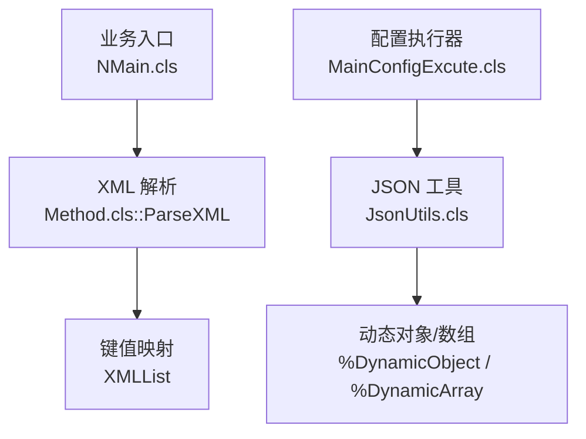
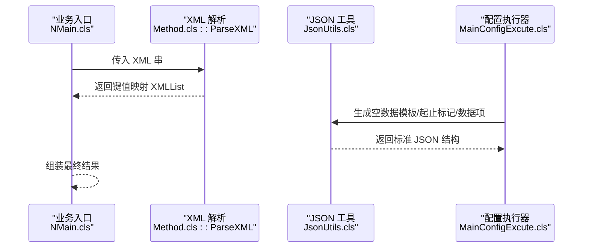
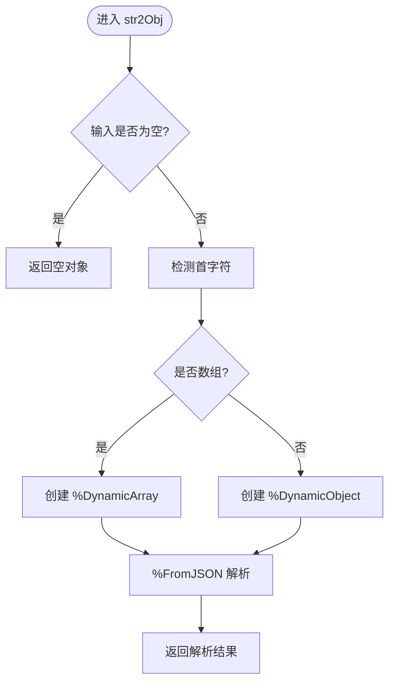
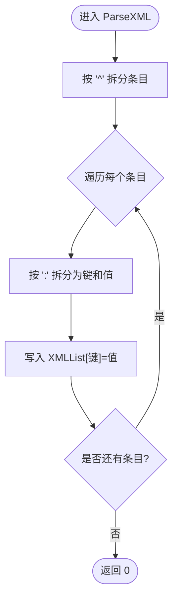
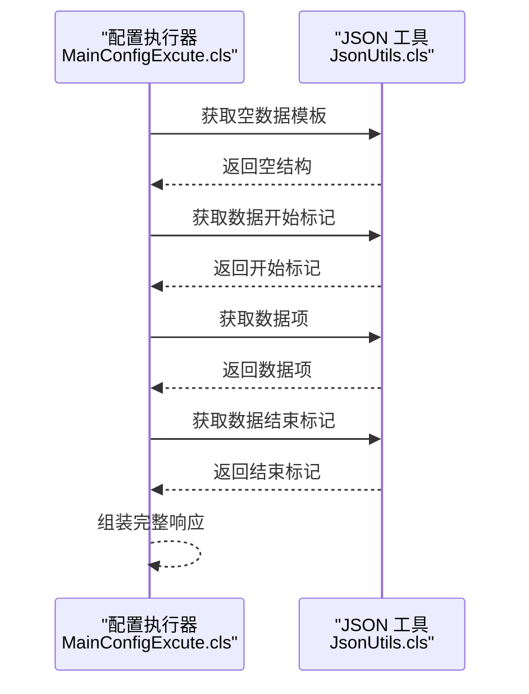
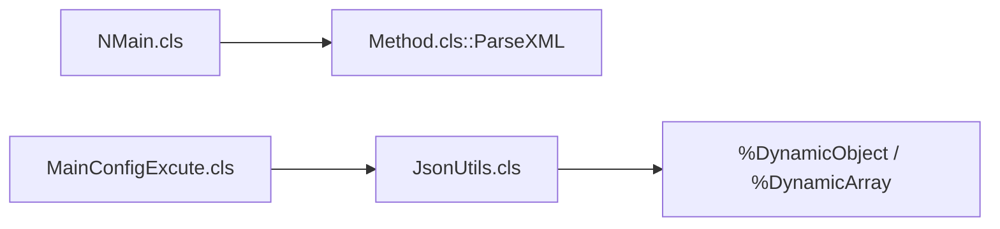

# 数据转换工具

<cite>
**本文引用的文件**
- [JsonUtils.cls](file://src/backend/doc-ws/DHCAnt/Util/JsonUtils.cls)
- [Method.cls](file://src/backend/doc-ws/DHCDoc/PW/COM/Method.cls)
- [MainConfigExcute.cls](file://src/backend/doc-ws/DHCAnt/Base/MainConfigExcute.cls)
- [NMain.cls](file://src/backend/doc-ws/DHCDoc/PW/BS/NMain.cls)
</cite>

## 目录
1. [简介](#简介)
2. [项目结构](#项目结构)
3. [核心组件](#核心组件)
4. [架构总览](#架构总览)
5. [详细组件分析](#详细组件分析)
6. [依赖关系分析](#依赖关系分析)
7. [性能考虑](#性能考虑)
8. [故障排查指南](#故障排查指南)
9. [结论](#结论)
10. [附录](#附录)

## 简介
本文件面向医疗信息系统中的数据转换能力，聚焦于系统中用于不同数据格式之间转换的工具类与函数库。基于仓库中已实现的代码片段，本文重点覆盖以下场景：
- JSON 解析与对象化（字符串到动态对象/数组）
- XML 串解析为键值映射（用于报表统计等场景）
- 配置驱动的 JSON 数据组装（无数据模板、起止标记、数据项封装）
- 批量处理与组合操作（数组合并、去重合并）

同时，文档给出转换规则配置思路、映射表管理建议、批量处理能力说明、API 接口与使用示例指引，以及数据验证、错误处理、回滚机制、性能优化、缓存策略、并发处理、日志监控与调试方法等实践建议。

## 项目结构
围绕数据转换的核心代码主要分布在后端服务模块的通用工具与业务入口中：
- DHCAnt.Util.JsonUtils：提供 JSON 字符串到动态对象的解析、数组拼接与去重合并等基础能力
- DHCDoc.PW.COM.Method：提供 XML 串解析为键值映射的方法，支撑报表统计数据的结构化
- DHCAnt.Base.MainConfigExcute：在配置执行流程中调用 JSON 工具生成标准返回结构
- DHCDoc.PW.BS.NMain：在业务流程中构建/解析 XML 数据，驱动统计或展示逻辑

图表来源
- [NMain.cls:62-62](file://src/backend/doc-ws/DHCDoc/PW/BS/NMain.cls#L62-L62)
- [Method.cls:591-600](file://src/backend/doc-ws/DHCDoc/PW/COM/Method.cls#L591-L600)
- [MainConfigExcute.cls:227-242](file://src/backend/doc-ws/DHCAnt/Base/MainConfigExcute.cls#L227-L242)
- [JsonUtils.cls:15-31](file://src/backend/doc-ws/DHCAnt/Util/JsonUtils.cls#L15-L31)

章节来源
- [JsonUtils.cls:1-82](file://src/backend/doc-ws/DHCAnt/Util/JsonUtils.cls#L1-L82)
- [Method.cls:591-600](file://src/backend/doc-ws/DHCDoc/PW/COM/Method.cls#L591-L600)
- [MainConfigExcute.cls:227-242](file://src/backend/doc-ws/DHCAnt/Base/MainConfigExcute.cls#L227-L242)
- [NMain.cls:62-62](file://src/backend/doc-ws/DHCDoc/PW/BS/NMain.cls#L62-L62)

## 核心组件
- JSON 工具（DHCAnt.Util.JsonUtils）
  - 字符串转对象：将 JSON 字符串解析为 %DynamicObject 或 %DynamicArray
  - 数组拼接：支持多参数数组合并为一个数组
  - 去重合并：在合并过程中避免重复元素
  - 扩展对象：将一个对象的属性扩展到另一个对象
- XML 解析（DHCDoc.PW.COM.Method）
  - 将特定格式的 XML 串按分隔符拆分为键值对，便于后续业务处理
- 配置驱动 JSON 组装（DHCAnt.Base.MainConfigExcute）
  - 根据配置项生成标准 JSON 响应结构（空数据模板、数据开始/结束标记、数据项封装）

章节来源
- [JsonUtils.cls:6-13](file://src/backend/doc-ws/DHCAnt/Util/JsonUtils.cls#L6-L13)
- [JsonUtils.cls:15-31](file://src/backend/doc-ws/DHCAnt/Util/JsonUtils.cls#L15-L31)
- [JsonUtils.cls:34-41](file://src/backend/doc-ws/DHCAnt/Util/JsonUtils.cls#L34-L41)
- [JsonUtils.cls:43-58](file://src/backend/doc-ws/DHCAnt/Util/JsonUtils.cls#L43-L58)
- [JsonUtils.cls:60-79](file://src/backend/doc-ws/DHCAnt/Util/JsonUtils.cls#L60-L79)
- [Method.cls:591-600](file://src/backend/doc-ws/DHCDoc/PW/COM/Method.cls#L591-L600)
- [MainConfigExcute.cls:227-242](file://src/backend/doc-ws/DHCAnt/Base/MainConfigExcute.cls#L227-L242)

## 架构总览
系统的数据转换以“工具层 + 业务入口”的方式组织：
- 工具层提供通用的 JSON/XML 解析与组合能力
- 业务入口在需要时调用工具层进行数据格式化与装配
- 配置执行器通过工具层生成统一的结构化响应，便于前端消费

图表来源
- [NMain.cls:62-62](file://src/backend/doc-ws/DHCDoc/PW/BS/NMain.cls#L62-L62)
- [Method.cls:591-600](file://src/backend/doc-ws/DHCDoc/PW/COM/Method.cls#L591-L600)
- [MainConfigExcute.cls:227-242](file://src/backend/doc-ws/DHCAnt/Base/MainConfigExcute.cls#L227-L242)
- [JsonUtils.cls:15-31](file://src/backend/doc-ws/DHCAnt/Util/JsonUtils.cls#L15-L31)

## 详细组件分析

### JSON 工具（DHCAnt.Util.JsonUtils）
- 字符串转对象
  - 输入：JSON 字符串或字符流
  - 输出：%DynamicObject 或 %DynamicArray
  - 行为：检测首字符决定类型；若为空则返回空对象
- 数组拼接与去重
  - 支持多个数组参数合并
  - 去重合并通过序列化比较实现，避免重复项
- 对象扩展
  - 将扩展对象的属性复制到目标对象

图表来源
- [JsonUtils.cls:15-31](file://src/backend/doc-ws/DHCAnt/Util/JsonUtils.cls#L15-L31)

章节来源
- [JsonUtils.cls:6-13](file://src/backend/doc-ws/DHCAnt/Util/JsonUtils.cls#L6-L13)
- [JsonUtils.cls:15-31](file://src/backend/doc-ws/DHCAnt/Util/JsonUtils.cls#L15-L31)
- [JsonUtils.cls:34-41](file://src/backend/doc-ws/DHCAnt/Util/JsonUtils.cls#L34-L41)
- [JsonUtils.cls:43-58](file://src/backend/doc-ws/DHCAnt/Util/JsonUtils.cls#L43-L58)
- [JsonUtils.cls:60-79](file://src/backend/doc-ws/DHCAnt/Util/JsonUtils.cls#L60-L79)

### XML 解析（DHCDoc.PW.COM.Method）
- 功能：将形如“键:值^键:值”的 XML 串拆分为键值映射
- 用途：快速将统计指标或配置项转换为可遍历的结构
- 复杂度：线性扫描，时间复杂度 O(n)，空间复杂度 O(k)（k 为键数量）

图表来源
- [Method.cls:591-600](file://src/backend/doc-ws/DHCDoc/PW/COM/Method.cls#L591-L600)

章节来源
- [Method.cls:591-600](file://src/backend/doc-ws/DHCDoc/PW/COM/Method.cls#L591-L600)

### 配置驱动的 JSON 组装（DHCAnt.Base.MainConfigExcute）
- 功能：在配置执行流程中，调用 JSON 工具生成标准响应结构
- 典型步骤：
  - 获取空数据模板
  - 获取数据开始/结束标记
  - 获取具体数据项并封装
- 价值：统一前后端数据结构，降低耦合度

图表来源
- [MainConfigExcute.cls:227-242](file://src/backend/doc-ws/DHCAnt/Base/MainConfigExcute.cls#L227-L242)
- [JsonUtils.cls:15-31](file://src/backend/doc-ws/DHCAnt/Util/JsonUtils.cls#L15-L31)

章节来源
- [MainConfigExcute.cls:227-242](file://src/backend/doc-ws/DHCAnt/Base/MainConfigExcute.cls#L227-L242)

### 业务流程中的 XML 构建与解析（DHCDoc.PW.BS.NMain）
- 功能：在业务主流程中构建 XML 串并调用解析方法，得到结构化数据
- 典型路径：
  - 构建 XML 串
  - 调用 ParseXML 解析为键值映射
  - 基于映射进行后续计算或展示

章节来源
- [NMain.cls:62-62](file://src/backend/doc-ws/DHCDoc/PW/BS/NMain.cls#L62-L62)
- [Method.cls:591-600](file://src/backend/doc-ws/DHCDoc/PW/COM/Method.cls#L591-L600)

## 依赖关系分析
- 工具层依赖
  - JSON 工具依赖 IRIS 的动态对象/数组类型进行解析与组合
  - XML 解析依赖字符串分割与字典赋值
- 业务层依赖
  - 配置执行器依赖 JSON 工具生成标准结构
  - 业务主流程依赖 XML 解析进行数据结构化

图表来源
- [NMain.cls:62-62](file://src/backend/doc-ws/DHCDoc/PW/BS/NMain.cls#L62-L62)
- [Method.cls:591-600](file://src/backend/doc-ws/DHCDoc/PW/COM/Method.cls#L591-L600)
- [MainConfigExcute.cls:227-242](file://src/backend/doc-ws/DHCAnt/Base/MainConfigExcute.cls#L227-L242)
- [JsonUtils.cls:15-31](file://src/backend/doc-ws/DHCAnt/Util/JsonUtils.cls#L15-L31)

章节来源
- [JsonUtils.cls:15-31](file://src/backend/doc-ws/DHCAnt/Util/JsonUtils.cls#L15-L31)
- [Method.cls:591-600](file://src/backend/doc-ws/DHCDoc/PW/COM/Method.cls#L591-L600)
- [MainConfigExcute.cls:227-242](file://src/backend/doc-ws/DHCAnt/Base/MainConfigExcute.cls#L227-L242)
- [NMain.cls:62-62](file://src/backend/doc-ws/DHCDoc/PW/BS/NMain.cls#L62-L62)

## 性能考虑
- JSON 解析
  - 使用 %DynamicObject/%DynamicArray 提升解析效率
  - 避免重复序列化/反序列化，尽量复用对象实例
- XML 解析
  - 线性扫描，适合中等规模数据；大数据量时可分块处理
- 数组合并
  - 去重合并涉及序列化比较，注意数据量较大时的开销
- 批量处理
  - 建议在业务层分批调用工具方法，控制单次内存占用
- 缓存策略
  - 对频繁使用的配置模板或映射表进行缓存（例如全局变量或缓存表）
- 并发处理
  - 工具方法无状态，适合并发调用；注意共享资源的锁与一致性

## 故障排查指南
- JSON 解析失败
  - 检查输入是否为有效 JSON 字符串或字符流
  - 确认首字符是否正确指示数组或对象
- XML 解析异常
  - 检查分隔符是否符合约定（如“^”、“:”）
  - 确保键值对完整且无缺失
- 配置执行错误
  - 核对配置项是否存在
  - 检查 JSON 模板与数据项结构是否匹配
- 性能问题
  - 定位热点调用路径，减少不必要的序列化
  - 对大集合采用分页或流式处理

章节来源
- [JsonUtils.cls:15-31](file://src/backend/doc-ws/DHCAnt/Util/JsonUtils.cls#L15-L31)
- [Method.cls:591-600](file://src/backend/doc-ws/DHCDoc/PW/COM/Method.cls#L591-L600)
- [MainConfigExcute.cls:227-242](file://src/backend/doc-ws/DHCAnt/Base/MainConfigExcute.cls#L227-L242)

## 结论
本仓库提供了轻量而实用的数据转换能力，涵盖 JSON 解析与组合、XML 串解析、配置驱动的 JSON 组装等常见场景。通过工具层与业务入口的清晰分工，系统实现了高内聚、低耦合的数据转换流程。结合合理的缓存与批处理策略，可在保证正确性的前提下提升性能与稳定性。

## 附录

### 转换规则配置与映射表管理建议
- 规则配置
  - 将字段映射、默认值、校验规则集中管理，便于维护与版本控制
  - 使用 JSON 模板描述期望结构，配合工具层生成标准响应
- 映射表管理
  - 建立统一的字典表，存储源字段到目标字段的映射关系
  - 支持热更新与灰度发布，降低变更风险

### 批量处理能力
- 分批处理：将大集合切分为批次，逐批调用转换工具
- 去重与合并：利用工具层的数组合并与去重能力，减少冗余数据
- 事务与回滚：在持久化阶段使用事务包裹，失败时回滚以保证一致性

### API 接口与使用示例
- JSON 工具
  - 字符串转对象：调用字符串转对象方法，传入 JSON 字符串
  - 数组拼接：传入多个数组，返回合并后的数组
  - 去重合并：传入多个数组，返回去重后的数组
- XML 解析
  - 传入 XML 串，返回键值映射，供后续业务使用
- 配置执行
  - 调用配置执行器，自动组装标准 JSON 响应

章节来源
- [JsonUtils.cls:15-31](file://src/backend/doc-ws/DHCAnt/Util/JsonUtils.cls#L15-L31)
- [JsonUtils.cls:43-58](file://src/backend/doc-ws/DHCAnt/Util/JsonUtils.cls#L43-L58)
- [JsonUtils.cls:60-79](file://src/backend/doc-ws/DHCAnt/Util/JsonUtils.cls#L60-L79)
- [Method.cls:591-600](file://src/backend/doc-ws/DHCDoc/PW/COM/Method.cls#L591-L600)
- [MainConfigExcute.cls:227-242](file://src/backend/doc-ws/DHCAnt/Base/MainConfigExcute.cls#L227-L242)

### 数据验证、错误处理与回滚机制
- 数据验证
  - 在转换前进行格式与内容校验，提前拦截非法数据
- 错误处理
  - 捕获解析异常，记录上下文信息，便于定位问题
- 回滚机制
  - 在持久化阶段使用事务，失败时回滚，保证数据一致性

### 日志、监控指标与调试工具
- 日志
  - 记录关键转换步骤、输入输出摘要、异常堆栈
- 监控指标
  - 统计转换耗时、成功率、失败率、数据量级
- 调试工具
  - 提供最小化用例，便于复现与验证转换逻辑