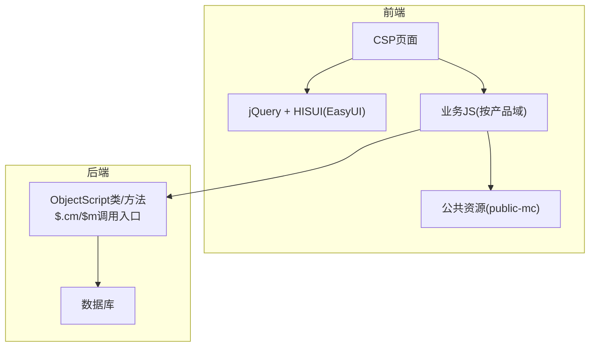
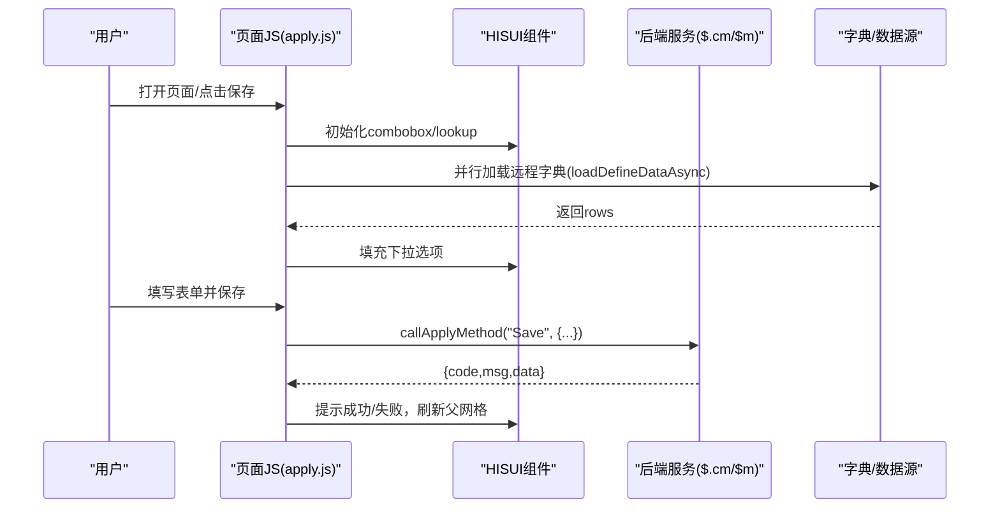
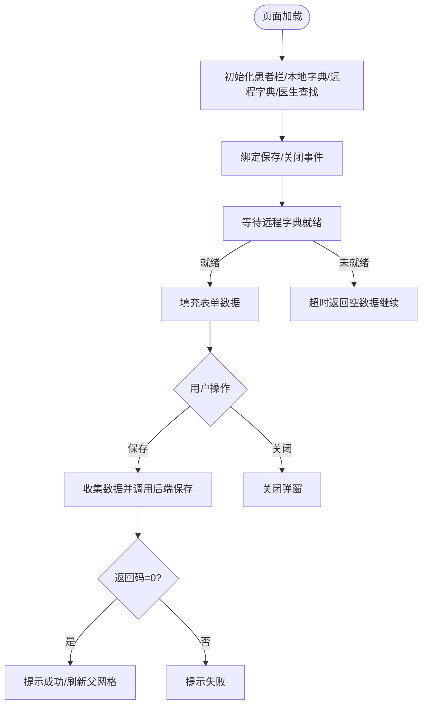
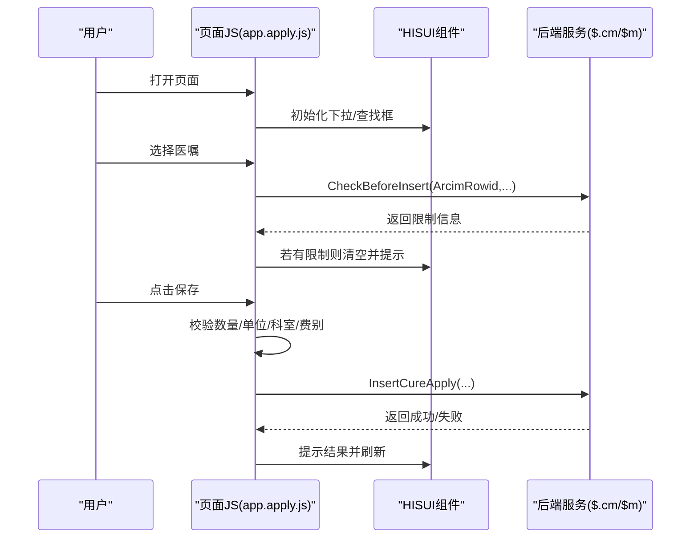
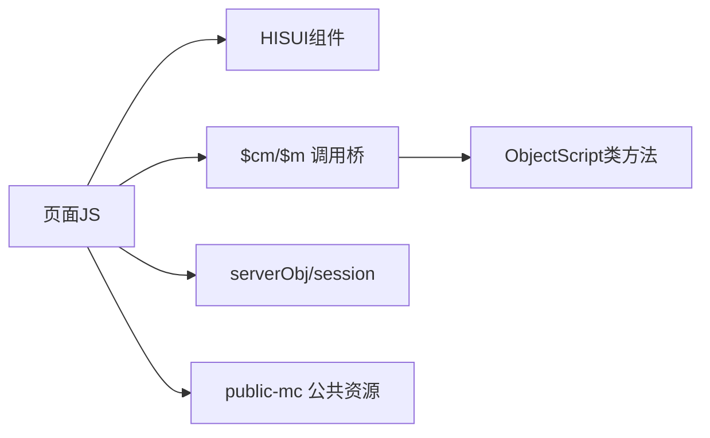

# JavaScript逻辑层

<cite>
**本文引用的文件**
- [README.md](file://README.md)
- [apply.js](file://src/frontend/cure-ws/scripts/dhcdoc/cure/rt/apply.js)
- [app.apply.js](file://src/frontend/cure-ws/scripts/dhcdoc/dhcdoccure_hui/app.apply.js)
</cite>

## 目录
1. [简介](#简介)
2. [项目结构](#项目结构)
3. [核心组件](#核心组件)
4. [架构总览](#架构总览)
5. [详细组件分析](#详细组件分析)
6. [依赖关系分析](#依赖关系分析)
7. [性能考虑](#性能考虑)
8. [故障排查指南](#故障排查指南)
9. [结论](#结论)
10. [附录](#附录)

## 简介
本文件聚焦前端JavaScript逻辑层，围绕jQuery与HISUI（基于EasyUI二次封装）的交互模式，系统说明页面初始化流程、事件绑定方式、状态管理模式、模块间通信机制、全局变量管理、错误处理策略、数据验证机制、异步请求处理、与后端API的交互模式和数据格式规范，并提供代码复用模式、函数封装方法、性能优化技巧、浏览器兼容性处理、调试技巧与测试方法。

## 项目结构
- 前端采用传统静态资源组织：CSP页面引入jQuery/HISUI脚本与样式，业务逻辑以独立JS文件按产品域划分（如cure-ws、doc-ws等）。
- 每个产品域包含scripts目录存放页面级或组件级JS；公共能力在public-mc中提供。
- 通过SFTP将前端资源部署到服务器统一路径，CSP负责组装页面与脚本。

**图表来源**
- [README.md:23-32](file://README.md#L23-L32)

**章节来源**
- [README.md:23-32](file://README.md#L23-L32)

## 核心组件
- 页面逻辑对象：以PageLogicObj/PageLogic集中管理页面状态、缓存与生命周期。
- 选择器集合：Selectors统一管理DOM节点ID，降低耦合。
- 组合框配置：本地字典RtApplyLocalCombos与远程字典RtApplyRemoteDefines分离，便于维护与扩展。
- 异步加载协调：Promise.all聚合多个远程字典加载任务，确保表单初始化前数据就绪。
- 保存与提交：统一的callApplyMethod封装$.cm/$m调用，屏蔽底层差异。
- 会话与上下文：getSessionStr/getServerValue获取会话与服务器注入参数。

**章节来源**
- [apply.js:5-12](file://src/frontend/cure-ws/scripts/dhcdoc/cure/rt/apply.js#L5-L12)
- [apply.js:16-51](file://src/frontend/cure-ws/scripts/dhcdoc/cure/rt/apply.js#L16-L51)
- [apply.js:140-174](file://src/frontend/cure-ws/scripts/dhcdoc/cure/rt/apply.js#L140-L174)
- [apply.js:272-321](file://src/frontend/cure-ws/scripts/dhcdoc/cure/rt/apply.js#L272-L321)
- [apply.js:396-401](file://src/frontend/cure-ws/scripts/dhcdoc/cure/rt/apply.js#L396-L401)

## 架构总览
前端以“页面JS + 组件库”为主，通过$.cm/$m与后端ObjectScript类方法交互；字典与查询列表通过远程接口动态加载；页面状态集中在PageLogic对象中，事件驱动更新UI与触发保存。

**图表来源**
- [apply.js:53-77](file://src/frontend/cure-ws/scripts/dhcdoc/cure/rt/apply.js#L53-L77)
- [apply.js:140-174](file://src/frontend/cure-ws/scripts/dhcdoc/cure/rt/apply.js#L140-L174)
- [apply.js:272-321](file://src/frontend/cure-ws/scripts/dhcdoc/cure/rt/apply.js#L272-L321)

## 详细组件分析

### 放疗申请单页面逻辑（apply.js）
- 初始化流程
  - 文档就绪后执行pageHandle()完成患者信息栏、本地字典、远程字典、医生查找框初始化；随后绑定事件；等待远程字典全部就绪后再init()填充表单。
- 事件绑定
  - 保存按钮绑定saveApply()；关闭按钮绑定closeRtApplyWin()。
- 数据加载与校验
  - 远程字典通过loadDefineDataAsync并发加载，超时保护避免阻塞；normalizeComboRows统一字典行格式为{id,text,remark,selected}。
- 保存流程
  - getSaveJson()收集表单数据并标准化source；callApplyMethod调用后端DHCDoc.Cure.RT.ApplyBLH.Save；根据返回码提示并刷新父窗口网格。
- 状态展示
  - showStatus根据currentStatus设置面板标题颜色与文案。

**图表来源**
- [apply.js:53-77](file://src/frontend/cure-ws/scripts/dhcdoc/cure/rt/apply.js#L53-L77)
- [apply.js:140-174](file://src/frontend/cure-ws/scripts/dhcdoc/cure/rt/apply.js#L140-L174)
- [apply.js:272-321](file://src/frontend/cure-ws/scripts/dhcdoc/cure/rt/apply.js#L272-L321)
- [apply.js:423-436](file://src/frontend/cure-ws/scripts/dhcdoc/cure/rt/apply.js#L423-L436)

**章节来源**
- [apply.js:53-77](file://src/frontend/cure-ws/scripts/dhcdoc/cure/rt/apply.js#L53-L77)
- [apply.js:140-174](file://src/frontend/cure-ws/scripts/dhcdoc/cure/rt/apply.js#L140-L174)
- [apply.js:272-321](file://src/frontend/cure-ws/scripts/dhcdoc/cure/rt/apply.js#L272-L321)
- [apply.js:332-394](file://src/frontend/cure-ws/scripts/dhcdoc/cure/rt/apply.js#L332-L394)
- [apply.js:423-436](file://src/frontend/cure-ws/scripts/dhcdoc/cure/rt/apply.js#L423-L436)

### 治疗申请单页面逻辑（app.apply.js）
- 初始化流程
  - window.load加载完成后InitInfo()；document.ready执行Init()/InitEvent()/PageHandle()。
- 事件绑定
  - 保存、打印、撤销/下一步按钮分别绑定对应处理函数；键盘事件用于快捷操作。
- 数据加载与校验
  - 新申请时先CheckDiagnose()与CheckIsAdmissions()进行前置校验；选择医嘱后调用CheckBeforeInsert()做使用限制检查；数量、单位、接收科室、费别等字段逐项校验。
- 保存流程
  - 编辑模式直接调用SaveCureApply；新增模式插入申请单后获取申请号并回填。
- 打印流程
  - 通过ActiveXObject生成Excel报表（IE环境），读取模板并填充数据。

**图表来源**
- [app.apply.js:10-18](file://src/frontend/cure-ws/scripts/dhcdoc/dhcdoccure_hui/app.apply.js#L10-L18)
- [app.apply.js:37-60](file://src/frontend/cure-ws/scripts/dhcdoc/dhcdoccure_hui/app.apply.js#L37-L60)
- [app.apply.js:517-555](file://src/frontend/cure-ws/scripts/dhcdoc/dhcdoccure_hui/app.apply.js#L517-L555)
- [app.apply.js:331-443](file://src/frontend/cure-ws/scripts/dhcdoc/dhcdoccure_hui/app.apply.js#L331-L443)

**章节来源**
- [app.apply.js:10-18](file://src/frontend/cure-ws/scripts/dhcdoc/dhcdoccure_hui/app.apply.js#L10-L18)
- [app.apply.js:37-60](file://src/frontend/cure-ws/scripts/dhcdoc/dhcdoccure_hui/app.apply.js#L37-L60)
- [app.apply.js:517-555](file://src/frontend/cure-ws/scripts/dhcdoc/dhcdoccure_hui/app.apply.js#L517-L555)
- [app.apply.js:331-443](file://src/frontend/cure-ws/scripts/dhcdoc/dhcdoccure_hui/app.apply.js#L331-L443)

## 依赖关系分析
- jQuery与HISUI：所有页面均依赖jQuery与HISUI提供的combobox、lookup、messager等组件。
- 后端桥接：$.cm/$m作为统一调用入口，屏蔽不同环境下的实现差异。
- 会话与上下文：通过serverObj/session获取登录信息与会话标识。
- 公共资源：public-mc提供通用工具与日志注册等能力。

**图表来源**
- [apply.js:310-321](file://src/frontend/cure-ws/scripts/dhcdoc/cure/rt/apply.js#L310-L321)
- [app.apply.js:90-105](file://src/frontend/cure-ws/scripts/dhcdoc/dhcdoccure_hui/app.apply.js#L90-L105)

**章节来源**
- [apply.js:310-321](file://src/frontend/cure-ws/scripts/dhcdoc/cure/rt/apply.js#L310-L321)
- [app.apply.js:90-105](file://src/frontend/cure-ws/scripts/dhcdoc/dhcdoccure_hui/app.apply.js#L90-L105)

## 性能考虑
- 并发加载字典：使用Promise.all并行加载多个远程字典，减少首屏等待时间。
- 超时保护：远程字典加载设置超时，避免网络异常导致页面卡死。
- 延迟搜索：lookup组件启用minQueryLen与delay，降低频繁请求。
- 按需渲染：仅在数据就绪后初始化表单，避免无效重绘。
- 建议优化
  - 合并字典接口：将多个DefineCode合并为一次批量请求，减少HTTP开销。
  - 缓存热点数据：对不常变化的字典进行内存缓存，必要时加版本号控制失效。
  - 防抖输入：对搜索框输入增加防抖，减少重复请求。

[本节为通用指导，无需特定文件引用]

## 故障排查指南
- 常见问题定位
  - 远程字典为空：检查loadDefineDataAsync是否超时或后端接口返回格式不符合预期。
  - 保存失败：查看callApplyMethod回调中的ret.code与ret.msg，确认后端返回结构。
  - 浏览器兼容：IE环境下需额外加载Promise polyfill（参考app.apply.js中对IE的处理）。
- 调试技巧
  - 使用浏览器控制台输出关键变量与返回值，确认数据流转。
  - 在网络面板观察$.cm/$m请求参数与响应，核对ClassName/MethodName/参数。
- 测试方法
  - 单元测试：对normalizeSource、normalizeComboRows等纯函数编写断言。
  - 集成测试：模拟后端返回不同code/msg，验证保存流程分支。
  - 回归测试：覆盖新增/编辑/撤销/打印等主流程。

**章节来源**
- [apply.js:332-366](file://src/frontend/cure-ws/scripts/dhcdoc/cure/rt/apply.js#L332-L366)
- [apply.js:272-295](file://src/frontend/cure-ws/scripts/dhcdoc/cure/rt/apply.js#L272-L295)
- [app.apply.js:4-9](file://src/frontend/cure-ws/scripts/dhcdoc/dhcdoccure_hui/app.apply.js#L4-L9)

## 结论
本项目前端逻辑以jQuery+HISUI为核心，采用页面级JS组织业务，通过$.cm/$m与后端ObjectScript交互。页面初始化遵循“先组件后数据”的顺序，结合Promise并发加载字典，保证用户体验。保存流程具备完善的校验与错误提示，支持多场景（新增/编辑/撤销/打印）。建议在现有基础上推进字典接口合并、缓存与防抖优化，提升性能与可维护性。

[本节为总结性内容，无需特定文件引用]

## 附录

### 页面初始化流程（apply.js）
- 文档就绪后执行pageHandle()初始化患者栏、本地字典、远程字典、医生查找框。
- 绑定事件后等待远程字典全部就绪再init()填充表单。

**章节来源**
- [apply.js:53-77](file://src/frontend/cure-ws/scripts/dhcdoc/cure/rt/apply.js#L53-L77)
- [apply.js:140-174](file://src/frontend/cure-ws/scripts/dhcdoc/cure/rt/apply.js#L140-L174)

### 事件绑定方式（apply.js / app.apply.js）
- apply.js：保存与关闭按钮绑定click事件。
- app.apply.js：保存、打印、撤销/下一步按钮绑定click；键盘事件用于快捷操作。

**章节来源**
- [apply.js:74-77](file://src/frontend/cure-ws/scripts/dhcdoc/cure/rt/apply.js#L74-L77)
- [app.apply.js:37-60](file://src/frontend/cure-ws/scripts/dhcdoc/dhcdoccure_hui/app.apply.js#L37-L60)

### 状态管理模式
- 使用PageLogicObj/PageLogic集中管理页面状态（如applyId、source、m_SavedJson等）。
- 通过setComboboxValue/setLookupValue统一设置控件值，保持状态与视图一致。

**章节来源**
- [apply.js:5-12](file://src/frontend/cure-ws/scripts/dhcdoc/cure/rt/apply.js#L5-L12)
- [apply.js:219-232](file://src/frontend/cure-ws/scripts/dhcdoc/cure/rt/apply.js#L219-L232)

### 模块间通信机制
- 父窗口通信：refreshParentCureApplyGrid调用父窗口的网格刷新方法。
- 弹窗关闭：优先尝试parent.websys_showModal，回退到window.websys_showModal。

**章节来源**
- [apply.js:403-421](file://src/frontend/cure-ws/scripts/dhcdoc/cure/rt/apply.js#L403-L421)

### 全局变量管理
- serverObj/session：从服务器注入的会话与上下文信息。
- com_Util.GetSessionStr：兼容不同环境的会话获取方式。

**章节来源**
- [apply.js:305-308](file://src/frontend/cure-ws/scripts/dhcdoc/cure/rt/apply.js#L305-L308)
- [apply.js:396-401](file://src/frontend/cure-ws/scripts/dhcdoc/cure/rt/apply.js#L396-L401)

### 错误处理策略
- 保存失败：根据ret.code提示失败原因。
- 远程字典超时：超时返回空数据，避免阻塞页面初始化。
- 浏览器兼容：IE下动态加载Promise polyfill。

**章节来源**
- [apply.js:272-295](file://src/frontend/cure-ws/scripts/dhcdoc/cure/rt/apply.js#L272-L295)
- [apply.js:332-366](file://src/frontend/cure-ws/scripts/dhcdoc/cure/rt/apply.js#L332-L366)
- [app.apply.js:4-9](file://src/frontend/cure-ws/scripts/dhcdoc/dhcdoccure_hui/app.apply.js#L4-L9)

### 数据验证机制
- 前端校验：数量必须大于0、单位/科室/费别必填。
- 后端校验：CheckBeforeInsert返回使用限制（年龄/性别等），前端解析并提示。

**章节来源**
- [app.apply.js:363-443](file://src/frontend/cure-ws/scripts/dhcdoc/dhcdoccure_hui/app.apply.js#L363-L443)
- [app.apply.js:517-555](file://src/frontend/cure-ws/scripts/dhcdoc/dhcdoccure_hui/app.apply.js#L517-L555)

### 异步请求处理
- Promise.all并发加载远程字典，onCombosReady确保数据就绪。
- loadDefineDataAsync封装单个字典请求，带超时保护。

**章节来源**
- [apply.js:140-174](file://src/frontend/cure-ws/scripts/dhcdoc/cure/rt/apply.js#L140-L174)
- [apply.js:332-366](file://src/frontend/cure-ws/scripts/dhcdoc/cure/rt/apply.js#L332-L366)

### 与后端API的交互模式与数据格式
- 调用方式：$.cm/$m统一入口，指定ClassName/MethodName与参数。
- 字典格式：normalizeComboRows将后端字典行转换为{id,text,remark,selected}。
- 保存返回：{code,msg,data}，code=0表示成功。

**章节来源**
- [apply.js:310-321](file://src/frontend/cure-ws/scripts/dhcdoc/cure/rt/apply.js#L310-L321)
- [apply.js:368-394](file://src/frontend/cure-ws/scripts/dhcdoc/cure/rt/apply.js#L368-L394)
- [apply.js:272-295](file://src/frontend/cure-ws/scripts/dhcdoc/cure/rt/apply.js#L272-L295)

### 代码复用模式与函数封装
- 选择器集合Selectors集中管理DOM ID。
- setComboboxValue/setLookupValue封装控件赋值。
- normalizeSource统一source字段命名。

**章节来源**
- [apply.js:16-23](file://src/frontend/cure-ws/scripts/dhcdoc/cure/rt/apply.js#L16-L23)
- [apply.js:219-232](file://src/frontend/cure-ws/scripts/dhcdoc/cure/rt/apply.js#L219-L232)
- [apply.js:323-330](file://src/frontend/cure-ws/scripts/dhcdoc/cure/rt/apply.js#L323-L330)

### 浏览器兼容性处理
- IE环境动态加载bluebird.min.js以提供Promise支持。

**章节来源**
- [app.apply.js:4-9](file://src/frontend/cure-ws/scripts/dhcdoc/dhcdoccure_hui/app.apply.js#L4-L9)

### 调试技巧与测试方法
- 调试：控制台输出关键变量与返回值；网络面板检查$.cm/$m请求。
- 测试：对纯函数进行单元测试；对保存流程进行端到端测试。

[本节为通用指导，无需特定文件引用]