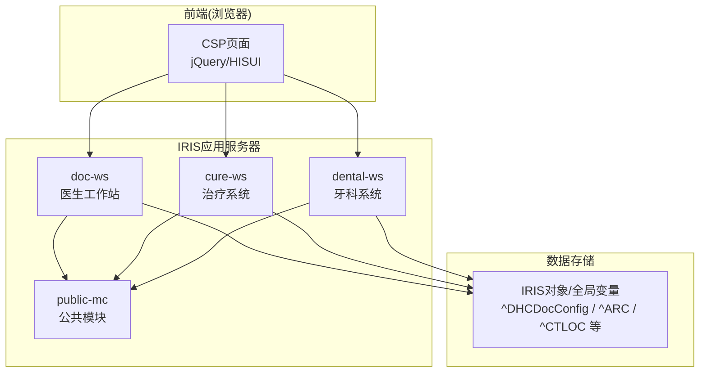
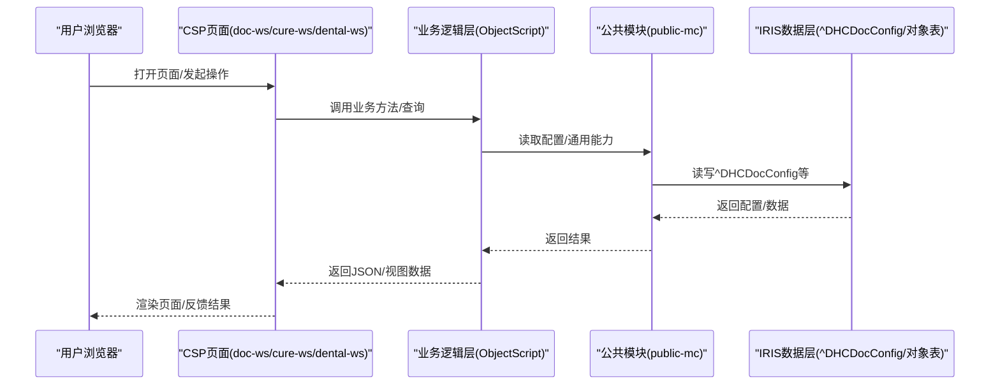
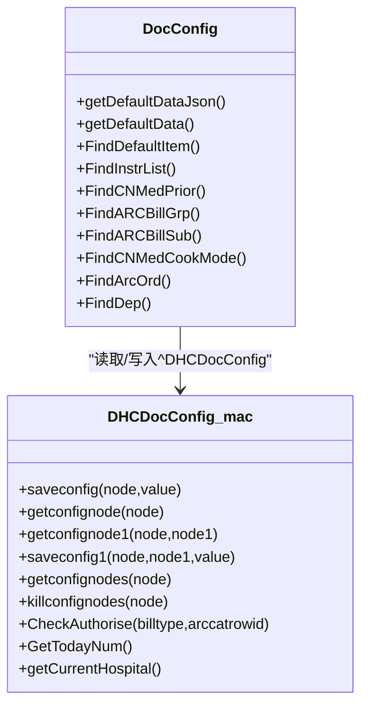
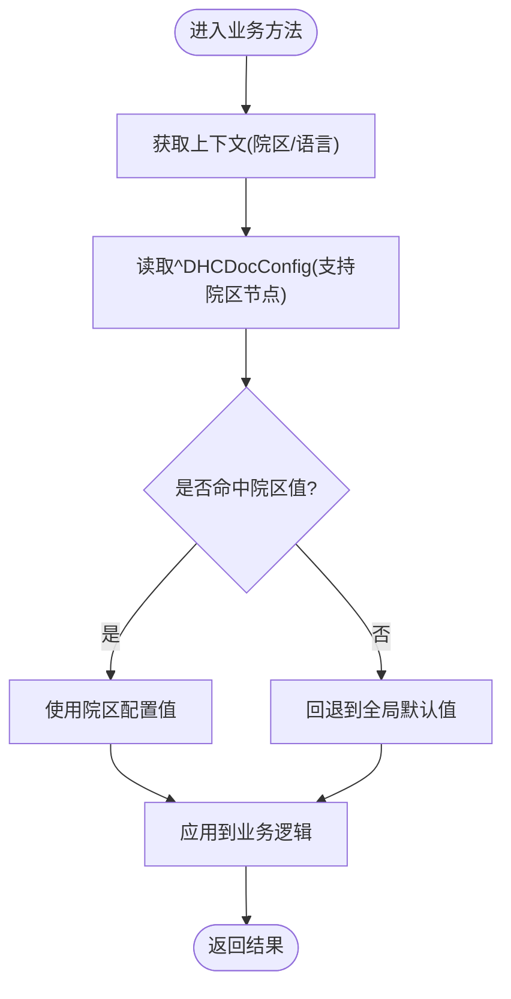
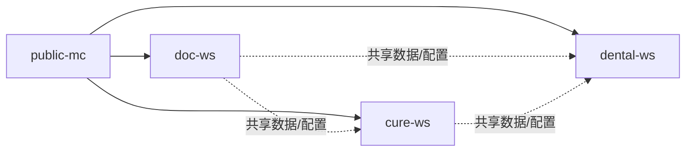
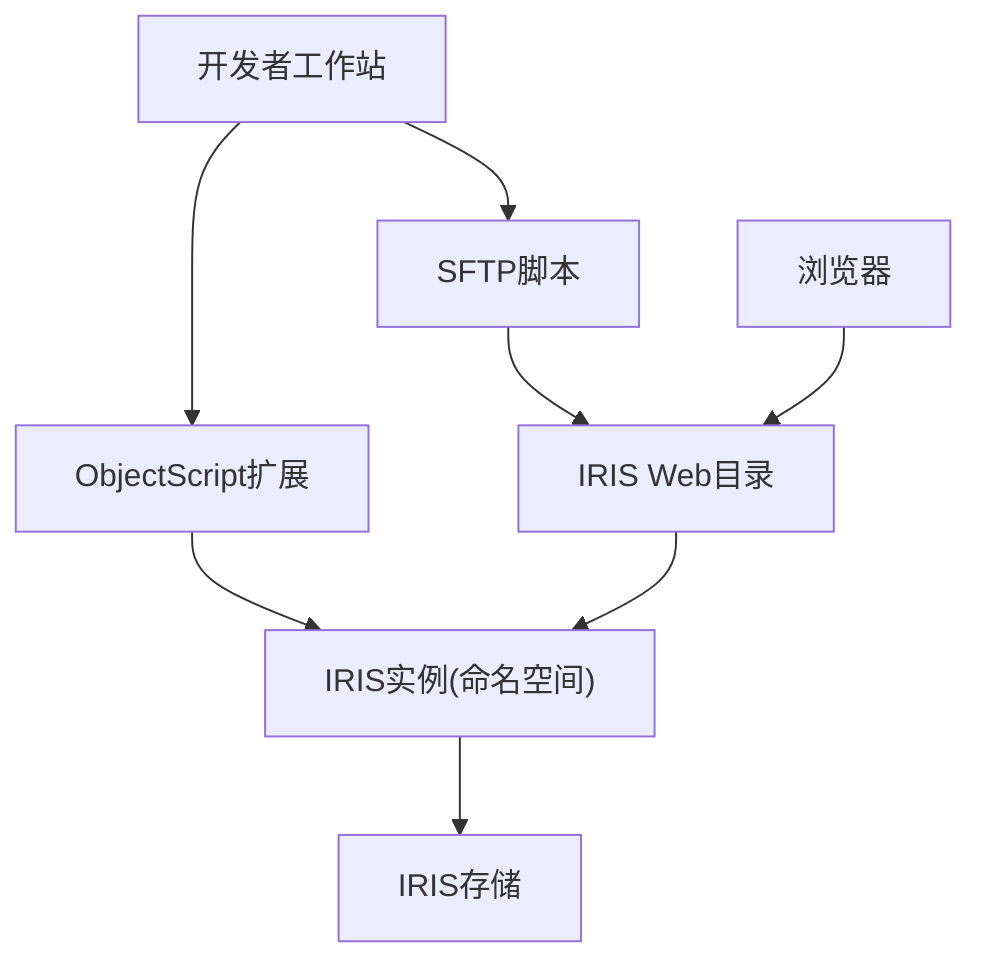
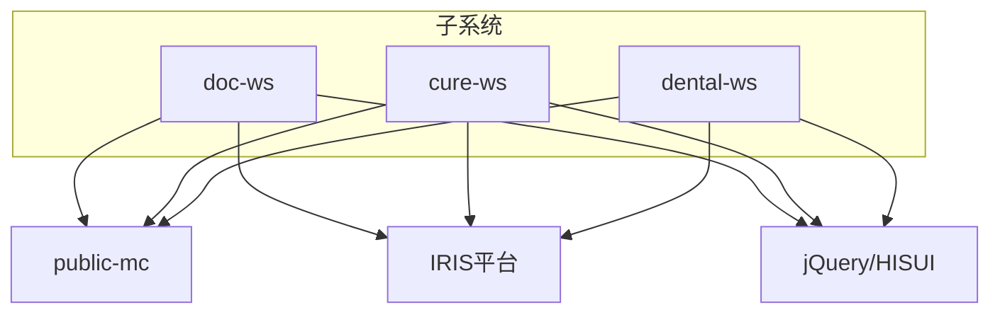

# 整体架构设计

<cite>
**本文引用的文件**
- [README.md](file://README.md)
- [DHCDocConfig.mac](file://src/backend/public-mc/DHCDocConfig.mac)
- [DocConfig.cls](file://src/backend/doc-ws/DHCDoc/DHCDocConfig/DocConfig.cls)
- [DHCDoc.inc](file://src/backend/public-mc/DHCDoc.inc)
</cite>

## 目录
1. [引言](#引言)
2. [项目结构](#项目结构)
3. [核心组件](#核心组件)
4. [架构总览](#架构总览)
5. [详细组件分析](#详细组件分析)
6. [依赖关系分析](#依赖关系分析)
7. [性能考虑](#性能考虑)
8. [故障排查指南](#故障排查指南)
9. [结论](#结论)
10. [附录](#附录)

## 引言
本文件面向IRIS HIS的整体架构设计，围绕MVC分层、模块化子系统边界与依赖、配置驱动机制（^DHCDocConfig全局变量）、技术选型权衡、系统约束与扩展性进行系统化阐述。目标是帮助读者快速理解“CSP页面表现层—ObjectScript业务逻辑层—IRIS数据库数据层”的职责划分与交互方式，并掌握各子系统（医生工作站、治疗系统、牙科系统等）的解耦原则与演进路径。

## 项目结构
- 前后端分离的组织方式：后端为InterSystems IRIS ObjectScript代码，前端为CSP+jQuery静态资源；通过Git Submodule分别管理前后端仓库。
- 多产品子系统并列：doc-ws（医生工作站）、cure-ws（治疗系统）、dental-ws（牙科系统）、epmi-mc（患者主索引）、opadm-mc（门诊挂号）、triage-ws（分诊）、pilot-*（试点项目）等，均共享public-mc公共资源。
- 部署与同步：前端通过SFTP脚本上传至服务器Web目录；后端通过ObjectScript扩展直接编译上传到IRIS命名空间。

图表来源
- [README.md:1-549](file://README.md#L1-L549)

章节来源
- [README.md:1-549](file://README.md#L1-L549)

## 核心组件
- 表现层（CSP）：以.csp/.show.csp为主，承载界面渲染与交互，调用后端接口或方法获取数据。
- 业务逻辑层（ObjectScript类/例程）：封装领域规则、流程编排、校验与计算，访问持久化数据。
- 数据层（IRIS）：使用全局变量（如^DHCDocConfig）和对象表（如^ARC、^CTLOC）存储配置与业务数据。

职责划分要点
- CSP仅负责展示与用户交互，不承载复杂业务逻辑。
- 业务层提供可复用的类与方法，统一处理跨子系统的通用能力（如配置读取、权限控制）。
- 数据层通过全局变量与对象模型提供稳定、高性能的数据访问。

章节来源
- [README.md:526-549](file://README.md#L526-L549)

## 架构总览
下图展示了从浏览器到IRIS应用服务器再到数据层的典型请求链路，以及各子系统如何复用公共能力。

图表来源
- [README.md:1-549](file://README.md#L1-L549)
- [DHCDocConfig.mac:1-119](file://src/backend/public-mc/DHCDocConfig.mac#L1-L119)
- [DocConfig.cls:1-800](file://src/backend/doc-ws/DHCDoc/DHCDocConfig/DocConfig.cls#L1-L800)

## 详细组件分析

### MVC分层与子系统边界
- 表现层（CSP）
  - 按子系统组织：doc-ws、cure-ws、dental-ws等各自拥有独立的前端页面集合。
  - 通过Ajax或直接跳转调用后端方法，获取结构化数据后渲染。
- 业务逻辑层（ObjectScript）
  - 以类形式组织，如DocConfig等，提供查询、保存、转换等能力。
  - 支持院区隔离与语言翻译，保证多院区、多语言场景下的正确性。
- 数据层（IRIS）
  - 配置集中存放在全局变量^DHCDocConfig，支持按院区节点隔离。
  - 业务实体存储在对象表中（如^ARC、^CTLOC），通过对象API或SQL访问。

图表来源
- [DocConfig.cls:1-800](file://src/backend/doc-ws/DHCDoc/DHCDocConfig/DocConfig.cls#L1-L800)
- [DHCDocConfig.mac:1-119](file://src/backend/public-mc/DHCDocConfig.mac#L1-L119)

章节来源
- [DocConfig.cls:1-800](file://src/backend/doc-ws/DHCDoc/DHCDocConfig/DocConfig.cls#L1-L800)
- [DHCDocConfig.mac:1-119](file://src/backend/public-mc/DHCDocConfig.mac#L1-L119)

### 配置驱动架构（^DHCDocConfig）
- 设计目标
  - 将系统行为参数化，避免硬编码；支持院区级覆盖与默认值回退。
  - 提供统一的存取接口，屏蔽底层全局变量的复杂性。
- 关键模式
  - 全局变量根节点：^DHCDocConfig
  - 院区隔离：通过HospDr_前缀或GetConfigNode系列方法区分院区节点。
  - 批量读取/写入：提供列表式读取与清理工具方法，便于初始化与迁移。
- 典型用法
  - 业务类在需要时调用配置读取方法，结合当前会话上下文（院区、语言）解析配置。
  - 前端通过CSP触发配置维护页面，后台持久化到^DHCDocConfig。

图表来源
- [DHCDocConfig.mac:1-119](file://src/backend/public-mc/DHCDocConfig.mac#L1-L119)
- [DocConfig.cls:1-800](file://src/backend/doc-ws/DHCDoc/DHCDocConfig/DocConfig.cls#L1-L800)

章节来源
- [DHCDocConfig.mac:1-119](file://src/backend/public-mc/DHCDocConfig.mac#L1-L119)
- [DocConfig.cls:1-800](file://src/backend/doc-ws/DHCDoc/DHCDocConfig/DocConfig.cls#L1-L800)

### 子系统边界与依赖
- 医生工作站（doc-ws）
  - 负责门诊/住院医嘱、诊断、处方、排班等核心临床工作流。
  - 依赖public-mc提供的通用配置、日志、工具能力。
- 治疗系统（cure-ws）
  - 聚焦治疗计划、评估量表、执行队列等业务域。
  - 通过公共配置与数据模型与doc-ws协同。
- 牙科系统（dental-ws）
  - 针对牙科专科的应用（申请单、材料、技工加工等）。
  - 复用公共配置与基础数据，保持与其他子系统的一致性。
- 公共模块（public-mc）
  - 提供全局配置、日志、通用工具、跨子系统共享能力。
  - 降低重复实现，提升一致性。

图表来源
- [README.md:1-549](file://README.md#L1-L549)

章节来源
- [README.md:1-549](file://README.md#L1-L549)

### 部署拓扑
- 开发期
  - 前端文件通过SFTP脚本上传至服务器Web目录。
  - 后端ObjectScript通过VS Code ObjectScript扩展直接编译上传到IRIS命名空间。
- 运行期
  - 浏览器访问CSP页面，由IRIS Web服务路由到对应命名空间与类方法。
  - 数据持久化在IRIS实例中，支持高可用与备份策略。

图表来源
- [README.md:1-549](file://README.md#L1-L549)

章节来源
- [README.md:1-549](file://README.md#L1-L549)

## 依赖关系分析
- 耦合度
  - 子系统之间通过公共模块间接耦合，降低直接依赖。
  - 配置中心^DHCDocConfig作为横向关注点，被多个子系统共用。
- 内聚性
  - 每个子系统内部按功能域组织类与页面，职责清晰。
  - 公共能力集中在public-mc，提高复用率。
- 外部依赖
  - InterSystems IRIS作为应用平台与数据库。
  - jQuery/HISUI作为前端框架。

图表来源
- [README.md:1-549](file://README.md#L1-L549)

章节来源
- [README.md:1-549](file://README.md#L1-L549)

## 性能考虑
- 配置读取优化
  - 使用全局变量^DHCDocConfig进行轻量级配置存取，减少数据库往返。
  - 通过院区节点隔离，避免大表扫描，提升命中率。
- 查询与分页
  - 业务类采用Query/ResultSet模式，按需拉取数据，避免一次性加载全量。
- 缓存与临时存储
  - 使用^CacheTemp等临时全局变量缓存中间结果，减少重复计算。
- I/O与网络
  - 前端静态资源与CSP页面就近部署，减少延迟。
  - 后端编译直传到IRIS命名空间，避免额外传输开销。

[本节为通用指导，不直接分析具体文件]

## 故障排查指南
- 配置异常
  - 检查^DHCDocConfig对应节点是否存在、院区节点是否正确。
  - 确认GetConfigNode系列方法是否按预期解析院区上下文。
- 权限与校验
  - 使用CheckAuthorise等方法验证账单类型与项目类别的授权策略。
- 日志定位
  - 通过日志对象记录关键步骤，便于问题回溯。

章节来源
- [DHCDocConfig.mac:27-38](file://src/backend/public-mc/DHCDocConfig.mac#L27-L38)
- [DHCDoc.inc:1-8](file://src/backend/public-mc/DHCDoc.inc#L1-L8)

## 结论
本架构以MVC分层为基础，借助InterSystems IRIS与ObjectScript构建高性能、可扩展的HIS平台。通过^DHCDocConfig实现配置驱动，使系统具备灵活的院区级定制能力；以public-mc为公共底座，支撑doc-ws、cure-ws、dental-ws等多子系统协同。未来可在现有基础上进一步增强微服务化、异步化与可观测性，持续提升系统的稳定性与可维护性。

[本节为总结性内容，不直接分析具体文件]

## 附录
- 技术决策权衡
  - 选择InterSystems IRIS的原因：对象数据库与全局变量的高性能、内置Web服务与CSP生态、强大的事务与并发能力，适合医疗业务对一致性与实时性的要求。
  - 选择CSP的优势：与IRIS深度集成、服务端渲染减少前端复杂度、便于院内既有前端体系（jQuery/HISUI）平滑过渡。
- 系统约束
  - 前端统一UTF-8编码，避免历史编码问题。
  - 所有Git操作需在对应Submodule内进行，确保前后端版本一致。
  - 修改公共模块需谨慎，避免影响多子系统。
- 扩展性设计
  - 新增子系统建议遵循“公共能力下沉、领域能力内聚”的原则，优先复用public-mc。
  - 配置项应纳入^DHCDocConfig统一管理，支持院区覆盖与默认回退。
  - 对外接口建议通过标准化服务类暴露，便于后续向API网关或服务化演进。

[本节为补充说明，不直接分析具体文件]