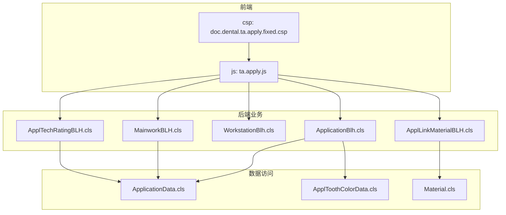
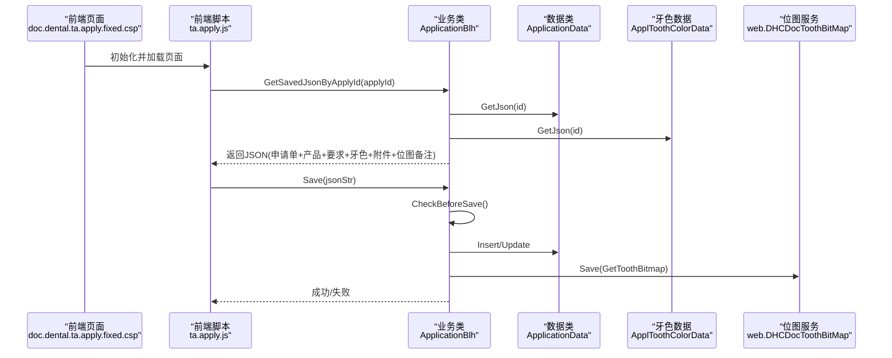
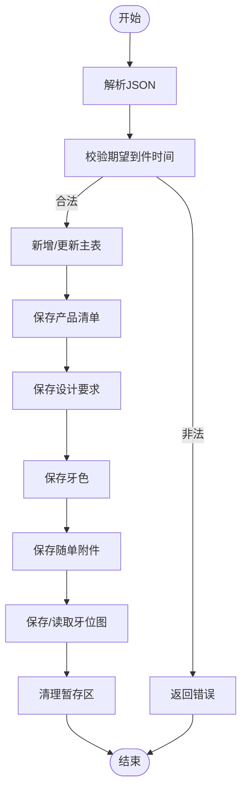
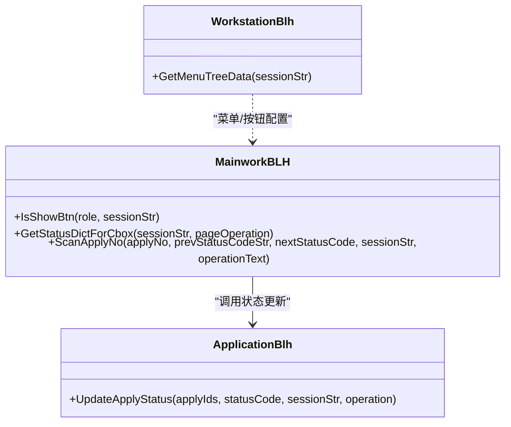
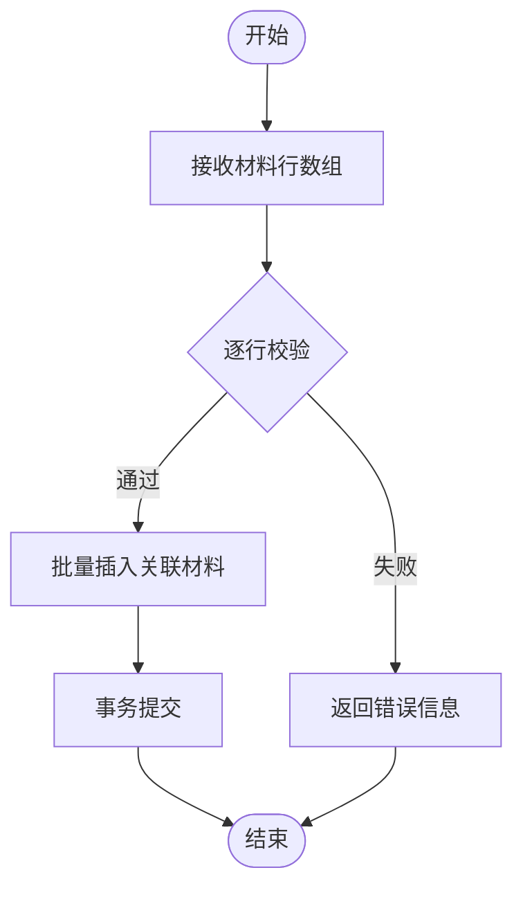
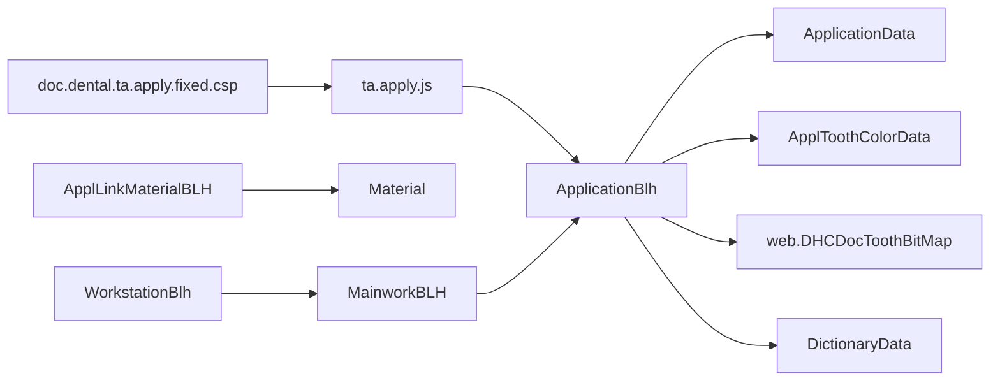

# 牙科系统 (dental-ws)

<cite>
**本文引用的文件**
- [ApplicationBlh.cls](file://src/backend/dental-ws/DHCDoc/Dental/TA/ApplicationBlh.cls)
- [ApplicationData.cls](file://src/backend/dental-ws/DHCDoc/Dental/TA/ApplicationData.cls)
- [MainworkBLH.cls](file://src/backend/dental-ws/DHCDoc/Dental/TA/MainworkBLH.cls)
- [WorkstationBlh.cls](file://src/backend/dental-ws/DHCDoc/Dental/TA/WorkstationBlh.cls)
- [ApplToothColorData.cls](file://src/backend/dental-ws/DHCDoc/Dental/TA/ApplToothColorData.cls)
- [ApplTechRatingBLH.cls](file://src/backend/dental-ws/DHCDoc/Dental/TA/ApplTechRatingBLH.cls)
- [ApplLinkMaterialBLH.cls](file://src/backend/dental-ws/DHCDoc/Dental/TA/ApplLinkMaterialBLH.cls)
- [Material.cls](file://src/backend/dental-ws/CT/DOC/Dental/TA/Material.cls)
- [doc.dental.ta.apply.fixed.csp](file://src/frontend/dental-ws/csp/doc.dental.ta.apply.fixed.csp)
- [ta.apply.js](file://src/frontend/dental-ws/scripts/dhcdoc/dental/ta.apply.js)
</cite>

## 目录
1. [简介](#简介)
2. [项目结构](#项目结构)
3. [核心组件](#核心组件)
4. [架构总览](#架构总览)
5. [详细组件分析](#详细组件分析)
6. [依赖关系分析](#依赖关系分析)
7. [性能考虑](#性能考虑)
8. [故障排查指南](#故障排查指南)
9. [结论](#结论)
10. [附录](#附录)

## 简介
本模块为牙科（口腔技工）业务提供完整的申请、记录与加工管理功能，覆盖：
- 牙科诊疗记录：申请单主数据、产品清单、设计要求、牙色、随单附件等
- 牙齿定位图：位点图保存与读取、备注管理
- 材料管理：材料字典、关联材料与金额汇总
- 技工评级：评分录入与状态联动
- 业务流程：修复体制作、正畸治疗、固定/活动修复等
- 配置与集成：菜单与工作流、打印模板扩展、与其他系统的接口点

## 项目结构
后端以类为中心组织，按职责划分：
- 业务层（BLH）：封装保存、校验、状态流转、统计等
- 数据层（DATA/SQL）：负责查询、插入、更新、删除
- 领域模型（CT）：字典、材料等基础数据实体
- 前端CSP与JS：页面入口、交互逻辑、与服务端方法调用

图表来源
- [doc.dental.ta.apply.fixed.csp:1-33](file://src/frontend/dental-ws/csp/doc.dental.ta.apply.fixed.csp#L1-L33)
- [ta.apply.js:1-200](file://src/frontend/dental-ws/scripts/dhcdoc/dental/ta.apply.js#L1-L200)
- [ApplicationBlh.cls:1-302](file://src/backend/dental-ws/DHCDoc/Dental/TA/ApplicationBlh.cls#L1-L302)
- [ApplicationData.cls:1-373](file://src/backend/dental-ws/DHCDoc/Dental/TA/ApplicationData.cls#L1-L373)
- [ApplToothColorData.cls:1-79](file://src/backend/dental-ws/DHCDoc/Dental/TA/ApplToothColorData.cls#L1-L79)
- [Material.cls:1-152](file://src/backend/dental-ws/CT/DOC/Dental/TA/Material.cls#L1-L152)

章节来源
- [doc.dental.ta.apply.fixed.csp:1-33](file://src/frontend/dental-ws/csp/doc.dental.ta.apply.fixed.csp#L1-L33)
- [ta.apply.js:1-200](file://src/frontend/dental-ws/scripts/dhcdoc/dental/ta.apply.js#L1-L200)
- [ApplicationBlh.cls:1-302](file://src/backend/dental-ws/DHCDoc/Dental/TA/ApplicationBlh.cls#L1-L302)
- [ApplicationData.cls:1-373](file://src/backend/dental-ws/DHCDoc/Dental/TA/ApplicationData.cls#L1-L373)
- [ApplToothColorData.cls:1-79](file://src/backend/dental-ws/DHCDoc/Dental/TA/ApplToothColorData.cls#L1-L79)
- [Material.cls:1-152](file://src/backend/dental-ws/CT/DOC/Dental/TA/Material.cls#L1-L152)

## 核心组件
- 申请单生命周期与保存：统一入口处理新增/更新、子表（产品、要求、牙色、附件）事务性写入、暂存与恢复
- 工作流与状态机：基于字典的状态码驱动，支持批量扫描与权限控制
- 牙齿定位图：通过通用位图服务保存/读取，支持备注
- 材料库与费用：材料字典维护有效期与价格，关联材料累计金额
- 技工评级：评分后自动推进到下一状态
- 工作台与菜单：动态菜单树、今日工作按钮显隐策略

章节来源
- [ApplicationBlh.cls:1-302](file://src/backend/dental-ws/DHCDoc/Dental/TA/ApplicationBlh.cls#L1-L302)
- [MainworkBLH.cls:1-102](file://src/backend/dental-ws/DHCDoc/Dental/TA/MainworkBLH.cls#L1-L102)
- [WorkstationBlh.cls:1-76](file://src/backend/dental-ws/DHCDoc/Dental/TA/WorkstationBlh.cls#L1-L76)
- [ApplTechRatingBLH.cls:1-48](file://src/backend/dental-ws/DHCDoc/Dental/TA/ApplTechRatingBLH.cls#L1-L48)
- [ApplLinkMaterialBLH.cls:1-100](file://src/backend/dental-ws/DHCDoc/Dental/TA/ApplLinkMaterialBLH.cls#L1-L100)
- [Material.cls:1-152](file://src/backend/dental-ws/CT/DOC/Dental/TA/Material.cls#L1-L152)

## 架构总览
前后端通过CSP页面加载JS，JS调用后端ClassMethod完成数据读写。业务类作为协调者，组合多个子模块完成复杂流程。

图表来源
- [doc.dental.ta.apply.fixed.csp:1-33](file://src/frontend/dental-ws/csp/doc.dental.ta.apply.fixed.csp#L1-L33)
- [ta.apply.js:146-186](file://src/frontend/dental-ws/scripts/dhcdoc/dental/ta.apply.js#L146-L186)
- [ApplicationBlh.cls:6-146](file://src/backend/dental-ws/DHCDoc/Dental/TA/ApplicationBlh.cls#L6-L146)
- [ApplicationData.cls:315-342](file://src/backend/dental-ws/DHCDoc/Dental/TA/ApplicationData.cls#L315-L342)
- [ApplToothColorData.cls:7-27](file://src/backend/dental-ws/DHCDoc/Dental/TA/ApplToothColorData.cls#L7-L27)

## 详细组件分析

### 申请单保存与校验（ApplicationBlh）
- 保存流程：解析JSON，校验期望到件时间，新增或更新主表；对子表（产品、要求、牙色、附件）执行“先删后插”或增量更新；最后清理暂存区
- 校验规则：必填项检查、日期格式与合法性、不允许早于当天
- 牙位图：委托通用位图服务保存/读取，支持备注
- 状态更新：根据字典状态码更新申请单状态

图表来源
- [ApplicationBlh.cls:6-146](file://src/backend/dental-ws/DHCDoc/Dental/TA/ApplicationBlh.cls#L6-L146)
- [ApplicationBlh.cls:148-186](file://src/backend/dental-ws/DHCDoc/Dental/TA/ApplicationBlh.cls#L148-L186)
- [ApplicationBlh.cls:188-203](file://src/backend/dental-ws/DHCDoc/Dental/TA/ApplicationBlh.cls#L188-L203)

章节来源
- [ApplicationBlh.cls:6-146](file://src/backend/dental-ws/DHCDoc/Dental/TA/ApplicationBlh.cls#L6-L146)
- [ApplicationBlh.cls:148-186](file://src/backend/dental-ws/DHCDoc/Dental/TA/ApplicationBlh.cls#L148-L186)
- [ApplicationBlh.cls:188-203](file://src/backend/dental-ws/DHCDoc/Dental/TA/ApplicationBlh.cls#L188-L203)
- [ApplicationBlh.cls:219-270](file://src/backend/dental-ws/DHCDoc/Dental/TA/ApplicationBlh.cls#L219-L270)

### 申请单查询与历史（ApplicationData）
- 多条件查询：患者号、日期范围、状态、科室、加工单位、医生等
- 历史工单：按患者维度过滤类型与状态，排除作废，展示复诊内容与预期时间
- 列表字段：包含技工信息、打印次数、关联材料金额、计划交付日期等

章节来源
- [ApplicationData.cls:7-200](file://src/backend/dental-ws/DHCDoc/Dental/TA/ApplicationData.cls#L7-L200)
- [ApplicationData.cls:202-301](file://src/backend/dental-ws/DHCDoc/Dental/TA/ApplicationData.cls#L202-L301)
- [ApplicationData.cls:303-373](file://src/backend/dental-ws/DHCDoc/Dental/TA/ApplicationData.cls#L303-L373)

### 工作流与状态机（MainworkBLH / WorkstationBlh）
- 菜单树：动态构建“今日工作”和“技工申请”菜单，链接对应CSP页面
- 按钮显隐：根据登录用户组角色控制操作可见性
- 状态扫描：校验当前状态是否允许操作，成功后调用应用状态更新

图表来源
- [MainworkBLH.cls:8-99](file://src/backend/dental-ws/DHCDoc/Dental/TA/MainworkBLH.cls#L8-L99)
- [WorkstationBlh.cls:5-73](file://src/backend/dental-ws/DHCDoc/Dental/TA/WorkstationBlh.cls#L5-L73)
- [ApplicationBlh.cls:205-217](file://src/backend/dental-ws/DHCDoc/Dental/TA/ApplicationBlh.cls#L205-L217)

章节来源
- [MainworkBLH.cls:8-99](file://src/backend/dental-ws/DHCDoc/Dental/TA/MainworkBLH.cls#L8-L99)
- [WorkstationBlh.cls:5-73](file://src/backend/dental-ws/DHCDoc/Dental/TA/WorkstationBlh.cls#L5-L73)

### 牙齿定位图（Tooth Bitmap）
- 保存：通过通用位图服务保存位图数据与备注，绑定申请单与就诊ID
- 读取：按申请单获取位图JSON与备注
- 前端：在固定修复界面中嵌入位图组件，支持编辑与回显

章节来源
- [ApplicationBlh.cls:188-203](file://src/backend/dental-ws/DHCDoc/Dental/TA/ApplicationBlh.cls#L188-L203)
- [doc.dental.ta.apply.fixed.csp:1-33](file://src/frontend/dental-ws/csp/doc.dental.ta.apply.fixed.csp#L1-L33)
- [ta.apply.js:146-186](file://src/frontend/dental-ws/scripts/dhcdoc/dental/ta.apply.js#L146-L186)

### 牙色管理（ApplToothColorData）
- 数据结构：包含基牙色、基台色、混合色、遮色、活髓比色、照片标记、特殊打印标记、类型等
- 打印输出：将字典值翻译为可读文本，布尔字段转换为勾选符号

章节来源
- [ApplToothColorData.cls:7-27](file://src/backend/dental-ws/DHCDoc/Dental/TA/ApplToothColorData.cls#L7-L27)
- [ApplToothColorData.cls:29-76](file://src/backend/dental-ws/DHCDoc/Dental/TA/ApplToothColorData.cls#L29-L76)

### 技工评级（ApplTechRatingBLH）
- 保存前校验：必须存在实际技工
- 保存逻辑：新增或更新评分；新增时自动推进申请单状态至下一节点
- 查询：按ID获取评分详情

章节来源
- [ApplTechRatingBLH.cls:6-45](file://src/backend/dental-ws/DHCDoc/Dental/TA/ApplTechRatingBLH.cls#L6-L45)

### 材料管理与费用计算（ApplLinkMaterialBLH / Material）
- 材料字典：包含代码、名称、类别、型号规格、单位、单价、有效期、生产单位、条码、备注、排序等
- 关联材料：批量保存行级数据，逐行校验（申请单ID、材料ID、数量），事务内提交
- 费用计算：列表聚合关联材料金额，用于统计与结算

图表来源
- [ApplLinkMaterialBLH.cls:6-31](file://src/backend/dental-ws/DHCDoc/Dental/TA/ApplLinkMaterialBLH.cls#L6-L31)
- [ApplLinkMaterialBLH.cls:52-84](file://src/backend/dental-ws/DHCDoc/Dental/TA/ApplLinkMaterialBLH.cls#L52-L84)
- [Material.cls:1-152](file://src/backend/dental-ws/CT/DOC/Dental/TA/Material.cls#L1-L152)

章节来源
- [ApplLinkMaterialBLH.cls:6-100](file://src/backend/dental-ws/DHCDoc/Dental/TA/ApplLinkMaterialBLH.cls#L6-L100)
- [Material.cls:1-152](file://src/backend/dental-ws/CT/DOC/Dental/TA/Material.cls#L1-L152)

### 前端交互与页面（CSP/JS）
- 固定修复申请页：加载公共样式与脚本，注入服务端上下文（就诊ID、患者ID、会话令牌等）
- 申请单初始化：加载按钮配置、历史工单iframe、字典下拉、暂存数据恢复
- 表单校验：期望到件时间格式与最小日期校验，错误提示

章节来源
- [doc.dental.ta.apply.fixed.csp:1-33](file://src/frontend/dental-ws/csp/doc.dental.ta.apply.fixed.csp#L1-L33)
- [ta.apply.js:20-71](file://src/frontend/dental-ws/scripts/dhcdoc/dental/ta.apply.js#L20-L71)
- [ta.apply.js:73-144](file://src/frontend/dental-ws/scripts/dhcdoc/dental/ta.apply.js#L73-L144)
- [ta.apply.js:146-186](file://src/frontend/dental-ws/scripts/dhcdoc/dental/ta.apply.js#L146-L186)

## 依赖关系分析
- 前端CSP依赖JS脚本，JS通过$cm调用后端ClassMethod
- 业务类依赖数据访问类与字典服务，状态变更依赖字典编码
- 材料模块依赖字典与SQL层进行持久化
- 位图模块复用通用服务，避免重复实现

图表来源
- [doc.dental.ta.apply.fixed.csp:1-33](file://src/frontend/dental-ws/csp/doc.dental.ta.apply.fixed.csp#L1-L33)
- [ta.apply.js:146-186](file://src/frontend/dental-ws/scripts/dhcdoc/dental/ta.apply.js#L146-L186)
- [ApplicationBlh.cls:6-146](file://src/backend/dental-ws/DHCDoc/Dental/TA/ApplicationBlh.cls#L6-L146)
- [ApplLinkMaterialBLH.cls:6-31](file://src/backend/dental-ws/DHCDoc/Dental/TA/ApplLinkMaterialBLH.cls#L6-L31)
- [MainworkBLH.cls:8-99](file://src/backend/dental-ws/DHCDoc/Dental/TA/MainworkBLH.cls#L8-L99)
- [WorkstationBlh.cls:5-73](file://src/backend/dental-ws/DHCDoc/Dental/TA/WorkstationBlh.cls#L5-L73)

## 性能考虑
- 查询优化：使用索引与分批迭代，避免全表扫描；按日期与状态变更时间双路径查询
- 事务边界：保存子表采用事务包裹，减少中间态不一致风险
- 字典缓存：字典翻译与显示名尽量复用，减少重复查询
- 前端懒加载：历史工单与位图等按需加载，降低首屏压力

[本节为通用指导，不直接分析具体文件]

## 故障排查指南
- 期望到件时间无效：检查前端正则与后端日期规范化逻辑，确保格式与日期范围正确
- 状态不允许操作：确认当前状态是否在允许的前置状态集合中，核对角色与页面权限
- 材料保存失败：检查行级校验（申请单ID、材料ID、数量），查看批量事务中的第一处失败原因
- 技工评分失败：确认已维护实际技工，且评分数据完整
- 位图未保存：确认位图服务调用参数（类型、申请单ID、就诊ID、用户ID）是否正确

章节来源
- [ApplicationBlh.cls:148-186](file://src/backend/dental-ws/DHCDoc/Dental/TA/ApplicationBlh.cls#L148-L186)
- [MainworkBLH.cls:69-99](file://src/backend/dental-ws/DHCDoc/Dental/TA/MainworkBLH.cls#L69-L99)
- [ApplLinkMaterialBLH.cls:52-84](file://src/backend/dental-ws/DHCDoc/Dental/TA/ApplLinkMaterialBLH.cls#L52-L84)
- [ApplTechRatingBLH.cls:28-37](file://src/backend/dental-ws/DHCDoc/Dental/TA/ApplTechRatingBLH.cls#L28-L37)

## 结论
该牙科系统模块围绕“申请单”这一核心实体，构建了从前端交互到后端业务、再到数据持久化的完整闭环。通过字典驱动的状态机、可配置的菜单与按钮、以及材料/牙色/位图等专科能力，满足修复体制作、正畸治疗等多样化场景。建议在生产环境中结合日志与监控，持续优化查询与事务边界，提升稳定性与性能。

[本节为总结性内容，不直接分析具体文件]

## 附录

### 配置方法与扩展点
- 菜单与按钮：通过字典配置pageLink与角色白名单，扩展新页面或操作
- 打印模板：可在现有CSP基础上扩展打印视图，复用字典与数据接口
- 集成方案：通过Inter.Invoke等接口暴露能力，供其他系统调用

章节来源
- [WorkstationBlh.cls:5-73](file://src/backend/dental-ws/DHCDoc/Dental/TA/WorkstationBlh.cls#L5-L73)
- [MainworkBLH.cls:23-67](file://src/backend/dental-ws/DHCDoc/Dental/TA/MainworkBLH.cls#L23-L67)